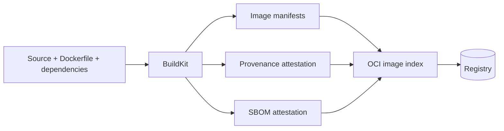

Build attestation là metadata có cấu trúc mô tả image chứa gì và được tạo như thế nào. BuildKit hỗ trợ hai loại chính:

- **SBOM** (Software Bill of Materials): inventory package/file/software artifact;
- **provenance**: nguồn, material, parameter và môi trường của quá trình build.

Attestation thường được biểu diễn bằng in-toto statement và gắn với image manifest/index. Nó giúp scanner/policy engine phân tích image mà không phải suy luận toàn bộ từ tag.



<Callout type="warn" title="Quan trọng">
  Attestation do builder tạo không tự động là chữ ký tin cậy. Muốn chứng minh danh tính người phát hành và chống thay thế, cần signing/verification, identity policy và registry trust riêng.
</Callout>

## SBOM và provenance trả lời câu hỏi nào?

| Câu hỏi | SBOM | Provenance |
|---|---:|---:|
| Image có package/version nào? | Có | Không phải mục tiêu chính |
| License/package identifier là gì? | Có thể có | Không |
| Source repository/revision nào? | Có thể gián tiếp | Có |
| Base image/material nào tham gia? | Một phần theo scanner/scope | Có |
| Builder/frontend/parameter nào được dùng? | Không | Có |
| CVE có ảnh hưởng không? | Là input cho scanner | Hỗ trợ trace, không tự kết luận |
| Artifact có được ký bởi publisher không? | Không | Không tự động |

SBOM là inventory tại thời điểm scan; vulnerability status thay đổi khi CVE database cập nhật. Provenance ghi facts về build; policy engine mới quyết định facts đó có được chấp nhận hay không.

## Tạo attestation

Push image kèm SBOM và provenance chi tiết:

```bash
docker buildx build \
  --platform linux/amd64,linux/arm64 \
  --tag registry.example.com/team/app:1.4.0 \
  --sbom=true \
  --provenance=mode=max,version=v1 \
  --push .
```

Cú pháp dài tương đương:

```bash
docker buildx build \
  --attest type=sbom \
  --attest type=provenance,mode=max,version=v1 \
  --push -t registry.example.com/team/app:1.4.0 .
```

BuildKit/Buildx hiện tạo minimal provenance mặc định cho một số image output, đặc biệt khi push registry. Không dựa vào default ẩn trong release policy; cấu hình rõ mode/version và kiểm tra kết quả.

## Provenance `mode=min` và `mode=max`

| Mode | Dữ liệu điển hình | Khi dùng |
|---|---|---|
| `min` | timestamp, frontend, materials, source revision, build platform, reproducibility | Baseline an toàn, metadata gọn |
| `max` | Thêm LLB, Dockerfile/source map, layer metadata, build arg value | Audit/policy chi tiết sau review disclosure |

`mode=max` có thể lộ **build argument values** và Dockerfile content. Đây là lý do bổ sung để không dùng `ARG` cho credential.

Secret mounts không được đưa vào provenance theo cơ chế chuẩn:

```dockerfile
RUN --mount=type=secret,id=token,required=true private-cli fetch
```

Nhưng output/log do command tạo vẫn có thể lộ secret nếu script xử lý sai.

Tắt provenance chỉ khi có lý do compatibility/policy:

```bash
docker buildx build --provenance=false ...
```

Có thể disable default attestation qua `BUILDX_NO_DEFAULT_ATTESTATIONS`, nhưng release workflow nên dùng flag explicit để dễ audit.

## Phạm vi SBOM trong multi-stage build

Mặc định BuildKit scan final stage. Với final `scratch`, build-time package trong stage compiler có thể không xuất hiện:

```dockerfile
FROM golang:1.25 AS build
# cài tool và compile

FROM scratch
COPY --from=build /out/server /server
```

Nếu threat model cần inventory build context/stage, khai báo special args trong Dockerfile:

```dockerfile
# syntax=docker/dockerfile:1
ARG BUILDKIT_SBOM_SCAN_CONTEXT=true

FROM golang:1.25 AS build
ARG BUILDKIT_SBOM_SCAN_STAGE=true
# build...

FROM scratch
COPY --from=build /out/server /server
```

Hoặc chỉ định stage theo tên theo khả năng frontend hiện tại. Chỉ stage thực sự được build mới được scan. Tăng scope làm SBOM lớn hơn và có thể liệt kê source/build tools không nằm trong runtime; đặt policy phân biệt runtime dependency và build material.

CLI `--build-arg` chỉ override special arg nếu Dockerfile đã khai báo `ARG`; truyền một mình không có hiệu lực cho scan scope.

## Kiểm tra trước khi push

Local exporter ghi attestation thành JSON file vì không có image manifest để attach:

```bash
rm -rf out

docker buildx build \
  --sbom=true \
  --provenance=mode=max,version=v1 \
  --output type=local,dest=out .

find out -maxdepth 1 -type f -print
jq '.packages | length' out/sbom.spdx.json
```

Tên/file set có thể khác khi scan nhiều stage/platform/version. Không hard-code chỉ một file nếu pipeline hỗ trợ multi-platform local output.

Sau push, dùng registry inspection:

```bash
docker buildx imagetools inspect registry.example.com/team/app:1.4.0
```

Raw SBOM:

```bash
docker buildx imagetools inspect \
  registry.example.com/team/app:1.4.0 \
  --format '{{ json .SBOM.SPDX }}' | jq .
```

Với image multi-platform, chọn entry theo platform:

```bash
docker buildx imagetools inspect \
  registry.example.com/team/app:1.4.0 \
  --format '{{ json (index .SBOM "linux/amd64").SPDX }}' | jq .
```

Raw provenance:

```bash
docker buildx imagetools inspect \
  registry.example.com/team/app:1.4.0 \
  --format '{{ json .Provenance.SLSA }}' | jq .
```

Template attribute phụ thuộc Buildx version và image structure. Pin tooling trong verifier thay vì để developer laptop version quyết định production gate.

## Storage trong registry

Attestation thường là manifest liên quan tới từng platform manifest và được tham chiếu từ image index. Registry cần giữ index, platform manifests, blobs và attestation manifests. Hệ quả:

- registry UI có thể hiển thị nhiều “unknown/attestation” entries;
- copy/mirror tool cũ có thể bỏ attestation;
- re-tag/copy chỉ một manifest có thể làm mất metadata liên quan;
- garbage collection/retention phải hiểu reference graph;
- single-manifest registry compatibility có thể khác OCI artifact behavior.

Test end-to-end với registry, promotion tool và deployment environment thật. Xác minh attestation sau khi promote từ staging sang production, không chỉ sau build đầu tiên.

## SBOM không đồng nghĩa vulnerability scan

Workflow đúng:

```text
Build image -> tạo SBOM -> scan SBOM/image với CVE DB -> áp policy -> ký/promote -> deploy
```

SBOM có package thiếu version hoặc binary statically linked mà scanner không nhận ra. Cần:

- scanner hỗ trợ ecosystem;
- CVE database cập nhật;
- VEX/triage để phân biệt affected/not affected;
- rescan định kỳ image cũ khi CVE mới xuất hiện;
- rebuild để nhận patched base/dependency.

Không fail release chỉ dựa trên tổng số CVE không có severity, exploitability và exception lifecycle.

## Provenance và reproducibility

Field `reproducible` trong provenance không tự làm build reproducible. Reproducibility cần:

- pin source revision/base digest/dependency lock;
- kiểm soát timestamp, locale, random input;
- compiler/build flag deterministic;
- không tải mutable URL/tag trong `RUN`;
- so digest của nhiều build độc lập theo cùng input.

Provenance giúp biết material/parameter đã dùng để điều tra khác biệt.

## Policy release gợi ý

Một policy thực tế có thể yêu cầu:

1. image được tham chiếu bằng digest;
2. provenance tồn tại cho mọi platform;
3. source repository và revision khớp release commit;
4. builder identity nằm trong allowlist sau khi attestation được ký;
5. base/material không dùng tag mutable ngoài policy;
6. SBOM tồn tại, parse được và có format/version hỗ trợ;
7. vulnerability gate đạt ngưỡng;
8. attestation/signature vẫn còn sau registry promotion.

BuildKit tạo metadata; engine như admission controller, CI policy hoặc supply-chain verifier thực thi rule.

## Bake configuration

```hcl
target "release" {
  context   = "."
  platforms = ["linux/amd64", "linux/arm64"]
  tags      = ["registry.example.com/team/app:${VERSION}"]
  attest = [
    { type = "sbom" },
    { type = "provenance", mode = "max", version = "v1" }
  ]
  output = [{ type = "registry" }]
}
```

```bash
VERSION=1.4.0 docker buildx bake release --print
VERSION=1.4.0 docker buildx bake release
```

Review output `--print` để chắc attestation không bị override khi merge Compose/HCL.

## Những gì không nên đưa vào metadata

- credential trong `ARG`/label;
- internal URL chứa token/query secret;
- username/path cá nhân không cần thiết;
- source code nhạy cảm nếu bật provenance max nhưng disclosure policy không cho phép;
- artifact inventory được phân loại confidential mà registry có readership rộng.

Chọn `mode=min` nếu chưa thể chấp nhận disclosure của max; không tắt toàn bộ provenance chỉ để che secret đang bị dùng sai.

## Checklist verification

- [ ] Build flag attestation explicit và tool version được pin.
- [ ] Mọi target platform có SBOM/provenance.
- [ ] SBOM parse được, package/version chính có mặt.
- [ ] Provenance source revision/material khớp release.
- [ ] `mode=max` không lộ build arg nhạy cảm.
- [ ] Registry mirror/promotion giữ nguyên attestation.
- [ ] Signing/identity verification được thiết kế riêng nếu cần trust.
- [ ] Scanner và policy có quy trình exception, rescan và remediation.
- [ ] Deploy dùng image digest, không chỉ tag.

## Nguồn chính thức

- [Build attestations](https://docs.docker.com/build/metadata/attestations/)
- [SBOM attestations](https://docs.docker.com/build/metadata/attestations/sbom/)
- [Provenance attestations](https://docs.docker.com/build/metadata/attestations/slsa-provenance/)
- [in-toto](https://in-toto.io/)
- [SLSA provenance](https://slsa.dev/spec/v1.0/provenance)
