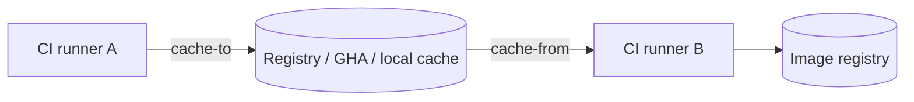

Mỗi builder có internal cache riêng. Điều này hiệu quả trên máy developer hoặc remote builder bền vững, nhưng CI runner ephemeral thường bắt đầu với cache rỗng. **External cache** cho phép export build record/layer tới một backend rồi import ở lần build khác.



Cache là output phụ để tăng tốc. Image release và cache reference phải có lifecycle, quyền và naming riêng.

## Cú pháp cơ bản

```bash
docker buildx build \
  --cache-from type=registry,ref=registry.example.com/team/app:cache-main \
  --cache-to type=registry,ref=registry.example.com/team/app:cache-main,mode=max \
  --push \
  --tag registry.example.com/team/app:1.4.0 .
```

- `--cache-from`: backend mà builder thử import; cache miss thường không làm build fail.
- `--cache-to`: backend nhận cache sau build thành công.
- Internal cache vẫn được dùng; external cache không tự động hoạt động nếu không khai báo.

## Chọn backend

| Backend | Dữ liệu nằm ở đâu? | Khi nên dùng | Giới hạn chính |
|---|---|---|---|
| `inline` | Metadata cache đi cùng image | Setup đơn giản, cache cho final image | Chỉ `mode=min`, coupling với image output |
| `registry` | Cache artifact/reference riêng trên OCI registry | CI đa runner, branch cache, `mode=max` | Storage/egress và registry compatibility |
| `local` | Directory trên client | Debug, cache volume/persistent workspace | Cần tự đồng bộ và cleanup |
| `gha` | GitHub Actions cache service | Workflow chạy trên GitHub Actions | Quota/scope/eviction của service |
| `s3`, `azblob` | Object storage | Chỉ khi BuildKit/backend đang dùng hỗ trợ | Có thể vẫn được đánh dấu unreleased/experimental theo phiên bản |

Khả năng backend phụ thuộc driver và image store. `docker-container`, `kubernetes` hoặc `remote` thường linh hoạt hơn. `docker` driver chỉ hỗ trợ tập exporter phù hợp khi containerd image store được bật.

> [!NOTE]
> Luôn kiểm tra tài liệu theo version Docker Engine, Buildx và BuildKit đang pin trong CI; danh sách backend và option có thể thay đổi.

## `mode=min` và `mode=max`

```bash
--cache-to type=registry,ref=registry.example.com/team/app:cache,mode=max
```

| Mode | Nội dung export | Trade-off |
|---|---|---|
| `min` | Cache cho layer thuộc final output | Nhỏ, nhanh truyền, ít hit cho intermediate stage |
| `max` | Bao gồm intermediate step/stage đủ điều kiện | Nhiều cache hit hơn, tốn storage/egress hơn |

`inline` chỉ hỗ trợ `min`. Với multi-stage CI có `deps`, `test`, `build`, `runtime`, registry cache `mode=max` thường đáng thử. Đo thời gian và bytes thay vì mặc định chọn `max` cho mọi repo.

## Inline cache

```bash
docker buildx build \
  --cache-from type=registry,ref=registry.example.com/team/app:main \
  --cache-to type=inline \
  --push -t registry.example.com/team/app:main .
```

Có thể bật inline cache bằng build arg compatibility:

```bash
docker buildx build \
  --build-arg BUILDKIT_INLINE_CACHE=1 \
  --push -t registry.example.com/team/app:main .
```

Inline phù hợp pipeline nhỏ. Nếu tag image bị retention policy xóa/chuyển hoặc cache intermediate stage quan trọng, dùng reference registry cache riêng.

## Registry cache riêng

```bash
docker buildx build \
  --cache-from type=registry,ref=registry.example.com/team/app:buildcache-main \
  --cache-to type=registry,ref=registry.example.com/team/app:buildcache-main,mode=max \
  --push -t registry.example.com/team/app:${GIT_SHA} .
```

Cache reference không phải runnable image release và không nên dùng cùng tag với output image. Áp dụng retention riêng, ví dụ giữ cache main lâu hơn cache branch.

Một số registry cần OCI manifest compatibility option. Với BuildKit mới, `image-manifest=true` có thể là mặc định; nếu gặp lỗi media type/index:

```bash
--cache-to type=registry,ref=registry.example.com/team/app:cache,mode=max,oci-mediatypes=true,image-manifest=true
```

Chỉ thêm option sau khi xác minh registry/version; không cargo-cult cấu hình.

## Cache theo branch mà không ghi đè lẫn nhau

Một cache destination bị ghi lại khi export. Dùng scope riêng cho branch và fallback main:

```bash
branch_slug=$(printf '%s' "$GIT_BRANCH" | tr '/:@ ' '----' | tr -cd 'A-Za-z0-9._-')

cache_main="registry.example.com/team/app:cache-main"
cache_branch="registry.example.com/team/app:cache-${branch_slug}"

docker buildx build \
  --cache-from type=registry,ref="$cache_branch" \
  --cache-from type=registry,ref="$cache_main" \
  --cache-to type=registry,ref="$cache_branch",mode=max \
  --push -t "registry.example.com/team/app:${GIT_SHA}" .
```

Cho build ở main, export thêm/hoặc vào `cache-main` theo pipeline policy. Không để untrusted fork có quyền ghi cache main: cache poisoning có thể ảnh hưởng build sau dù BuildKit dùng content digest.

## Nhiều cache source và destination

BuildKit có thể import/export nhiều cache:

```bash
docker buildx build \
  --cache-from type=registry,ref=registry.example.com/team/app:cache-feature \
  --cache-from type=registry,ref=registry.example.com/team/app:cache-main \
  --cache-to type=registry,ref=registry.example.com/team/app:cache-feature,mode=max \
  --cache-to type=local,dest=.build/cache-new,mode=min \
  --load -t app:test .
```

Nhiều destination tăng độ bền nhưng cũng tăng thời gian export và failure surface. Chỉ giữ destination có consumer rõ ràng.

## Local cache an toàn

```bash
rm -rf .build/cache-new

docker buildx build \
  --cache-from type=local,src=.build/cache \
  --cache-to type=local,dest=.build/cache-new,mode=max \
  --load -t app:test .

rm -rf .build/cache
mv .build/cache-new .build/cache
```

Không export đè trực tiếp directory đang import nếu backend/tooling không bảo đảm atomicity. Trên CI, cache service có thể upload `.build/cache` sau job; kiểm tra quota và concurrent job behavior.

## GitHub Actions cache

Với Docker actions hiện hành, setup builder rồi dùng cache type `gha`:

```yaml
name: build
on:
  push:

jobs:
  image:
    runs-on: ubuntu-latest
    steps:
      - uses: actions/checkout@v4
      - uses: docker/setup-buildx-action@v4
      - uses: docker/login-action@v4
        with:
          registry: ghcr.io
          username: ${{ github.actor }}
          password: ${{ secrets.GITHUB_TOKEN }}
      - uses: docker/build-push-action@v7
        with:
          context: .
          push: true
          tags: ghcr.io/example/app:${{ github.sha }}
          cache-from: type=gha
          cache-to: type=gha,mode=max
```

Pin action theo immutable commit SHA nếu supply-chain policy yêu cầu; major tag trong ví dụ ưu tiên khả năng đọc. Scope và quyền cache phụ thuộc GitHub event/repository, nên test pull request từ fork riêng.

## Compression và transfer cost

Registry/local cache có thể hỗ trợ compression option:

```bash
--cache-to type=registry,ref=registry.example.com/team/app:cache,mode=max,compression=zstd
```

Compression mạnh hơn có thể giảm egress nhưng tăng CPU. Cache ở region khác runner có thể chậm hơn rebuild. Đo:

- thời gian import/export;
- hit ratio và step nặng được cứu;
- bytes registry/object storage;
- CPU compression;
- chi phí retention/egress.

## Security boundary

Không đưa secret vào Dockerfile bằng `ARG`, `ENV` hoặc `COPY`. External cache có thể tồn tại lâu, được đọc rộng hơn image release và khó audit hơn.

Dùng:

```dockerfile
RUN --mount=type=secret,id=token,required=true private-cli fetch
```

```bash
docker buildx build --secret id=token,env=API_TOKEN ...
```

Ngoài ra:

- tách quyền pull/push cache;
- untrusted PR chỉ đọc cache public/sanitized hoặc dùng scope riêng;
- không tin cache thay cho lockfile/signature/hash;
- áp dụng registry retention, encryption và access log;
- revoke credential nếu từng xuất hiện trong layer/cache cũ.

## Cache invalidation có chủ đích

Không dùng `--no-cache` thường xuyên để “chắc chắn mới”. Thay vào đó:

- pin/update base image có quy trình;
- dùng `--pull` khi muốn resolve lại tag;
- update lockfile/version input;
- dùng `--no-cache-filter deps` cho stage cần làm mới;
- đưa version public của private artifact vào `ARG`, không đưa token.

```bash
docker buildx build \
  --pull \
  --no-cache-filter deps \
  --cache-from type=registry,ref=registry.example.com/team/app:cache-main \
  --load -t app:test .
```

## Chẩn đoán cache miss

```bash
docker buildx build --progress=plain ...
docker buildx du
```

Theo dõi **step đầu tiên** không `CACHED`, rồi kiểm tra:

1. builder/import cache có đúng reference và credential không;
2. Dockerfile frontend, platform, build arg có đổi không;
3. context/checksum/lockfile có đổi không;
4. base image digest có đổi do `--pull` hoặc tag mutable không;
5. cache destination có bị branch/job khác ghi đè không;
6. `mode=min` có bỏ intermediate stage cần thiết không;
7. registry có chấp nhận media type và chưa xóa cache không.

Build log có `importing cache manifest` nhưng không hit không có nghĩa importer lỗi; cache key có thể thực sự khác.

## Best practices

- Dùng cache reference riêng với image release.
- Import branch cache trước, main cache sau; export về branch scope.
- Chỉ trusted main/release job được ghi cache canonical.
- Chọn `mode` theo measurement.
- Build phải đúng khi external cache trống hoặc bị xóa.
- Đặt retention/quota và theo dõi storage/egress.
- Dùng secret mount và giả định cache có thể được đọc bởi actor khác trong cùng scope.
- Pin builder/tool version để tránh cache format/behavior bất ngờ.

## Nguồn chính thức

- [Cache storage backends](https://docs.docker.com/build/cache/backends/)
- [Optimize cache usage](https://docs.docker.com/build/cache/optimize/)
- [Registry cache](https://docs.docker.com/build/cache/backends/registry/)
- [GitHub Actions cache](https://docs.docker.com/build/cache/backends/gha/)
