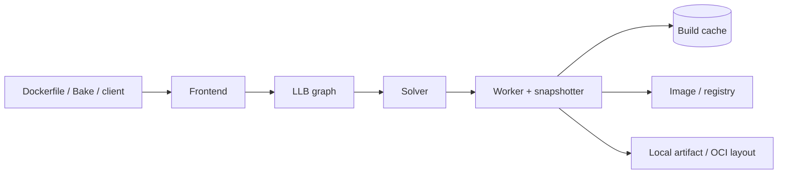

BuildKit là build engine hiện đại đứng sau `docker build` và `docker buildx build`. Nó nhận định nghĩa build, chuyển thành đồ thị phụ thuộc, giải đồ thị bằng worker rồi xuất image, filesystem artifact hoặc cache. So với legacy builder, BuildKit không chỉ chạy tuần tự từng dòng Dockerfile: nó có thể bỏ stage không được dùng, thực thi các nhánh độc lập song song và truyền phần build context thực sự cần thiết.



> [!IMPORTANT]
> BuildKit là engine thực thi; Buildx là client/CLI để chọn builder, cấu hình output, cache, multi-platform và nhiều tính năng BuildKit khác. Hai khái niệm liên quan nhưng không đồng nghĩa.

## BuildKit giải quyết vấn đề gì?

| Vấn đề của build truyền thống | Cách BuildKit xử lý |
|---|---|
| Chạy mọi stage dù final target không cần | Phân tích dependency graph và bỏ stage không liên quan |
| Các stage độc lập vẫn chờ nhau | Solver thực thi song song khi dependency cho phép |
| Luôn gửi lại toàn bộ context | Truyền tăng dần file thay đổi và tránh file không được dùng |
| Cache phụ thuộc heuristic image layer | Cache key dựa trên operation, input và checksum nội dung |
| Intermediate container/image gây side effect | Build operation được quản lý bên trong worker |
| Khó chia sẻ cache giữa CI runner | Import/export cache qua registry, local hoặc backend CI |
| Dockerfile khó mở rộng syntax | Frontend có version, được phân phối như container image |

Tốc độ thực tế vẫn phụ thuộc Dockerfile. `COPY . .` quá sớm, context lớn, dependency không được lock hoặc mỗi build dùng builder mới không có external cache vẫn làm cache hit thấp.

## Các thành phần cốt lõi

### Frontend

Frontend chuyển định dạng con người đọc được thành **LLB** (Low-Level Build). Dockerfile frontend thường được chọn bằng parser directive:

```dockerfile
# syntax=docker/dockerfile:1
FROM alpine:3.23
RUN echo "hello BuildKit" > /message
```

Pin channel/version frontend giúp syntax như `RUN --mount`, heredoc và build checks có behavior nhất quán. Không dùng image frontend không tin cậy: frontend tham gia vào quá trình tạo định nghĩa build.

### LLB và solver

LLB là định dạng nhị phân mô tả đồ thị content-addressable. Một operation chỉ chạy sau khi input của nó sẵn sàng. Cache key được suy ra từ operation, metadata và nội dung input thay vì chỉ so lịch sử image.

```text
source image ──> install dependencies ──┐
                                        ├──> compile ──> runtime image
source code ────────────────────────────┘
```

Nếu source application đổi nhưng dependency manifest không đổi, operation cài dependency có thể được tái sử dụng. Nếu một stage không nằm trên đường tới target, solver có thể bỏ qua nó.

### Worker, snapshotter và content store

Worker thực thi operation. Tùy deployment, BuildKit có thể dùng Docker/containerd worker và snapshotter phù hợp để tạo filesystem snapshot. Content store giữ blob theo digest; metadata store theo dõi quan hệ cache. Builder khác nhau thường có storage/cache riêng.

### Exporter

Kết quả build không bắt buộc là image local:

| Output | Mục đích | Ví dụ |
|---|---|---|
| Docker image store | Chạy/test local một image đơn platform | `--load` |
| Registry | Phân phối image, đặc biệt multi-platform | `--push` |
| Local filesystem | Xuất binary hoặc static assets | `--output type=local,dest=out` |
| OCI/Docker archive | Tích hợp tool theo chuẩn image archive | `--output type=oci,dest=image.tar` |
| Cache only | Làm nóng cache mà không phát hành artifact | `--output type=cacheonly` |

Với custom driver, nếu không chỉ định output, kết quả có thể chỉ nằm trong build cache và không xuất hiện trong `docker image ls`.

## Luồng build thực tế

Tạo project tối thiểu:

```bash
mkdir buildkit-lab
cd buildkit-lab
printf 'hello\n' > message.txt
```

```dockerfile
# syntax=docker/dockerfile:1
FROM alpine:3.23
WORKDIR /app
COPY message.txt .
RUN tr '[:lower:]' '[:upper:]' < message.txt > result.txt
CMD ["cat", "/app/result.txt"]
```

Build lần đầu và xem log operation:

```bash
docker buildx build --progress=plain --load --tag buildkit-lab:dev .
```

Build lại không sửa input. Các step đủ điều kiện sẽ hiện `CACHED`:

```bash
docker buildx build --progress=plain --load --tag buildkit-lab:dev .
docker run --rm buildkit-lab:dev
```

Expected output:

```text
HELLO
```

Kiểm tra client và builder đang dùng:

```bash
docker buildx version
docker buildx ls
docker buildx inspect --bootstrap
```

`--bootstrap` khởi động builder nếu cần và lấy trạng thái node/platform; nó không chứng minh mọi target platform chạy native.

## Cache không chỉ là image layer

BuildKit có ba phạm vi thường bị nhầm:

1. **Regular layer cache**: tái sử dụng kết quả operation khi cache key khớp.
2. **Cache mount**: directory mutable cho package manager/compiler dùng lại qua nhiều lần chạy operation.
3. **External cache**: bản cache được export để builder/runner khác có thể import.

Đọc [Cache mounts](/docs/buildkit/cache-mounts/) và [External build cache](/docs/buildkit/external-cache/) trước khi thiết kế cache CI. Cache là dữ liệu tăng tốc, không phải source of truth; build phải vẫn đúng khi cache rỗng.

## BuildKit và build context

BuildKit có thể tránh truyền file không được operation sử dụng, nhưng build context vẫn là trust boundary. Luôn:

- giữ context nhỏ và dùng `.dockerignore`;
- tách dependency manifest khỏi source thay đổi thường xuyên;
- dùng named context khi build cần nhiều nguồn;
- pin remote source/base image theo digest khi cần reproducibility;
- không gửi secret như file thường rồi kỳ vọng BuildKit tự che giấu.

```dockerfile
COPY package.json package-lock.json ./
RUN --mount=type=cache,target=/root/.npm npm ci
COPY src/ ./src/
```

Cách sắp xếp này cho solver một dependency graph ổn định hơn `COPY . .` trước `npm ci`.

## Boundary bảo mật

Build có thể chạy script từ package manager, Dockerfile và source repository. Vì vậy builder là hạ tầng thực thi code, không chỉ là cache server.

- Không cấp production secret cho build từ pull request không tin cậy.
- Dùng `RUN --mount=type=secret` hoặc `type=ssh`, không dùng `ARG`, `ENV` hay `COPY` cho credential.
- Hạn chế entitlements như `security.insecure` và `network.host`.
- Cô lập builder dùng chung; áp dụng quota, cache GC và access control.
- Xem provenance/SBOM là metadata để audit, không phải chữ ký xác thực danh tính tự động.

> [!WARNING]
> Secret mount tránh lưu secret vào layer/cache/provenance theo cơ chế chuẩn, nhưng command được chạy vẫn có thể cố tình gửi secret ra network. Chỉ build code đáng tin cậy với credential nhạy cảm.

## Khi nào dùng Buildx thay `docker build`?

`docker build` hiện dùng BuildKit trong môi trường Docker phổ biến, nhưng `docker buildx build` rõ ràng hơn khi cần:

- custom hoặc remote builder;
- multi-platform output;
- external cache nâng cao;
- nhiều exporter;
- SBOM/provenance;
- quản lý builder, disk usage và build history;
- Bake cho nhiều target.

Cho local build đơn giản, `docker build -t app:dev .` vẫn hợp lý. Cho CI/release, nên biểu diễn builder, platform, cache và output một cách tường minh.

## Bản đồ phần BuildKit và Buildx

1. [Docker Buildx](/docs/buildkit/buildx/) — CLI, build flags và output.
2. [Cache mounts](/docs/buildkit/cache-mounts/) — cache mutable cho package manager/compiler.
3. [Secret và SSH mounts](/docs/buildkit/secret-and-ssh-mounts/) — truyền credential tạm thời.
4. [External build cache](/docs/buildkit/external-cache/) — chia sẻ cache giữa CI runner.
5. [Multi-platform builds](/docs/buildkit/multi-platform-builds/) — QEMU, native nodes và cross-compilation.
6. [Builders và drivers](/docs/buildkit/builders-and-drivers/) — topology và lifecycle builder.
7. [Docker Buildx Bake](/docs/buildkit/bake/) — build workflow dạng khai báo.
8. [Attestations, SBOM và provenance](/docs/buildkit/attestations-sbom-provenance/) — metadata supply chain.
9. [Troubleshooting build](/docs/buildkit/build-troubleshooting/) — quy trình chẩn đoán cache, network, platform và output.

## Cleanup bài thực hành

```bash
docker image rm buildkit-lab:dev
cd ..
rm -rf buildkit-lab
```

## Nguồn chính thức

- [BuildKit](https://docs.docker.com/build/buildkit/)
- [Docker Build overview](https://docs.docker.com/build/)
- [Buildx CLI reference](https://docs.docker.com/reference/cli/docker/buildx/)
- [Dockerfile reference](https://docs.docker.com/reference/dockerfile/)
