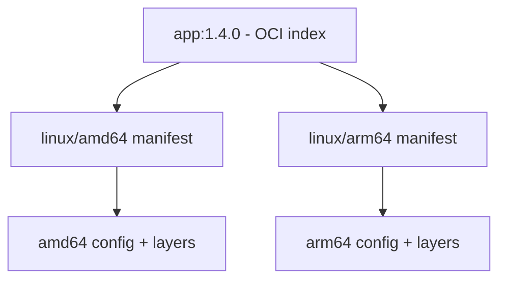

Multi-platform build tạo nhiều image variant cho các cặp OS/architecture trong một lần build, rồi ghép chúng dưới một OCI image index/manifest list. Khi pull, registry/runtime chọn manifest phù hợp với platform của host.



Một container vẫn chia sẻ kernel với host. Multi-platform image không làm binary amd64 tự chạy native trên arm64 và không biến Linux image thành Windows image.

## Platform gồm những gì?

Cú pháp thường gặp:

```text
linux/amd64
linux/arm64
linux/arm/v7
windows/amd64
```

- OS: `linux`, `windows`...
- architecture: `amd64`, `arm64`, `arm`...
- variant: ví dụ `v7` với ARM 32-bit.

Xem platform builder quảng cáo:

```bash
docker buildx ls
docker buildx inspect --bootstrap
```

Danh sách này cho biết builder có thể xử lý platform, không nhất thiết cho biết nó thực thi native. QEMU/binfmt có thể làm platform xuất hiện.

## Điều kiện output

Image store phải hỗ trợ multi-platform manifest. Docker Desktop và Docker Engine mới với containerd image store hỗ trợ tốt hơn. Cách portable cho release là dùng custom builder rồi push thẳng registry:

```bash
docker buildx create \
  --name multiplatform \
  --driver docker-container \
  --use --bootstrap

docker buildx build \
  --platform linux/amd64,linux/arm64 \
  --tag registry.example.com/team/app:1.4.0 \
  --push .
```

Custom driver không tự load output vào `docker image ls`. `--load` chủ yếu cho image đơn platform; multi-platform release nên `--push` và kiểm tra bằng `imagetools`.

## Ba chiến lược build

| Chiến lược | Setup | Hiệu năng | Phù hợp |
|---|---|---|---|
| QEMU emulation | Thấp | Chậm với compile/compression | Bắt đầu nhanh, step nhẹ |
| Nhiều native node | Cao hơn | Native | Build nặng, compatibility phức tạp |
| Cross-compilation | Phụ thuộc ngôn ngữ | Thường nhanh | Go/Rust/toolchain hỗ trợ tốt |

Có thể kết hợp: cross-compile application trên build platform, dùng QEMU cho một số package install target-specific, và chạy smoke test trên native runner.

## Chiến lược 1: QEMU

Docker Desktop thường cấu hình emulation sẵn. Trên Linux host, nếu BuildKit distribution không kèm/nhận QEMU đúng cách, có thể đăng ký `binfmt_misc`:

```bash
docker run --privileged --rm tonistiigi/binfmt --install all
```

Command cần privilege trên host và làm thay đổi binfmt registration; chỉ chạy trên hạ tầng được quản lý. Kiểm tra flag `F`:

```bash
grep -H '^flags.*F' /proc/sys/fs/binfmt_misc/qemu-* 2>/dev/null
```

Build:

```bash
docker buildx build \
  --platform linux/amd64,linux/arm64 \
  --push -t registry.example.com/team/app:1.4.0 .
```

QEMU tiện nhưng có thể chậm đáng kể với compiler, compression và test CPU-heavy. Một số syscall/toolchain có behavior khác hoặc lỗi khó hiểu như `exec format error`, segmentation fault. Đừng xem emulation pass là thay thế hoàn toàn test native.

## Chiến lược 2: nhiều native node

Giả sử có hai Docker context trỏ tới daemon amd64 và arm64:

```bash
docker context create node-amd64 --docker host=ssh://builder-amd64
docker context create node-arm64 --docker host=ssh://builder-arm64

docker buildx create --name native --use node-amd64
docker buildx create --name native --append node-arm64
docker buildx inspect --bootstrap
```

Sau đó:

```bash
docker buildx build \
  --builder native \
  --platform linux/amd64,linux/arm64 \
  --push -t registry.example.com/team/app:1.4.0 .
```

Native nodes nhanh và tương thích tốt hơn, nhưng cần:

- đồng bộ BuildKit config/version;
- auth registry và network egress;
- cache strategy dùng chung;
- capacity scheduling;
- patching, isolation và log/metric;
- kiểm soát node nào được phép nhận secret release.

## Chiến lược 3: cross-compilation

BuildKit tự cung cấp các build args:

| Arg | Ví dụ | Ý nghĩa |
|---|---|---|
| `BUILDPLATFORM` | `linux/amd64` | Platform thực thi build stage |
| `BUILDOS`, `BUILDARCH`, `BUILDVARIANT` | `linux`, `amd64`, rỗng | Thành phần build platform |
| `TARGETPLATFORM` | `linux/arm64` | Platform output hiện tại |
| `TARGETOS`, `TARGETARCH`, `TARGETVARIANT` | `linux`, `arm64`, rỗng | Thành phần target platform |

Để dùng trong `RUN`, khai báo `ARG` trong stage. Ví dụ Go:

```dockerfile
# syntax=docker/dockerfile:1
FROM --platform=$BUILDPLATFORM golang:1.25-alpine AS build
WORKDIR /src
COPY go.mod go.sum ./
RUN --mount=type=cache,target=/go/pkg/mod go mod download
COPY . .
ARG TARGETOS TARGETARCH
RUN --mount=type=cache,target=/go/pkg/mod \
    --mount=type=cache,target=/root/.cache/go-build \
    CGO_ENABLED=0 GOOS="$TARGETOS" GOARCH="$TARGETARCH" \
    go build -trimpath -ldflags='-s -w' -o /out/server ./cmd/server

FROM alpine:3.23
COPY --from=build /out/server /usr/local/bin/server
USER 65534:65534
ENTRYPOINT ["/usr/local/bin/server"]
```

`FROM --platform=$BUILDPLATFORM` giữ compiler chạy native và tránh QEMU. Final `FROM alpine` tự resolve theo target platform.

`CGO_ENABLED=0` không phải lựa chọn universal. Nếu dùng cgo/native library, cần target compiler/sysroot và runtime libc đúng architecture. Không copy binary glibc vào Alpine/musl nếu chưa xác minh dynamic linkage.

## Build và push release

```bash
export IMAGE=registry.example.com/team/app
export VERSION=1.4.0

docker buildx build \
  --platform linux/amd64,linux/arm64 \
  --cache-from type=registry,ref=${IMAGE}:buildcache-main \
  --cache-to type=registry,ref=${IMAGE}:buildcache-main,mode=max \
  --provenance=mode=max \
  --sbom=true \
  --tag ${IMAGE}:${VERSION} \
  --tag ${IMAGE}:stable \
  --push .
```

Không đưa `latest/stable` vào command untrusted PR có push permission. Release pipeline phải kiểm soát tag mutation.

## Xác minh manifest và từng variant

```bash
docker buildx imagetools inspect registry.example.com/team/app:1.4.0
```

Kiểm tra raw index khi cần:

```bash
docker buildx imagetools inspect \
  --raw registry.example.com/team/app:1.4.0 | jq .
```

Pull/run từng platform trên host có emulation:

```bash
docker run --rm --platform linux/amd64 \
  registry.example.com/team/app:1.4.0 uname -m

docker run --rm --platform linux/arm64 \
  registry.example.com/team/app:1.4.0 uname -m
```

Image distroless/scratch không có `uname`; application nên có `--version`/health endpoint hoặc dùng dedicated test target. Quan trọng nhất là test trên native amd64 và arm64 runner cho release quan trọng.

## Cache theo platform

BuildKit tách cache record theo operation/platform, nhưng tool cache bên trong cache mount có thể cần scope riêng:

```dockerfile
ARG TARGETOS TARGETARCH
RUN --mount=type=cache,id=go-build-${TARGETOS}-${TARGETARCH},target=/root/.cache/go-build \
    GOOS="$TARGETOS" GOARCH="$TARGETARCH" go build ./...
```

External registry cache `mode=max` hữu ích vì mỗi platform có intermediate layers. Theo dõi cache size; matrix platform lớn nhân storage và transfer.

## Base image và platform

Base image phải có manifest cho mọi target. Kiểm tra:

```bash
docker buildx imagetools inspect alpine:3.23
```

Không hard-code:

```dockerfile
FROM --platform=linux/amd64 alpine:3.23
```

trong final stage nếu mục tiêu là output đa platform. Build check có thể cảnh báo `FromPlatformFlagConstDisallowed` hoặc `InvalidBaseImagePlatform`. Chỉ pin `$BUILDPLATFORM` cho stage toolchain khi có cross-compilation plan rõ.

## Windows không chỉ là thêm một platform

`windows/amd64` cần Windows base image, Windows worker tương thích và host/kernel version constraints. Không ghép Linux và Windows variant chỉ bằng một Dockerfile Linux hiện tại. BuildKit hỗ trợ Windows containers vẫn có giới hạn/experimental area tùy version; thiết kế pipeline/node riêng và test theo Windows container compatibility matrix.

## Lỗi thường gặp

### `exec format error`

Binary/stage đang chạy khác architecture, QEMU chưa đăng ký hoặc shebang/interpreter thiếu. Kiểm tra `TARGETARCH`, binary format và platform của `FROM`.

### Multiple platforms feature is not supported

Builder/image store/driver không hỗ trợ output. Tạo `docker-container` builder và dùng `--push`.

### Image build xong nhưng không thấy local

Custom driver không auto-load; multi-platform output không thể nạp như single image vào classic store. Kiểm tra registry bằng `imagetools inspect`.

### Build arm64 quá chậm

Đang compile qua QEMU. Chuyển sang cross-compilation hoặc native arm64 node, đồng thời dùng cache mount/external cache.

### Chạy được amd64 nhưng arm64 crash

Kiểm tra native dependency, cgo, prebuilt addon, libc, endianness/assembly optimization và artifact có bị dùng chung sai giữa platform không. Test native.

## Best practices

- Chọn strategy theo workload, không mặc định QEMU cho compile nặng.
- Pin build stage vào `$BUILDPLATFORM` chỉ khi compiler cross-build đúng.
- Khai báo và dùng `TARGET*` rõ ràng; không suy architecture từ `uname -m` trong cross-build stage.
- Push multi-platform index rồi xác minh registry manifest.
- Test mỗi architecture, ưu tiên native runner cho release.
- Tạo SBOM/provenance cho mọi variant và deploy theo digest.
- Đảm bảo base image/native dependency hỗ trợ đủ platform.
- Tách cache mount khi tool cache không portable giữa architecture.

## Nguồn chính thức

- [Multi-platform builds](https://docs.docker.com/build/building/multi-platform/)
- [Automatic platform ARGs](https://docs.docker.com/reference/dockerfile/#automatic-platform-args-in-the-global-scope)
- [Build drivers](https://docs.docker.com/build/drivers/)
- [`docker buildx imagetools inspect`](https://docs.docker.com/reference/cli/docker/buildx/imagetools/inspect/)
