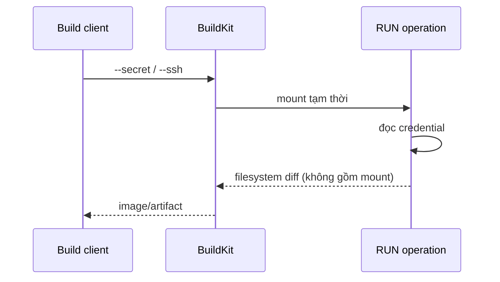

Build đôi khi cần credential để tải package private, clone repository hoặc đọc artifact. Không truyền credential qua `ARG`, `ENV`, `COPY` hay URL được ghi trực tiếp trong Dockerfile. BuildKit cung cấp hai mount tạm thời:

- **secret mount**: file hoặc environment variable bí mật dùng cho một `RUN`;
- **SSH mount**: chuyển tiếp SSH agent socket hoặc key cho Git/SSH client.

Credential chỉ khả dụng trong operation khai báo mount và không được commit vào output layer theo cơ chế chuẩn.



<Callout type="warn" title="Cảnh báo">
  Mount bảo vệ khỏi việc vô tình lưu secret vào layer, nhưng code trong `RUN` có thể đọc và gửi secret ra ngoài. Không cấp credential production cho Dockerfile/source từ pull request không tin cậy.
</Callout>

## Vì sao `ARG` và `COPY` không an toàn?

Anti-pattern:

```dockerfile
ARG NPM_TOKEN
RUN echo "//registry.npmjs.org/:_authToken=${NPM_TOKEN}" > /root/.npmrc \
    && npm ci \
    && rm /root/.npmrc
```

Các vấn đề:

- build arg có thể xuất hiện trong build metadata/provenance/log;
- secret từng được ghi vào layer/cache trước khi xóa;
- shell trace hoặc error có thể in giá trị;
- remote cache có thể phân phối layer chứa dữ liệu nhạy cảm.

Xóa file ở cùng hoặc instruction sau không biến secret handling thành an toàn.

## Secret mount từ file

Dockerfile:

```dockerfile
# syntax=docker/dockerfile:1
FROM node:24-alpine AS deps
WORKDIR /app
COPY package.json package-lock.json ./
RUN --mount=type=secret,id=npmrc,target=/root/.npmrc,required=true \
    npm ci
```

Build:

```bash
docker buildx build \
  --secret id=npmrc,src="$HOME/.npmrc" \
  --load -t app:dev .
```

`id` nối source ở client với mount trong Dockerfile. Nếu không đặt `target`, path mặc định là `/run/secrets/<id>`.

`required=true` làm step fail rõ ràng nếu caller quên secret, thay vì tiếp tục bằng anonymous access hoặc behavior không mong muốn.

## Secret từ environment variable

```bash
export API_TOKEN='value-from-secret-store'
docker buildx build --secret id=API_TOKEN .
```

Dockerfile đọc file mặc định:

```dockerfile
RUN --mount=type=secret,id=API_TOKEN,required=true \
    token="$(cat /run/secrets/API_TOKEN)" && \
    curl --fail --silent --show-error \
      --header "Authorization: Bearer ${token}" \
      --output /tmp/artifact.tar.gz \
      https://artifacts.example.com/app.tar.gz
```

Có thể mount secret thành environment variable chỉ trong `RUN`:

```dockerfile
RUN --mount=type=secret,id=api-token,env=API_TOKEN,required=true \
    private-cli download
```

```bash
docker buildx build \
  --secret id=api-token,env=API_TOKEN \
  --load -t app:dev .
```

Environment mount tiện nhưng tool/debug output dễ in environment hơn. Ưu tiên file khi client hỗ trợ, và tắt verbose/shell trace.

## Các option của secret mount

| Option trong Dockerfile | Vai trò |
|---|---|
| `id` | Tên secret khớp với CLI/Bake |
| `target`/`dst` | Path file trong operation |
| `env` | Tên environment variable tạm thời |
| `required` | Fail nếu secret không được cung cấp |
| `mode` | Permission file, mặc định chỉ đọc phù hợp |
| `uid`, `gid` | Ownership của file mount |

Ví dụ non-root:

```dockerfile
RUN --mount=type=secret,id=config,target=/home/app/.config/private,uid=10001,gid=10001,mode=0400,required=true \
    su-exec 10001:10001 private-cli sync
```

Utility đổi user phụ thuộc base image. Không nới permission `0444` chỉ để né lỗi ownership.

## SSH mount với agent forwarding

SSH mount phù hợp nhất khi máy client/runner đã có `ssh-agent`:

```bash
eval "$(ssh-agent -s)"
ssh-add "$HOME/.ssh/id_ed25519"
docker buildx build --ssh default --load -t app:dev .
```

Dockerfile:

```dockerfile
# syntax=docker/dockerfile:1
FROM alpine:3.23 AS source
RUN apk add --no-cache git openssh-client
RUN install -d -m 0700 /root/.ssh \
    && ssh-keyscan -t ed25519 github.com > /root/.ssh/known_hosts
RUN --mount=type=ssh,id=default,required=true \
    git clone --depth=1 git@github.com:example/private-lib.git /src/private-lib
```

Agent forwarding cho phép SSH client yêu cầu ký mà không copy private key vào image. Agent vẫn là authority: operation có thể yêu cầu agent ký/kết nối theo key và policy đang load.

## Host key verification là bắt buộc

Không dùng:

```dockerfile
RUN git config --global core.sshCommand 'ssh -o StrictHostKeyChecking=no'
```

Cách đó loại bỏ bảo vệ trước man-in-the-middle. `ssh-keyscan` trong cùng build qua network cũng chưa tự xác minh fingerprint. Production nên cung cấp `known_hosts` đã review từ repository hoặc secret/config được quản lý:

```dockerfile
COPY build/known_hosts /etc/ssh/ssh_known_hosts
RUN --mount=type=ssh,required=true \
    git clone git@github.com:example/private-lib.git /src/private-lib
```

Review fingerprint theo quy trình của Git provider và cập nhật có kiểm soát.

## Nhiều SSH identity

CLI:

```bash
docker buildx build \
  --ssh github="$SSH_AUTH_SOCK" \
  --ssh internal=/run/secrets/internal_build_key \
  --load -t app:dev .
```

Dockerfile chọn ID:

```dockerfile
RUN --mount=type=ssh,id=github,required=true git clone git@github.com:example/lib.git /src/lib
RUN --mount=type=ssh,id=internal,required=true git clone git@git.internal:team/config.git /src/config
```

Ưu tiên agent socket hơn raw private key. Nếu CI buộc dùng key file, tạo file permission chặt trong ephemeral runner, không commit và xóa theo secret-provider lifecycle.

## Private Git context: pre-flight secret

Nếu chính build context là private Git repository, builder cần credential trước khi Dockerfile được đọc. BuildKit nhận các secret định danh trước như `GIT_AUTH_TOKEN` hoặc `GIT_AUTH_HEADER`:

```bash
export GIT_AUTH_TOKEN="$(gh auth token)"
docker buildx build \
  --secret id=GIT_AUTH_TOKEN \
  https://github.com/example/private-app.git
```

Đây khác secret mount trong `RUN`: credential được dùng để fetch context. Có thể suffix hostname để tách token cho nhiều host:

```bash
docker buildx build \
  --secret id=GIT_AUTH_TOKEN.github.com,env=GITHUB_TOKEN \
  --secret id=GIT_AUTH_HEADER.gitlab.example.com,env=GITLAB_AUTH_HEADER \
  https://github.com/example/private-app.git
```

Không đưa token vào URL như `https://token@host/repo.git`; URL có thể vào log, shell history hoặc metadata.

## Secret trong Bake

`docker-bake.hcl`:

```hcl
variable "HOME" {
  default = null
}

target "app" {
  context    = "."
  dockerfile = "Dockerfile"
  secret = [
    {
      type = "file"
      id   = "npmrc"
      src  = "${HOME}/.npmrc"
    }
  ]
  ssh = [{ id = "default" }]
}
```

```bash
docker buildx bake app
```

Bake file chỉ mô tả nguồn/path, không chứa secret value. Với CI, lấy secret từ secret manager và tạo ephemeral file/env ở runtime.

## Cache behavior

Nội dung secret không được đưa vào cache checksum theo cách regular file input được xử lý. Thay secret value có thể không tự invalidate cached `RUN`. Nếu output hợp lệ phụ thuộc vào **phiên bản dữ liệu** sau credential, dùng một non-secret version/checksum làm cache-busting input:

```dockerfile
ARG PRIVATE_ARTIFACT_VERSION
RUN --mount=type=secret,id=token,required=true \
    private-cli fetch --version "$PRIVATE_ARTIFACT_VERSION" --output /opt/artifact
```

```bash
docker buildx build \
  --build-arg PRIVATE_ARTIFACT_VERSION=2026.04.1 \
  --secret id=token,env=API_TOKEN .
```

Không đưa token vào cache-busting arg.

## Kiểm tra không rò rỉ

Không thể chứng minh tuyệt đối chỉ bằng grep image, nhưng có thể tạo các gate:

```bash
docker history --no-trunc app:dev

docker image save app:dev -o app.tar
# Chỉ tìm marker giả trong test fixture, không dùng secret thật
grep -aR 'TEST_SECRET_MARKER' app.tar && exit 1 || true
rm app.tar
```

Bổ sung:

- scan build log/artifact/cache policy;
- kiểm tra provenance `mode=max` không chứa giá trị nhạy cảm;
- rotate credential nếu nghi ngờ exposure;
- dùng canary secret trong integration test, không dùng production secret;
- review shell `set -x`, error handler và package manager verbose mode.

## Best practices

- Dùng credential scope tối thiểu, read-only và thời hạn ngắn.
- Mount chỉ ở đúng `RUN` cần credential; đặt `required=true`.
- Tách build trusted release khỏi untrusted pull request.
- Dùng host key verification cho SSH.
- Không lưu secret vào cache mount, artifact, test report hoặc metadata.
- Không echo secret; tắt shell trace quanh operation nhạy cảm.
- Dùng secret manager của CI thay vì repository variable dạng plain text.
- Revoke/rotate ngay khi có dấu hiệu secret từng vào layer, cache hoặc log.

## Nguồn chính thức

- [Build secrets](https://docs.docker.com/build/building/secrets/)
- [`RUN --mount=type=secret`](https://docs.docker.com/reference/dockerfile/#run---mounttypesecret)
- [`RUN --mount=type=ssh`](https://docs.docker.com/reference/dockerfile/#run---mounttypessh)
- [Cache invalidation với build secrets](https://docs.docker.com/build/cache/invalidation/#build-secrets)
