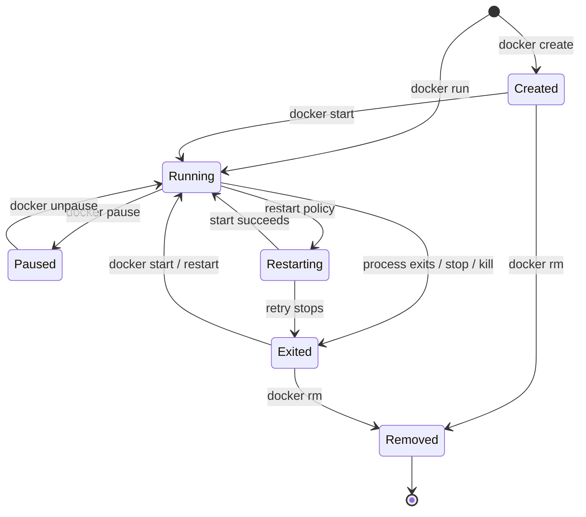

Container không phải một máy ảo nhỏ luôn tồn tại ở trạng thái chạy. Nó là một object do Docker daemon quản lý, gồm cấu hình đã chốt lúc tạo, writable layer, các mount/network attachment và một process chính chỉ tồn tại khi container chạy.

Vì vậy, cần tách hai câu hỏi:

- **Container object còn tồn tại không?** Nếu còn, Docker vẫn giữ ID, name, cấu hình và writable layer của nó.
- **Process chính còn chạy không?** Nếu PID 1 dừng, container chuyển sang `exited`, nhưng object chưa bị xóa.

Đây là nền tảng để hiểu vì sao `docker stop` không xóa dữ liệu trong writable layer, `docker start` không tạo container mới, còn `docker rm` mới kết thúc lifecycle của object.

## State machine cốt lõi

Sơ đồ sau tập trung vào các state thường gặp trên một Docker Engine độc lập. Một command có thể thất bại trước khi đạt state đích, nên luôn kiểm tra state thực tế thay vì suy luận từ command vừa chạy.



`removing` và `dead` là các state phụ có thể xuất hiện trong lúc xóa hoặc khi daemon không hoàn tất cleanup. Chúng thường là tín hiệu để thu thập `docker inspect`, `docker events` và daemon logs, không phải state vận hành bình thường.

| State | Process chính | Ý nghĩa vận hành |
|---|---:|---|
| `created` | Chưa có | Object đã được tạo nhưng chưa start lần nào |
| `running` | Có | PID 1 đang chạy; container chưa chắc đã `healthy` |
| `paused` | Bị suspend | Các process vẫn tồn tại nhưng không được scheduler cho chạy |
| `restarting` | Đang được thay phiên khởi động lại | Restart policy đang xử lý một lần exit |
| `exited` | Không | Process đã dừng; exit code và object vẫn còn để điều tra |
| `removing` | Không ổn định | Daemon đang xóa object |
| `dead` | Không | Daemon không xóa được hoàn toàn; cần chẩn đoán host/runtime |

Xem state ở dạng dễ đọc:

```bash
docker container ls --all
```

Xem state có cấu trúc để dùng trong script:

```bash
docker container inspect CONTAINER \
  --format 'status={{.State.Status}} running={{.State.Running}} paused={{.State.Paused}} exit={{.State.ExitCode}}'
```

Thay `CONTAINER` bằng name hoặc ID. Khi cần phân biệt nhiều incarnation dùng lại cùng name, ưu tiên full container ID.

## Container identity và process instance

Một container có ID ổn định từ `create` đến `rm`. Mỗi lần `start`, Docker tạo một process instance mới từ cấu hình đã lưu trong container object:

- container ID và name giữ nguyên;
- image reference/config không tự cập nhật dù tag đã trỏ sang image mới;
- writable layer và named volume vẫn còn;
- PID, thời gian start và state runtime thay đổi;
- process bắt đầu lại từ `ENTRYPOINT`/`CMD`, không tiếp tục từ instruction đang dở.

`docker restart` cũng vận hành trên **cùng container**, tương đương một chu kỳ stop rồi start về mặt lifecycle. Muốn nhận image hoặc cấu hình deployment mới, phải tạo container mới.

<Callout type="warn" title="Stopped không có nghĩa là đã xóa">
  Container `exited` vẫn chiếm metadata và writable-layer disk. Ngược lại, xóa container làm mất writable layer của nó; dữ liệu cần bền vững phải nằm trong volume, bind mount hoặc external service.
</Callout>

## Health là trục trạng thái riêng

Container có healthcheck mang thêm health status:

```text
starting → healthy ↔ unhealthy
```

Health status không thay thế lifecycle state. Một container có thể `running` nhưng `unhealthy`; Docker Engine không tự stop hoặc restart container chỉ vì healthcheck thất bại. Restart policy phản ứng với **process exit**, không phản ứng trực tiếp với `unhealthy`.

Kiểm tra cả hai trục:

```bash
docker container inspect CONTAINER \
  --format 'state={{.State.Status}} health={{with .State.Health}}{{.Status}}{{else}}none{{end}}'
```

Chi tiết nằm ở [Container health checks](/docs/container-lifecycle/healthchecks/) và [Restart policies](/docs/container-lifecycle/restart-policies/).

## Lab: đi qua `created`, `running`, `exited` và removed

Ví dụ dùng Linux container `alpine:3.22`. Name có prefix `lifecycle-` để dễ nhận diện và cleanup.

### Tạo nhưng chưa chạy

```bash
docker container create \
  --name lifecycle-overview \
  --label com.example.lab=container-lifecycle \
  alpine:3.22 sh -c 'echo lifecycle-started; exit 7'
```

Command in container chưa chạy. Xác minh:

```bash
docker container inspect lifecycle-overview \
  --format 'status={{.State.Status}} running={{.State.Running}}'
docker container logs lifecycle-overview
```

Expected state là `created`; logs chưa có dòng `lifecycle-started`.

### Start và chờ process kết thúc

```bash
docker container start lifecycle-overview
docker container wait lifecycle-overview
```

`docker container wait` in exit code của process, ở đây là `7`. Kiểm tra evidence thay vì chỉ nhìn cột `STATUS`:

```bash
docker container logs lifecycle-overview
docker container inspect lifecycle-overview \
  --format 'status={{.State.Status}} exit={{.State.ExitCode}} finished={{.State.FinishedAt}}'
```

Expected: log có `lifecycle-started`, state là `exited` và exit code là `7`.

### Xóa object

```bash
docker container rm lifecycle-overview
docker container inspect lifecycle-overview
```

Lệnh `inspect` cuối phải báo không tìm thấy object. Đây là khác biệt quan trọng giữa `exited` và removed.

## Chọn command theo ý định

| Ý định | Command | Điều cần nhớ |
|---|---|---|
| Chuẩn bị object, chưa chạy | `docker container create` | State đầu là `created` |
| Tạo và chạy trong một bước | `docker container run` | Thực hiện create rồi start, mặc định attach |
| Chạy lại object đã dừng | `docker container start` | Dùng lại config và writable layer cũ |
| Dừng có grace period | `docker container stop` | Gửi stop signal rồi mới `SIGKILL` nếu quá hạn |
| Gửi signal ngay | `docker container kill` | Mặc định `SIGKILL`; có thể chọn signal khác |
| Tạm đóng băng process | `docker container pause` | Không giải phóng resource hay đóng connection đúng cách |
| Chạy process phụ | `docker container exec` | Chỉ chạy khi PID 1 còn sống |
| Nối vào stdio của PID 1 | `docker container attach` | Có thể gửi signal/input tới application chính |
| Xóa container | `docker container rm` | Xóa object và writable layer, không mặc định xóa named volume |

## Quan sát lifecycle trong thực tế

Không dùng một signal duy nhất để kết luận. Kết hợp:

```bash
docker container ls --all --no-trunc
docker container inspect CONTAINER
docker container logs --timestamps --tail 200 CONTAINER
docker events --since '10m' --until '0s' --filter 'container=CONTAINER'
```

- `ls` cho inventory nhanh;
- `inspect` cho current state và config;
- `logs` cho output của process;
- `events` cho timeline gần đây, nhưng không phải audit log bền vững.

Trước khi `rm`, recreate hoặc prune trong một incident, hãy capture các evidence trên. Xóa object có thể làm mất đúng state cần để tìm nguyên nhân.

## Lộ trình của phần này

Đọc theo thứ tự navigation để đi từ thao tác cơ bản đến cách vận hành:

1. [Create, run và start](/docs/container-lifecycle/create-run-start/) để hiểu lúc nào cấu hình được chốt.
2. [Stop, kill và restart](/docs/container-lifecycle/stop-kill-restart/) và [Pause, unpause](/docs/container-lifecycle/pause-unpause/) để điều khiển state an toàn.
3. [Exec và attach](/docs/container-lifecycle/exec-and-attach/), [Container logs](/docs/container-lifecycle/logs/) và [Process trong container](/docs/container-lifecycle/processes-and-top/) để quan sát runtime.
4. [Exit codes](/docs/container-lifecycle/exit-codes/), [Restart policies](/docs/container-lifecycle/restart-policies/) và [Container health checks](/docs/container-lifecycle/healthchecks/) để thiết kế failure handling.
5. [Xóa container và dọn dẹp](/docs/container-lifecycle/cleanup/) rồi [Immutable containers](/docs/container-lifecycle/immutable-containers/) để chuyển từ lab sang operating model có thể lặp lại.

## Nguồn chính thức

- [Docker container CLI reference](https://docs.docker.com/reference/cli/docker/container/)
- [docker container ls và các lifecycle status](https://docs.docker.com/reference/cli/docker/container/ls/)
- [Docker Engine API reference](https://docs.docker.com/reference/api/engine/)
