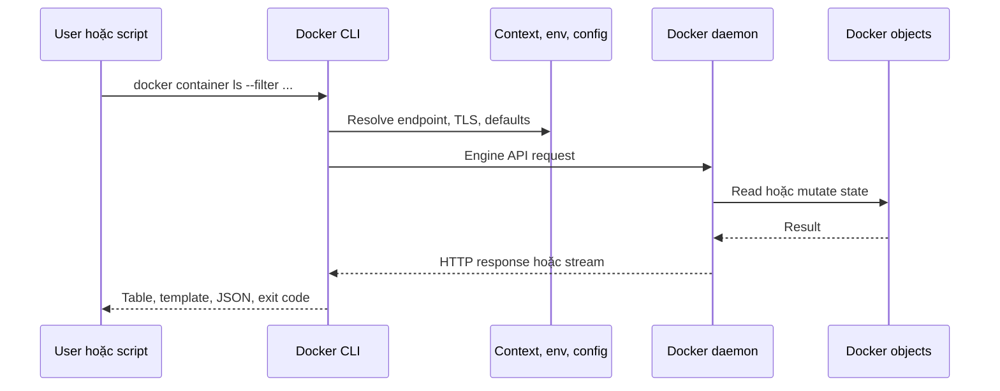

Docker CLI là lớp điều khiển phổ biến nhất của Docker Engine. Command `docker` không tự chạy container: CLI đọc option, context, environment và client config, sau đó gửi request tới Docker daemon qua Engine API. Daemon mới là thành phần tạo image, container, network và volume.

Mental model này giải thích một quy tắc vận hành quan trọng: **terminal ở máy A có thể đang thay đổi resource trên daemon ở máy B**. Trước một command tạo, xóa hoặc cleanup object, luôn xác định target.

```bash
docker context show
docker context ls
docker version
```

`docker version` phải có cả phần Client và Server nếu command cần daemon. `docker --help` và một số thao tác quản lý context vẫn có thể chạy khi Server không reachable.

<Callout type="error" title="Docker socket là quyền điều khiển mạnh">
  Người hoặc process truy cập được Docker daemon rootful thường có thể đạt quyền tương đương root trên daemon host. Không mount Docker socket vào container, chia sẻ context hoặc mở TCP endpoint chỉ vì muốn chạy CLI thuận tiện.
</Callout>

## Luồng xử lý một command



Có bốn lớp cần phân biệt:

1. **Command syntax** quyết định object và operation, ví dụ `docker container inspect`.
2. **Target selection** quyết định daemon nào nhận request, thường qua context.
3. **Client behavior** đến từ global flag, environment variable và `~/.docker/config.json`.
4. **Server behavior** phụ thuộc Engine API, daemon configuration và capability của daemon đích.

Vì vậy, sửa `~/.docker/config.json` không thay đổi cấu hình `dockerd`; ngược lại, sửa `/etc/docker/daemon.json` không đổi default format của CLI.

## Hai kiểu command: object-oriented và alias

Docker hỗ trợ command theo management group:

```bash
docker container ls
docker image ls
docker volume inspect app-data
docker system df
```

Nhiều operation còn có alias top-level tương thích lâu đời:

```bash
docker ps
docker images
docker inspect app-data
```

Trong tài liệu và automation mới, dạng `docker <object> <operation>` thường rõ nghĩa hơn. Alias vẫn hữu ích khi thao tác nhanh, nhưng `docker inspect NAME` có thể mơ hồ nếu nhiều loại object trùng tên; `docker volume inspect NAME` hoặc `docker inspect --type volume NAME` an toàn hơn.

## Phân loại command theo tác động

| Nhóm | Ví dụ | Câu hỏi trước khi chạy |
|---|---|---|
| Local client | `docker --help`, `docker context ls` | Có đọc file chứa credential hoặc endpoint nhạy cảm không? |
| Read-only tới daemon | `docker version`, `docker info`, `docker container ls`, `docker inspect` | Context có đúng target và output có secret không? |
| Tạo/thay đổi object | `docker run`, `docker network create`, `docker container update` | Naming, label, quota, port và cleanup plan là gì? |
| Xóa object | `docker rm`, `docker image prune`, `docker system prune` | Có inventory, backup và xác nhận object đang không được dùng không? |
| Streaming | `docker events`, `docker logs --follow`, `docker stats` | Command dừng khi nào và output được lưu ở đâu? |

Exit code `0` chỉ cho biết command hoàn thành theo contract của nó. Một lệnh liệt kê trả về danh sách rỗng vẫn có thể exit `0`; script phải kiểm tra cả dữ liệu khi empty state là lỗi.

## Workflow CLI an toàn

### 1. Xác định client, server và target

```bash
docker context show
docker version --format 'client={{.Client.Version}} server={{.Server.Version}} api={{.Server.APIVersion}}'
```

Nếu Server không reachable, dùng `docker version` không format để giữ thông báo lỗi đầy đủ. Với remote context, bind-mount path và published port thuộc daemon host, không thuộc laptop đang chạy CLI.

### 2. Thu hẹp object trước khi thay đổi

Dùng label và filter thay vì grep tên từ table mặc định:

```bash
docker container ls --all \
  --filter 'label=com.example.project=cli-lab' \
  --format 'table {{.ID}}\t{{.Names}}\t{{.Status}}'
```

Filter được daemon/command hiểu theo field có hỗ trợ. `grep` chỉ xử lý text sau khi CLI render và dễ match nhầm.

### 3. Inspect effective state

```bash
docker container inspect cli-lab \
  --format 'status={{.State.Status}} image={{.Config.Image}} restart={{.HostConfig.RestartPolicy.Name}}'
```

`inspect` là dữ liệu low-level. Field khác nhau theo object type và Engine version; luôn xem JSON đầy đủ trước khi viết template phụ thuộc một path.

### 4. Thực hiện thay đổi nhỏ, có label

Ví dụ tạo một container lab đã dừng:

```bash
docker container create \
  --name cli-lab \
  --label com.example.project=cli-lab \
  alpine:latest echo cli-ok
```

Xác minh object đã được tạo nhưng chưa chạy:

```bash
docker container inspect cli-lab \
  --format 'status={{.State.Status}} labels={{json .Config.Labels}}'
```

Expected state là `created`; output cụ thể còn phụ thuộc version và environment.

### 5. Quan sát lifecycle và cleanup đúng object

Terminal thứ nhất:

```bash
docker events \
  --filter 'container=cli-lab' \
  --filter 'type=container'
```

Terminal thứ hai:

```bash
docker container start --attach cli-lab
docker container rm cli-lab
```

Bạn sẽ thấy các event như `start`, `die` và `destroy`. Event stream chỉ phục vụ quan sát gần thời gian thực, không thay thế audit log bền vững.

## CLI cho người và CLI cho automation

Command tương tác nên ưu tiên output dễ đọc và confirmation. Script cần contract chặt hơn:

- pin context bằng `docker --context "$TARGET_CONTEXT" ...` thay vì dựa vào context đang active;
- dùng object ID, label hoặc exact filter thay cho tên gần đúng;
- dùng `--format`, JSON hoặc Engine API thay vì parse table mặc định;
- kiểm tra exit code và empty result;
- đặt timeout cho stream hoặc network operation ở lớp gọi;
- không dùng `--force` để che bước review;
- ghi target, command intent và object ID vào log nhưng redact credential.

Ví dụ guard tối thiểu trước cleanup trong Bash:

```bash
set -euo pipefail

: "${TARGET_CONTEXT:?Set TARGET_CONTEXT explicitly}"

actual_context=$(docker --context "$TARGET_CONTEXT" context show)
[ "$actual_context" = "$TARGET_CONTEXT" ] || {
  echo "Unexpected context: $actual_context" >&2
  exit 1
}

docker --context "$TARGET_CONTEXT" container ls \
  --all \
  --filter 'label=com.example.lifecycle=ephemeral' \
  --format '{{.ID}}\t{{.Names}}'
```

Đây mới là inventory; chưa có command xóa. Production workflow nên tách review và execution thành hai bước độc lập.

## Bản đồ phần Docker CLI

1. [Cấu trúc Docker command](/docs/docker-cli/command-structure/) giải thích management group, option, argument, help và exit status.
2. [Docker contexts](/docs/docker-cli/contexts/) quản lý nhiều daemon local/remote và tránh thao tác nhầm target.
3. [Environment variables](/docs/docker-cli/environment-variables/) trình bày endpoint, TLS, API version, platform, proxy và scope của biến.
4. [Docker CLI configuration](/docs/docker-cli/configuration-file/) quản lý `config.json`, credential helper, proxy mặc định và output format.
5. [Định dạng output](/docs/docker-cli/format-output/) dùng Go template và JSON an toàn cho người đọc lẫn script.
6. [Filter và sort object](/docs/docker-cli/filter-and-sort/) thu hẹp object ở nguồn và sắp xếp machine-readable output.
7. [Inspect Docker object](/docs/docker-cli/inspect/) đọc desired config, runtime state, network, mount và size.
8. [Theo dõi Docker events](/docs/docker-cli/events/) capture lifecycle theo thời gian, filter và xuất JSON Lines.
9. [Docker system commands](/docs/docker-cli/system-commands/) đọc capability, disk usage và cleanup có kiểm soát.
10. [Shell completion](/docs/docker-cli/completion/) bật completion cho Bash, Zsh và Fish, đồng thời chẩn đoán completion cũ.
11. [Engine API và SDKs](/docs/docker-cli/api-and-sdks/) chuyển từ shell command sang tích hợp có version negotiation và security boundary rõ ràng.

## Tiêu chí hoàn thành

Sau phần này, bạn cần làm được các việc sau mà không đoán:

- giải thích CLI và daemon là hai process có thể ở hai host khác nhau;
- xác minh context trước thao tác;
- chọn command object-oriented và đọc help đúng cấp;
- phân biệt global option, command option và argument truyền vào process trong container;
- dùng filter, format và inspect thay cho parse table bằng vị trí cột;
- capture event trong một time window xác định;
- đánh giá disk usage trước prune và hiểu prune không có rollback;
- chọn CLI, Engine API hoặc SDK theo mức độ tự động hóa;
- bảo vệ Docker socket, TLS material và client config như credential quản trị.

## Nguồn chính thức

- [Docker CLI reference](https://docs.docker.com/reference/cli/docker/)
- [Docker contexts](https://docs.docker.com/engine/manage-resources/contexts/)
- [Docker Engine API](https://docs.docker.com/reference/api/engine/)
- [Protect the Docker daemon socket](https://docs.docker.com/engine/security/protect-access/)
