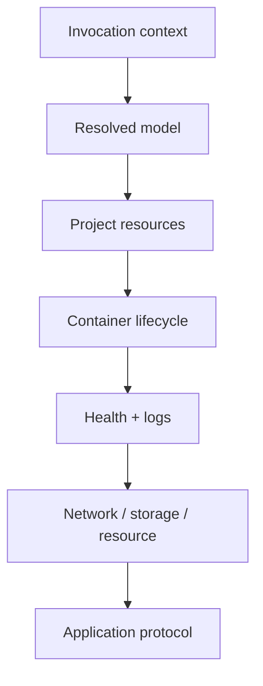

Troubleshooting Compose hiệu quả bắt đầu từ **resolved model**, sau đó mới đi xuống resource và process runtime. Nhiều incident tưởng là container lỗi nhưng nguyên nhân là đang dùng sai project name, file set, profile, interpolation source hoặc relative path.



<Callout type="warn" title="Thu evidence trước khi down hoặc recreate">
  `docker compose down`, `up --force-recreate`, prune hoặc xóa volume có thể làm mất container state, writable layer, logs local và timeline cần điều tra. Capture model, ps, inspect, logs và events trước thao tác phá hủy.
</Callout>

## 1. Xác nhận invocation context

Ghi lại command, directory, file set, project và version:

```bash
pwd
docker compose version
docker version
docker context show
docker compose ls
docker compose config --profiles
docker compose config --services
```

Nếu dùng nhiều file/profile, lặp đúng flags production:

```bash
docker compose \
  -p shop-prod \
  -f compose.yaml \
  -f compose.production.yaml \
  --profile observability \
  config
```

Các lỗi thường gặp:

- chạy trong directory khác nên Compose tìm file/project khác;
- Docker context trỏ remote Engine;
- quên production override hoặc vô tình auto-load dev override;
- project name đổi nên tạo stack resource thứ hai;
- profile cần thiết chưa active.

## 2. Validate resolved model

```bash
docker compose config --quiet
docker compose config --environment
docker compose config --format json > compose-resolved.json
```

Kiểm tra:

- image reference sau interpolation;
- bind/config/secret path;
- port và host IP;
- service có nằm trong active profiles;
- network/volume external name;
- merged `command`, `entrypoint`, environment và healthcheck;
- development mount còn sót.

`config --environment` và resolved JSON có thể chứa dữ liệu nhạy cảm. Lưu evidence ở nơi có access control và xóa theo retention policy.

## 3. Inventory project và container state

```bash
docker compose ps --all --no-trunc
docker compose images
docker compose top
docker compose events --json
```

Với service cụ thể:

```bash
container_id=$(docker compose ps --quiet api)
docker inspect "$container_id" > api-inspect.json
docker logs --timestamps --tail 500 "$container_id" > api.log 2>&1
```

Nếu `ps` trống nhưng bạn thấy container trong `docker ps`, so labels/project:

```bash
docker ps -a --filter label=com.docker.compose.project \
  --format 'table {{.ID}}\t{{.Names}}\t{{.Label "com.docker.compose.project"}}\t{{.Label "com.docker.compose.service"}}'
```

## 4. Create/start failure

Chạy foreground để thấy error trực tiếp:

```bash
docker compose up --build
```

Phân loại:

| Error | Hướng kiểm tra |
|---|---|
| Pull access denied/not found | Image name/tag, registry login, credential scope |
| Port already allocated | Host socket và project khác đang bind |
| Network/volume external not found | Provisioning và `name` effective |
| Bind source missing | Resolved path, `create_host_path`, host filesystem |
| Permission denied | Host path mode, container UID/GID, SELinux/AppArmor |
| Invalid mount config | Short syntax, file-vs-directory, platform support |
| Unknown field/unsupported feature | Compose CLI version và schema |

Tìm process bind port trên Linux:

```bash
sudo ss -ltnp 'sport = :8080'
docker ps --format '{{.Names}}\t{{.Ports}}'
```

Không kill process trước khi xác định owner/impact.

## 5. Process exit và restart loop

```bash
docker compose ps --all
docker compose logs --timestamps --tail 200 api
docker inspect "$(docker compose ps -q api)" \
  --format 'status={{.State.Status}} exit={{.State.ExitCode}} oom={{.State.OOMKilled}} error={{.State.Error}} restarts={{.RestartCount}}'
```

Đọc [Exit codes](/docs/container-lifecycle/exit-codes/) và [Restart policies](/docs/container-lifecycle/restart-policies/). Restart loop chỉ là symptom; tạm thời vô hiệu restart trong môi trường điều tra nếu runbook cho phép để giữ evidence.

Kiểm tra command effective:

```bash
docker inspect "$(docker compose ps -q api)" \
  --format 'entrypoint={{json .Config.Entrypoint}} cmd={{json .Config.Cmd}} user={{json .Config.User}}'
```

## 6. Healthcheck fail

```bash
docker inspect "$(docker compose ps -q api)" \
  --format '{{json .State.Health}}'
docker compose exec api sh -c 'command -v curl || command -v wget || true'
```

Câu hỏi:

1. probe tool có trong image?
2. probe gọi đúng `localhost`/port/path bên trong container?
3. `$VAR` có bị Compose interpolate sớm thay vì dùng `$$VAR`?
4. timeout/retries/start_period có thực tế?
5. endpoint có dependency side effect hoặc auth?
6. process running nhưng application đang deadlock/OOM/throttle?

`unhealthy` không tự kích restart policy trên standalone Engine.

## 7. Network và DNS

Từ source service:

```bash
docker compose exec api cat /etc/resolv.conf
docker compose exec api getent hosts db
docker compose exec api sh -c 'nc -vz db 5432'
docker compose port api 8080
```

Xem attachment:

```bash
docker inspect "$(docker compose ps -q api)" \
  --format '{{json .NetworkSettings.Networks}}'
docker network ls --filter label=com.docker.compose.project
docker network inspect PROJECT_backend
```

Chẩn đoán theo lớp:

1. hai services share network?
2. DNS service name resolve?
3. process peer listen đúng interface/port?
4. route/firewall cho phép?
5. TCP connect?
6. TLS/HTTP/database protocol đúng?

Không gọi `localhost` để tới service khác và không publish port chỉ để chữa giao tiếp nội bộ.

## 8. Storage và permission

```bash
docker inspect "$(docker compose ps -q api)" \
  --format '{{json .Mounts}}'
docker compose exec api id
docker compose exec api stat -c '%u:%g %a %n' /var/lib/app
docker volume ls --filter label=com.docker.compose.project
```

Nếu dữ liệu “mất”:

- project name có đổi nên volume physical name khác?
- mount target có đổi/che directory image?
- dùng anonymous volume mới?
- bind source resolve sang path khác?
- `down -v`/prune đã xóa volume?
- application đang đọc database/schema khác?

Không ghi thử vào database volume đang incident. Mount read-only vào container điều tra hoặc dùng backup/database tooling phù hợp.

## 9. Environment và interpolation

```bash
docker compose config --environment
docker compose config
docker inspect "$(docker compose ps -q api)" \
  --format '{{json .Config.Env}}'
```

Không in output này vào ticket/log public. Phân biệt:

- `.env`/`--env-file` cho model interpolation;
- service `env_file` cho container environment;
- `environment` override service `env_file`;
- environment chốt lúc create, sửa file cần recreate.

## 10. Resource exhaustion

```bash
docker stats --no-stream
docker system df
docker info
df -h
df -i
```

Trên Linux còn kiểm tra kernel/daemon logs theo quyền và distro:

```bash
journalctl -u docker --since '30 min ago'
dmesg --ctime | tail -n 100
```

Tìm OOM, disk full, inode exhaustion, pull/unpack error, daemon restart, cgroup limit và filesystem I/O. Site build/Compose parse thành công không chứng minh host đủ resource.

## Orphans và stale resources

Khi service bị rename/remove, container cũ có thể thành orphan:

```bash
docker compose up --detach --remove-orphans
```

Trước khi xóa, xác minh nó thực sự thuộc project và không giữ evidence/data. Cleanup project:

```bash
docker compose down --remove-orphans
```

Không thêm `--volumes` trong runbook generic.

## Capture bundle tối thiểu

```bash
mkdir -p compose-evidence

docker compose config > compose-evidence/config.yaml
docker compose ps -a --no-trunc > compose-evidence/ps.txt
docker compose logs --no-color --timestamps > compose-evidence/logs.txt 2>&1
docker version > compose-evidence/docker-version.txt
docker compose version > compose-evidence/compose-version.txt
```

Thêm `docker inspect` cho container/network/volume liên quan và redact secret trước khi chia sẻ. `docker events` chỉ giữ timeline hữu hạn; thu sớm.

## Decision table

| Triệu chứng | Evidence đầu tiên |
|---|---|
| Không thấy service | `config --services`, profiles, project name |
| Config khác kỳ vọng | `config`, `config --environment`, file order |
| Container không create | foreground `up`, Engine error |
| Exit ngay | logs, exit code, effective command |
| Running nhưng unavailable | health, listening socket, request nội bộ |
| Service không resolve peer | network attachment, `getent hosts` |
| Host không truy cập port | `compose port`, bind IP, host socket/firewall |
| Data/permission lỗi | `.Mounts`, UID/GID/mode, volume identity |
| Restart/OOM/chậm | inspect state, stats, daemon/kernel logs |

## Nguồn chính thức

- [`docker compose config`](https://docs.docker.com/reference/cli/docker/compose/config/)
- [`docker compose ps`](https://docs.docker.com/reference/cli/docker/compose/ps/)
- [`docker compose logs`](https://docs.docker.com/reference/cli/docker/compose/logs/)
- [Networking in Compose](https://docs.docker.com/compose/how-tos/networking/)
- [Docker daemon logs](https://docs.docker.com/engine/daemon/logs/)
