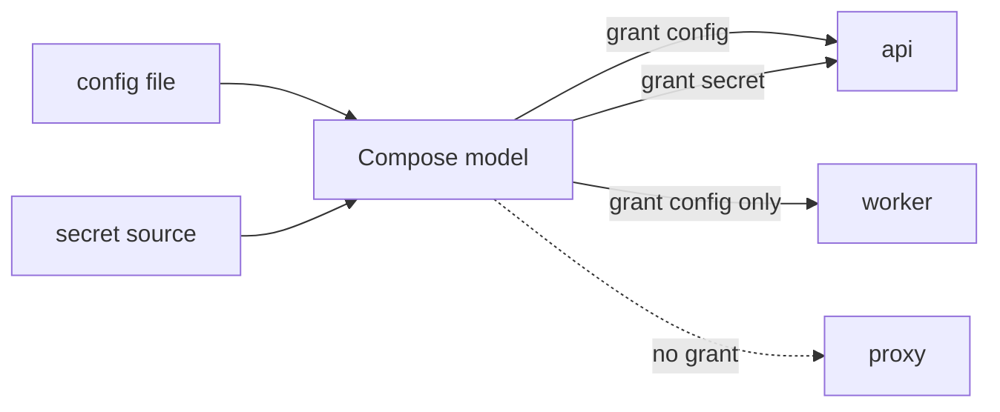

Configs và secrets tách dữ liệu cấu hình khỏi image rồi cấp quyền theo service. Cả hai thường xuất hiện trong container dưới dạng file, giúp application đọc nội dung mà không cần bake vào image hoặc đưa tất cả vào environment.



<Callout type="warn" title="Secret trong Compose không tự trở thành vault">
  Với Docker Compose trên một Engine thông thường, file-backed secret được triển khai bằng mount từ host. Compose giúp giảm accidental exposure và cấp theo service, nhưng không tự mã hóa source file, quản lý rotation hay bảo vệ host/root user.
</Callout>

## Cơ chế hai bước

Định nghĩa source ở top level, sau đó grant cho từng service:

```yaml
services:
  api:
    image: example/api:1
    configs:
      - source: app_config
        target: /etc/example/app.yaml
    secrets:
      - source: db_password
        target: db_password

configs:
  app_config:
    file: ./config/app.yaml

secrets:
  db_password:
    file: ./secrets/db-password.txt
```

Service không liệt kê resource sẽ không được mount resource đó. Trên Linux, short syntax config mặc định ở `/<config-name>`; secret thường ở `/run/secrets/<secret-name>`.

## Config sources

Compose Specification hỗ trợ các source theo implementation/version:

```yaml
configs:
  from_file:
    file: ./config/app.yaml

  from_env:
    environment: SIMPLE_CONFIG_VALUE

  inline:
    content: |
      log.level=${LOG_LEVEL:-info}
      app.name=${COMPOSE_PROJECT_NAME}

  managed_elsewhere:
    external: true
    name: platform-config-v4
```

- `file`: đọc content từ file;
- `environment`: lấy toàn bộ value của một host variable;
- `content`: inline content và có interpolation;
- `external`: lookup resource do platform quản lý, fail nếu không tồn tại.

Inline config phù hợp nội dung không nhạy cảm, nhỏ và cần template. File riêng dễ lint/test hơn cho cấu hình phức tạp.

## Secret sources

```yaml
secrets:
  api_token:
    file: ./secrets/api-token.txt

  oauth_token:
    environment: OAUTH_TOKEN

  external_certificate:
    external: true
    name: prod-server-certificate
```

`environment` secret lấy value từ environment của tiến trình Compose. Đây là feature Docker Compose và không được `docker stack deploy` hỗ trợ theo cùng cách. Shell/CI vẫn phải bảo vệ biến nguồn.

Không commit secret source:

```text
# .gitignore
secrets/*
!secrets/README.md
```

`.gitignore` không xóa secret đã commit và không bảo vệ file trên host. Nếu credential từng lộ, rotate/revoke trước rồi mới dọn history.

## Short và long syntax ở service

```yaml
services:
  app:
    configs:
      - app_config
    secrets:
      - source: api_token
        target: application_token
        uid: "10001"
        gid: "10001"
        mode: "0400"
```

Long syntax có `source`, `target`, `uid`, `gid`, `mode`. Tuy nhiên Docker Compose dùng bind mount cho file source nên `uid`, `gid`, `mode` có thể không được implement đầy đủ với file-backed config/secret. Kiểm tra effective permission trong container, không chỉ tin YAML.

```bash
docker compose exec app stat -c '%u:%g %a %n' /run/secrets/application_token
```

## `_FILE` convention

Nhiều Docker Official Images hỗ trợ biến có hậu tố `_FILE`:

```yaml
services:
  db:
    image: postgres:18-alpine
    environment:
      POSTGRES_DB: inventory
      POSTGRES_USER: inventory
      POSTGRES_PASSWORD_FILE: /run/secrets/db_password
    secrets:
      - db_password

secrets:
  db_password:
    file: ./secrets/db-password.txt
```

`_FILE` là convention của entrypoint/application image, không phải Compose tự chuyển mọi variable. Kiểm tra tài liệu image; application custom phải tự đọc file.

## Config, secret, environment hay volume?

| Nhu cầu | Cơ chế ưu tiên |
|---|---|
| Giá trị non-secret nhỏ để interpolation model | `.env`/shell + interpolation |
| Nhiều runtime variables | service `env_file` |
| Config file read-only | `configs` |
| Password/token/certificate private | `secrets` + external secret workflow nếu production |
| Dữ liệu application ghi và cần persist | volume |
| Source code development | bind mount hoặc Compose Watch |

Environment dễ bị lộ qua debug output/process inspection và không biểu diễn file permission. Secret mount giảm một số rủi ro nhưng application vẫn có thể log/exfiltrate nội dung sau khi đọc.

## Lab: grant theo service

Tạo source không dùng credential thật:

```bash
mkdir -p config secrets
printf 'mode=lab\n' > config/app.conf
printf 'not-a-real-secret\n' > secrets/token.txt
chmod 600 secrets/token.txt
```

```yaml
name: compose-config-secret-lab

services:
  allowed:
    image: alpine:3.23
    command: ["sleep", "300"]
    configs:
      - source: app_config
        target: /etc/lab/app.conf
    secrets:
      - token

  denied:
    image: alpine:3.23
    command: ["sleep", "300"]

configs:
  app_config:
    file: ./config/app.conf

secrets:
  token:
    file: ./secrets/token.txt
```

Chạy và kiểm tra:

```bash
docker compose up --detach
docker compose exec allowed cat /etc/lab/app.conf
docker compose exec allowed sh -c 'wc -c /run/secrets/token'
docker compose exec denied sh -c 'ls /run/secrets 2>/dev/null || true'
```

Không `cat` secret thật trong terminal/log CI. `wc -c` chỉ dùng ở lab để chứng minh file tồn tại.

## Rotation

Thay source file không nên được coi là hot reload contract. Quy trình an toàn:

1. tạo version secret mới;
2. cập nhật reference/model;
3. recreate service nhận secret;
4. xác minh connection/auth;
5. revoke version cũ;
6. xóa artifact tạm và audit logs.

```bash
docker compose up --detach --force-recreate allowed
```

Ứng dụng phải đóng/mở lại connection hoặc reload credential theo behavior đã thiết kế.

## Cleanup

```bash
docker compose down
rm -rf config secrets
```

## Nguồn chính thức

- [Configs top-level element](https://docs.docker.com/reference/compose-file/configs/)
- [Secrets top-level element](https://docs.docker.com/reference/compose-file/secrets/)
- [Manage secrets securely in Docker Compose](https://docs.docker.com/compose/how-tos/use-secrets/)
- [Build secrets](/docs/buildkit/secret-and-ssh-mounts/)
