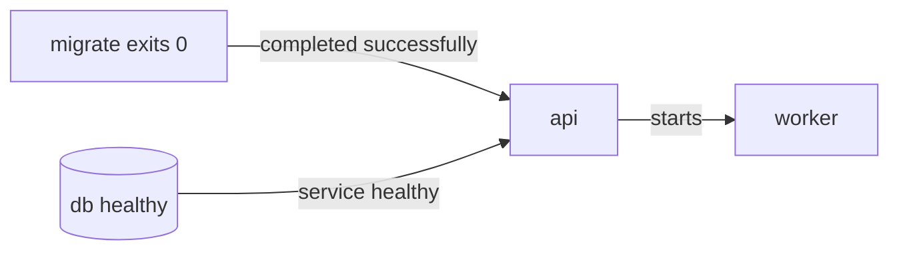

`depends_on` biểu diễn dependency giữa services và điều khiển create/start/remove order. Nó không tự chứng minh service đã sẵn sàng nhận request, không đảm bảo dependency sẽ luôn sống và không thay retry logic trong application.



## Short syntax: started, chưa chắc ready

```yaml
services:
  api:
    image: example/api:1
    depends_on:
      - db

  db:
    image: postgres:18-alpine
```

Compose start `db` trước `api`, nhưng short syntax chỉ tương đương `service_started`. Container database có thể đang `running` trong khi recovery/migration nội bộ chưa xong.

## Long syntax và conditions

```yaml
services:
  api:
    image: example/api:1
    depends_on:
      db:
        condition: service_healthy
        restart: true
      migrate:
        condition: service_completed_successfully

  migrate:
    image: example/api:1
    command: ["./app", "migrate"]
    depends_on:
      db:
        condition: service_healthy

  db:
    image: postgres:18-alpine
    environment:
      POSTGRES_USER: app
      POSTGRES_DB: app
      POSTGRES_PASSWORD: lab-only
    healthcheck:
      test: ["CMD-SHELL", "pg_isready -U $${POSTGRES_USER} -d $${POSTGRES_DB}"]
      interval: 5s
      timeout: 3s
      retries: 10
      start_period: 20s
```

| Condition | Dependency được coi là thỏa khi |
|---|---|
| `service_started` | Container đã start |
| `service_healthy` | Healthcheck báo `healthy` |
| `service_completed_successfully` | One-off process exit code `0` |

`required: false` cho phép dependency optional: Compose cảnh báo thay vì fail khi dependency không available. Dùng cho telemetry/debug sidecar, không dùng để che dependency thật sự bắt buộc.

## Healthcheck chạy ở đâu?

Probe chạy **bên trong dependency container**. Tool trong `test` phải tồn tại trong image, và `localhost` là chính container đó:

```yaml
healthcheck:
  test: ["CMD", "wget", "-q", "-O-", "http://127.0.0.1:8080/healthz"]
  interval: 10s
  timeout: 2s
  retries: 5
  start_period: 30s
```

- `CMD` không qua shell;
- `CMD-SHELL`/string cho phép `||`, expansion và pipe;
- `$$VAR` giữ variable cho container shell;
- probe exit `0` là success, non-zero là failure.

Probe nên nhanh, bounded, không mutate data và phản ánh khả năng phục vụ. Không gọi một chuỗi dependency sâu nếu application vẫn có degradation mode.

## `restart: true` trong `depends_on` khác restart policy

```yaml
depends_on:
  db:
    condition: service_healthy
    restart: true
```

Field này yêu cầu Compose restart dependent sau khi dependency được update/restart bởi **explicit Compose operation**. Nó không có nghĩa runtime tự restart `api` mỗi lần `db` crash/restart.

Service restart policy là field khác:

```yaml
services:
  api:
    restart: unless-stopped
```

Restart policy phản ứng với process exit, không phản ứng trực tiếp với `unhealthy`.

## Application vẫn phải retry

Startup gate chỉ xử lý một thời điểm. Sau khi cả stack chạy:

- database có thể restart;
- DNS trả IP mới khi peer recreate;
- connection đang mở bị đóng;
- network tạm lỗi;
- dependency chuyển unhealthy.

Application phải có timeout, retry với backoff/jitter, reconnect và idempotency phù hợp. `depends_on` không phải runtime service mesh.

## `--wait` cho script và CI

```bash
docker compose up --detach --wait --wait-timeout 120
```

`--wait` chờ services running/healthy và phù hợp hơn `sleep 30`. Service có healthcheck phải healthy; service không có healthcheck chỉ có thể được đánh giá theo trạng thái running.

Sau đó chạy smoke test riêng:

```bash
curl --fail --retry 5 http://127.0.0.1:8080/healthz
```

Healthcheck pass không chứng minh toàn bộ user flow.

## Migration job pattern

```yaml
services:
  migrate:
    image: registry.example.com/shop/api:1.8.3
    command: ["./app", "migrate"]
    restart: "no"
    depends_on:
      db:
        condition: service_healthy

  api:
    image: registry.example.com/shop/api:1.8.3
    depends_on:
      migrate:
        condition: service_completed_successfully
```

Migration phải:

- trả exit code non-zero khi fail;
- an toàn khi retry hoặc có locking/version control;
- tương thích rollout/rollback schema;
- không chạy đồng thời ngoài ý muốn khi nhiều deploy actor.

Compose trên một host không tự giải quyết distributed migration coordination.

## Lab: thấy khác biệt started và healthy

Tạo `compose.yaml`:

```yaml
name: compose-dependency-lab

services:
  ready:
    image: alpine:3.23
    command: ["sh", "-c", "sleep 8; touch /tmp/ready; exec sleep 300"]
    healthcheck:
      test: ["CMD", "test", "-f", "/tmp/ready"]
      interval: 2s
      timeout: 1s
      retries: 10

  client:
    image: alpine:3.23
    command: ["sh", "-c", "echo dependency-ready; exec sleep 300"]
    depends_on:
      ready:
        condition: service_healthy
```

Chạy attached để xem timeline:

```bash
docker compose up --wait
docker compose ps
```

`client` chỉ start sau khi `ready` chuyển healthy. Xem health evidence:

```bash
docker compose ps --quiet ready | xargs docker inspect \
  --format '{{json .State.Health}}'
```

## Troubleshooting

| Triệu chứng | Kiểm tra |
|---|---|
| Dependent start quá sớm | Có đang dùng short syntax/service_started? |
| Dependency luôn unhealthy | Probe tool/path/port, timeout, health log |
| `${VAR}` trống trong probe | Dùng `$$VAR` nếu expansion phải xảy ra trong container |
| `up --wait` timeout | `docker compose ps`, `logs`, `.State.Health.Log` |
| Dependency restart nhưng client lỗi | Retry/reconnect logic, không chỉ `depends_on` |
| Migration chạy mãi | Process/lock/database logs và timeout policy |

## Cleanup

```bash
docker compose down
```

## Nguồn chính thức

- [Control startup and shutdown order](https://docs.docker.com/compose/how-tos/startup-order/)
- [`depends_on` reference](https://docs.docker.com/reference/compose-file/services/#depends_on)
- [`healthcheck` reference](https://docs.docker.com/reference/compose-file/services/#healthcheck)
- [Container health checks](/docs/container-lifecycle/healthchecks/)
