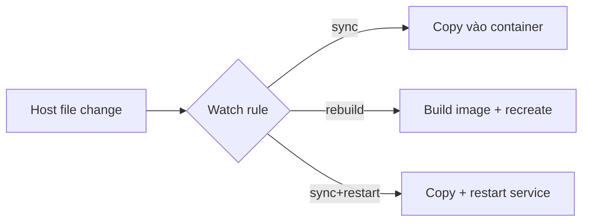

Compose Watch theo dõi source trên host và cập nhật service đang chạy theo rule khai báo. Nó phù hợp cho service build từ local source và giúp tránh bind toàn repository, đặc biệt khi dependency/artifact không portable giữa host và container.



Compose Watch yêu cầu Docker Compose 2.22.0+ cho `develop` và các action/field mới hơn có thể yêu cầu version mới hơn. Pin toolchain trong team/CI.

## Watch khác bind mount

| Tiêu chí | Bind mount | Compose Watch |
|---|---|---|
| Cập nhật file | Host filesystem mount trực tiếp | Compose sync/rebuild theo event |
| Granularity | Theo mount tree | Nhiều rule/action/ignore |
| Host-container portability | Có thể lộ artifact host | Có thể giữ dependency trong image/container |
| Rebuild khi manifest đổi | Script/tool khác | Rule `rebuild` |
| Offline sau container start | Mount luôn phản chiếu host | Watch process phải tiếp tục chạy |

Watch không thay mọi bind mount. Bind mount vẫn tốt cho file cần editing hai chiều hoặc tool ecosystem yêu cầu filesystem semantics trực tiếp. Watch chủ yếu là host-to-container development flow.

## Ba action chính

### `sync`

Copy thay đổi vào target, phù hợp framework hot reload:

```yaml
- action: sync
  path: ./src
  target: /app/src
```

### `rebuild`

Build image rồi recreate service, phù hợp dependency manifest hoặc compiled project:

```yaml
- action: rebuild
  path: ./package-lock.json
```

Behavior tương tự `docker compose up --build SERVICE` khi file đổi. Dockerfile phải tối ưu cache để loop không chậm.

### `sync+restart`

Sync file rồi restart service, phù hợp config cần process reload qua restart:

```yaml
- action: sync+restart
  path: ./config/app.yaml
  target: /etc/example/app.yaml
```

Restart làm gián đoạn connection và process; không dùng cho từng source edit nếu hot reload có thể xử lý.

## Cấu hình Node.js điển hình

```yaml
services:
  web:
    build:
      context: .
      target: development
    command: ["npm", "run", "dev", "--", "--host", "0.0.0.0"]
    ports:
      - "127.0.0.1:3000:3000"
    develop:
      watch:
        - action: sync
          path: ./src
          target: /app/src
          initial_sync: true
          ignore:
            - "**/*.test.js"
        - action: rebuild
          path: ./package.json
        - action: rebuild
          path: ./package-lock.json
```

Không sync `node_modules` từ host: package có native binary theo OS/architecture và file tree lớn gây I/O cao.

## Path và ignore rules

- `path` relative theo project directory;
- directory được watch recursive;
- `target` là root tương ứng trong container;
- `ignore` relative theo chính `path`, không theo project root;
- `.dockerignore` cũng ảnh hưởng watch;
- `.git` và temporary editor files thường được ignore tự động;
- watch path không dùng glob như một generic file watcher.

Nếu `path: ./web`, ignore `node_modules/` nhắm `./web/node_modules/`.

`initial_sync: true` với sync action đảm bảo target khớp host khi bắt đầu watch session. Không giả định image luôn chứa source mới nhất nếu trước đó dùng cache.

## Ownership và image prerequisites

Watch cần các executable cơ bản như `stat`, `mkdir`, `rmdir` trong image. User chạy container phải có quyền ghi target.

Dockerfile pattern:

```dockerfile
# syntax=docker/dockerfile:1
FROM node:24-alpine AS development

RUN addgroup -g 10001 app && adduser -D -u 10001 -G app app
WORKDIR /app
COPY package.json package-lock.json ./
RUN npm ci
COPY --chown=app:app . .
USER app
CMD ["npm", "run", "dev", "--", "--host", "0.0.0.0"]
```

Nếu `COPY` tạo file root-owned rồi container chạy UID `10001`, sync có thể fail permission. Sửa ownership trong image; không chạy root chỉ để Watch hoạt động.

## Chạy Watch

Start stack và watch cùng lúc:

```bash
docker compose up --watch
```

Hoặc tách logs khỏi watch events:

```bash
docker compose up --detach
docker compose watch
```

Trong terminal khác:

```bash
docker compose logs --follow web
```

Watch process phải còn chạy để nhận file events. Khi editor atomic-replace file hoặc filesystem remote/VM không phát event như mong đợi, kiểm tra behavior trên platform thật.

## Lab tối thiểu

Tạo file:

```bash
mkdir -p app
printf 'version-1\n' > app/message.txt
```

`Dockerfile`:

```dockerfile
FROM alpine:3.23
WORKDIR /app
COPY app/ /app/
CMD ["sh", "-c", "while true; do cat /app/message.txt; sleep 2; done"]
```

`compose.yaml`:

```yaml
name: compose-watch-lab

services:
  demo:
    build: .
    develop:
      watch:
        - action: sync
          path: ./app
          target: /app
          initial_sync: true
```

Chạy foreground:

```bash
docker compose up --watch
```

Trong terminal khác:

```bash
printf 'version-2\n' > app/message.txt
```

Expected: logs chuyển sang `version-2` mà không rebuild image. Nếu không, xem watch event, permission và target path.

## Tối ưu development loop

- Tách dependency manifest khỏi source trong Dockerfile để cache install step.
- `sync` source, `rebuild` lockfile/manifest, `sync+restart` config.
- Ignore output, coverage, dependency tree, logs và editor cache.
- Giữ target nhỏ; không watch toàn monorepo nếu service chỉ cần một package.
- Không đưa secret vào watched tree hoặc image context.
- Test delete/rename/new directory, không chỉ sửa content.
- Dùng healthcheck/smoke test để phát hiện service restart nhưng chưa ready.

## Cleanup

Dừng Watch bằng `Ctrl+C`, rồi:

```bash
docker compose down --remove-orphans
rm -rf app Dockerfile
```

## Nguồn chính thức

- [Use Compose Watch](https://docs.docker.com/compose/how-tos/file-watch/)
- [Compose Develop Specification](https://docs.docker.com/reference/compose-file/develop/)
- [Build cache](/docs/buildkit/)
