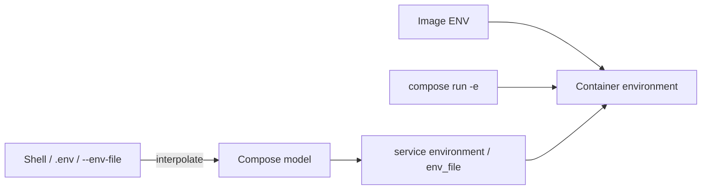

Trong Compose có hai pipeline dễ bị trộn lẫn:

1. **Interpolation**: Compose CLI đọc shell/`.env` để tạo application model.
2. **Container environment**: service `environment`, `env_file`, CLI và image `ENV` tạo biến bên trong container.



Một biến trong host shell hoặc `.env` **không tự xuất hiện trong container**. Compose file phải tham chiếu hoặc chuyển nó vào service.

## `environment`

Mapping syntax rõ key và type hơn:

```yaml
services:
  api:
    image: example/api:1
    environment:
      APP_ENV: production
      LOG_JSON: "true"
      OPTIONAL_VALUE:
```

List syntax tương đương cho giá trị cụ thể:

```yaml
environment:
  - APP_ENV=production
  - LOG_JSON=true
  - OPTIONAL_VALUE
```

Key không có value yêu cầu Compose resolve từ environment dùng cho invocation; nếu không resolve được, biến có thể bị unset khỏi container. Dùng required interpolation để fail rõ khi bắt buộc:

```yaml
environment:
  DATABASE_URL: "${DATABASE_URL:?DATABASE_URL is required}"
```

## Service `env_file`

```yaml
services:
  api:
    image: example/api:1
    env_file:
      - path: ./config/default.env
        required: true
      - path: ./config/local.env
        required: false
```

File sau override file trước nếu trùng key. Relative path được resolve theo Compose file/project rules. `environment` của service override `env_file`, kể cả khi value empty.

Ví dụ `config/default.env`:

```dotenv
APP_ENV=development
LOG_LEVEL=info
FEATURE_FLAGS="search,export"
```

`env_file` này đưa biến vào container. Nó khác CLI option:

```bash
docker compose --env-file .env.production up
```

Option `--env-file` chủ yếu cung cấp biến cho **interpolation và Compose self-configuration**. Hai cơ chế có thể đọc cùng format nhưng phục vụ boundary khác.

## Precedence container environment

Theo Docker Compose, từ cao xuống thấp:

1. `docker compose run -e KEY=value` hoặc `--env`;
2. giá trị ở `environment`/`env_file` được lấy qua interpolation từ shell hoặc environment file;
3. giá trị literal trong service `environment`;
4. giá trị trong service `env_file`;
5. Dockerfile/image `ENV`.

Bảng đơn giản:

| Source | Ví dụ | Kết quả nếu cùng `APP_ENV` |
|---|---|---|
| One-off CLI | `docker compose run -e APP_ENV=test api` | `test` |
| Service mapping | `environment: { APP_ENV: staging }` | `staging` |
| Service env file | `APP_ENV=development` | `development` |
| Image | `ENV APP_ENV=production` | `production` nếu không bị override |

Precedence trở nên khó đọc khi một entry lại lấy value từ host. Luôn xem model và environment runtime thay vì suy luận.

## `.env` không phải secret store

`.env` thường nằm cạnh `compose.yaml` để cung cấp default interpolation:

```dotenv
IMAGE_TAG=1.8.3
HOST_HTTP_PORT=8080
```

```yaml
services:
  api:
    image: "example/api:${IMAGE_TAG}"
    ports:
      - "127.0.0.1:${HOST_HTTP_PORT}:8080"
```

Không đặt production password/token trong `.env` commit. File vẫn là plaintext trên host và có thể bị đọc bởi backup, process, IDE hoặc CI artifact. Dùng [Configs và secrets](/docs/docker-compose/configs-and-secrets/) cho runtime credential.

## Lab: nhìn cả model và runtime

Tạo `service.env`:

```dotenv
VALUE=from-env-file
ONLY_FILE=present
```

Tạo `compose.yaml`:

```yaml
name: compose-env-lab

services:
  demo:
    image: alpine:3.23
    command: ["sleep", "300"]
    env_file:
      - ./service.env
    environment:
      VALUE: "${VALUE:-from-compose}"
      ONLY_MAPPING: present
```

Xem interpolation source và resolved model:

```bash
docker compose config --environment
docker compose config
```

Chạy mặc định:

```bash
docker compose up --detach
docker compose exec demo env | sort
```

Expected: `VALUE=from-compose`, vì service `environment` override `env_file`.

Recreate với host value:

```bash
VALUE=from-shell docker compose up --detach --force-recreate
docker compose exec demo sh -c 'printf "%s\n" "$VALUE"'
```

Expected: `from-shell`. Thử one-off CLI:

```bash
docker compose run --rm -e VALUE=from-cli demo sh -c 'printf "%s\n" "$VALUE"'
```

Expected: `from-cli`.

## Kiểm tra runtime an toàn

In toàn bộ `env` có thể lộ credential. Trong production, chỉ query key không nhạy cảm hoặc kiểm tra presence:

```bash
docker compose exec api sh -c '
  test -n "$DATABASE_URL" && echo DATABASE_URL=set || echo DATABASE_URL=missing
'
```

Để xem config container do Engine lưu:

```bash
docker compose ps --quiet api | xargs docker inspect \
  --format '{{json .Config.Env}}'
```

Output này có thể chứa secret nếu bạn đã dùng environment; bảo vệ terminal/log.

## Lỗi thường gặp

| Triệu chứng | Nguyên nhân | Kiểm tra |
|---|---|---|
| Variable trống trong YAML | Không có interpolation source/default | `config --environment`, `config --variables` |
| Có trong `.env` nhưng không có trong container | Chưa chuyển qua `environment`/`env_file` | `docker compose config` |
| `env_file` bị bỏ qua | Path resolve sai hoặc entry optional | `config`, kiểm tra project directory |
| Giá trị thành boolean/số | YAML type coercion | Quote value |
| `$VAR` nở quá sớm | Compose interpolation thay vì shell container | Dùng `$$VAR` khi muốn giữ `$` |
| Thay file nhưng container giữ value cũ | Environment chốt lúc create | Recreate service |

## Cleanup

```bash
docker compose down
rm -f service.env
```

## Nguồn chính thức

- [Environment variables in Compose](https://docs.docker.com/compose/how-tos/environment-variables/)
- [Environment variable precedence](https://docs.docker.com/compose/how-tos/environment-variables/envvars-precedence/)
- [`environment` và `env_file`](https://docs.docker.com/reference/compose-file/services/)
