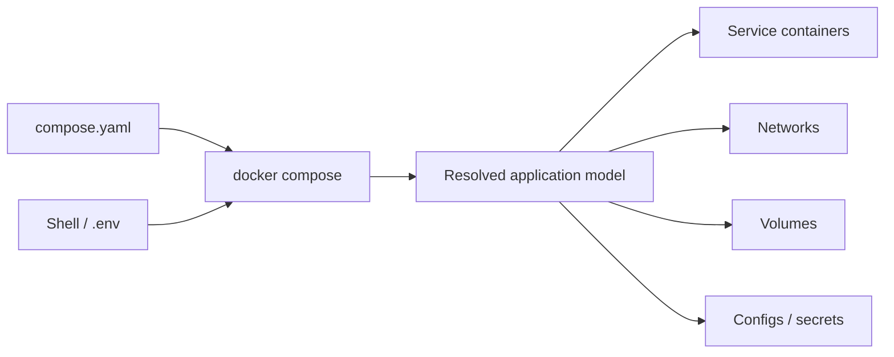

Docker Compose biến cấu hình của một ứng dụng nhiều container thành **application model** có thể kiểm tra và chạy lặp lại. Thay vì ghi nhớ chuỗi `docker run`, `docker network create` và `docker volume create`, bạn khai báo services, networks, volumes, configs và secrets trong YAML rồi để Compose đối chiếu model đó với Docker Engine.



<Callout type="warn" title="Mental model quan trọng">
  Compose quản lý một project gồm nhiều resource; nó không biến các container thành một container lớn và không phải orchestrator đa host. Mỗi service vẫn chạy bằng container, image, network và volume của Docker Engine.
</Callout>

## Compose giải quyết vấn đề gì?

| Khi dùng từng lệnh Docker | Khi dùng Compose |
|---|---|
| Cấu hình nằm trong shell script hoặc lịch sử terminal | Desired configuration nằm trong file có thể review |
| Name, network và volume phải phối hợp thủ công | Resource được nhóm theo project name và gắn label Compose |
| Khó tái tạo cùng topology cho đồng đội/CI | Cùng model được resolve bằng `docker compose config` |
| Start, logs và cleanup theo từng container | CLI thao tác theo project hoặc service |
| Thay đổi config dễ để lại container cũ | `up` recreate service khi config/image thay đổi |

Compose phù hợp nhất cho development, integration test, CI và deployment một Docker host. Khi cần scheduling đa node, rolling update, self-healing hoặc cluster networking, cần một orchestrator như Swarm hoặc Kubernetes thay vì suy rộng khả năng của Compose.

## Application model

Compose Specification hiện là format được khuyến nghị. Các format legacy `2.x` và `3.x` đã được hợp nhất; top-level `version` chỉ còn mang tính tương thích và không nên dùng để chọn feature.

```yaml
name: compose-lab

services:
  web:
    image: nginx:1.29-alpine
    ports:
      - "127.0.0.1:8080:80"
    networks:
      - frontend

  probe:
    image: alpine:3.23
    command: ["sh", "-c", "until wget -qO- http://web/; do sleep 1; done; exec sleep infinity"]
    depends_on:
      - web
    networks:
      - frontend

networks:
  frontend: {}
```

Các phần tử chính:

| Phần tử | Vai trò |
|---|---|
| `name` | Project name trong model; có thể bị override bởi CLI/environment |
| `services` | Workload có thể build, create, replace và scale độc lập |
| `networks` | Connectivity và DNS boundary giữa services |
| `volumes` | Data store do container engine quản lý |
| `configs` | Nội dung cấu hình được mount vào service được cấp quyền |
| `secrets` | Dữ liệu nhạy cảm được cấp theo service và mount dạng file |
| `include` | Ghép các application model độc lập thành model lớn hơn |

## Project name và identity

Compose dùng project name để cô lập nhiều lần chạy của cùng model. Nếu project là `shop`, service `api` thường tạo resource mang prefix/label tương ứng như `shop-api-1` và `shop_default`. Đừng phụ thuộc vào tên container generated trong application; service discovery dùng **service name** như `api`.

Precedence project name từ cao xuống thấp:

1. `docker compose -p NAME ...`;
2. `COMPOSE_PROJECT_NAME`;
3. top-level `name`;
4. basename của project directory hoặc Compose file đầu tiên;
5. basename của current directory khi không tìm thấy file theo cách khác.

Trong CI hoặc nhiều worktree, luôn đặt project name duy nhất:

```bash
docker compose -p "ci-${BUILD_ID}" up --detach --wait
```

## Lab: chạy project đầu tiên

Tạo directory và lưu YAML ở trên thành `compose.yaml`:

```bash
mkdir compose-overview-lab
cd compose-overview-lab
```

Trước khi chạy, validate model đã resolve:

```bash
docker compose config --quiet
docker compose config
```

Khởi động detached và chờ service đạt trạng thái running/healthy:

```bash
docker compose up --detach --wait
docker compose ps
curl http://127.0.0.1:8080/
```

Expected: `curl` trả HTML mặc định của Nginx. Kiểm tra probe gọi `web` qua DNS nội bộ và container port `80`:

```bash
docker compose logs probe
docker compose exec probe wget -qO- http://web/
```

Host dùng `127.0.0.1:8080`; service `probe` dùng `web:80`. Published port không cần thiết cho giao tiếp service-to-service.

## Vòng đời project

| Ý định | Command | Tác động chính |
|---|---|---|
| Resolve/validate model | `docker compose config` | Không tạo resource |
| Tạo và start | `docker compose up -d` | Build/pull khi cần, create/recreate và start |
| Xem inventory | `docker compose ps` | Hiển thị container của project |
| Theo dõi output | `docker compose logs -f` | Aggregate logs theo service |
| Chạy trong container hiện có | `docker compose exec SERVICE CMD` | Không tạo container service mới |
| Chạy one-off | `docker compose run --rm SERVICE CMD` | Tạo container mới từ service config |
| Stop, giữ resource | `docker compose stop` | Container còn để start lại |
| Xóa project runtime | `docker compose down` | Xóa container và network do project quản lý |

`docker compose down` mặc định **không xóa named volume**. `down --volumes` xóa named/anonymous volumes thuộc project và có thể làm mất dữ liệu.

## Compose là declarative nhưng không hoàn toàn idempotent

`docker compose up` so sánh service config và image với container hiện có. Khi thay đổi, Compose thường stop và recreate container, đồng thời giữ mounted volume. Tuy nhiên:

- application migration vẫn cần thiết kế riêng;
- thay tag image không đảm bảo pull image mới nếu pull policy/cache không yêu cầu;
- service đang giữ connection phải reconnect khi peer được recreate;
- bind mount và external resource phụ thuộc state ngoài model;
- `restart` policy không thay health-based orchestration.

Luôn kiểm tra model bằng `docker compose config`, trạng thái bằng `ps`/`inspect`, và behavior bằng request thực tế.

## Lộ trình phần Docker Compose

1. [Compose file](/docs/docker-compose/compose-file/) và [Compose services](/docs/docker-compose/services/) — model, schema và workload.
2. [Compose networks](/docs/docker-compose/networks/) và [Compose volumes](/docs/docker-compose/volumes/) — connectivity và dữ liệu.
3. [Configs và secrets](/docs/docker-compose/configs-and-secrets/), [Environment variables](/docs/docker-compose/environment-variables/) và [Variable interpolation](/docs/docker-compose/interpolation/) — truyền cấu hình đúng boundary.
4. [`depends_on` và healthcheck](/docs/docker-compose/depends-on-and-healthcheck/) cùng [Compose profiles](/docs/docker-compose/profiles/) — startup dependency và service tùy chọn.
5. [Extends và include](/docs/docker-compose/extends-and-include/) cùng [Merge và override](/docs/docker-compose/merge-and-override/) — tái sử dụng model.
6. [Compose Watch](/docs/docker-compose/develop-watch/), [Compose cho production](/docs/docker-compose/production-patterns/) và [Troubleshooting Compose](/docs/docker-compose/compose-troubleshooting/) — development loop, deployment và runbook.

## Cleanup bài thực hành

```bash
docker compose down
cd ..
rm -rf compose-overview-lab
```

## Nguồn chính thức

- [Docker Compose](https://docs.docker.com/compose/)
- [Compose file reference](https://docs.docker.com/reference/compose-file/)
- [`docker compose` CLI](https://docs.docker.com/reference/cli/docker/compose/)
- [Compose Specification](https://github.com/compose-spec/compose-spec)
