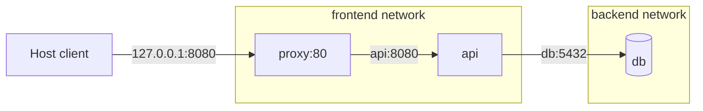

Compose tạo network theo project và nối service vào đó. Nếu không khai báo `networks`, mọi service dùng implicit `default` network, có thể resolve nhau bằng service name.



<Callout type="warn" title="Không hard-code container IP">
  Recreate container thường cấp IP mới nhưng service name vẫn ổn định. Application phải resolve lại tên và reconnect khi connection cũ bị đóng.
</Callout>

## Default network

```yaml
services:
  api:
    image: example/api:1
  db:
    image: postgres:18-alpine
```

Tương đương về ý định với:

```yaml
services:
  api:
    image: example/api:1
    networks: [default]
  db:
    image: postgres:18-alpine
    networks: [default]

networks:
  default: {}
```

Compose thường tạo `<project>_default`. Từ `api`, endpoint database là `db:5432`. `localhost:5432` trong `api` là chính container `api`.

## Custom networks để biểu diễn trust boundary

```yaml
services:
  proxy:
    image: nginx:1.29-alpine
    ports:
      - "127.0.0.1:8080:80"
    networks: [frontend]

  api:
    image: example/api:1
    networks: [frontend, backend]

  db:
    image: postgres:18-alpine
    networks: [backend]

networks:
  frontend: {}
  backend:
    internal: true
```

`proxy` và `db` không share network nên không có direct path mặc định. `api` multi-homed nối hai zone; nếu bị compromise, nó vẫn có thể là đường sang backend. Network segmentation không thay authentication, TLS hoặc authorization.

`internal: true` tạo network không có external connectivity mặc định. Service nối thêm một network thường vẫn có thể đi ra ngoài qua network kia.

## Service-level network options

Long syntax cho phép alias và IP cố định:

```yaml
services:
  api:
    image: example/api:1
    networks:
      backend:
        aliases:
          - inventory-api
        ipv4_address: 172.28.0.10

networks:
  backend:
    ipam:
      config:
        - subnet: 172.28.0.0/24
```

Alias chỉ có nghĩa trên network tương ứng. Nếu nhiều container/service cùng alias, client phải chấp nhận DNS trả một trong các endpoint. Static IP tăng coupling và dễ xung đột; chỉ dùng khi tích hợp legacy/firewall thật sự yêu cầu.

## Published port và container port

```yaml
ports:
  - "127.0.0.1:8080:80"
```

| Thành phần | Ý nghĩa |
|---|---|
| `127.0.0.1` | Host address được bind |
| `8080` | Host/published port |
| `80` | Container port |

Peer cùng network dùng `service:container-port`; client ngoài project dùng `host:published-port`. `expose: ["80"]` không publish port lên host và thường không cần để DNS/service connectivity hoạt động.

Không bỏ host IP cho database/admin UI nếu chỉ cần local access:

```yaml
ports:
  - "5432:5432" # thường bind mọi host address
```

Ưu tiên:

```yaml
ports:
  - "127.0.0.1:5432:5432"
```

## External network

Dùng network đã được provisioning ngoài lifecycle project:

```bash
docker network create shared-gateway
```

```yaml
services:
  api:
    image: example/api:1
    networks: [shared]

networks:
  shared:
    external: true
    name: shared-gateway
```

Compose không tạo/xóa external network và fail nếu nó không tồn tại. Các project trên cùng external network có thể resolve service name/alias; điều này cũng mở rộng trust boundary và có thể gây name collision.

## Tùy chỉnh default network

```yaml
networks:
  default:
    driver: bridge
    driver_opts:
      com.docker.network.bridge.host_binding_ipv4: "127.0.0.1"
```

Driver option phụ thuộc Docker Engine/platform. `name` đặt tên vật lý không có project scope:

```yaml
networks:
  default:
    name: inventory-network
```

Dùng tên global cố định khiến nhiều project có thể vô tình share resource; chỉ làm khi đó là intent rõ ràng.

## Lab: DNS và isolation

Tạo `compose.yaml`:

```yaml
name: compose-network-lab

services:
  web:
    image: nginx:1.29-alpine
    networks: [front]

  client:
    image: alpine:3.23
    command: ["sleep", "300"]
    networks: [front]

  isolated:
    image: alpine:3.23
    command: ["sleep", "300"]
    networks: [back]

networks:
  front: {}
  back:
    internal: true
```

Chạy và test:

```bash
docker compose up --detach
docker compose exec client wget -qO- http://web/
docker compose exec isolated sh -c 'getent hosts web || true'
```

Expected: `client` gọi được `web`; `isolated` không resolve `web` vì không share network.

Xem effective attachment:

```bash
docker compose ps --quiet | xargs docker inspect \
  --format '{{.Name}} {{json .NetworkSettings.Networks}}'
docker network ls --filter label=com.docker.compose.project=compose-network-lab
```

## Troubleshooting nhanh

```bash
docker compose config
docker compose ps
docker compose exec SERVICE cat /etc/resolv.conf
docker compose exec SERVICE getent hosts PEER
docker compose exec SERVICE wget -S -O- http://PEER:PORT/
docker network inspect NETWORK
```

Chẩn đoán theo thứ tự: model → attachment → DNS → route → listening socket → application protocol. Không publish port để “sửa” lỗi service-to-service.

## Cleanup

```bash
docker compose down
```

## Nguồn chính thức

- [Networking in Compose](https://docs.docker.com/compose/how-tos/networking/)
- [Networks top-level element](https://docs.docker.com/reference/compose-file/networks/)
- [Docker network drivers](https://docs.docker.com/engine/network/drivers/)
- [Port publishing](/docs/networking/port-publishing/)
