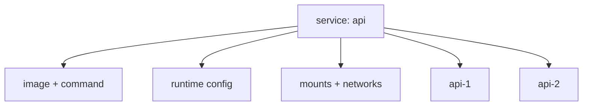

Service là định nghĩa trừu tượng của một workload có thể create, replace hoặc scale độc lập. Container chỉ là runtime instance của service. Compose áp dụng cùng service configuration cho các replica, đồng thời gắn project/service labels để quản lý chúng như một nhóm.



## `image` và `build`

Service phải có `image`, `build`, hoặc cả hai theo Compose Build Specification:

```yaml
services:
  api:
    image: registry.example.com/shop/api:1.8.3
    build:
      context: ./api
      target: runtime
```

`image` cho biết tên image để pull/run/tag; `build` mô tả cách tạo image từ source. Khi có cả hai, behavior pull/build còn phụ thuộc `pull_policy` và command. Đừng dùng tag mutable như `latest` cho deployment cần rollback/reproducibility.

```bash
docker compose build api
docker compose pull api
docker compose up --detach --build api
```

## Process: `entrypoint`, `command` và `init`

`entrypoint` override Dockerfile `ENTRYPOINT`; `command` override `CMD`:

```yaml
services:
  worker:
    image: example/worker:2.1
    init: true
    entrypoint: ["/usr/local/bin/worker"]
    command: ["--queue", "emails", "--concurrency", "4"]
    stop_grace_period: 30s
```

List form tránh shell parsing ngoài ý muốn. String `command` không tự động chạy theo Dockerfile `SHELL`; khi cần pipe/expansion phải gọi shell rõ:

```yaml
command: ["/bin/sh", "-c", "echo host=$$HOSTNAME; exec ./server"]
```

`$$` giữ dấu `$` cho shell trong container. `exec` giúp application trở thành process chính và nhận signal. `init: true` thêm init nhỏ để forward signal/reap child process; nó không sửa application shutdown sai.

## Runtime configuration thường dùng

```yaml
services:
  api:
    image: example/api:1.8.3
    restart: unless-stopped
    init: true
    environment:
      LOG_LEVEL: info
    env_file:
      - ./config/api.env
    ports:
      - "127.0.0.1:8080:8080"
    expose:
      - "8080"
    volumes:
      - uploads:/srv/uploads
    networks:
      - frontend
      - backend
    read_only: true
    tmpfs:
      - /tmp
    cap_drop:
      - ALL
    security_opt:
      - no-new-privileges:true
```

| Field | Ý nghĩa | Lỗi thường gặp |
|---|---|---|
| `ports` | Publish container port lên host | Bind `0.0.0.0` ngoài ý muốn |
| `expose` | Ghi nhận container port, không publish host | Nghĩ rằng nó tạo firewall rule/service discovery |
| `environment` | Environment cuối trong container | Đặt secret trực tiếp trong YAML |
| `env_file` | Nạp nhiều biến cho container | Nhầm với `.env` dùng interpolation |
| `restart` | Engine restart khi process exit/daemon restart | Nghĩ rằng `unhealthy` tự restart |
| `read_only` | Read-only root filesystem | Quên cấp writable volume/tmpfs cần thiết |
| `cap_add/drop` | Điều chỉnh Linux capabilities | Thêm `ALL` để chữa lỗi permission |
| `user` | UID/GID chạy process | Không xử lý ownership của mount |

Đọc sâu về security và resource limit ở các phần sau của curriculum; Compose chỉ biểu diễn option, không tự chọn policy an toàn.

## `ports` không phải service-to-service port

```yaml
services:
  web:
    image: nginx:1.29-alpine
    ports:
      - "127.0.0.1:8080:80"
  client:
    image: alpine:3.23
```

`client` gọi `http://web:80`, không gọi host port `8080`. Host gọi `http://127.0.0.1:8080`. Khi scale service, fixed published port thường xung đột vì nhiều replica không thể cùng bind một host socket.

## `up`, `run` và `exec`

| Command | Container dùng | Port | Use case |
|---|---|---|---|
| `docker compose up api` | Service container managed | Theo model | Chạy workload dài hạn |
| `docker compose run --rm api CMD` | One-off container mới | Không publish service ports mặc định | Migration, shell, task |
| `docker compose exec api CMD` | Container đang chạy | Giữ nguyên | Chẩn đoán runtime |

Ví dụ:

```bash
docker compose run --rm api ./manage migrate
docker compose exec api sh
docker compose logs --follow api
```

`run` có thể start dependencies trừ khi dùng `--no-deps`. Với service có nhiều replica, `exec` cần chọn instance bằng `--index` khi phù hợp.

## Recreate và immutable service

Khi image hoặc service config thay đổi, `docker compose up` recreate container. Writable layer cũ bị bỏ; named volume/bind mount được gắn lại.

```bash
docker compose up --detach --pull always
docker compose up --detach --force-recreate api
```

Không sửa container bằng `exec` rồi coi đó là deploy. Sửa source/Dockerfile/Compose model và recreate để state có thể lặp lại.

## Scale service

```bash
docker compose up --detach --scale worker=3
```

Điều kiện để scale an toàn:

- không đặt `container_name`;
- không dùng fixed host port cho mỗi replica;
- state nằm ngoài writable layer;
- workload phân chia công việc đúng và idempotent;
- logs/metrics phân biệt replica;
- downstream chịu được nhiều connection/consumer.

`deploy.replicas` thuộc Deploy Specification và mức hỗ trợ phụ thuộc platform/command. Với local Compose, `--scale` là cách rõ ràng để thử nhiều replica; nó không cung cấp load balancer production đầy đủ.

## Lab: quan sát service instance

Tạo `compose.yaml`:

```yaml
name: services-lab

services:
  worker:
    image: alpine:3.23
    init: true
    command: ["sh", "-c", "echo started=$$HOSTNAME; exec sleep 300"]
    labels:
      com.example.lab: compose-services
```

Chạy hai replica:

```bash
docker compose up --detach --scale worker=2
docker compose ps
docker compose logs worker
```

Xem label và config effective:

```bash
docker compose ps --quiet worker | xargs docker inspect \
  --format '{{.Name}} project={{index .Config.Labels "com.docker.compose.project"}} service={{index .Config.Labels "com.docker.compose.service"}}'
```

Expected: hai container khác ID/name nhưng cùng project và service label.

## Cleanup

```bash
docker compose down
```

## Nguồn chính thức

- [Services top-level element](https://docs.docker.com/reference/compose-file/services/)
- [`docker compose up`](https://docs.docker.com/reference/cli/docker/compose/up/)
- [`docker compose run`](https://docs.docker.com/reference/cli/docker/compose/run/)
- [`docker compose exec`](https://docs.docker.com/reference/cli/docker/compose/exec/)
