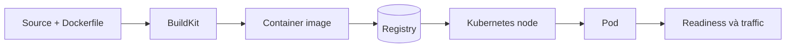
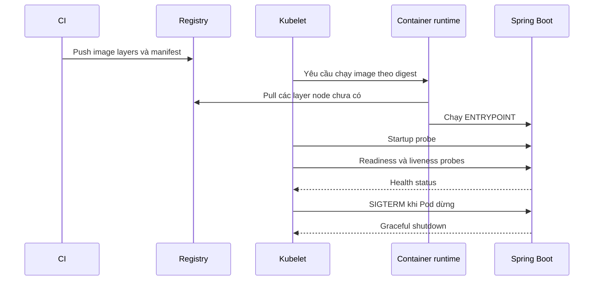

Tối ưu Docker image không phải là cuộc thi tìm image có số `SIZE` nhỏ nhất. Một image tốt phải đạt đồng thời bốn mục tiêu:

| Mục tiêu | Câu hỏi cần trả lời |
|---|---|
| **Chạy đúng** | Ứng dụng có đủ JRE, CA certificate, timezone và thư viện cần thiết không? |
| **Build nhanh** | Sửa source có buộc Maven tải lại toàn bộ dependency không? |
| **Phân phối nhanh** | Node Kubernetes phải pull bao nhiêu layer mới trong mỗi lần rollout? |
| **An toàn, dễ vận hành** | Container có chạy non-root, nhận `SIGTERM`, expose health endpoint và không chứa secret không? |

<Callout type="info" title="Thứ tự ưu tiên">
  Hãy tối ưu theo thứ tự **chạy đúng → tách build/runtime → tối ưu cache → hardening → đo trên Kubernetes**. Image nhỏ nhưng không khởi động được hoặc không shutdown đúng vẫn là một image lỗi.
</Callout>

Trang này dùng một ứng dụng Java Spring Boot để nối toàn bộ flow từ source code đến Pod:



Nếu chưa quen với layer, cache hoặc multi-stage build, nên đọc [Image layers và build cache](/docs/images-va-dockerfile/layers-and-cache/) và [Multi-stage builds](/docs/images-va-dockerfile/multi-stage-builds/) trước.

## Flow tối ưu trong 5 bước

Dùng cùng một flow cho mọi ngôn ngữ:

1. **Xác định runtime contract:** ứng dụng cần runtime nào, chạy port nào, ghi file ở đâu và shutdown ra sao.
2. **Build baseline:** tạo image đang dùng và đo trước khi sửa.
3. **Loại bỏ phần không cần ở runtime:** compiler, source, package cache và công cụ build.
4. **Kiểm chứng local:** HTTP, health check, user, filesystem và `SIGTERM` vẫn hoạt động.
5. **Kiểm chứng trên Kubernetes:** image pull, startup, readiness, rollout và termination.

Không nên thay base image, cách package JAR, cache và Kubernetes manifest cùng lúc. Thay đổi theo từng bước giúp biết chính xác cải tiến nào tạo ra kết quả.

## Ví dụ Spring Boot: xác định runtime contract

Ví dụ giả định project Maven một module có cấu trúc:

```text
orders-service/
├── pom.xml
└── src/
    ├── main/
    └── test/
```

Ứng dụng có các đặc điểm:

- build bằng Java 21 và Maven;
- tạo executable JAR trong `target/`;
- lắng nghe trên port `8080`;
- có dependency `spring-boot-starter-actuator` để cung cấp health endpoint;
- ghi log ra `stdout`/`stderr`, không ghi log vào image.

Để Spring Boot cung cấp probe riêng cho Kubernetes, thêm cấu hình:

```properties
server.port=8080
server.shutdown=graceful
spring.lifecycle.timeout-per-shutdown-phase=20s
management.endpoint.health.probes.enabled=true
```

Hai endpoint được dùng trong ví dụ:

```text
/actuator/health/liveness
/actuator/health/readiness
```

- **Liveness** trả lời “process còn hoạt động bình thường không?”. Không nên làm liveness phụ thuộc database hoặc API bên ngoài, nếu không một sự cố database có thể khiến toàn bộ Pod bị restart hàng loạt.
- **Readiness** trả lời “Pod đã sẵn sàng nhận traffic chưa?”. Khi readiness fail, Kubernetes dừng route traffic tới Pod nhưng không nhất thiết restart container.

## Bước 1: build image baseline

Một Dockerfile thường gặp ở giai đoạn đầu. Lưu nó thành `Dockerfile.before` để tạo baseline:

```dockerfile
# syntax=docker/dockerfile:1
FROM maven:3.9-eclipse-temurin-21

WORKDIR /workspace
COPY . .
RUN mvn --batch-mode --no-transfer-progress package

EXPOSE 8080
ENTRYPOINT ["java", "-jar", "target/orders-service-0.0.1-SNAPSHOT.jar"]
```

Thay tên JAR trong `ENTRYPOINT` theo `artifactId` và `version` thực tế của project. Image này có thể chạy, nhưng Maven image vừa là môi trường build vừa là runtime. Final image chứa cả:

- Maven và JDK;
- source code và test code;
- Maven local repository trong `/root/.m2`;
- build output trung gian;
- user mặc định `root`.

Build baseline để có số liệu so sánh:

```bash
docker build \
  --file Dockerfile.before \
  --tag orders-service:before \
  --progress=plain \
  .

docker image inspect orders-service:before \
  --format 'size={{.Size}} user={{json .Config.User}}'

docker image history orders-service:before
```

`docker image inspect` hiển thị logical size trong local image store. Nó hữu ích để so sánh hai image trên cùng máy, nhưng không phải chính xác số byte mà node Kubernetes tải từ registry.

## Bước 2: thu hẹp build context

Tạo `.dockerignore` ở root của build context:

```text
.git
.idea
.vscode
target
*.log
.env
.env.*
*.pem
*.key
README.md
```

`.dockerignore` giúp:

1. gửi ít dữ liệu hơn tới builder;
2. tránh file local không liên quan làm cache miss;
3. giảm nguy cơ copy nhầm credential hoặc build output vào image.

Kiểm tra dòng `load build context` trong output:

```bash
docker build --progress=plain --tag orders-service:context-check .
```

<Callout type="warn" title="Không đưa secret vào image">
  Không truyền password, token hoặc private key bằng `COPY`, `ARG` hay `ENV`. Secret dùng lúc build phải đi qua BuildKit secret mount; secret dùng lúc chạy phải được inject bởi Kubernetes Secret hoặc secret manager.
</Callout>

Xem thêm quy tắc pattern tại [.dockerignore](/docs/images-va-dockerfile/dockerignore/).

## Bước 3: tách builder khỏi runtime

Dockerfile production cơ bản:

```dockerfile
# syntax=docker/dockerfile:1

FROM maven:3.9-eclipse-temurin-21 AS build
WORKDIR /workspace

# Dependency thay đổi ít hơn source, nên copy pom.xml trước.
COPY pom.xml ./
RUN --mount=type=cache,target=/root/.m2 \
    mvn --batch-mode --no-transfer-progress \
    dependency:go-offline

# Source đổi thường xuyên được copy sau.
COPY src/ src/
RUN --mount=type=cache,target=/root/.m2 \
    mvn --batch-mode --no-transfer-progress verify

FROM eclipse-temurin:21-jre-jammy AS runtime
WORKDIR /application

COPY --from=build --chown=10001:10001 \
    /workspace/target/*.jar application.jar

USER 10001:10001
EXPOSE 8080
ENTRYPOINT ["java", "-jar", "application.jar"]
```

Dockerfile này tạo hai ranh giới rõ ràng:

```text
build stage                         runtime stage
-----------                         -------------
Maven + JDK                         JRE
pom.xml + source                    application.jar
Maven cache                         numeric non-root user
compile + test                      java -jar
```

### Vì sao image nhỏ hơn?

`runtime` bắt đầu từ JRE image mới và chỉ nhận JAR qua `COPY --from=build`. Maven, JDK, source và `/root/.m2` không thuộc final image.

### Vì sao build lại nhanh hơn?

`pom.xml` được copy trước source. Khi chỉ sửa Java code:

```text
pom.xml -> tải dependency -> source -> test/package
            có thể reuse       chạy lại
```

Cache mount `/root/.m2` giúp Maven không tải lại artifact đã có khi step phải chạy lại. Cache mount chỉ tăng tốc build; nội dung của nó không đi vào final image và build vẫn phải thành công khi cache rỗng.

### Vì sao dùng `ENTRYPOINT` dạng JSON?

Exec form giúp JVM trở thành process chính trong container và nhận `SIGTERM` trực tiếp. Điều này quan trọng khi Kubernetes dừng Pod trong lúc rollout hoặc scale down.

### Có cần đổi sang Alpine hoặc distroless ngay không?

Không. Trước tiên hãy tạo một image JRE hoạt động đúng. Chỉ đổi base sau khi đã kiểm tra:

- native library dùng glibc hay musl;
- outbound HTTPS có CA certificate;
- timezone và locale;
- cách debug khi image không có shell;
- target architecture như `linux/amd64` hoặc `linux/arm64`.

Đổi base chỉ để giảm vài MB nhưng làm ứng dụng lỗi TLS hoặc native dependency là tối ưu sai mục tiêu.

<Callout type="info" title="Project Maven nhiều module">
  Ví dụ trên dành cho project một module. Với multi-module project, phải copy root POM và các module POM cần cho dependency resolution trước khi chạy `dependency:go-offline`; không copy máy móc mỗi `pom.xml` rồi giả định cache vẫn đúng.
</Callout>

## Bước 4: build và kiểm chứng local

Build candidate hai lần:

```bash
docker build \
  --file Dockerfile \
  --tag orders-service:optimized \
  --progress=plain \
  .

docker build \
  --file Dockerfile \
  --tag orders-service:optimized \
  --progress=plain \
  .
```

Lần thứ hai, các step không có input thay đổi nên hiển thị `CACHED` hoặc được reuse. Sau đó sửa một file Java rồi build lại: bước dependency nên được reuse, còn source và package phải chạy lại.

### So sánh cấu hình và kích thước

```bash
for image in orders-service:before orders-service:optimized; do
  docker image inspect "$image" \
    --format 'image='"$image"' size={{.Size}} user={{json .Config.User}} entrypoint={{json .Config.Entrypoint}}'
done

docker image history orders-service:optimized
```

Kết quả cần kiểm tra:

- image optimized dùng user `10001:10001`;
- entrypoint là `java -jar application.jar`;
- history của final image không chứa Maven install hoặc source;
- image optimized nhỏ hơn baseline nhưng vẫn chạy đủ chức năng.

Không hard-code một số MB “đúng” vì base digest và dependency thay đổi theo thời gian.

### Chạy gần giống Kubernetes hơn

Dùng read-only root filesystem và cấp riêng `/tmp` cho JVM:

```bash
docker run --detach \
  --name orders-service \
  --publish 127.0.0.1:8080:8080 \
  --read-only \
  --tmpfs /tmp:rw,noexec,nosuid,size=64m \
  orders-service:optimized
```

Kiểm tra HTTP và probes:

```bash
curl --fail --retry 30 --retry-delay 1 \
  --retry-connrefused --retry-all-errors \
  http://127.0.0.1:8080/actuator/health/liveness

curl --fail \
  http://127.0.0.1:8080/actuator/health/readiness

docker container inspect orders-service \
  --format 'user={{.Config.User}} status={{.State.Status}}'
```

Kiểm tra graceful shutdown:

```bash
docker container stop --time 30 orders-service
docker container logs orders-service
```

Ứng dụng phải thoát trước timeout. Nếu Docker phải gửi `SIGKILL`, cần kiểm tra entrypoint, Spring graceful shutdown và các thread không chịu dừng.

## Tối ưu thêm cho Spring Boot layered JAR

Multi-stage build loại Maven/JDK khỏi runtime. Tuy nhiên, nếu toàn bộ executable JAR nằm trong một layer, mỗi lần application code đổi có thể tạo một blob JAR mới.

Spring Boot có thể tách executable JAR thành các layer:

```text
dependencies             thay đổi ít
spring-boot-loader       thay đổi ít
snapshot-dependencies    thay đổi tùy project
application              thay đổi thường xuyên
```

Sau stage `build`, có thể thêm:

```dockerfile
FROM eclipse-temurin:21-jre-jammy AS extract
WORKDIR /builder
COPY --from=build /workspace/target/*.jar application.jar
RUN java -Djarmode=tools -jar application.jar \
    extract --layers --destination extracted

FROM eclipse-temurin:21-jre-jammy AS runtime
WORKDIR /application
COPY --from=extract --chown=10001:10001 /builder/extracted/dependencies/ ./
COPY --from=extract --chown=10001:10001 /builder/extracted/spring-boot-loader/ ./
COPY --from=extract --chown=10001:10001 /builder/extracted/snapshot-dependencies/ ./
COPY --from=extract --chown=10001:10001 /builder/extracted/application/ ./
USER 10001:10001
EXPOSE 8080
ENTRYPOINT ["java", "-jar", "application.jar"]
```

Lợi ích chính là **reuse layer khi push/pull giữa các release**, không phải xóa dependency khỏi ứng dụng. Chỉ thêm bước này sau khi multi-stage cơ bản đã chạy đúng và registry/pull time thực sự là bottleneck.

`jarmode=tools` phụ thuộc phiên bản Spring Boot và cách JAR được package. Nếu command `list-layers` hoặc `extract` không hoạt động, kiểm tra Spring Boot Maven/Gradle plugin của chính project thay vì đổi Dockerfile ngẫu nhiên.

## Bước 5: image tương tác với Kubernetes như thế nào?

Khi triển khai, Kubernetes không build Dockerfile. Cluster chỉ nhận image reference và runtime configuration:



Điều này giải thích vì sao tối ưu image ảnh hưởng trực tiếp tới rollout:

- context và Maven cache ảnh hưởng **thời gian CI build**;
- final image và layer reuse ảnh hưởng **thời gian node pull**;
- JRE/application startup ảnh hưởng **thời gian startup probe pass**;
- readiness quyết định **khi nào Service gửi traffic**;
- exec-form entrypoint và graceful shutdown quyết định **request có bị cắt khi rollout không**.

### Push image theo version, deploy theo digest

Ví dụ build multi-platform và push:

```bash
docker buildx build \
  --platform linux/amd64,linux/arm64 \
  --tag registry.example.com/team/orders-service:1.0.0 \
  --push \
  .

docker buildx imagetools inspect \
  registry.example.com/team/orders-service:1.0.0
```

Lấy digest từ output của registry hoặc `imagetools inspect`, sau đó dùng digest trong manifest. Tag giúp con người đọc version; digest đảm bảo các Pod chạy đúng cùng một nội dung.

### Deployment mẫu

Manifest sau minh họa contract giữa image Spring Boot và Kubernetes:

```yaml
apiVersion: apps/v1
kind: Deployment
metadata:
  name: orders-service
spec:
  replicas: 2
  selector:
    matchLabels:
      app: orders-service
  template:
    metadata:
      labels:
        app: orders-service
    spec:
      terminationGracePeriodSeconds: 30
      securityContext:
        runAsNonRoot: true
        seccompProfile:
          type: RuntimeDefault
      containers:
        - name: application
          image: "registry.example.com/team/orders-service@sha256:<DIGEST>"
          imagePullPolicy: IfNotPresent
          ports:
            - name: http
              containerPort: 8080
          env:
            - name: SPRING_PROFILES_ACTIVE
              value: kubernetes
          startupProbe:
            httpGet:
              path: /actuator/health/liveness
              port: http
            periodSeconds: 2
            failureThreshold: 30
          readinessProbe:
            httpGet:
              path: /actuator/health/readiness
              port: http
            periodSeconds: 5
            timeoutSeconds: 2
            failureThreshold: 3
          livenessProbe:
            httpGet:
              path: /actuator/health/liveness
              port: http
            periodSeconds: 10
            timeoutSeconds: 2
            failureThreshold: 3
          securityContext:
            runAsUser: 10001
            runAsGroup: 10001
            allowPrivilegeEscalation: false
            readOnlyRootFilesystem: true
            capabilities:
              drop:
                - ALL
          resources:
            requests:
              cpu: 100m
              memory: 256Mi
            limits:
              memory: 512Mi
          volumeMounts:
            - name: tmp
              mountPath: /tmp
      volumes:
        - name: tmp
          emptyDir:
            sizeLimit: 128Mi
---
apiVersion: v1
kind: Service
metadata:
  name: orders-service
spec:
  selector:
    app: orders-service
  ports:
    - name: http
      port: 80
      targetPort: http
```

Các giá trị CPU, memory và probe chỉ là baseline minh họa. Phải điều chỉnh bằng startup time, heap usage và traffic thực tế.

### Kubernetes chịu trách nhiệm gì, image chịu trách nhiệm gì?

| Image/Application | Kubernetes |
|---|---|
| Chứa JRE và JAR | Pull image từ registry |
| Chạy process bằng `ENTRYPOINT` | Áp `securityContext` và resource limit |
| Expose health endpoint | Gọi startup/readiness/liveness probe |
| Xử lý `SIGTERM` | Gửi signal và chờ grace period |
| Ghi log ra stdout/stderr | Thu thập log qua runtime/agent |
| Không chứa config/secret production | Inject ConfigMap, Secret và volume |

`EXPOSE 8080` trong Dockerfile chỉ là metadata. Nó không tạo Kubernetes Service và không tự mở port. Port, probe và Service phải được khai báo trong manifest.

## Đo kết quả trên Kubernetes

Theo dõi rollout:

```bash
kubectl apply --filename deployment.yaml
kubectl rollout status deployment/orders-service
kubectl get pods --selector app=orders-service --watch
```

Xem node mất bao lâu để pull và ứng dụng mất bao lâu để ready:

```bash
kubectl describe pod <POD_NAME>
kubectl logs <POD_NAME>
kubectl get pod <POD_NAME> \
  --output=jsonpath='{.status.containerStatuses[0].imageID}{"\n"}'
```

Trong `kubectl describe pod`, chú ý các event `Pulling`, `Pulled`, `Created`, `Started` và probe failure. Đây là số liệu gần với trải nghiệm rollout hơn local `docker image ls`.

Sau khi rollout thành công, kiểm tra shutdown bằng một lần restart có kiểm soát:

```bash
kubectl rollout restart deployment/orders-service
kubectl rollout status deployment/orders-service
kubectl logs <OLD_POD_NAME>
```

Không thực hiện thử nghiệm restart tùy tiện trên production. Dùng môi trường staging hoặc maintenance window phù hợp.

## Chẩn đoán nhanh

| Triệu chứng | Nguyên nhân thường gặp | Kiểm tra đầu tiên |
|---|---|---|
| Build chậm mỗi lần sửa Java | `COPY . .` đứng trước Maven dependency step | Build log và step cache miss đầu tiên |
| Final image vẫn rất lớn | Runtime vẫn dùng Maven/JDK image | `docker image history` và final `FROM` |
| `ImagePullBackOff` | Sai image, digest hoặc credential registry | `kubectl describe pod` |
| Pod `Running` nhưng không nhận traffic | Readiness probe fail | Probe event và actuator endpoint |
| Pod restart liên tục lúc khởi động | Startup/liveness quá gắt hoặc app crash | `kubectl logs --previous` và events |
| Container lỗi `Permission denied` | Non-root user không có quyền ghi | Path ghi file, ownership và volume mount |
| Read-only filesystem làm JVM lỗi | Thiếu writable `/tmp` hoặc app ghi nhầm path | Log và volume mount `/tmp` |
| Rollout cắt request | App không xử lý `SIGTERM` hoặc grace period quá ngắn | Log shutdown và thời gian request dài nhất |
| Node vẫn pull nhiều dữ liệu mỗi release | JAR/layer lớn thay đổi toàn bộ | Registry layer, image history, layered JAR |

Khi cache miss, hãy tìm **step đầu tiên không được reuse**. Khi Pod lỗi, đọc **events trước, logs sau**, rồi kiểm tra manifest và image digest đang chạy.

## Checklist production ngắn gọn

### Build

- [ ] `.dockerignore` loại `.git`, `target`, IDE file, log và credential.
- [ ] Manifest dependency được copy trước source.
- [ ] Build và runtime tách bằng multi-stage.
- [ ] Final image chỉ chứa JRE và artifact cần chạy.
- [ ] Test/package chạy trong release flow.

### Runtime

- [ ] Dùng exec-form `ENTRYPOINT`.
- [ ] Container chạy non-root.
- [ ] Ứng dụng chạy được với read-only root filesystem và `/tmp` riêng.
- [ ] Outbound HTTPS, timezone và native library đã được test.
- [ ] Secret không tồn tại trong layer, `ARG` hoặc `ENV` của image.

### Kubernetes

- [ ] Deploy bằng version rõ ràng và pin digest.
- [ ] Startup, readiness và liveness có đúng semantics.
- [ ] `terminationGracePeriodSeconds` dài hơn thời gian graceful shutdown cần thiết.
- [ ] Resource request/limit dựa trên measurement.
- [ ] Rollout và rollback đã được thử trên staging.
- [ ] Registry giữ known-good digest trong thời gian rollback.

## Kết luận

Một Docker image tối ưu cho Spring Boot trên Kubernetes có flow rõ ràng:

```text
context nhỏ
  -> dependency cache ổn định
  -> Maven/JDK build stage
  -> JRE runtime stage
  -> non-root + read-only filesystem
  -> push registry theo digest
  -> startup/readiness/liveness
  -> graceful rollout và rollback
```

Hãy bắt đầu bằng multi-stage build và `.dockerignore`; đây thường là hai thay đổi đem lại hiệu quả lớn nhất. Chỉ thêm layered JAR, distroless, `jlink`, CDS/AOT hoặc compression đặc biệt khi measurement cho thấy chúng giải quyết bottleneck thực tế.

## Nguồn chính thức

- [Dockerfile best practices](https://docs.docker.com/build/building/best-practices/)
- [Optimize build cache](https://docs.docker.com/build/cache/optimize/)
- [Multi-stage builds](https://docs.docker.com/build/building/multi-stage/)
- [Build context và `.dockerignore`](https://docs.docker.com/build/concepts/context/)
- [Spring Boot Dockerfiles và layered JAR](https://docs.spring.io/spring-boot/reference/packaging/container-images/dockerfiles.html)
- [Spring Boot Kubernetes probes](https://docs.spring.io/spring-boot/reference/actuator/endpoints.html#actuator.endpoints.kubernetes-probes)
- [Kubernetes container images](https://kubernetes.io/docs/concepts/containers/images/)
- [Kubernetes liveness, readiness và startup probes](https://kubernetes.io/docs/concepts/configuration/liveness-readiness-startup-probes/)
- [Kubernetes Pod termination](https://kubernetes.io/docs/concepts/workloads/pods/pod-lifecycle/#pod-termination)
