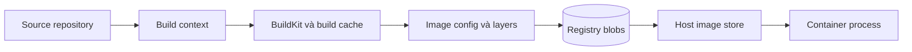
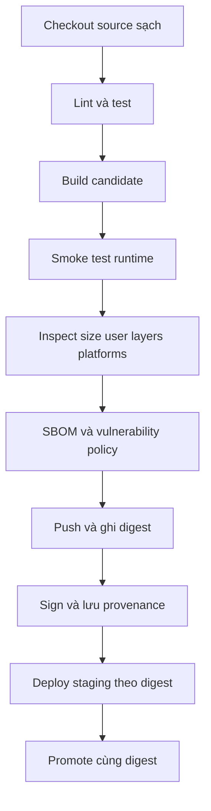

Tối ưu Docker image không có nghĩa là cố làm cho con số `SIZE` nhỏ nhất. Một image production tốt phải đồng thời đáp ứng nhiều yêu cầu:

- chứa đúng artifact và runtime dependency mà ứng dụng cần;
- build đủ nhanh, tận dụng cache nhưng vẫn đúng khi cache rỗng;
- pull và phân phối hiệu quả qua registry;
- không mang compiler, source, credential hoặc package thừa vào runtime;
- chạy bằng quyền tối thiểu, nhận signal đúng và có cách quan sát lỗi;
- tái tạo, truy vết, scan và rollback được theo digest.

Một image giảm được vài chục MB nhưng thiếu CA certificate nên không gọi được HTTPS là một **regression**, không phải một thành công tối ưu. Ngược lại, giữ toàn bộ compiler và development dependency trong runtime chỉ để tiện debug thường làm image lớn hơn, tăng attack surface và kéo dài thời gian phân phối.

<Callout type="info" title="Nguyên tắc xuyên suốt">
  Tối ưu theo vòng lặp **đo → xác định bottleneck → thay đổi một nhóm quyết định → kiểm chứng lại**. Đừng thay base image, build flags, dependency manager và runtime contract cùng lúc rồi kết luận dựa trên mỗi số MB.
</Callout>

Trang này là bài tổng hợp cuối phần Images và Dockerfile. Nếu chưa quen với layer, cache hoặc build context, nên đọc [Image layers và build cache](/docs/images-va-dockerfile/layers-and-cache/), [Multi-stage builds](/docs/images-va-dockerfile/multi-stage-builds/) và [Build context](/docs/images-va-dockerfile/build-context/) trước.

## Mental model: đang tối ưu phần nào?

Một lần build đi qua nhiều lớp chi phí khác nhau:



Mỗi điểm có metric và cách tối ưu riêng:

| Phần | Chi phí thường gặp | Tối ưu chính |
|---|---|---|
| Source → build context | Transfer nhiều file, checksum chậm, leak file local | Context nhỏ, `.dockerignore`, `COPY` theo allowlist |
| Builder | Compile/install lặp lại, cache miss | Instruction ordering, cache mount, external cache |
| Final image | Toolchain, source, package/cache thừa | Multi-stage, runtime base phù hợp, copy artifact tối thiểu |
| Registry | Push/pull blob lớn hoặc thay đổi thường xuyên | Layer boundary ổn định, compression phù hợp, reuse layer |
| Runtime | Startup chậm, thiếu library/CA, signal sai | Runtime contract, smoke test, non-root, exec form |
| Supply chain | Không biết image chứa gì hoặc được build từ đâu | Digest, SBOM, provenance, scan, signing |

Điểm quan trọng là một kỹ thuật có thể chỉ cải thiện một phần. Ví dụ:

- `.dockerignore` giảm context transfer nhưng không tự làm final image nhỏ nếu Dockerfile chưa từng `COPY` file bị ignore;
- cache mount giảm thời gian tải dependency nhưng nội dung mount không đi vào final image;
- multi-stage thường giảm runtime image nhưng không bảo đảm build nhanh nếu cache graph vẫn sắp xếp kém;
- base image tối giản giảm package thừa nhưng có thể làm debug hoặc compatibility khó hơn.

## “Kích thước image” không chỉ có một con số

Trước khi so sánh, cần biết metric đang đo là gì.

### Logical size trong local image store

```bash
docker image inspect app:test --format '{{.Size}}'
```

`.Size` biểu diễn kích thước logical, không nén của image mà Docker Engine local biết. Con số này hữu ích để so sánh hai candidate trên cùng máy, nhưng không bằng chính xác số byte truyền qua mạng.

### Kích thước hiển thị bởi `docker image ls`

```bash
docker image ls app
```

Đây là cách xem nhanh. Không nên dùng output đã làm tròn làm benchmark chính xác.

### Compressed bytes trong registry

Registry thường lưu và truyền compressed blobs. Một layer 100 MB khi giải nén có thể nhỏ hơn nhiều trên mạng. Compression algorithm, media type, dữ liệu bên trong và exporter ảnh hưởng con số thực.

### Disk tăng thêm trên host

Hai image có thể dùng chung base layer. Vì vậy pull image thứ hai không nhất thiết tăng disk đúng bằng toàn bộ logical size của nó.

```bash
docker system df --verbose
```

Lệnh này giúp phân biệt shared và unique storage trong image store hiện tại. Với Buildx dùng driver khác hoặc remote builder, build cache có thể nằm ngoài image store của Docker Engine; kiểm tra thêm:

```bash
docker buildx ls
docker buildx du
```

### Chọn metric theo mục tiêu

| Câu hỏi | Metric nên xem |
|---|---|
| Vì sao gửi context chậm? | Dòng `load build context`, context bytes |
| Vì sao build source nhỏ vẫn lâu? | Cold/warm build time, step đầu tiên cache miss |
| Vì sao deploy sang node mới lâu? | Registry compressed bytes, pull duration, unpack duration |
| Image nào chiếm thêm nhiều disk? | Unique/shared layer usage trên node |
| Image có quá nhiều runtime package? | SBOM, package count, final filesystem inventory |
| Tối ưu có làm ứng dụng khởi động chậm? | Startup/readiness duration và smoke test |

## Quy trình tối ưu an toàn

Một quy trình có thể lặp lại gồm sáu bước:

1. **Xác định runtime contract:** platform, libc, CA, timezone, locale, writable path, user, port, signal và debug strategy.
2. **Đo baseline:** build time, context bytes, size, layer, package/CVE, startup và behavior khi dừng.
3. **Tìm nguyên nhân lớn nhất:** dùng build log, `docker image history`, SBOM và filesystem inventory thay vì đoán.
4. **Thay đổi có chủ đích:** ưu tiên multi-stage, context, cache ordering và package allowlist.
5. **Kiểm chứng correctness trước size:** test, HTTPS, signal, permission, architecture và runtime dependency.
6. **So sánh rồi rollout:** scan candidate, deploy theo digest, quan sát và giữ known-good digest để rollback.

Phần thực hành tiếp theo áp dụng quy trình này trên một HTTP service nhỏ.

## Thực hành: từ image “chạy được” tới runtime image tối thiểu

Bài lab dùng Go vì có thể tạo một binary self-contained rõ ràng, qua đó quan sát chính xác toolchain nào bị loại khỏi final image. Kỹ thuật tương tự áp dụng cho Java, Node.js, Python hoặc .NET, nhưng runtime artifact và dependency cần copy sẽ khác.

### Điều kiện

Bạn cần:

- Docker Engine đang chạy;
- BuildKit/Buildx khả dụng;
- `curl` trên host để gọi HTTP endpoint;
- Linux container mode.

Kiểm tra nhanh:

```bash
docker version
docker buildx version
```

### Tạo source cho lab

```bash
mkdir image-optimization-lab
cd image-optimization-lab
```

Tạo `go.mod`:

```bash
cat > go.mod <<'EOF'
module example.com/image-optimization-lab

go 1.25
EOF
```

Tạo `main.go`. Service lắng nghe trên `0.0.0.0:8080`, có health endpoint và xử lý `SIGTERM` để có thể dừng graceful:

```bash
cat > main.go <<'EOF'
package main

import (
    "context"
    "errors"
    "fmt"
    "log"
    "net/http"
    "os"
    "os/signal"
    "syscall"
    "time"
)

func main() {
    mux := http.NewServeMux()
    mux.HandleFunc("/", func(w http.ResponseWriter, _ *http.Request) {
        fmt.Fprintln(w, "hello from optimized image")
    })
    mux.HandleFunc("/healthz", func(w http.ResponseWriter, _ *http.Request) {
        w.WriteHeader(http.StatusOK)
        fmt.Fprintln(w, "ok")
    })

    server := &http.Server{
        Addr:              ":8080",
        Handler:           mux,
        ReadHeaderTimeout: 5 * time.Second,
    }

    errCh := make(chan error, 1)
    go func() {
        log.Println("listening on :8080")
        errCh <- server.ListenAndServe()
    }()

    signals := make(chan os.Signal, 1)
    signal.Notify(signals, syscall.SIGINT, syscall.SIGTERM)

    select {
    case sig := <-signals:
        log.Printf("received %s; shutting down", sig)
        ctx, cancel := context.WithTimeout(context.Background(), 5*time.Second)
        defer cancel()
        if err := server.Shutdown(ctx); err != nil {
            log.Printf("graceful shutdown failed: %v", err)
            os.Exit(1)
        }
    case err := <-errCh:
        if !errors.Is(err, http.ErrServerClosed) {
            log.Fatalf("server failed: %v", err)
        }
    }
}
EOF
```

### Baseline: single-stage image

Tạo `Dockerfile.before`:

```bash
cat > Dockerfile.before <<'EOF'
# syntax=docker/dockerfile:1
FROM golang:1.25-bookworm

WORKDIR /src
COPY . .
RUN go build -o /usr/local/bin/server .

EXPOSE 8080
CMD ["/usr/local/bin/server"]
EOF
```

Build baseline:

```bash
docker build \
  --file Dockerfile.before \
  --progress=plain \
  --tag image-opt:before \
  .
```

Image này chạy được, nhưng final stage vẫn chứa:

- Go SDK và toolchain;
- source code;
- package/tool của Debian builder image;
- file build context không cần runtime;
- default user `root` vì chưa có `USER`.

Kiểm tra thay vì chỉ tin vào nhận xét:

```bash
docker image inspect image-opt:before \
  --format 'size={{.Size}} user={{json .Config.User}} cmd={{json .Config.Cmd}}'

docker image history --no-trunc image-opt:before
```

Expected state: `user` rỗng hoặc biểu diễn default root, image history cho thấy layer `COPY` source và layer compile nằm trên Go base image.

Chạy smoke test baseline:

```bash
docker run --detach \
  --name image-opt-before \
  --publish 127.0.0.1:18080:8080 \
  image-opt:before

curl --fail http://127.0.0.1:18080/healthz
docker container logs image-opt-before
docker container rm --force image-opt-before
```

Expected output của `curl`:

```text
ok
```

### Candidate: multi-stage và non-root

Tạo `.dockerignore` trước để build context chỉ chứa input cần thiết:

```bash
cat > .dockerignore <<'EOF'
.git
.gitignore
Dockerfile*
README.md
coverage*
*.log
.env
.env.*
*.pem
*.key
EOF
```

Tạo `Dockerfile` tối ưu:

```bash
cat > Dockerfile <<'EOF'
# syntax=docker/dockerfile:1

FROM --platform=$BUILDPLATFORM golang:1.25-bookworm AS build
WORKDIR /src

COPY go.mod ./
RUN --mount=type=cache,target=/go/pkg/mod \
    go mod download

COPY main.go ./
ARG TARGETOS TARGETARCH
RUN --mount=type=cache,target=/root/.cache/go-build \
    CGO_ENABLED=0 GOOS="$TARGETOS" GOARCH="$TARGETARCH" \
    go build -trimpath -ldflags="-s -w" -o /out/server .

FROM scratch AS runtime
COPY --from=build --chown=10001:10001 --chmod=0555 \
    /out/server /server

USER 10001:10001
EXPOSE 8080
ENTRYPOINT ["/server"]
EOF
```

Các quyết định quan trọng:

- `build` chứa compiler và source; `runtime` bắt đầu từ filesystem rỗng `scratch`;
- final stage chỉ copy `/out/server`, không copy cả builder filesystem;
- `CGO_ENABLED=0` tạo binary không phụ thuộc glibc cho ví dụ chỉ dùng Go standard library;
- `TARGETOS` và `TARGETARCH` giúp build đúng target platform khi dùng Buildx;
- cache mount tăng tốc module/build cache nhưng không trở thành final layer;
- numeric `USER` hoạt động dù `scratch` không có `/etc/passwd`;
- exec-form `ENTRYPOINT` giúp binary trở thành process chính và nhận signal trực tiếp;
- `-s -w` bỏ symbol/debug metadata để giảm binary, đổi lại debugging sâu khó hơn.

<Callout type="warn" title="Không sao chép máy móc CGO_ENABLED=0 hoặc scratch">
  Nếu ứng dụng dùng cgo, dynamic library, outbound HTTPS cần CA bundle, timezone database hoặc file cấu hình hệ thống, `scratch` có thể thiếu runtime dependency. Khi đó hãy dùng slim/distroless base phù hợp hoặc copy chính xác dữ liệu cần thiết rồi test trên target platform.
</Callout>

Build candidate:

```bash
docker build \
  --file Dockerfile \
  --progress=plain \
  --tag image-opt:after \
  .
```

### So sánh hai image

```bash
for image in image-opt:before image-opt:after; do
  docker image inspect "$image" \
    --format 'image='"$image"' size={{.Size}} user={{json .Config.User}} entrypoint={{json .Config.Entrypoint}} cmd={{json .Config.Cmd}}'
done
```

Không hard-code số MB kỳ vọng vì base image và exporter có thể thay đổi. Kết quả đúng cần thể hiện:

- `image-opt:after` nhỏ hơn đáng kể;
- user là `10001:10001`;
- entrypoint là `/server`;
- ứng dụng vẫn trả cùng HTTP response.

Xem layer final image:

```bash
docker image history image-opt:before
docker image history image-opt:after
```

`image-opt:after` không chứa layer Go SDK của stage `build`; chỉ stage cuối được export thành runtime image. Builder cache vẫn có thể giữ dữ liệu build để tăng tốc lần sau, nhưng dữ liệu đó không thuộc final image.

### Kiểm tra behavior runtime

```bash
docker run --detach \
  --name image-opt-after \
  --publish 127.0.0.1:8080:8080 \
  image-opt:after

curl --fail http://127.0.0.1:8080/
curl --fail http://127.0.0.1:8080/healthz

docker container inspect image-opt-after \
  --format 'user={{.Config.User}} status={{.State.Status}} pid={{.State.Pid}}'
```

Dừng graceful rồi đọc log:

```bash
docker container stop --time 10 image-opt-after
docker container logs image-opt-after
```

Expected log có thông báo nhận `terminated` hoặc signal tương đương và shutdown trước timeout. Đây là kiểm tra correctness mà so sánh size không thể thay thế.

### Xem final filesystem

Vì image `scratch` không có shell, dùng `docker export` từ host để inventory:

```bash
container_id=$(docker container create image-opt:after)
docker container export "$container_id" | tar -tf -
docker container rm "$container_id"
```

Output minh họa chỉ nên có filesystem tối thiểu với binary `/server` và metadata filesystem cần thiết. Nếu dùng slim/distroless runtime, danh sách sẽ dài hơn và điều đó không tự động là lỗi.

## Đọc kết quả lab đúng cách

Lab chứng minh ba điều khác nhau:

1. **Multi-stage giảm final image** vì toolchain không nằm trong ancestry của runtime stage.
2. **Cache mount giảm công việc build lại** nhưng không phải lý do làm final image lớn/nhỏ.
3. **Runtime contract vẫn phải được test**: HTTP, user và signal tiếp tục hoạt động sau khi đổi cấu trúc image.

Không nên suy rộng rằng mọi ứng dụng phải dùng `scratch`. Node.js, Python và JVM cần runtime tương ứng. Mục tiêu đúng là chọn final base nhỏ nhất **vẫn đáp ứng contract**, không phải chọn base có ít file nhất.

## Chọn base image theo compatibility trước kích thước

Base image quyết định libc, package manager, CA bundle, timezone data, shell và nhiều runtime library. So sánh theo nhu cầu thực tế:

| Loại base | Lợi ích | Rủi ro hoặc chi phí cần kiểm tra |
|---|---|---|
| Full distribution | Compatibility và debug tool rộng | Nhiều package, pull lâu, attack surface lớn hơn |
| Slim | Cân bằng compatibility và kích thước | Có thể thiếu locale, timezone, diagnostic tool |
| Alpine | Nhỏ, package manager đơn giản | Dùng musl thay glibc; native dependency có thể không tương thích |
| Distroless | Ít shell/package manager/tool thừa | Debug trực tiếp khó; phải chuẩn bị external debug strategy |
| `scratch` | Filesystem gần như rỗng | Binary/data phải tự đủ; không có shell, CA hoặc timezone mặc định |

### Câu hỏi cần trả lời trước khi đổi base

- Binary có dynamic link không?
- Native dependency được build cho glibc hay musl?
- Ứng dụng có gọi HTTPS ra ngoài không và CA bundle nằm ở đâu?
- Có cần timezone database, locale hoặc font không?
- Ứng dụng ghi file vào directory nào?
- User/group có cần tên hay numeric ID đủ dùng?
- Đội vận hành debug image không có shell bằng cách nào?
- Target là `linux/amd64`, `linux/arm64` hay cả hai?

Đổi từ Debian slim sang Alpine chỉ vì Alpine nhỏ hơn có thể làm native module fail. Đổi sang `scratch` có thể làm binary chạy được nhưng TLS hoặc timezone sai. Luôn chạy integration test trên runtime base mới.

### Pin digest nhưng vẫn phải cập nhật

Tag của base image có thể thay đổi. Production có thể giữ tag dễ đọc và pin digest:

```dockerfile
FROM debian:bookworm-slim@sha256:<TRUSTED_DIGEST>
```

Thay `<TRUSTED_DIGEST>` bằng digest lấy từ registry tin cậy. Pin digest giúp build dùng đúng artifact đã review; nó không tự cung cấp security patch. Cần bot hoặc lịch định kỳ tạo PR cập nhật digest, rebuild, scan và test.

Hai mục tiêu cần được cân bằng:

```text
Pin digest       -> reproducibility và audit
Update automation -> patch freshness
```

Bỏ pin để “luôn mới” làm thay đổi khó kiểm soát. Pin rồi không bao giờ update lại giữ lỗ hổng cũ. Quy trình tốt cần cả hai.

## Multi-stage: tách build environment khỏi runtime contract

Multi-stage thường là thay đổi có tác động lớn nhất vì compiler và source hiếm khi cần trong production.

Mental model:

```text
builder stage
├── compiler/SDK
├── source
├── test tools
├── package cache
└── output artifact
          │ COPY --from=build
          ▼
runtime stage
├── runtime library bắt buộc
├── config mặc định không nhạy cảm
└── output artifact
```

### Copy theo allowlist

Không nên:

```dockerfile
COPY --from=build / /
```

Lệnh này kéo toàn bộ toolchain, cache và file tạm sang runtime, làm mất ranh giới multi-stage. Nên copy từng artifact:

```dockerfile
COPY --from=build /out/server /usr/local/bin/server
COPY --from=build /out/migrations /usr/share/app/migrations
```

Sau đó kiểm tra artifact nào thật sự cần lúc chạy. Ví dụ migration binary có thể nên là một job/image riêng thay vì luôn nằm trong web runtime image, tùy deployment model.

### Test stage không tự động là release gate

Dockerfile có stage `test` không có nghĩa CI đã chạy nó. Nếu runtime target không phụ thuộc stage đó, BuildKit có thể bỏ qua test stage.

```bash
docker build --target test --tag app:test-stage .
docker build --target runtime --tag app:runtime .
```

CI phải biểu diễn rõ test gate và bảo đảm artifact release đến từ cùng source/input đã kiểm tra. Xem chi tiết tại [Multi-stage builds](/docs/images-va-dockerfile/multi-stage-builds/).

## Giữ build context nhỏ và có chủ đích

Build context là input builder được phép đọc, không phải mặc định “toàn bộ repository”. Context quá rộng gây ba vấn đề:

1. transfer/checksum chậm, đặc biệt với remote builder;
2. file không liên quan làm cache miss;
3. Dockerfile có cơ hội đọc/copy nhầm credential hoặc artifact local.

Baseline `.dockerignore` cho project Node.js có thể là:

```text
.git
node_modules
coverage
dist
*.log
.env
.env.*
!.env.example
*.pem
*.key
```

Đây chỉ là điểm bắt đầu. Nếu workflow chủ đích copy `dist`, không được ignore `dist`. Rule phải phản ánh Dockerfile contract.

Đo context bằng plain progress:

```bash
docker build --progress=plain --tag app:context-check .
```

Tìm step `load build context` và bytes transfer. Kích thước nhỏ không chứng minh secret đã được loại; vẫn phải review pattern, build context path và `COPY` source.

Đọc [.dockerignore](/docs/images-va-dockerfile/dockerignore/) để hiểu negation, Dockerfile-specific ignore file và cách kiểm tra pattern phức tạp.

## Sắp xếp instruction theo tần suất thay đổi

Build cache hiệu quả khi dependency đắt tiền nằm trước source đổi thường xuyên.

Dockerfile kém hiệu quả:

```dockerfile
FROM node:24-bookworm-slim
WORKDIR /app
COPY . .
RUN npm ci
RUN npm run build
```

Bất kỳ file nào trong context thay đổi cũng có thể làm `npm ci` chạy lại.

Cấu trúc tốt hơn:

```dockerfile
# syntax=docker/dockerfile:1
FROM node:24-bookworm-slim AS build
WORKDIR /app

COPY package.json package-lock.json ./
RUN --mount=type=cache,target=/root/.npm \
    npm ci

COPY . .
RUN npm run build
```

Graph cache trở thành:

```text
base -> lockfile -> install dependency -> source -> build
                    ổn định hơn          đổi thường xuyên
```

Cấu trúc này chỉ đúng khi lockfile thực sự khóa dependency và `npm ci` không cần source khác. Với monorepo/workspace, phải copy đủ manifest/workspace file ảnh hưởng dependency resolution.

### Cache mount không phải final layer

```dockerfile
RUN --mount=type=cache,target=/root/.cache/pip \
    pip wheel --wheel-dir=/wheels --requirement requirements.txt
```

Cache mount tồn tại trong builder cache, có thể bị garbage collection và không tự xuất hiện trong final image. Build phải thành công khi cache rỗng; cache chỉ tăng tốc, không được là nguồn dữ liệu duy nhất bảo đảm correctness.

### External cache cho CI stateless

Runner CI mới thường không có local cache. Buildx có thể import/export cache qua registry:

```bash
docker buildx build \
  --cache-from type=registry,ref=registry.example.com/cache/app:main \
  --cache-to type=registry,ref=registry.example.com/cache/app:main,mode=max \
  --tag registry.example.com/team/app:1.4.2 \
  --push \
  .
```

Cache có trust boundary riêng:

- không coi cache là signed release artifact;
- không đưa secret vào cache layer;
- giới hạn credential đọc/ghi cache;
- tách scope giữa untrusted pull request và protected release branch;
- chấp nhận cache có thể mất và build vẫn phải đúng.

## Cài package và cleanup đúng layer

Với Debian/Ubuntu, đặt update, install và xóa package index trong cùng instruction:

```dockerfile
RUN apt-get update \
    && apt-get install --yes --no-install-recommends \
       ca-certificates \
       curl \
    && rm -rf /var/lib/apt/lists/*
```

Không nên:

```dockerfile
RUN apt-get update
RUN apt-get install --yes curl
RUN rm -rf /var/lib/apt/lists/*
```

Có hai vấn đề:

- `apt-get update` có thể bị cache trong khi danh sách package đã cũ;
- xóa file ở layer sau không thu hồi bytes đã tồn tại trong layer trước.

Alpine có thể dùng:

```dockerfile
RUN apk add --no-cache ca-certificates
```

Chỉ cài runtime dependency trong final stage. Compiler, header, Git và test runner nên ở builder stage trừ khi application thực sự cần chúng lúc chạy.

### Không gộp toàn bộ Dockerfile thành một `RUN`

Gộp cùng một lifecycle như `download → verify → extract → delete` là hợp lý. Gộp mọi công việc thành một shell script khổng lồ làm cache coarse, log khó đọc và review khó hơn.

Ranh giới instruction nên theo trách nhiệm và tần suất thay đổi:

```dockerfile
COPY dependency-lockfiles ./
RUN install-dependencies
COPY source ./
RUN build-and-test
```

Mục tiêu không phải số layer ít nhất; mục tiêu là layer/cache graph dễ hiểu và final filesystem đúng.

## Vì sao “xóa ở layer sau” không làm image nhỏ lại?

Mỗi filesystem layer ghi phần thay đổi so với layer trước. Ví dụ:

```dockerfile
RUN curl -o /tmp/tool.tar.gz https://example.com/tool.tar.gz
RUN tar -xzf /tmp/tool.tar.gz -C /usr/local
RUN rm /tmp/tool.tar.gz
```

Layer cuối chỉ ghi rằng file đã bị xóa khỏi view hiện tại. Blob của layer đầu vẫn chứa archive và vẫn phải được lưu/pull.

Đặt cùng lifecycle trong một instruction:

```dockerfile
RUN curl --fail --location \
      --output /tmp/tool.tar.gz \
      https://example.com/tool.tar.gz \
    && echo '<SHA256>  /tmp/tool.tar.gz' | sha256sum --check - \
    && tar -xzf /tmp/tool.tar.gz -C /usr/local \
    && rm /tmp/tool.tar.gz
```

Thay `<SHA256>` bằng checksum được xác minh từ nguồn tin cậy. Tốt hơn nữa, dùng stage tải/giải nén riêng rồi chỉ copy artifact cần thiết sang runtime.

Không dùng `curl | sh` cho artifact production nếu không có cơ chế pin, review và verify nội dung.

## Tối ưu artifact ứng dụng, không chỉ base image

Đôi khi base chỉ chiếm phần nhỏ; artifact ứng dụng mới là phần lớn nhất.

### Go/Rust/C/C++

Có thể giảm symbol hoặc debug info, nhưng cần giữ symbol ở artifact store nếu production profiling/crash analysis cần:

```text
Release binary nhỏ hơn ↔ khả năng debug tại chỗ thấp hơn
```

### Node.js

Final stage thường chỉ cần:

- production dependency;
- output đã build;
- runtime configuration không nhạy cảm.

Không copy `node_modules` từ host. Native addon phải được tạo cho đúng OS, architecture và libc của runtime stage. Dùng `npm ci --omit=dev` hoặc package-manager contract tương đương trong production dependency stage, rồi chạy smoke test.

### Python

Không copy virtual environment từ laptop sang Linux image. Wheel/native extension phải tương thích target platform. Có thể build wheel trong builder stage và install wheel vào runtime stage.

### Java

JAR có thể chứa duplicate resource hoặc dependency không dùng; custom runtime bằng `jlink` có thể giảm size nhưng tăng trách nhiệm test module, certificate, charset và observability tool. Không chọn chỉ vì con số nhỏ hơn.

Trong mọi ecosystem, đo artifact riêng trước khi dành thời gian đổi base:

```bash
du -ah build dist target 2>/dev/null | sort -h | tail
```

Command này chạy trên workspace và chỉ là bước tìm candidate; đường dẫn thực tế phụ thuộc project.

## Security hardening không thể đo bằng MB

Image nhỏ thường có ít package hơn, nhưng nhỏ không đồng nghĩa an toàn. Một binary nhỏ chứa vulnerability vẫn không an toàn; một image lớn hơn nhưng được patch, ký và chạy quyền tối thiểu có thể tốt hơn.

### Chạy non-root

Với base có package manager/user database:

```dockerfile
RUN groupadd --gid 10001 app \
    && useradd \
       --uid 10001 \
       --gid 10001 \
       --no-create-home \
       --shell /usr/sbin/nologin \
       app

COPY --chown=10001:10001 app /app/app
USER 10001:10001
```

Sau đó test:

```bash
docker run --rm app:test id
```

Nếu final image không có `id`, inspect config và chạy workload test với filesystem permission thực tế. `USER` không thay thế runtime controls như dropped capabilities, read-only root filesystem, seccomp hoặc orchestrator policy.

### Không đưa secret vào layer, `ARG` hoặc `ENV`

Không làm:

```dockerfile
ARG NPM_TOKEN
ENV NPM_TOKEN=$NPM_TOKEN
RUN npm ci
```

Build arguments và environment variables không phải cơ chế truyền secret an toàn. Dùng BuildKit secret mount:

```dockerfile
RUN --mount=type=secret,id=npmrc,target=/root/.npmrc,required=true \
    npm ci
```

Build:

```bash
docker build \
  --secret id=npmrc,src="$HOME/.npmrc" \
  --tag app:test \
  .
```

Secret chỉ được mount trong instruction cần nó. Dockerfile hoặc script không tin cậy vẫn có thể đọc/exfiltrate secret, vì vậy không cấp production credential cho build từ untrusted pull request.

Đọc [Build secrets và SSH mounts](/docs/buildkit/secret-and-ssh-mounts/) để thiết kế trust boundary đầy đủ.

## Giữ runtime contract sau khi làm image tối giản

Sau mỗi thay đổi, kiểm tra các nhóm sau.

### Process và signal

Dùng exec form:

```dockerfile
ENTRYPOINT ["/usr/local/bin/server"]
CMD ["--listen=:8080"]
```

Không dùng shell form nếu không cần shell expansion:

```dockerfile
CMD /usr/local/bin/server --listen=:8080
```

Nếu cần entrypoint script, dòng cuối nên dùng `exec`:

```sh
#!/bin/sh
set -eu
prepare-runtime
exec /usr/local/bin/server "$@"
```

Ứng dụng phải xử lý `SIGTERM` và kết thúc trong grace period của runtime/orchestrator. Đo behavior bằng `docker stop`, không suy luận chỉ từ Dockerfile.

### CA, timezone, locale và dynamic library

Test ít nhất:

- outbound HTTPS tới endpoint test;
- timezone conversion nếu business logic phụ thuộc timezone;
- locale/Unicode nếu có format hoặc sort;
- dynamic loader/library bằng công cụ ở builder stage hoặc CI;
- native module trên đúng architecture/libc.

Không thêm toàn bộ full distro chỉ để giải quyết một file thiếu. Xác định dependency rồi chọn runtime base/copy policy phù hợp.

### Writable filesystem

Application nên ghi dữ liệu tạm, cache hoặc upload vào path rõ ràng. Nếu production dùng read-only root filesystem, mount writable volume/tmpfs đúng path và test quyền của non-root user.

Không bake log hoặc dữ liệu runtime vào image. Log service nên đi ra `stdout`/`stderr`; persistent data đi vào volume/object store/database tùy kiến trúc.

### Healthcheck

Dockerfile có thể khai báo `HEALTHCHECK`, nhưng health semantics phải phản ánh readiness/liveness thực. Kubernetes không tự chuyển Dockerfile `HEALTHCHECK` thành Kubernetes probes; deployment manifest vẫn cần probe riêng.

Tối ưu image không nên cài `curl` chỉ để chạy healthcheck nếu ứng dụng có thể cung cấp binary health probe hoặc runtime hỗ trợ cách khác. Cân nhắc chi phí package và khả năng vận hành.

### Debug strategy

Nếu production image không có shell:

- giữ debug target riêng và không tag nhầm thành release;
- dùng ephemeral debug container/toolbox;
- giữ debug symbols/source mapping ngoài image;
- có logs, metrics, traces và runbook đủ dùng;
- ghi mapping giữa release digest và debug artifact.

“Không có shell” là một trade-off vận hành, không phải huy hiệu security tự thân.

## Reproducibility và supply-chain evidence

Một Dockerfile có thể tải input mutable từ nhiều nơi:

- base image tag;
- package version range hoặc package index;
- Git branch/tag;
- HTTP URL không checksum;
- timestamp, random seed hoặc generated file ngoài source control.

Giảm biến động bằng:

- lockfile và exact dependency policy;
- base tag kèm digest;
- remote artifact checksum/signature;
- clean checkout;
- deterministic compiler/build option khi phù hợp;
- build một lần và promote cùng digest.

### Tạo SBOM và provenance

Buildx có thể tạo SBOM và provenance khi push:

```bash
docker buildx build \
  --platform linux/amd64,linux/arm64 \
  --tag registry.example.com/team/app:1.4.2 \
  --sbom=true \
  --provenance=mode=max \
  --push \
  .
```

- **SBOM** trả lời image chứa package/software component nào;
- **provenance** mô tả source, material và quá trình build;
- **vulnerability scan** dùng image/SBOM cùng CVE database để tìm vấn đề đã biết;
- **signature** chứng minh identity nào ký hoặc chấp thuận digest theo policy.

Các khái niệm này bổ sung nhau. SBOM không tự kết luận image an toàn; provenance không tự là chữ ký; signature không làm vulnerability biến mất.

Đọc [Attestations, SBOM và provenance](/docs/buildkit/attestations-sbom-provenance/) để kiểm tra metadata theo từng platform.

### Scan final image theo digest

Release workflow nên scan artifact thực tế sẽ deploy:

```text
Build và push -> lấy digest -> tạo/kiểm tra SBOM
-> scan -> áp policy -> ký/promote -> deploy cùng digest
```

Không chỉ scan Dockerfile hoặc tag mutable rồi deploy một artifact khác. Scanner có false positive/false negative; policy cần severity, fix availability, exception owner và expiration thay vì chỉ đếm tổng CVE.

## Layer ordering và registry reuse

Registry upload/pull blob theo digest. Nếu một layer không đổi, registry và host có thể reuse nó. Nếu một file trong layer lớn thay đổi, blob content mới phải được push dù phần lớn dữ liệu nhìn giống nhau.

Do đó, thường nên:

- đặt runtime/base dependency lớn nhưng ít đổi trước;
- đặt source/output đổi thường xuyên sau;
- tách dependency theo lifecycle hợp lý;
- tránh tạo layer lớn chứa cả stable dependency lẫn file thay đổi mỗi commit.

Tuy nhiên, không chia layer chỉ để đạt một con số đẹp. Quá nhiều boundary tùy tiện làm Dockerfile khó maintain và không bảo đảm bytes nhỏ hơn.

### Compression cần benchmark end-to-end

Compression ảnh hưởng:

- CPU lúc build/export;
- bytes trong registry;
- pull và decompression time;
- compatibility với registry/runtime;
- khả năng reuse blob đã tồn tại.

Đừng nén sẵn mọi file text/binary bên trong image nếu ứng dụng phải giải nén mỗi startup hoặc nếu điều đó làm cache/delta kém. Đo build, registry bytes, pull, unpack và startup trên hạ tầng thật.

## Multi-platform image

Khi build nhiều platform, mỗi platform thường có manifest và layer riêng; image index trỏ tới các manifest đó:

```text
image index
├── linux/amd64 manifest
└── linux/arm64 manifest
```

Build:

```bash
docker buildx build \
  --platform linux/amd64,linux/arm64 \
  --tag registry.example.com/team/app:1.4.2 \
  --push \
  .
```

Kiểm tra remote index:

```bash
docker buildx imagetools inspect \
  registry.example.com/team/app:1.4.2
```

Các lỗi thường gặp:

- copy binary từ laptop `amd64` vào image `arm64`;
- native dependency build cho glibc nhưng runtime dùng musl;
- chỉ smoke test một architecture;
- đo tổng index rồi hiểu nhầm mỗi node phải pull mọi platform;
- dùng emulation và giả định nó phát hiện được mọi lỗi runtime native.

Production nên chạy smoke/integration test trên target architecture thật khi rủi ro hoặc workload yêu cầu.

## Đưa tối ưu image vào CI/CD

Tối ưu chỉ bền vững khi CI kiểm tra regression. Một release pipeline có thể đi theo flow:



### Gate nên kiểm tra gì?

Không cần mọi project dùng cùng ngưỡng. Chọn tiêu chí theo SLO và threat model:

| Gate | Ví dụ bằng chứng |
|---|---|
| Correctness | Unit/integration/smoke test pass |
| Runtime | Non-root, signal, health, TLS, writable path hoạt động |
| Size regression | Logical/compressed size không vượt budget có giải thích |
| Cache | Warm build reuse dependency step; clean build vẫn pass |
| Security | Không có secret; vulnerability policy đạt; base được hỗ trợ |
| Supply chain | Digest, SBOM, provenance và signature tồn tại |
| Platform | Đủ manifest và test cho target architecture |
| Rollback | Known-good digest vẫn còn trong registry |

Không nên fail release chỉ vì image tăng 1 MB nếu thay đổi đó thêm CA certificate bắt buộc. Budget cần cho phép exception có lý do và review.

### Build sạch và build warm phục vụ hai câu hỏi khác nhau

```bash
# Kiểm tra build không phụ thuộc cache cũ và refresh base theo reference
docker build --pull --no-cache --tag app:candidate-clean .

# Kiểm tra cache reuse trong workflow bình thường
docker build --progress=plain --tag app:candidate-warm .
```

- `--pull` kiểm tra base image mới hơn theo reference;
- `--no-cache` không dùng instruction cache;
- `--no-cache` không tự thay thế `--pull`;
- clean build không nên là mặc định duy nhất nếu bạn cũng cần đo cache performance.

## Chẩn đoán theo triệu chứng

| Triệu chứng | Giả thuyết ưu tiên | Cách kiểm tra | Hướng xử lý |
|---|---|---|---|
| Image vẫn rất lớn sau multi-stage | Final stage vẫn dùng SDK hoặc copy quá rộng | `docker image history`, inspect Dockerfile ancestry | Dùng runtime base, `COPY --from` theo allowlist |
| Xóa file nhưng size không giảm | File tồn tại ở layer trước | `docker image history --no-trunc` | Gộp lifecycle hoặc dùng stage tạm |
| Context transfer lớn | `.git`, dependency, artifact hoặc context root quá rộng | Plain build log, `du`, review `.dockerignore` | Thu hẹp context và ignore đúng input |
| Sửa source làm install dependency chạy lại | `COPY . .` đứng trước install | Tìm step cache miss đầu tiên | Copy lockfile trước source |
| CI luôn cache miss | Runner/builder mới, không import cache | `docker buildx ls`, build log, cache config | Dùng external cache đúng scope |
| Image nhỏ nhưng container không start | Thiếu loader/library hoặc sai architecture | Container error, artifact/platform inspection | Chọn compatible runtime base, rebuild đúng target |
| HTTPS fail sau khi dùng `scratch` | Thiếu CA bundle | Error TLS và integration test | Dùng base có CA hoặc copy CA bundle có kiểm soát |
| Permission denied khi chạy non-root | Ownership/writable path sai | Inspect user, mount và filesystem permission | `COPY --chown`, tạo/mount path đúng quyền |
| `docker stop` phải kill process | Shell form hoặc app không xử lý signal | Inspect PID/command và logs | Exec form, `exec` trong script, handle `SIGTERM` |
| CVE count tăng dù image nhỏ | Base/package vẫn có vulnerability hoặc DB thay đổi | SBOM và scanner report | Update/remediate/triage theo policy, không chỉ đổi base vì size |
| Local chạy nhưng `arm64` fail | Native artifact sai platform/libc | Inspect index, test trên native runner | Build theo `TARGETARCH`, test từng platform |

Khi điều tra cache, tìm **operation đầu tiên miss**. Các step sau thường chỉ là hệ quả. Đừng bắt đầu bằng `docker builder prune`; prune xóa bằng chứng và làm build sau chậm hơn mà chưa giải thích nguyên nhân.

## Anti-pattern thường gặp

### Chỉ đổi sang Alpine hoặc scratch để giảm MB

Sai vì không kiểm tra libc, CA, timezone, native module và debug strategy. Base nhỏ chỉ có giá trị khi runtime contract vẫn đúng.

### Cài rồi xóa ở instruction sau

Bytes vẫn tồn tại trong layer cũ. Dùng cùng lifecycle hoặc multi-stage.

### Gộp mọi lệnh thành một `RUN`

Có thể giảm một số intermediate layer nhưng phá cache granularity, readability và troubleshooting. Gộp theo trách nhiệm, không theo khẩu hiệu “ít layer nhất”.

### Copy toàn bộ builder sang runtime

```dockerfile
COPY --from=build / /
```

Làm mất isolation boundary và có thể mang source, cache hoặc credential remnants sang final image.

### Copy dependency từ máy developer

`node_modules`, `.venv` hoặc binary local có thể sai OS, architecture, libc và chứa file không reproducible. Build dependency trong controlled builder stage.

### Dùng `ARG` hoặc `ENV` cho token

Credential có thể xuất hiện trong metadata, history, provenance, cache hoặc log. Dùng secret/SSH mount và giới hạn trust boundary.

### Dùng `latest` để nhận patch tự động

Tag mutable làm build khó truy vết. Dùng release line + digest và automation mở PR cập nhật. Đọc [Tag và version image](/docs/images-va-dockerfile/image-tagging/).

### Tắt cache cho mọi build

Che giấu cache graph kém, làm pipeline chậm và tăng tải package registry. Dùng clean build như một phép kiểm tra riêng, không thay cache design.

### Đặt size là gate duy nhất

Image nhỏ có thể không chạy, không debug được hoặc vẫn có CVE. Gate phải bao gồm correctness, security và operability.

## Checklist review Dockerfile production

### Runtime contract

- [ ] Target OS/architecture/libc đã xác định.
- [ ] Application listen đúng interface/port.
- [ ] CA, timezone, locale, font và dynamic library cần thiết đã test.
- [ ] `ENTRYPOINT`/`CMD` dùng exec form khi phù hợp.
- [ ] Process nhận `SIGTERM` và dừng trong grace period.
- [ ] Writable path, volume permission và read-only root filesystem đã kiểm tra.
- [ ] Debug strategy tồn tại nếu final image không có shell/tool.

### Size và build performance

- [ ] Baseline gồm context bytes, cold/warm build, logical/compressed size và startup time.
- [ ] Builder/runtime đã tách bằng multi-stage khi hợp lý.
- [ ] Final stage chỉ copy artifact theo allowlist.
- [ ] `.dockerignore` loại VCS, local dependency, output và credential không cần.
- [ ] Lockfile/manifest dependency được copy trước source đổi thường xuyên.
- [ ] Cache mount/external cache chỉ tăng tốc; build vẫn đúng khi cache rỗng.
- [ ] Download/cache tạm không tồn tại trong final layer.

### Security và supply chain

- [ ] Base đến từ nguồn tin cậy, được hỗ trợ và có owner cập nhật.
- [ ] Base/dependency pinning có automation refresh.
- [ ] Final process chạy non-root nếu application cho phép.
- [ ] Secret không nằm trong context, layer, `ARG`, `ENV`, log hoặc provenance.
- [ ] Artifact remote được pin và verify checksum/signature.
- [ ] Final digest được scan; SBOM/provenance/signature đáp ứng policy.
- [ ] CI không cấp release credential cho untrusted build.

### Release và vận hành

- [ ] Smoke/integration test chạy trên final image, không chỉ builder stage.
- [ ] Mỗi target platform có manifest và test phù hợp.
- [ ] Build một lần, promote cùng digest qua các environment.
- [ ] Registry retention giữ known-good digest và attestation trong rollback window.
- [ ] Size budget có ngữ cảnh và exception process, không chặn dependency bắt buộc.

## Cleanup bài thực hành

Xóa container nếu bước trước bị dừng giữa chừng, sau đó xóa image và directory lab:

```bash
docker container rm --force image-opt-before image-opt-after 2>/dev/null || true
docker image rm image-opt:before image-opt:after
cd ..
rm -rf image-optimization-lab
```

`docker image rm` có thể từ chối nếu container khác còn tham chiếu image. Kiểm tra trước khi thêm `--force`:

```bash
docker container ls --all --filter ancestor=image-opt:before
docker container ls --all --filter ancestor=image-opt:after
```

Không chạy `docker system prune --all` chỉ để cleanup lab; command đó có blast radius lớn hơn vì có thể xóa nhiều image/cache không liên quan.

## Cách ra quyết định nhanh

Nếu chỉ nhớ một thứ tự, dùng thứ tự sau:

1. **Ứng dụng phải chạy đúng** trên target platform.
2. **Tách builder khỏi runtime** và chỉ copy artifact cần thiết.
3. **Thu hẹp context, sắp cache graph** theo dependency.
4. **Loại package/cache/source thừa** nhưng giữ runtime dependency bắt buộc.
5. **Chạy non-root, bảo vệ secret và kiểm tra signal/filesystem**.
6. **Đo registry, startup và CI**, không chỉ local `SIZE`.
7. **Scan, tạo SBOM/provenance, ký và deploy theo digest**.
8. **Tự động cập nhật dependency đã pin** và giữ đường rollback.

Image tối ưu là image có chi phí thấp nhất trong khi vẫn đáp ứng correctness, security, reproducibility và operability của hệ thống cụ thể. Không có một base image hoặc số MB lý tưởng áp dụng cho mọi workload.

## Nguồn chính thức

- [Dockerfile best practices](https://docs.docker.com/build/building/best-practices/)
- [Optimize cache usage](https://docs.docker.com/build/cache/optimize/)
- [Multi-stage builds](https://docs.docker.com/build/building/multi-stage/)
- [Build context và `.dockerignore`](https://docs.docker.com/build/concepts/context/)
- [Build cache invalidation](https://docs.docker.com/build/cache/invalidation/)
- [Build secrets](https://docs.docker.com/build/building/secrets/)
- [Build attestations](https://docs.docker.com/build/metadata/attestations/)
- [`docker image inspect`](https://docs.docker.com/reference/cli/docker/image/inspect/)
- [`docker image history`](https://docs.docker.com/reference/cli/docker/image/history/)
