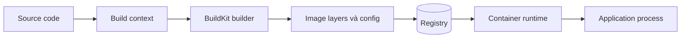
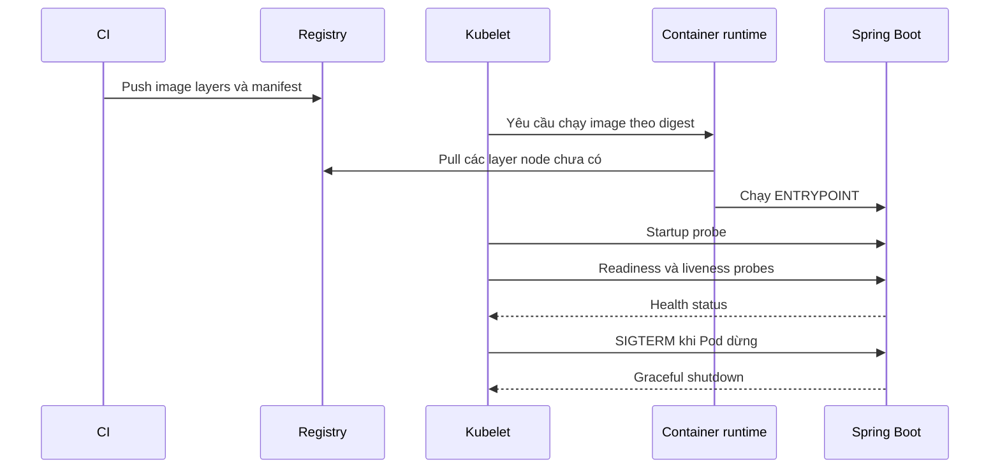
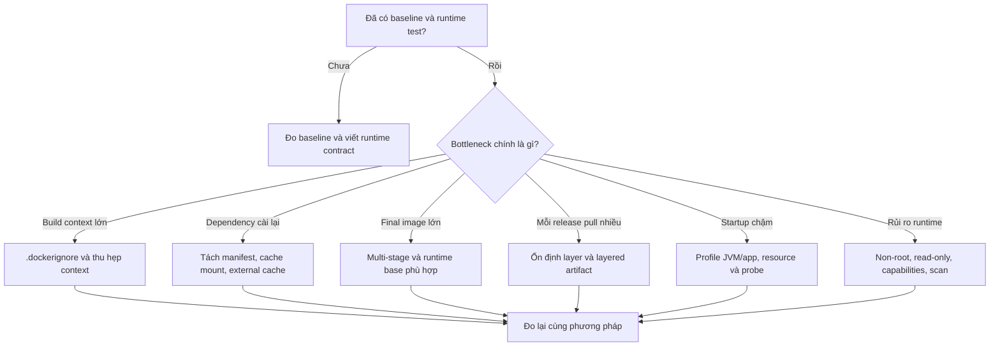

Tối ưu Docker image không phải là cuộc thi tìm image có số `SIZE` nhỏ nhất. Mục tiêu thật sự là tạo ra một artifact **chạy đúng, build nhanh, phân phối hiệu quả, an toàn và có thể tái tạo**. Nếu giảm được 100 MB nhưng ứng dụng mất CA certificate, không nhận `SIGTERM` hoặc khó rollback thì đó là regression, không phải tối ưu.

Trang này dùng một ứng dụng Java Spring Boot làm case study xuyên suốt. Tuy nhiên, quy trình và mental model áp dụng tương tự cho Node.js, Python, Go, .NET hoặc bất kỳ workload nào được đóng gói thành container.

Sau khi hoàn thành, bạn sẽ biết cách:

- phân biệt tối ưu **build context**, **build cache**, **image layers** và **runtime**;
- đo baseline trước khi sửa Dockerfile;
- tách toolchain khỏi final image bằng multi-stage build;
- chọn base image dựa trên runtime contract thay vì chỉ nhìn dung lượng;
- kiểm tra user, filesystem, signal, health endpoint và image history;
- hiểu image tối ưu ảnh hưởng thế nào tới pull time, startup và rollout trên Kubernetes;
- xác định bước tiếp theo dựa trên bottleneck đã đo, thay vì áp dụng mọi kỹ thuật cùng lúc.

## Mental model: có ba giai đoạn khác nhau

Một thay đổi chỉ có giá trị khi nó tối ưu đúng giai đoạn đang chậm hoặc đang rủi ro:



| Giai đoạn | Thành phần chính | Kỹ thuật tối ưu | Kết quả mong đợi |
|---|---|---|---|
| **Input/build** | Context, Dockerfile, dependency, compiler | `.dockerignore`, thứ tự `COPY`, cache mount, external cache | Build nhanh và cache invalidation đúng |
| **Artifact/distribution** | Manifest, config, compressed layers | Multi-stage, runtime base phù hợp, layered artifact | Push/pull ít dữ liệu hơn, ít package thừa |
| **Runtime/operation** | User, process, filesystem, health, resource | Exec-form entrypoint, non-root, read-only filesystem, probes | Khởi động và shutdown đúng, giảm quyền và blast radius |

Ví dụ, `.dockerignore` có thể giảm thời gian gửi context nhưng không tự làm JAR nhỏ hơn. Multi-stage build có thể giảm final image nhưng không tự làm Maven build nhanh nếu Dockerfile phá cache. Kubernetes probe có thể bảo vệ rollout nhưng không làm registry pull nhanh hơn.

<Callout type="info" title="Nguyên tắc quan trọng nhất">
  Mỗi kỹ thuật tối ưu phải gắn với một phép đo hoặc một runtime contract. Hãy trả lời hai câu hỏi: **đang tối ưu phần nào?** và **sẽ kiểm chứng bằng cách nào?**
</Callout>

## Một image tốt cần cân bằng điều gì?

Một image production tốt phải đạt đồng thời các mục tiêu sau:

| Mục tiêu | Câu hỏi cần trả lời |
|---|---|
| **Chạy đúng** | Ứng dụng có đủ JRE, CA certificate, timezone và thư viện cần thiết không? |
| **Build nhanh** | Sửa source có buộc Maven tải lại toàn bộ dependency không? |
| **Phân phối nhanh** | Node Kubernetes phải pull bao nhiêu layer mới trong mỗi lần rollout? |
| **Tái tạo được** | Cùng source, lockfile và base digest có tạo ra artifact có thể truy vết không? |
| **An toàn** | Final image có compiler, package thừa, secret hoặc chạy bằng `root` không? |
| **Dễ vận hành** | Process có nhận `SIGTERM`, expose health endpoint và chạy được với filesystem hạn chế không? |

<Callout type="info" title="Thứ tự ưu tiên">
  Hãy tối ưu theo thứ tự **chạy đúng → đo baseline → tách build/runtime → tối ưu cache → hardening → đo trên môi trường triển khai**. Image nhỏ nhưng không khởi động được hoặc không shutdown đúng vẫn là một image lỗi.
</Callout>

Nếu chưa quen với layer, cache hoặc multi-stage build, nên đọc [Image layers và build cache](/docs/images-va-dockerfile/layers-and-cache/) và [Multi-stage builds](/docs/images-va-dockerfile/multi-stage-builds/) trước.

## Bảy điểm kiểm soát từ baseline đến production

Dùng cùng bảy điểm kiểm soát cho mọi ngôn ngữ. Các phần thực hành phía dưới nhóm chúng thành năm chặng thay đổi Dockerfile và triển khai:

1. **Xác định runtime contract:** ứng dụng cần runtime, certificate, native library, port, writable path và signal nào.
2. **Build baseline:** build image hiện tại, lưu tag riêng và ghi lại size, duration, user, layers.
3. **Thu hẹp input:** giảm build context và ổn định các input ít thay đổi.
4. **Tách build khỏi runtime:** loại compiler, source, test output và package cache khỏi final image.
5. **Hardening có kiểm chứng:** chạy non-root, dùng exec form và thử read-only root filesystem.
6. **Đo lại trên local/CI:** so sánh cold build, warm build, rebuild sau khi sửa source và runtime behavior.
7. **Đo trên môi trường triển khai:** quan sát registry push, node pull, startup, readiness, rollout và termination.

Không nên thay base image, cách package JAR, cache và Kubernetes manifest cùng lúc. Thay đổi theo từng bước giúp biết chính xác cải tiến nào tạo ra kết quả và giúp rollback dễ hơn nếu có regression.

Một bảng đo đơn giản có thể dùng trong pull request:

| Chỉ số | Baseline | Candidate | Cách đo |
|---|---:|---:|---|
| Cold build | ... | ... | Builder/cache sạch có kiểm soát |
| Warm build, không đổi source | ... | ... | Build lại cùng input |
| Rebuild sau khi sửa một file Java | ... | ... | Cùng builder và network |
| Local logical size | ... | ... | `docker image inspect` |
| Registry compressed bytes | ... | ... | Registry/CI metrics |
| Startup đến readiness | ... | ... | Container log hoặc Pod events |
| Graceful shutdown | pass/fail | pass/fail | `docker stop` hoặc rollout staging |

## Ví dụ Spring Boot: xác định runtime contract

Ví dụ giả định project Maven một module có cấu trúc:

```text
orders-service/
├── pom.xml
└── src/
    ├── main/
    └── test/
```

Ứng dụng có các đặc điểm:

- build bằng Java 21 và Maven;
- tạo executable JAR trong `target/`;
- lắng nghe trên port `8080`;
- có dependency `spring-boot-starter-actuator` để cung cấp health endpoint;
- ghi log ra `stdout`/`stderr`, không ghi log vào image.

### Runtime contract phải được viết ra trước Dockerfile

Dockerfile chỉ là cách đóng gói runtime contract. Nếu contract chưa rõ, việc chọn JRE, user hoặc filesystem gần như chỉ là đoán. Với ứng dụng ví dụ, contract tối thiểu là:

| Contract | Quyết định trong image/container | Cách kiểm chứng |
|---|---|---|
| Java 21 runtime | Final stage dùng Java 21 JRE, không cần Maven/JDK | `java -version` ở stage kiểm chứng và smoke test ứng dụng |
| HTTP port `8080` | `EXPOSE 8080`, publish port khi chạy local | Gọi endpoint qua `curl` |
| Không cần quyền root | `USER 10001:10001` | `docker inspect`, `id` nếu image có shell, security context khi deploy |
| Root filesystem không cần ghi | Chỉ cấp writable `/tmp` | Chạy với `--read-only --tmpfs /tmp` |
| Có outbound HTTPS | Runtime phải có CA certificate phù hợp | Integration test tới dependency HTTPS |
| Nhận `SIGTERM` | Exec-form `ENTRYPOINT`, Spring graceful shutdown | `docker stop --time 30` và đọc log |
| Health semantics riêng | Actuator liveness/readiness endpoint | Gọi từng endpoint và mô phỏng dependency chưa ready |
| Config/secret ở runtime | Không bake production config/secret vào image | Kiểm tra history/config và inject qua runtime |

Các ứng dụng có native library, font, locale, timezone database, headless browser hoặc image-processing library phải bổ sung chúng vào contract. “Ứng dụng khởi động được trên laptop” chưa chứng minh runtime image có đủ dependency cho mọi code path production.

Để Spring Boot cung cấp probe riêng cho Kubernetes, thêm cấu hình:

```properties
server.port=8080
server.shutdown=graceful
spring.lifecycle.timeout-per-shutdown-phase=20s
management.endpoint.health.probes.enabled=true
```

Hai endpoint được dùng trong ví dụ:

```text
/actuator/health/liveness
/actuator/health/readiness
```

- **Liveness** trả lời “process còn hoạt động bình thường không?”. Không nên làm liveness phụ thuộc database hoặc API bên ngoài, nếu không một sự cố database có thể khiến toàn bộ Pod bị restart hàng loạt.
- **Readiness** trả lời “Pod đã sẵn sàng nhận traffic chưa?”. Khi readiness fail, Kubernetes dừng route traffic tới Pod nhưng không nhất thiết restart container.

Startup probe sẽ được thêm ở phần Kubernetes. Khi startup probe tồn tại, kubelet chưa chạy liveness và readiness cho đến khi startup probe thành công. Đây là cách cho ứng dụng khởi động chậm một khoảng thời gian riêng mà không phải làm liveness trở nên quá lỏng.

## Bước 1: build image baseline

Một Dockerfile thường gặp ở giai đoạn đầu. Lưu nó thành `Dockerfile.before` để tạo baseline:

```dockerfile
# syntax=docker/dockerfile:1
FROM maven:3.9-eclipse-temurin-21

WORKDIR /workspace
COPY . .
RUN mvn --batch-mode --no-transfer-progress package

EXPOSE 8080
ENTRYPOINT ["java", "-jar", "target/orders-service-0.0.1-SNAPSHOT.jar"]
```

Thay tên JAR trong `ENTRYPOINT` theo `artifactId` và `version` thực tế của project. Image này có thể chạy, nhưng Maven image vừa là môi trường build vừa là runtime. Final image chứa cả:

- Maven và JDK;
- source code và test code;
- Maven local repository trong `/root/.m2`;
- build output trung gian;
- user mặc định `root`.

Build baseline để có số liệu so sánh. Lần đầu đại diện cho cold build hoặc trạng thái cache hiện tại đã được ghi nhận; lần thứ hai dùng cùng input để quan sát warm cache:

```bash
# Lần 1: cold hoặc trạng thái cache hiện tại đã được ghi nhận.
time docker build --file Dockerfile.before \
  --tag orders-service:before --progress=plain .

# Lần 2: warm build với input giống hệt.
time docker build --file Dockerfile.before \
  --tag orders-service:before --progress=plain .

docker image inspect orders-service:before \
  --format 'size={{.Size}} user={{json .Config.User}}'
docker image history --no-trunc orders-service:before
```

<Callout type="warn" title="Không prune cache chỉ để lấy một con số đẹp">
  Cold build cần môi trường cache sạch hoặc builder mới, nhưng `docker builder prune` có thể xóa cache đang được project khác dùng và không có rollback. Hãy dùng builder disposable trong CI/lab, hoặc ghi rõ trạng thái cache thay vì prune máy dùng chung.
</Callout>

`docker image inspect` hiển thị logical size trong local image store. Nó hữu ích để so sánh hai image trên cùng máy, nhưng không phải chính xác số byte mà node Kubernetes tải từ registry.

### Hiểu đúng các loại “kích thước image”

Một image không chỉ có một con số size duy nhất:

| Số đo | Nó trả lời câu hỏi gì? | Lưu ý |
|---|---|---|
| Local logical size | Tổng nội dung layer mà image tham chiếu trên máy local | Shared layers có thể được tính cho nhiều image khi nhìn từng image |
| Compressed registry size | Registry hoặc node phải truyền bao nhiêu byte cho layer chưa có | Phụ thuộc compression và layer đã tồn tại trên node |
| Unique bytes trên host | Image làm tăng bao nhiêu storage thực tế | Phụ thuộc layer dùng chung và image store |
| Container writable layer | Process đã ghi thêm bao nhiêu dữ liệu sau khi chạy | Không phải một phần của immutable image |

Vì vậy, đừng báo cáo “image giảm 40%” mà không nói dùng số đo nào. Với rollout Kubernetes, **compressed bytes của các layer node chưa có** và **thời gian từ pull đến readiness** thường gần với trải nghiệm người dùng hơn cột `SIZE` trong `docker image ls`.

## Bước 2: thu hẹp build context

Tạo `.dockerignore` ở root của build context:

```text
.git
.idea
.vscode
target
*.log
.env
.env.*
*.pem
*.key
README.md
```

`.dockerignore` giúp:

1. gửi ít dữ liệu hơn tới builder;
2. tránh file local không liên quan làm cache miss;
3. giảm nguy cơ copy nhầm credential hoặc build output vào image.

Nó **không bảo đảm final image nhỏ hơn** nếu các file bị loại vốn chưa bao giờ được `COPY`. Lợi ích trực tiếp trước tiên là thu hẹp input boundary và giảm công việc transfer/checksum. Final image chỉ nhỏ hơn khi trước đó Dockerfile thực sự copy nội dung thừa vào layer.

Kiểm tra dòng `load build context` trong output:

```bash
docker build --progress=plain --tag orders-service:context-check .
```

Đọc số byte ở lần build đầu. Ở lần build sau, BuildKit có thể reuse context/cache nên con số thời gian không còn đại diện cho cold transfer. Nếu context vẫn rất lớn:

1. xác nhận dấu `.` cuối command đang trỏ đúng project root;
2. xác nhận `.dockerignore` nằm ở root của context;
3. tìm artifact lớn như `target/`, `.git/`, log, test fixture hoặc heap dump;
4. kiểm tra Dockerfile-specific ignore file nếu dùng `--file docker/prod.Dockerfile`;
5. không chuyển secret sang một directory khác chỉ để “giảm context” — secret phải bị loại và quản lý bằng cơ chế riêng.

<Callout type="warn" title="Không đưa secret vào image">
  Không truyền password, token hoặc private key bằng `COPY`, `ARG` hay `ENV`. Secret dùng lúc build phải đi qua BuildKit secret mount; secret dùng lúc chạy phải được inject bởi Kubernetes Secret hoặc secret manager.
</Callout>

Xem thêm quy tắc pattern tại [.dockerignore](/docs/images-va-dockerfile/dockerignore/).

## Bước 3: tách builder khỏi runtime

Dockerfile production cơ bản:

```dockerfile
# syntax=docker/dockerfile:1

FROM maven:3.9-eclipse-temurin-21 AS build
WORKDIR /workspace

# Dependency thay đổi ít hơn source, nên copy pom.xml trước.
COPY pom.xml ./
RUN --mount=type=cache,target=/root/.m2 \
    mvn --batch-mode --no-transfer-progress \
    dependency:go-offline

# Source đổi thường xuyên được copy sau.
COPY src/ src/
RUN --mount=type=cache,target=/root/.m2 \
    mvn --batch-mode --no-transfer-progress verify

FROM eclipse-temurin:21-jre-jammy AS runtime
WORKDIR /application

COPY --from=build --chown=10001:10001 \
    /workspace/target/*.jar application.jar

USER 10001:10001
EXPOSE 8080
ENTRYPOINT ["java", "-jar", "application.jar"]
```

Dockerfile này tạo hai ranh giới rõ ràng:

```text
build stage                         runtime stage
-----------                         -------------
Maven + JDK                         JRE
pom.xml + source                    application.jar
Maven cache                         numeric non-root user
compile + test                      java -jar
```

### Vì sao image nhỏ hơn?

`runtime` bắt đầu từ JRE image mới và chỉ nhận JAR qua `COPY --from=build`. Maven, JDK, source và `/root/.m2` không thuộc final image.

### Vì sao build lại nhanh hơn?

`pom.xml` được copy trước source. Khi chỉ sửa Java code:

```text
pom.xml -> tải dependency -> source -> test/package
            có thể reuse       chạy lại
```

Cache mount `/root/.m2` giúp Maven không tải lại artifact đã có khi step phải chạy lại. Cache mount chỉ tăng tốc build; nội dung của nó không đi vào final image và build vẫn phải thành công khi cache rỗng.

### Vì sao dùng `ENTRYPOINT` dạng JSON?

Exec form giúp JVM trở thành process chính trong container và nhận `SIGTERM` trực tiếp. Điều này quan trọng khi Kubernetes dừng Pod trong lúc rollout hoặc scale down.

### Có cần đổi sang Alpine hoặc distroless ngay không?

Không. Trước tiên hãy tạo một image JRE hoạt động đúng. Chỉ đổi base sau khi đã kiểm tra:

- native library dùng glibc hay musl;
- outbound HTTPS có CA certificate;
- timezone và locale;
- cách debug khi image không có shell;
- target architecture như `linux/amd64` hoặc `linux/arm64`.

Đổi base chỉ để giảm vài MB nhưng làm ứng dụng lỗi TLS hoặc native dependency là tối ưu sai mục tiêu.

### Chọn base image theo decision table

Không có một base image tốt nhất cho mọi workload:

| Loại base | Điểm mạnh | Trade-off cần kiểm tra | Phù hợp khi |
|---|---|---|---|
| Full distro + JDK | Tool đầy đủ, dễ build/debug | Lớn, nhiều package không cần ở runtime | Builder stage |
| Distro + JRE | Cân bằng tương thích và dung lượng | Vẫn có OS packages cần patch/scan | Runtime Java phổ biến |
| Slim/minimal distro | Ít package hơn | Có thể thiếu shell, timezone, font, native lib | Runtime contract đã rõ và có smoke test |
| Alpine/musl | Dung lượng base nhỏ | Native library/glibc compatibility, DNS/TLS/performance phải test | Ứng dụng và dependency hỗ trợ musl rõ ràng |
| Distroless/`scratch` | Attack surface nhỏ, không có package manager/shell | Debug trực tiếp khó; phải chuẩn bị observability và debug workflow | Artifact self-contained, contract rất rõ |
| Custom `jlink` runtime | Chỉ đóng gói Java modules cần thiết | Tăng độ phức tạp build/update/test | Java runtime size thật sự là bottleneck đã đo |

Hai câu hỏi thường bị nhầm:

- **Base nào nhỏ nhất?** chỉ nói về một con số ban đầu.
- **Base nào nhỏ nhất nhưng vẫn thỏa runtime contract và update policy?** mới là câu hỏi production.

Ưu tiên image từ nguồn tin cậy, dùng version/tag rõ ràng và có quy trình rebuild định kỳ. Tag có thể thay đổi nội dung theo thời gian. Pin digest tăng reproducibility nhưng cũng có nghĩa là image không tự nhận bản vá mới; dependency bot hoặc quy trình review phải chủ động cập nhật digest.

```dockerfile
# Ví dụ minh họa cú pháp pin; thay digest bằng giá trị đã xác minh của image thật.
FROM eclipse-temurin:21-jre-jammy@sha256:<VERIFIED_DIGEST> AS runtime
```

<Callout type="warn" title="Không copy digest ví dụ">
  Digest phải lấy từ registry tin cậy và được policy của tổ chức xác minh. Placeholder hoặc digest lấy từ bài viết cũ không phải dependency pin hợp lệ.
</Callout>

### Xóa file ở layer sau không làm layer trước nhỏ đi

Sai lầm phổ biến:

```dockerfile
RUN apt-get update && apt-get install -y curl
RUN rm -rf /var/lib/apt/lists/*
```

Package index đã tồn tại trong filesystem layer của `RUN` đầu. Layer sau chỉ ghi thay đổi “đã xóa”, không sửa blob bất biến trước đó. Cleanup phải nằm trong cùng instruction tạo dữ liệu:

```dockerfile
RUN apt-get update \
    && apt-get install -y --no-install-recommends curl \
    && rm -rf /var/lib/apt/lists/*
```

Tuy nhiên, final runtime tốt nhất thường không cần `curl` chỉ để probe. Kubernetes có thể gửi HTTP request từ kubelet; cài thêm client trong application image làm tăng package và lỗ hổng cần quản lý. Chỉ cài công cụ runtime khi ứng dụng hoặc operational contract thực sự cần nó.

<Callout type="info" title="Project Maven nhiều module">
  Ví dụ trên dành cho project một module. Với multi-module project, phải copy root POM và các module POM cần cho dependency resolution trước khi chạy `dependency:go-offline`; không copy máy móc mỗi `pom.xml` rồi giả định cache vẫn đúng.
</Callout>

## Bước 4: build và kiểm chứng local

Build candidate hai lần:

```bash
docker build \
  --file Dockerfile \
  --tag orders-service:optimized \
  --progress=plain \
  .

docker build \
  --file Dockerfile \
  --tag orders-service:optimized \
  --progress=plain \
  .
```

Lần thứ hai, các step không có input thay đổi nên hiển thị `CACHED` hoặc được reuse. Sau đó sửa một file Java rồi build lại: bước dependency nên được reuse, còn source và package phải chạy lại.

### So sánh cấu hình và kích thước

```bash
for image in orders-service:before orders-service:optimized; do
  docker image inspect "$image" \
    --format 'image='"$image"' size={{.Size}} user={{json .Config.User}} entrypoint={{json .Config.Entrypoint}}'
done

docker image history orders-service:optimized
```

Kết quả cần kiểm tra:

- image optimized dùng user `10001:10001`;
- entrypoint là `java -jar application.jar`;
- history của final image không chứa Maven install hoặc source;
- image optimized nhỏ hơn baseline nhưng vẫn chạy đủ chức năng.

Không hard-code một số MB “đúng” vì base digest và dependency thay đổi theo thời gian.

### Chạy gần giống Kubernetes hơn

Dùng read-only root filesystem và cấp riêng `/tmp` cho JVM:

```bash
docker run --detach \
  --name orders-service \
  --publish 127.0.0.1:8080:8080 \
  --read-only \
  --tmpfs /tmp:rw,noexec,nosuid,size=64m \
  orders-service:optimized
```

Kiểm tra HTTP và probes:

```bash
curl --fail --retry 30 --retry-delay 1 \
  --retry-connrefused --retry-all-errors \
  http://127.0.0.1:8080/actuator/health/liveness

curl --fail \
  http://127.0.0.1:8080/actuator/health/readiness

docker container inspect orders-service \
  --format 'user={{.Config.User}} status={{.State.Status}}'
```

Kiểm tra graceful shutdown:

```bash
docker container stop --time 30 orders-service
docker container logs orders-service
```

Ứng dụng phải thoát trước timeout. Nếu Docker phải gửi `SIGKILL`, cần kiểm tra entrypoint, Spring graceful shutdown và các thread không chịu dừng.

### Ma trận kiểm chứng: nhỏ hơn chưa đủ

Chạy ít nhất các kiểm tra sau trước khi gọi image là “optimized”:

| Nhóm | Thử nghiệm | Tiêu chí pass |
|---|---|---|
| Process | Khởi động container không override command | JVM chạy ở PID chính và app phục vụ request |
| Identity | Inspect configured user | Không phải root và UID/GID khớp policy |
| Filesystem | `--read-only` + writable `/tmp` riêng | App chạy bình thường, không ghi nhầm vào image layer |
| Network | Gọi endpoint chính và outbound HTTPS cần thiết | Không lỗi CA/DNS/native TLS |
| Health | Gọi liveness và readiness | Status phản ánh đúng semantics, response nhanh và nhẹ |
| Signal | `docker stop --time 30` | App nhận `SIGTERM` và thoát trước deadline |
| Resource | Chạy với memory/CPU gần production | Không OOM hoặc startup timeout do limit phi thực tế |
| Architecture | Chạy artifact trên target platform | Không lỗi `exec format` hoặc native library |

Nếu ứng dụng cần memory limit, có thể smoke test gần production hơn:

```bash
docker run --detach \
  --name orders-service-limited \
  --memory 512m \
  --cpus 1 \
  --read-only \
  --tmpfs /tmp:rw,noexec,nosuid,size=64m \
  --publish 127.0.0.1:8081:8080 \
  orders-service:optimized

curl --fail --retry 30 --retry-delay 1 \
  --retry-connrefused --retry-all-errors \
  http://127.0.0.1:8081/actuator/health/readiness

docker stop --time 30 orders-service-limited
docker rm orders-service-limited
```

Giá trị `512m` và `1 CPU` chỉ là ví dụ. Dùng request/limit dự kiến của workload. Một JVM khởi động tốt khi không giới hạn resource nhưng fail trong Pod vẫn là runtime contract chưa được kiểm chứng.

### Cache local và cache CI là hai bài toán khác nhau

Cache mount `/root/.m2` có thể hoạt động tốt trên máy developer nhưng CI runner ephemeral thường bắt đầu không có cache. Buildx hỗ trợ export/import cache qua backend phù hợp với nền tảng. Ví dụ registry cache:

```bash
docker buildx build \
  --cache-from type=registry,ref=registry.example.com/team/orders-service:buildcache \
  --cache-to type=registry,ref=registry.example.com/team/orders-service:buildcache,mode=max \
  --tag registry.example.com/team/orders-service:1.0.0 \
  --push \
  .
```

Cache không phải artifact release và không phải nguồn duy nhất để build đúng. Pipeline phải vẫn thành công khi cache rỗng. Cache từ pull request không tin cậy cũng cần tách scope/trust boundary; không export layer từng chứa credential được `COPY` hoặc ghi ra filesystem.

Đánh giá cache CI bằng ba tình huống riêng:

1. build trên runner mới nhưng import được external cache;
2. build lại cùng commit;
3. build commit chỉ thay đổi source, không đổi `pom.xml`.

Nếu cả ba đều tải dependency lại, đọc plain log và tìm operation đầu tiên cache miss thay vì tăng kích thước cache một cách mù quáng.

## Tối ưu thêm cho Spring Boot layered JAR

Multi-stage build loại Maven/JDK khỏi runtime. Tuy nhiên, nếu toàn bộ executable JAR nằm trong một layer, mỗi lần application code đổi có thể tạo một blob JAR mới.

Spring Boot có thể tách executable JAR thành các layer:

```text
dependencies             thay đổi ít
spring-boot-loader       thay đổi ít
snapshot-dependencies    thay đổi tùy project
application              thay đổi thường xuyên
```

Sau stage `build`, có thể thêm:

```dockerfile
FROM eclipse-temurin:21-jre-jammy AS extract
WORKDIR /builder
COPY --from=build /workspace/target/*.jar application.jar
RUN java -Djarmode=tools -jar application.jar \
    extract --layers --destination extracted

FROM eclipse-temurin:21-jre-jammy AS runtime
WORKDIR /application
COPY --from=extract --chown=10001:10001 /builder/extracted/dependencies/ ./
COPY --from=extract --chown=10001:10001 /builder/extracted/spring-boot-loader/ ./
COPY --from=extract --chown=10001:10001 /builder/extracted/snapshot-dependencies/ ./
COPY --from=extract --chown=10001:10001 /builder/extracted/application/ ./
USER 10001:10001
EXPOSE 8080
ENTRYPOINT ["java", "-jar", "application.jar"]
```

Lợi ích chính là **reuse layer khi push/pull giữa các release**, không phải xóa dependency khỏi ứng dụng. Chỉ thêm bước này sau khi multi-stage cơ bản đã chạy đúng và registry/pull time thực sự là bottleneck.

Thứ tự bốn `COPY` cũng thể hiện tần suất thay đổi:

```text
dependencies           ít đổi nhất
spring-boot-loader      ít đổi
snapshot-dependencies  đổi khi snapshot đổi
application            đổi thường xuyên nhất
```

Khi chỉ code ứng dụng thay đổi, registry và node có thể reuse ba layer đầu rồi truyền layer `application`. Tổng logical content của ứng dụng không nhất thiết giảm đáng kể; lợi ích đến từ **delta giữa hai release** nhỏ hơn.

`jarmode=tools` phụ thuộc phiên bản Spring Boot và cách JAR được package. Nếu command `list-layers` hoặc `extract` không hoạt động, kiểm tra Spring Boot Maven/Gradle plugin của chính project thay vì đổi Dockerfile ngẫu nhiên.

Kiểm tra JAR hỗ trợ layer trước khi sửa runtime stage:

```bash
java -Djarmode=tools \
  -jar target/orders-service-0.0.1-SNAPSHOT.jar \
  list-layers
```

Tên JAR phải khớp output thật. Project Maven có thể sinh thêm plain/original JAR; wildcard `target/*.jar` có thể match nhiều file và làm `COPY` không còn deterministic. Release pipeline nên xác định duy nhất executable JAR qua cấu hình build hoặc argument đã kiểm soát.

### Khi nào chưa nên dùng layered JAR?

Không thêm layered JAR chỉ vì Dockerfile mẫu có nó. Chưa cần khi:

- final JAR nhỏ và node pull không phải bottleneck;
- release hiếm, registry/node luôn có bandwidth tốt;
- dependency thay đổi gần như mỗi release nên layer reuse thấp;
- team chưa có test cho jarmode/package layout;
- độ phức tạp bổ sung làm release khó debug hơn lợi ích đo được.

Ngược lại, layered JAR hữu ích khi application code đổi thường xuyên, dependency ổn định và cùng nhiều node phải pull release liên tục.

## Bước 5: image tương tác với Kubernetes như thế nào?

Khi triển khai, Kubernetes không build Dockerfile. Cluster chỉ nhận image reference và runtime configuration:



Điều này giải thích vì sao tối ưu image ảnh hưởng trực tiếp tới rollout:

- context và Maven cache ảnh hưởng **thời gian CI build**;
- final image và layer reuse ảnh hưởng **thời gian node pull**;
- JRE/application startup ảnh hưởng **thời gian startup probe pass**;
- readiness quyết định **khi nào Service gửi traffic**;
- exec-form entrypoint và graceful shutdown quyết định **request có bị cắt khi rollout không**.

### Push image theo version, deploy theo digest

Ví dụ build multi-platform và push:

```bash
docker buildx build \
  --platform linux/amd64,linux/arm64 \
  --tag registry.example.com/team/orders-service:1.0.0 \
  --push \
  .

docker buildx imagetools inspect \
  registry.example.com/team/orders-service:1.0.0
```

Lấy digest từ output của registry hoặc `imagetools inspect`, sau đó dùng digest trong manifest. Tag giúp con người đọc version; digest đảm bảo các Pod chạy đúng cùng một nội dung.

### Deployment mẫu

Manifest sau minh họa contract giữa image Spring Boot và Kubernetes:

```yaml
apiVersion: apps/v1
kind: Deployment
metadata:
  name: orders-service
spec:
  replicas: 2
  selector:
    matchLabels:
      app: orders-service
  template:
    metadata:
      labels:
        app: orders-service
    spec:
      terminationGracePeriodSeconds: 30
      securityContext:
        runAsNonRoot: true
        seccompProfile:
          type: RuntimeDefault
      containers:
        - name: application
          image: "registry.example.com/team/orders-service@sha256:<DIGEST>"
          imagePullPolicy: IfNotPresent
          ports:
            - name: http
              containerPort: 8080
          env:
            - name: SPRING_PROFILES_ACTIVE
              value: kubernetes
          startupProbe:
            httpGet:
              path: /actuator/health/liveness
              port: http
            periodSeconds: 2
            failureThreshold: 30
          readinessProbe:
            httpGet:
              path: /actuator/health/readiness
              port: http
            periodSeconds: 5
            timeoutSeconds: 2
            failureThreshold: 3
          livenessProbe:
            httpGet:
              path: /actuator/health/liveness
              port: http
            periodSeconds: 10
            timeoutSeconds: 2
            failureThreshold: 3
          securityContext:
            runAsUser: 10001
            runAsGroup: 10001
            allowPrivilegeEscalation: false
            readOnlyRootFilesystem: true
            capabilities:
              drop:
                - ALL
          resources:
            requests:
              cpu: 100m
              memory: 256Mi
            limits:
              memory: 512Mi
          volumeMounts:
            - name: tmp
              mountPath: /tmp
      volumes:
        - name: tmp
          emptyDir:
            sizeLimit: 128Mi
---
apiVersion: v1
kind: Service
metadata:
  name: orders-service
spec:
  selector:
    app: orders-service
  ports:
    - name: http
      port: 80
      targetPort: http
```

Các giá trị CPU, memory và probe chỉ là baseline minh họa. Phải điều chỉnh bằng startup time, heap usage và traffic thực tế.

### Kubernetes chịu trách nhiệm gì, image chịu trách nhiệm gì?

| Image/Application | Kubernetes |
|---|---|
| Chứa JRE và JAR | Pull image từ registry |
| Chạy process bằng `ENTRYPOINT` | Áp `securityContext` và resource limit |
| Expose health endpoint | Gọi startup/readiness/liveness probe |
| Xử lý `SIGTERM` | Gửi signal và chờ grace period |
| Ghi log ra stdout/stderr | Thu thập log qua runtime/agent |
| Không chứa config/secret production | Inject ConfigMap, Secret và volume |

`EXPOSE 8080` trong Dockerfile chỉ là metadata. Nó không tạo Kubernetes Service và không tự mở port. Port, probe và Service phải được khai báo trong manifest.

## Đo kết quả trên Kubernetes

Theo dõi rollout:

```bash
kubectl apply --filename deployment.yaml
kubectl rollout status deployment/orders-service
kubectl get pods --selector app=orders-service --watch
```

Xem node mất bao lâu để pull và ứng dụng mất bao lâu để ready:

```bash
kubectl describe pod <POD_NAME>
kubectl logs <POD_NAME>
kubectl get pod <POD_NAME> \
  --output=jsonpath='{.status.containerStatuses[0].imageID}{"\n"}'
```

Trong `kubectl describe pod`, chú ý các event `Pulling`, `Pulled`, `Created`, `Started` và probe failure. Đây là số liệu gần với trải nghiệm rollout hơn local `docker image ls`.

Sau khi rollout thành công, kiểm tra shutdown bằng một lần restart có kiểm soát:

```bash
kubectl rollout restart deployment/orders-service
kubectl rollout status deployment/orders-service
kubectl logs <OLD_POD_NAME>
```

Không thực hiện thử nghiệm restart tùy tiện trên production. Dùng môi trường staging hoặc maintenance window phù hợp.

## Kích thước, bảo mật và khả năng tái tạo là ba chỉ số khác nhau

Ba mục tiêu này thường cùng được cải thiện khi loại package thừa, nhưng không thể thay thế cho nhau:

| Mục tiêu | Ví dụ phép kiểm tra | Kết luận không được phép suy ra |
|---|---|---|
| Image nhỏ | So sánh local/registry bytes | Không chứng minh không có lỗ hổng |
| Ít CVE hơn | Scan final image và dependency | Không chứng minh image chạy non-root hoặc không có secret |
| Reproducible/traceable | Pin input, ghi provenance, deploy digest | Không chứng minh artifact hoạt động đúng |
| Runtime hardened | Non-root, read-only, drop capabilities | Không chứng minh source/dependency đáng tin cậy |

Một image distroless có thể rất nhỏ nhưng vẫn chứa dependency ứng dụng có CVE. Một image không có CVE đã biết vẫn có thể chứa token bị `COPY`. Một digest cố định chỉ chứng minh content không đổi; nó không chứng minh content đó an toàn.

Release flow production nên có các gate độc lập:

1. build từ source/lockfile đã review;
2. chạy unit/integration/smoke test trên chính candidate artifact;
3. scan final image và dependency theo policy của tổ chức;
4. tạo/ghi nhận SBOM, provenance hoặc attestation nếu supply chain yêu cầu;
5. push bằng tag release rõ ràng và ghi digest;
6. deploy digest đã qua gate, không build lại một artifact khác sau test;
7. giữ known-good digest để rollback.

<Callout type="warn" title="`ARG` và `ENV` không phải nơi giữ secret">
  Multi-stage build không cứu được secret đã được `COPY` hoặc ghi vào layer/cache. Dùng BuildKit secret/SSH mount cho credential lúc build. Credential runtime phải được inject bởi orchestrator hoặc secret manager và không xuất hiện trong Dockerfile, image config hay build log.
</Callout>

## Cây quyết định: nên tối ưu bước nào tiếp theo?

Không phải project nào cũng cần layered JAR, distroless hoặc custom JRE. Dùng triệu chứng để chọn thay đổi nhỏ nhất:



Nếu chưa có bottleneck rõ, bắt đầu bằng ba thay đổi có value cao và độ phức tạp thấp: `.dockerignore`, multi-stage build và non-root runtime. Sau đó đo lại trước khi thêm kỹ thuật nâng cao.

## Chẩn đoán nhanh

| Triệu chứng | Nguyên nhân thường gặp | Kiểm tra đầu tiên |
|---|---|---|
| Build chậm mỗi lần sửa Java | `COPY . .` đứng trước Maven dependency step | Build log và step cache miss đầu tiên |
| Final image vẫn rất lớn | Runtime vẫn dùng Maven/JDK image | `docker image history` và final `FROM` |
| `ImagePullBackOff` | Sai image, digest hoặc credential registry | `kubectl describe pod` |
| Pod `Running` nhưng không nhận traffic | Readiness probe fail | Probe event và actuator endpoint |
| Pod restart liên tục lúc khởi động | Startup/liveness quá gắt hoặc app crash | `kubectl logs --previous` và events |
| Container lỗi `Permission denied` | Non-root user không có quyền ghi | Path ghi file, ownership và volume mount |
| Read-only filesystem làm JVM lỗi | Thiếu writable `/tmp` hoặc app ghi nhầm path | Log và volume mount `/tmp` |
| Rollout cắt request | App không xử lý `SIGTERM` hoặc grace period quá ngắn | Log shutdown và thời gian request dài nhất |
| Node vẫn pull nhiều dữ liệu mỗi release | JAR/layer lớn thay đổi toàn bộ | Registry layer, image history, layered JAR |
| Scan vẫn báo nhiều package | Runtime base còn tool/package thừa hoặc CVE nằm trong app dependency | SBOM/scan result theo package ownership |
| Build cùng commit nhưng digest khác | Input chưa pin, timestamp/generated file hoặc provenance khác | So sánh metadata, base digest và build input |
| Local chạy được, ARM node lỗi | Chỉ build/test `linux/amd64` hoặc có native dependency | Manifest platform và smoke test trên ARM |
| Image nhỏ nhưng khó xử lý incident | Runtime không có shell và chưa có debug workflow | Ephemeral debug container hoặc debug target riêng |

Khi cache miss, hãy tìm **step đầu tiên không được reuse**. Khi Pod lỗi, đọc **events trước, logs sau**, rồi kiểm tra manifest và image digest đang chạy.

## Checklist production ngắn gọn

### Build

- [ ] `.dockerignore` loại `.git`, `target`, IDE file, log và credential.
- [ ] Manifest dependency được copy trước source.
- [ ] Build và runtime tách bằng multi-stage.
- [ ] Final image chỉ chứa JRE và artifact cần chạy.
- [ ] Test/package chạy trong release flow.
- [ ] CI cache tăng tốc nhưng build vẫn đúng khi cache rỗng.
- [ ] Base image có update/pinning policy rõ ràng.

### Runtime

- [ ] Dùng exec-form `ENTRYPOINT`.
- [ ] Container chạy non-root.
- [ ] Ứng dụng chạy được với read-only root filesystem và `/tmp` riêng.
- [ ] Outbound HTTPS, timezone và native library đã được test.
- [ ] Secret không tồn tại trong layer, `ARG` hoặc `ENV` của image.
- [ ] Final image và application dependency được scan theo policy.
- [ ] Có debug workflow nếu production image không có shell.

### Kubernetes

- [ ] Deploy bằng version rõ ràng và pin digest.
- [ ] Startup, readiness và liveness có đúng semantics.
- [ ] `terminationGracePeriodSeconds` dài hơn thời gian graceful shutdown cần thiết.
- [ ] Resource request/limit dựa trên measurement.
- [ ] Rollout và rollback đã được thử trên staging.
- [ ] Registry giữ known-good digest trong thời gian rollback.

### Cleanup bài thực hành local

Các lệnh sau chỉ xóa object được tạo trong ví dụ. Kiểm tra container trước khi xóa image:

```bash
docker container rm --force orders-service orders-service-limited 2>/dev/null || true
docker image rm \
  orders-service:before \
  orders-service:context-check \
  orders-service:optimized
```

`docker container rm --force` dừng process ngay, không kiểm tra graceful shutdown. Chỉ dùng ở bước cleanup sau khi bài test signal đã hoàn tất. Không chạy `docker system prune` hoặc `docker builder prune` trên máy dùng chung chỉ để dọn lab nhỏ này.

## Kết luận

Một Docker image tối ưu cho Spring Boot trên Kubernetes có flow rõ ràng:

```text
context nhỏ
  -> dependency cache ổn định
  -> Maven/JDK build stage
  -> JRE runtime stage
  -> non-root + read-only filesystem
  -> push registry theo digest
  -> startup/readiness/liveness
  -> graceful rollout và rollback
```

Hãy bắt đầu bằng multi-stage build và `.dockerignore`; đây thường là hai thay đổi đem lại hiệu quả lớn nhất. Chỉ thêm layered JAR, distroless, `jlink`, CDS/AOT hoặc compression đặc biệt khi measurement cho thấy chúng giải quyết bottleneck thực tế.

## Nguồn chính thức

- [Dockerfile best practices](https://docs.docker.com/build/building/best-practices/)
- [Optimize build cache](https://docs.docker.com/build/cache/optimize/)
- [Multi-stage builds](https://docs.docker.com/build/building/multi-stage/)
- [Build context và `.dockerignore`](https://docs.docker.com/build/concepts/context/)
- [Spring Boot Dockerfiles và layered JAR](https://docs.spring.io/spring-boot/reference/packaging/container-images/dockerfiles.html)
- [Spring Boot Kubernetes probes](https://docs.spring.io/spring-boot/reference/actuator/endpoints.html#actuator.endpoints.kubernetes-probes)
- [Kubernetes container images](https://kubernetes.io/docs/concepts/containers/images/)
- [Kubernetes liveness, readiness và startup probes](https://kubernetes.io/docs/concepts/configuration/liveness-readiness-startup-probes/)
- [Kubernetes Pod termination](https://kubernetes.io/docs/concepts/workloads/pods/pod-lifecycle/#pod-termination)
