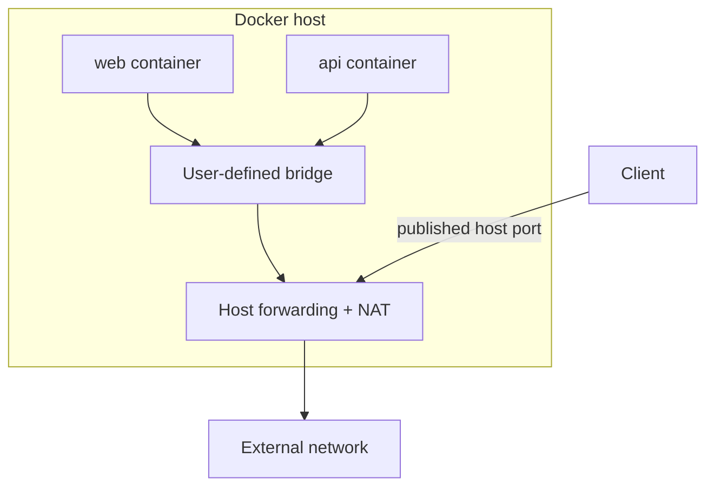

Bridge là driver phù hợp nhất cho application chạy trên **một Docker Engine**. Trên Linux, Docker thường nối endpoint container vào software bridge, thêm route, firewall và masquerading để container ra mạng ngoài.



## User-defined bridge và default `bridge`

| Khả năng | User-defined bridge | Default `bridge` |
|---|---|---|
| DNS bằng container name/alias | Có | Không; chỉ IP nếu không dùng legacy link |
| Isolation theo application | Có | Mọi container không chỉ định network dồn chung |
| Connect/disconnect khi đang chạy | Có | Hạn chế, thường phải recreate |
| Cấu hình subnet/MTU/bind default | Theo từng network | Daemon-wide, cần restart |
| Khuyến nghị | Dùng mặc định cho application | Chỉ compatibility/lab đơn giản |

`--link` là cơ chế legacy. Dùng user-defined network và DNS name.

## Connectivity mặc định

Với user-defined bridge:

- container cùng network truy cập mọi container port mà service đang listen;
- container khác bridge không direct-connect mặc định;
- outbound thường được masquerade thành host address;
- inbound từ ngoài host cần published port hoặc direct routing được cấu hình;
- host có thể truy cập container address trên Linux Engine, nhưng không nên dùng container IP làm public contract.

`EXPOSE` trong Dockerfile không tạo firewall rule. Nó chỉ mô tả port dự kiến. `-p` mới publish port lên host.

## Lab: DNS và isolation

```bash
docker network create bridge-front
docker network create bridge-back

docker run -d --name bridge-web \
  --network bridge-front \
  nginx:1.29-alpine

docker run -d --name bridge-client \
  --network bridge-front \
  alpine:3.23 sleep 1d
```

Peer cùng network gọi bằng name:

```bash
docker exec bridge-client wget -qO- http://bridge-web/
```

Một peer ở network khác không resolve được `bridge-web`:

```bash
docker run --rm --network bridge-back alpine:3.23 \
  nslookup bridge-web
```

Command cuối dự kiến fail. Nối web vào network thứ hai với alias riêng:

```bash
docker network connect --alias web-internal bridge-back bridge-web
docker run --rm --network bridge-back alpine:3.23 \
  wget -qO- http://web-internal/
```

Network alias có scope theo network; đây là cách một container có identity khác nhau ở từng boundary.

## Tạo bridge có IPAM rõ ràng

```bash
docker network create \
  --driver bridge \
  --subnet 172.31.20.0/24 \
  --ip-range 172.31.20.128/25 \
  --gateway 172.31.20.1 \
  --opt com.docker.network.driver.mtu=1450 \
  bridge-custom
```

Chỉ đặt MTU `1450` khi underlay/tunnel yêu cầu và đã đo path MTU. MTU sai thường gây lỗi “kết nối được nhưng response lớn treo”, đặc biệt qua VPN/VXLAN.

Inspect:

```bash
docker network inspect bridge-custom \
  --format 'driver={{.Driver}} internal={{.Internal}} ipam={{json .IPAM.Config}} options={{json .Options}}'
```

## Internal bridge

```bash
docker network create --internal bridge-internal
```

Các container cùng network vẫn giao tiếp; Docker không cấu hình default route ra external network và thêm filtering phù hợp. Host có thể còn giao tiếp qua bridge gateway tùy gateway mode. Nếu cần mức tách host chặt hơn, Docker Engine mới hỗ trợ gateway mode `isolated` kết hợp `--internal`:

```bash
docker network create --internal \
  -o com.docker.network.bridge.gateway_mode_ipv4=isolated \
  bridge-isolated
```

Kiểm tra version trước khi dùng option mới; không copy vào fleet hỗn hợp mà chưa test.

## Port publishing và bind address

```bash
docker run -d --name bridge-public \
  --network bridge-front \
  -p 127.0.0.1:8080:80 \
  nginx:1.29-alpine
```

Mapping này chỉ bind IPv4 loopback. Để bind cả IPv4 và IPv6 loopback:

```bash
docker run -d --name bridge-loopback \
  --network bridge-front \
  -p 127.0.0.1:8081:80 \
  -p '[::1]:8081:80' \
  nginx:1.29-alpine
```

Không ghi host IP nghĩa là bind mọi address theo default network/daemon, có thể expose dịch vụ ra Internet. Xem [Publish và expose port](/docs/networking/port-publishing/).

## Driver options đáng biết

| Option | Mục đích |
|---|---|
| `com.docker.network.bridge.name` | Chọn tên bridge Linux |
| `...enable_ip_masquerade` | Bật/tắt masquerade outbound |
| `...enable_icc` | Điều khiển inter-container connectivity |
| `...host_binding_ipv4` | Default host address khi publish không ghi IP |
| `com.docker.network.driver.mtu` | MTU endpoint |
| `...gateway_mode_ipv4/ipv6` | `nat`, `routed`, `nat-unprotected`, `isolated` |

Option thay đổi packet path và security posture. Version-control network definition, kiểm tra `docker network inspect`, firewall và connectivity sau rollout.

## Không chỉnh artifact Docker trực tiếp

Docker tạo bridge interface, veth và firewall rules. Đổi/xóa trực tiếp các object này có thể làm runtime state lệch metadata và bị Docker ghi đè.

Khi cần user policy với iptables, dùng `DOCKER-USER`; với nftables backend, tạo table/base chain riêng theo priority. Xem [Firewall, iptables và nftables](/docs/networking/firewall-iptables-nftables/).

## Failure modes

| Triệu chứng | Kiểm tra đầu tiên |
|---|---|
| Resolve name fail | Hai container có cùng user-defined network không? Alias đúng scope không? |
| Outbound fail | Route, DNS, host forwarding, masquerade/firewall |
| Chỉ payload lớn fail | MTU/path MTU |
| Port host không mở | Application listen port, `docker port`, bind address, host conflict |
| VPN làm mất kết nối | Docker subnet có overlap prefix VPN không? |
| Network không xóa được | `docker network inspect` để tìm active endpoint |

## Cleanup

```bash
docker rm -f bridge-web bridge-client bridge-public bridge-loopback 2>/dev/null || true
docker network rm \
  bridge-front bridge-back bridge-custom bridge-internal bridge-isolated \
  2>/dev/null || true
```

## Nguồn chính thức

- [Bridge network driver](https://docs.docker.com/engine/network/drivers/bridge/)
- [Port publishing and mapping](https://docs.docker.com/engine/network/port-publishing/)
- [docker network create](https://docs.docker.com/reference/cli/docker/network/create/)
