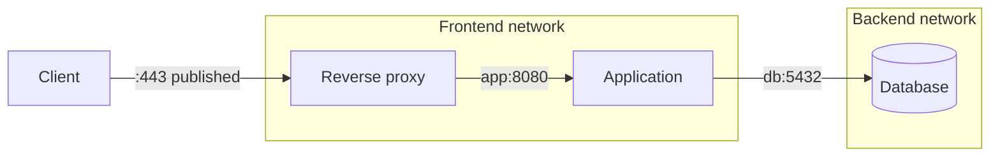

Giao tiếp giữa container nên được thiết kế theo **service identity và trust boundary**, không theo IP runtime. Hai containers chỉ cần ở cùng network phù hợp và application listen trên container interface/port.



Proxy và app multi-home vì phải nối hai tier; database không có lý do xuất hiện ở frontend network.

## Chọn địa chỉ theo nguồn traffic

| Nguồn → đích | Address nên dùng |
|---|---|
| Container → cùng container | `127.0.0.1:PORT` |
| Container → peer cùng custom network | `SERVICE_NAME:CONTAINER_PORT` |
| Host → bridge container | Published `HOST_IP:HOST_PORT` |
| External client → service | Load balancer/reverse proxy hoặc published address |
| Container → host | Platform-specific host gateway/address |
| Swarm task → service | Swarm service name/VIP hoặc `dnsrr` |

Không dùng host published port cho east-west traffic nếu hai services đã share network; path đó thêm NAT/firewall dependency và làm topology khó hiểu.

## Lab ba tier

Tạo hai network:

```bash
docker network create comm-front
docker network create --internal comm-back
```

Chạy backend HTTP giả lập trên internal network:

```bash
docker run -d --name comm-api \
  --network comm-back \
  --network-alias api \
  nginx:1.29-alpine
```

Chạy gateway trên frontend rồi nối thêm backend:

```bash
docker run -d --name comm-gateway \
  --network comm-front \
  -p 127.0.0.1:8080:80 \
  alpine:3.23 sleep 1d

docker network connect comm-back comm-gateway
```

Chứng minh gateway gọi API bằng service alias:

```bash
docker exec comm-gateway wget -qO- http://api:80/
```

Peer chỉ ở frontend không thấy API:

```bash
docker run --rm --network comm-front alpine:3.23 nslookup api
```

Command cuối dự kiến fail. Network segmentation giảm accidental connectivity nhưng gateway vẫn là bridge giữa hai zones ở cấp application.

## Application listen address

Server bind `127.0.0.1` chỉ nhận connection trong chính container/network namespace. Để peer gọi qua network interface, thường bind `0.0.0.0:PORT`, `[::]:PORT` hoặc address cụ thể của endpoint.

```bash
docker exec SERVICE ss -lntup
```

Client phải dùng **container port**, không phải host port. Nếu Compose khai báo `ports: ["8080:80"]`, peer gọi `service:80`, host gọi `localhost:8080`.

## Container chia sẻ network stack

`--network container:<name>` làm container mới join network namespace của container target:

```bash
docker run -d --name shared-web nginx:1.29-alpine
docker run --rm --network container:shared-web alpine:3.23 \
  wget -qO- http://127.0.0.1:80/
```

Hai process dùng chung interfaces, routes, loopback và port space. Mode này phù hợp sidecar chặt như proxy/debug container, nhưng:

- không publish port trên joining container;
- nhiều DNS/hostname/network flags không được hỗ trợ;
- port conflict xảy ra như cùng một host;
- lifecycle/security boundary phụ thuộc target namespace.

Không nhầm với “cùng Docker network”: shared namespace chặt hơn nhiều.

## Kết nối tới host

Trên Docker Desktop, `host.docker.internal` là convention được platform cung cấp. Trên Linux Engine, có thể thêm mapping tới host gateway:

```bash
docker run --rm \
  --add-host host.docker.internal:host-gateway \
  alpine:3.23 getent hosts host.docker.internal
```

Service host phải listen trên address reachable từ bridge; nếu chỉ listen host `127.0.0.1`, container bridge thường không gọi được. Host firewall cũng phải cho phép source từ Docker subnet.

Dùng host network chỉ khi thực sự muốn share toàn bộ host stack, không như workaround mặc định.

## Multi-network và default route

Một container nối nhiều network có nhiều interfaces. Docker chọn default gateway; có thể kiểm soát bằng `gw-priority`:

```bash
docker run -d --name routed-app \
  --network name=egress-net,gw-priority=1 \
  --network backend-net \
  alpine:3.23 sleep 1d
```

Connected traffic tới backend subnet đi interface backend; traffic khác đi default gateway của `egress-net`. Kiểm tra:

```bash
docker exec routed-app ip route
docker inspect routed-app --format '{{json .NetworkSettings.Networks}}'
```

Application có thể chọn source address/interface khác kernel default; test cả ingress và return path.

## Retry, readiness và connection lifecycle

Network connect thành công không có nghĩa service ready. Client nên:

- retry có backoff/jitter cho transient startup;
- đặt connect/read timeout;
- phân biệt DNS, TCP, TLS và application errors;
- refresh DNS/connection khi endpoint bị thay;
- dùng health/readiness của platform, không chỉ `depends_on` order.

Retry vô hạn có thể che config sai và tạo thundering herd. Log endpoint name, phase và timeout nhưng không log credential.

## Security design

- Một network cho mỗi trust zone/component thay vì một flat network.
- Chỉ multi-home proxy/gateway thực sự cần nối zones.
- Không publish database/cache ra host nếu chỉ app cần dùng.
- Dùng TLS/mTLS và auth; Docker DNS/name không chứng minh identity.
- Egress allow-list ở boundary phù hợp; `--internal` chỉ bỏ external route của network đó.
- Không đưa Docker socket vào container để service tự khám phá peers.

## Chẩn đoán theo tầng

```bash
# 1. Membership và alias
docker inspect CLIENT --format '{{json .NetworkSettings.Networks}}'
docker inspect SERVER --format '{{json .NetworkSettings.Networks}}'

# 2. DNS
docker exec CLIENT nslookup SERVICE

# 3. Route
docker exec CLIENT ip route get SERVER_IP

# 4. Server socket
docker exec SERVER ss -lntup

# 5. L7 request
docker exec CLIENT wget -S -O- http://SERVICE:PORT/
```

Không dùng `ping` làm kết luận cuối: image có thể thiếu ping, ICMP có thể bị chặn trong khi TCP hoạt động, và ping không test application port.

## Cleanup

```bash
docker rm -f comm-api comm-gateway shared-web routed-app 2>/dev/null || true
docker network rm comm-front comm-back egress-net backend-net 2>/dev/null || true
```

## Nguồn chính thức

- [Docker networking overview](https://docs.docker.com/engine/network/)
- [Bridge network driver](https://docs.docker.com/engine/network/drivers/bridge/)
- [docker network connect](https://docs.docker.com/reference/cli/docker/network/connect/)
