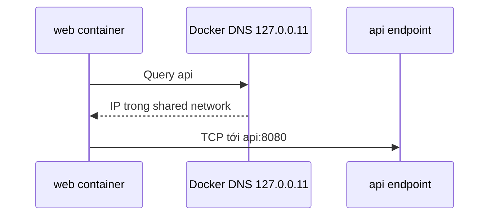

Service discovery tách **identity ổn định** khỏi endpoint IP có thể đổi khi container recreate. Trên user-defined network, Docker embedded DNS resolve container name và network alias cho peers cùng network.



## Default bridge và custom network

| Network | Resolver behavior |
|---|---|
| Default `bridge` | Container nhận bản sao DNS config phù hợp từ host; không có automatic container-name discovery |
| User-defined network | Dùng embedded DNS `127.0.0.11`; resolve name/alias nội bộ và forward external query |
| `none` | Không có Docker DNS connectivity |
| Host mode | Dùng host network stack; resolver file vẫn do Docker chuẩn bị theo configuration |

`127.0.0.11` là address nhìn từ container namespace. Docker docs quy định địa chỉ IPv4 này dùng được cả trong IPv6-only container; không có DNS server address IPv6 tương đương.

## Name, hostname và alias

```bash
docker network create dns-lab
docker run -d --name api-v1 \
  --hostname api-host \
  --network dns-lab \
  --network-alias api \
  nginx:1.29-alpine
```

Từ peer:

```bash
docker run --rm --network dns-lab alpine:3.23 \
  nslookup api
```

- `api-v1`: container name, resolve trong custom network.
- `api`: network-scoped alias, phù hợp làm service identity trong lab.
- `api-host`: hostname process tự thấy; không nên giả định luôn là discovery alias.
- IP: endpoint detail, có thể đổi.

Gắn alias khi connect container đang chạy:

```bash
docker network connect --alias api backend-net api-v1
```

Alias chỉ có nghĩa trong `backend-net`, không tự xuất hiện ở network khác.

## Nhiều endpoint cùng alias

Có thể gán cùng alias cho nhiều containers để DNS trả nhiều address. Tuy nhiên:

- thứ tự record không phải load-balancing guarantee;
- client có thể cache DNS lâu;
- client có thể giữ TCP connection tới một endpoint;
- record cũ có thể còn trong cache khi container bị thay;
- health/readiness không mặc định được DNS record phản ánh theo cách application mong muốn.

Với Docker Compose, dùng service name; với Swarm, dùng service discovery/VIP hoặc `dnsrr`. Không tự xây production load balancer chỉ bằng container aliases.

## Upstream DNS

Override theo container:

```bash
docker run --rm \
  --dns 192.0.2.53 \
  --dns-search corp.example \
  --dns-opt ndots:1 \
  alpine:3.23 cat /etc/resolv.conf
```

`--dns 127.0.0.1` trỏ vào loopback **của container**, không phải DNS daemon trên host. Nếu cần host DNS proxy, nó phải listen trên địa chỉ reachable từ container và firewall cho phép.

Docker embedded DNS forward external query tới upstream của host/config. Với VPN hoặc `systemd-resolved`, phân biệt stub address chỉ host dùng được với upstream thực sự reachable từ container path.

## `/etc/hosts` và `--add-host`

Host `/etc/hosts` không tự được copy toàn bộ vào container. Thêm entry có chủ đích:

```bash
docker run --rm \
  --add-host api.example:192.0.2.20 \
  alpine:3.23 getent hosts api.example
```

Trên Linux Engine, map tên host gateway động:

```bash
docker run --rm \
  --add-host host.docker.internal:host-gateway \
  alpine:3.23 getent hosts host.docker.internal
```

Static hosts bypass DNS lifecycle và health. Dùng cho compatibility/test, không làm service registry production.

## Lab: chứng minh scope

```bash
docker network create dns-front
docker network create dns-back

docker run -d --name dns-api \
  --network dns-back \
  --network-alias api \
  nginx:1.29-alpine
```

Resolve từ shared network:

```bash
docker run --rm --network dns-back alpine:3.23 nslookup api
```

Resolve từ network khác dự kiến fail:

```bash
docker run --rm --network dns-front alpine:3.23 nslookup api
```

Nối endpoint với alias ở network mới rồi thử lại:

```bash
docker network connect --alias public-api dns-front dns-api
docker run --rm --network dns-front alpine:3.23 nslookup public-api
```

## Quy trình chẩn đoán DNS

1. Xác minh shared network và alias:

```bash
docker inspect CONTAINER --format '{{json .NetworkSettings.Networks}}'
docker network inspect NETWORK
```

2. Xem resolver effective:

```bash
docker exec CONTAINER cat /etc/resolv.conf
docker exec CONTAINER cat /etc/hosts
```

3. Tách internal và external query:

```bash
docker exec CONTAINER nslookup PEER_NAME
docker exec CONTAINER nslookup example.com
```

4. Tách DNS khỏi connectivity bằng cách gọi known IP tạm thời. IP gọi được nhưng name không được chỉ chứng minh resolver path có vấn đề; không biến IP thành permanent fix.

5. Kiểm tra application resolver/cache. Java, Go, glibc, musl và framework có caching/search behavior khác nhau.

## Failure modes phổ biến

| Triệu chứng | Khả năng |
|---|---|
| `NXDOMAIN` cho container name | Không cùng custom network, alias sai scope |
| Internal name được, external name fail | Upstream DNS/VPN/firewall |
| CLI lookup được, app fail | App cache, `ndots`, search domain, resolver implementation |
| Resolve ra IP cũ | Client/proxy cache hoặc stale long-lived connection |
| `--dns 127.0.0.1` fail | Resolver loopback không chạy trong container |
| Short name resolve sai domain | Search suffix/`ndots` tạo query ngoài dự kiến |

## Security

- DNS không xác thực peer; dùng TLS/mTLS hoặc application auth.
- Search domain có thể gửi short-name query ra upstream; dùng FQDN khi boundary quan trọng.
- Không log toàn bộ resolver config nếu chứa internal domains nhạy cảm.
- Hạn chế ai được attach vào network; membership cho phép discover và connect peers.

## Cleanup

```bash
docker rm -f api-v1 dns-api 2>/dev/null || true
docker network rm dns-lab dns-front dns-back backend-net 2>/dev/null || true
```

## Nguồn chính thức

- [Docker networking overview — DNS services](https://docs.docker.com/engine/network/#dns-services)
- [Bridge network driver](https://docs.docker.com/engine/network/drivers/bridge/)
- [docker network connect](https://docs.docker.com/reference/cli/docker/network/connect/)
