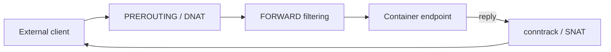

Trên Linux, Docker tạo firewall rules để bridge isolation, port publishing, NAT/masquerade và DNS hoạt động. Rules này là runtime-managed state; sửa trực tiếp chain/table Docker sở hữu dễ bị ghi đè hoặc làm metadata lệch data plane.



Docker tạo host firewall rules cho bridge networks. `host`, `macvlan` và `ipvlan` không nhận cùng bridge rules; policy phải áp ở packet path tương ứng.

## Firewall backend

Docker Engine mặc định dùng iptables backend. Docker 29.0 giới thiệu nftables backend ở trạng thái **experimental**:

```json
{
  "firewall-backend": "nftables"
}
```

Ở trạng thái hiện tại, nftables backend chưa hỗ trợ overlay rules và không thể bật khi daemon chạy Swarm mode. Behavior/options có thể đổi; không rollout production fleet chỉ dựa trên snippet.

<Callout type="warn" title="Không tắt Docker firewall tùy tiện">
  Đặt `iptables: false` hoặc `ip6tables: false` thường làm bridge networking hỏng: mất masquerade/isolation và có thể khiến container ports reachable ngoài dự kiến. Chỉ làm khi bạn cung cấp đầy đủ replacement rules và đã test lifecycle.
</Callout>

## iptables chains quan trọng

Docker có thể tạo các chains như:

- `DOCKER-USER`: vị trí cho user policy trước Docker forwarding rules;
- `DOCKER-FORWARD`: dispatch/established forwarding;
- `DOCKER`, `DOCKER-BRIDGE`, `DOCKER-INTERNAL`: publish/isolation;
- `DOCKER-CT`: conntrack theo bridge;
- `DOCKER-INGRESS`: Swarm ingress;
- `DOCKER` trong `nat`: DNAT, masquerade và port mapping.

Tên chi tiết có thể đổi theo version, nhưng `DOCKER-USER` là interface được tài liệu hóa cho iptables policy.

Quan sát read-only:

```bash
sudo iptables -S
sudo iptables -t nat -S
sudo ip6tables -S
sudo nft list ruleset
```

Capture output trước thay đổi; firewall dump có thể lộ internal topology.

## Thêm policy với `DOCKER-USER`

Cho established/related response trước:

```bash
sudo iptables -I DOCKER-USER 1 \
  -m conntrack --ctstate ESTABLISHED,RELATED -j ACCEPT
```

Ví dụ chỉ cho subnet quản trị vào từ external interface, rồi drop nguồn khác:

```bash
sudo iptables -I DOCKER-USER 2 \
  -i eth0 -s 192.0.2.0/24 -j ACCEPT
sudo iptables -I DOCKER-USER 3 \
  -i eth0 -j DROP
```

Đây chỉ là pattern minh họa. Rule thật phải giới hạn destination/protocol/port và không chặn traffic hợp lệ khác trên host. Dùng công cụ persistent firewall/IaC thay vì command ad hoc.

Khi packet tới `DOCKER-USER`, DNAT có thể đã đổi destination thành container IP/port. Muốn match original destination, dùng conntrack như `--ctorigdst`/`--ctorigdstport`; feature này có performance cost.

## nftables backend không có `DOCKER-USER`

Docker tạo tables riêng như `ip docker-bridges` và `ip6 docker-bridges`. Không sửa chúng. Tạo table/base chain riêng với cùng hook và priority có chủ đích:

```text
table inet site-policy {
  chain forward-filter {
    type filter hook forward priority filter; policy accept;
    ct state established,related accept
    iifname "eth0" oifname "br-*" ip saddr != 192.0.2.0/24 drop
  }
}
```

Nftables `accept` trong một base chain không nhất thiết là verdict cuối cho mọi base chain khác; packet vẫn có thể bị chain priority khác drop. Khi cần override Docker drop, Docker nftables backend có `bridge-accept-fwmark` workflow. Review official migration guide thay vì dịch từng iptables rule theo cú pháp.

## IP forwarding

Bridge routing/publishing cần forwarding:

```bash
sysctl net.ipv4.ip_forward
sysctl net.ipv6.conf.all.forwarding
```

Với iptables backend, Docker có thể bật forwarding và đặt `FORWARD` policy `DROP`. Với nftables backend experimental, Docker không tự bật forwarding và không tạo default drop policy; operator phải cấu hình cả forwarding lẫn policy chặn unwanted routing giữa non-Docker interfaces.

Một host nhiều NIC có forwarding bật có thể vô tình trở thành router. `ip-forward-no-drop` không phải optimization; nó thay security posture.

## UFW và firewalld

### UFW

Published traffic được DNAT/routed trước path `INPUT` mà nhiều UFW rules tập trung vào, nên “UFW deny port” có thể không chặn published container như dự kiến. Áp policy trong forwarding path/`DOCKER-USER` hoặc dùng integration đã được test.

### firewalld

Khi firewall integration bật, Docker tạo zone `docker` và forwarding policy liên quan, đưa bridge interfaces vào zone. Không sửa tên interface thủ công mà bỏ qua dynamic network lifecycle. Review effective zones:

```bash
sudo firewall-cmd --get-active-zones
sudo firewall-cmd --list-all --zone=docker
```

## Packet path theo network mode

| Mode | Policy location chính |
|---|---|
| Bridge published port | DNAT + forwarding chains/tables |
| Bridge east-west | Bridge forwarding/isolation rules |
| Host network | Host `INPUT`/`OUTPUT` path như host process |
| Macvlan/IPvlan | Physical/VLAN/endpoint/upstream policy; Docker không tạo bridge rules |
| Overlay | Swarm/overlay and ingress rules cùng underlay firewall |

Đây là lý do không thể kiểm tra mọi lỗi bằng `iptables -L INPUT`.

## Quy trình thay đổi an toàn

1. Capture `docker info`, network/container inspect và full firewall ruleset.
2. Xác định backend thật: iptables legacy/nft wrapper hay native Docker nftables.
3. Vẽ packet path cho source, destination, protocol và address family.
4. Có out-of-band access hoặc rollback timer để tránh tự khóa SSH.
5. Thêm rule hẹp, có counter/log rate-limit nếu cần.
6. Test established flow, new flow, IPv4, IPv6, TCP và UDP liên quan.
7. Recreate/publish/unpublish container để test lifecycle.
8. Persist rule bằng system firewall/IaC; reboot test trên môi trường staging.

## Troubleshooting

```bash
docker port CONTAINER
docker inspect CONTAINER --format '{{json .NetworkSettings.Ports}}'
sudo ss -lntup
sudo iptables -nvL DOCKER-USER --line-numbers
sudo iptables -t nat -nvL
sudo nft list ruleset
sudo conntrack -L 2>/dev/null | head
```

Counter không tăng thường nghĩa packet không đi chain/interface bạn nghĩ. Capture ở external NIC, bridge và container namespace để tìm điểm mất packet; không flush toàn bộ firewall để “test” trên host từ xa.

## Nguồn chính thức

- [Packet filtering and firewalls](https://docs.docker.com/engine/network/packet-filtering-firewalls/)
- [Docker with iptables](https://docs.docker.com/engine/network/firewall-iptables/)
- [Docker with nftables](https://docs.docker.com/engine/network/firewall-nftables/)
- [Port publishing and mapping](https://docs.docker.com/engine/network/port-publishing/)
