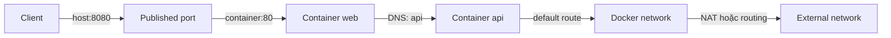

Docker networking quyết định process trong container nhìn thấy interface, địa chỉ IP, route, DNS và port nào. Container không cần biết peer là container hay máy vật lý; nó chỉ gửi packet qua network stack mà Docker và host đã cấu hình.



<Callout type="warn" title="Mental model quan trọng">
  `localhost` luôn thuộc network namespace hiện tại. Trong bridge network, `127.0.0.1` bên trong container là chính container đó, không phải Docker host và không phải container khác.
</Callout>

## Năm câu hỏi trước khi cấu hình

1. Peer nằm trong cùng container, cùng Docker host, host khác hay mạng vật lý?
2. Kết nối là outbound, container-to-container hay inbound từ client bên ngoài?
3. Peer nên tìm nhau bằng DNS name hay địa chỉ IP cố định?
4. Port cần chỉ dùng nội bộ hay phải publish lên host?
5. Trust boundary yêu cầu network nào được phép giao tiếp với network nào?

Không chọn driver vì “nhanh hơn” trước khi trả lời topology và security boundary. Với phần lớn application trên một host, **user-defined bridge** là mặc định phù hợp.

## Thành phần của một endpoint

Khi nối container vào network, Docker thường cung cấp:

- một interface trong network namespace của container;
- một hoặc nhiều địa chỉ do IPAM cấp;
- connected route và có thể có default gateway;
- DNS configuration;
- endpoint metadata trong Docker network object;
- host-side forwarding, NAT và firewall rules tùy driver.

Quan sát từ container:

```bash
docker run --rm alpine:3.23 sh -c '
  ip address
  ip route
  cat /etc/resolv.conf
'
```

Quan sát từ Docker:

```bash
docker network ls
docker network inspect bridge
docker container inspect CONTAINER \
  --format '{{json .NetworkSettings.Networks}}'
```

Hai view bổ sung cho nhau: `inspect` cho biết Docker intended state; `ip`, `ss` và resolver output cho biết effective state trong namespace.

## Chọn network driver

| Driver/mode | Phạm vi chính | Đặc điểm | Dùng khi |
|---|---|---|---|
| `bridge` | Một Docker Engine | Network riêng, DNS trên user-defined network, NAT/publish port | Application thông thường trên một host |
| `host` | Host network namespace | Không có IP riêng, không NAT, xung đột trực tiếp host port | Tool cần host stack hoặc dải port rất lớn |
| `none` | Chỉ loopback | Không có external interface/default route | Batch xử lý offline, sandbox cần cắt network |
| `overlay` | Nhiều Swarm node | VXLAN, service discovery, có thể encrypt data plane | Swarm service hoặc standalone container đa host |
| `macvlan` | Physical L2/VLAN | Mỗi endpoint có MAC riêng | Legacy appliance cần xuất hiện như thiết bị L2 |
| `ipvlan` | Physical L2 hoặc routed L3 | Dùng chung parent MAC, ít L2 state hơn macvlan | Underlay integration, giới hạn số MAC |

`bridge`, `host` và `none` giải quyết các topology khác nhau, không phải ba mức “tốt hơn”. `overlay`, `macvlan` và `ipvlan` cần hiểu hạ tầng bên ngoài trước khi dùng.

## Ba luồng traffic cần phân biệt

### Container-to-container

Hai container trên cùng user-defined network có thể dùng name/alias và container port trực tiếp:

```text
web -> http://api:8080
```

Không cần `-p` cho luồng này. Publish port chỉ cần khi traffic phải đi qua host address hoặc boundary khác.

### Container-to-external

Bridge network mặc định masquerade outbound traffic: peer bên ngoài thường thấy source là IP của Docker host. DNS upstream thường bắt nguồn từ network namespace của container thông qua Docker embedded DNS trên custom network.

### External-to-container

Bridge network mặc định chặn direct inbound tới unpublished ports. `-p 127.0.0.1:8080:80` tạo mapping từ host loopback port `8080` tới container TCP port `80`; `-p 8080:80` mặc định bind trên mọi host address và có thể expose ra mạng ngoài.

## Lab: DNS nội bộ và published port

Tạo user-defined bridge:

```bash
docker network create networking-lab
```

Chạy web server, chỉ expose metadata trong image chứ chưa publish host port:

```bash
docker run -d --name networking-web \
  --network networking-lab \
  nginx:1.29-alpine
```

Gọi bằng container name từ peer cùng network:

```bash
docker run --rm --network networking-lab alpine:3.23 \
  wget -qO- http://networking-web/
```

Host chưa có mapping nào:

```bash
docker port networking-web
```

Recreate server với port chỉ bind vào host loopback:

```bash
docker rm -f networking-web
docker run -d --name networking-web \
  --network networking-lab \
  -p 127.0.0.1:8080:80 \
  nginx:1.29-alpine
curl http://127.0.0.1:8080/
```

Điều cần chứng minh:

- peer cùng network dùng `networking-web:80`;
- host dùng `127.0.0.1:8080`;
- hai địa chỉ phục vụ hai boundary khác nhau;
- container IP là runtime detail, không nên hard-code vào application.

## Network không phải security policy hoàn chỉnh

Tách service vào nhiều network làm giảm connectivity mặc định, nhưng không thay thế:

- firewall/NetworkPolicy ở platform;
- authentication và TLS giữa services;
- least privilege, seccomp và LSM;
- egress control và audit;
- policy trên cloud/VLAN/router.

Một container được nối vào cả `frontend` và `backend` có thể trở thành đường nối giữa hai trust zone nếu application bị compromise. Multi-homing cần review route, gateway priority và quyền của process.

## Lộ trình phần Networking

1. [Docker network model](/docs/networking/network-model/) — namespace, endpoint, IPAM, route và driver.
2. [Bridge network](/docs/networking/bridge-network/), [Host network](/docs/networking/host-network/) và [None network](/docs/networking/none-network/) — ba mode local quan trọng.
3. [Overlay network](/docs/networking/overlay-network/), [Macvlan](/docs/networking/macvlan/) và [IPvlan](/docs/networking/ipvlan/) — topology nâng cao.
4. [DNS và service discovery](/docs/networking/dns-service-discovery/) cùng [Publish và expose port](/docs/networking/port-publishing/) — naming và inbound traffic.
5. [Giao tiếp giữa container](/docs/networking/container-communication/) và [IPv6](/docs/networking/ipv6/) — thiết kế connectivity thực tế.
6. [Firewall, iptables và nftables](/docs/networking/firewall-iptables-nftables/) cùng [Troubleshooting network](/docs/networking/network-troubleshooting/) — enforcement và runbook.

## Cleanup bài thực hành

```bash
docker rm -f networking-web 2>/dev/null || true
docker network rm networking-lab 2>/dev/null || true
```

## Nguồn chính thức

- [Docker networking overview](https://docs.docker.com/engine/network/)
- [Docker network drivers](https://docs.docker.com/engine/network/drivers/)
- [Port publishing and mapping](https://docs.docker.com/engine/network/port-publishing/)
- [docker network CLI](https://docs.docker.com/reference/cli/docker/network/)
