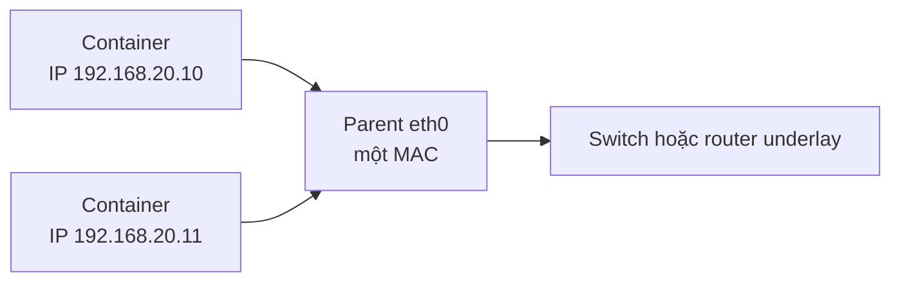

IPvlan gắn endpoint container vào một parent interface mà không cần Linux bridge. Khác Macvlan, nhiều endpoint dùng MAC của parent ở external network, giúp giảm số MAC mà switch phải học.



IPvlan là integration với physical network, không phải “bridge nhanh hơn” để thay thế mặc định. Operator phải sở hữu IP plan, VLAN, route và external policy.

## Modes và flags

Driver option chính:

| Option | Giá trị | Vai trò |
|---|---|---|
| `ipvlan_mode` | `l2` (default), `l3`, `l3s` | Chọn switching/routing behavior |
| `ipvlan_flag` | `bridge` (default), `private`, `vepa` | Điều khiển giao tiếp giữa endpoints |
| `parent` | `eth0`, `eth0.20`... | Physical hoặc VLAN sub-interface |

### L2 mode

Container ở cùng L2 subnet với parent và dùng external gateway. ARP/ND/broadcast behavior tồn tại theo L2; upstream switch thấy nhiều IP sau một MAC.

### L3 mode

Host đóng vai trò router cho các container prefixes. Broadcast/multicast L2 không đi qua như L2 mode; upstream phải có route tới container subnet qua Docker host. Docker không tự phân phối route ra hạ tầng.

### L3S mode

L3S bổ sung shared conntrack behavior cho use case cần stateful filtering. Đây là mode chuyên sâu; kiểm tra kernel, Docker version và firewall path trong lab trước production.

## Platform và giới hạn

- Chỉ Linux host; cần kernel hỗ trợ ổn định, Docker docs khuyến nghị kernel 4.2+.
- Docker Desktop/Windows không cung cấp physical-parent behavior tương đương.
- Parent host và child endpoint không giao tiếp trực tiếp theo isolation behavior của IPvlan.
- Cloud virtual NIC/security policy có thể không route secondary container IP.
- Host firewall bridge rules không tự bảo vệ external IPvlan path.

## Tạo IPvlan L2

Thay subnet/gateway/parent bằng allocation thật:

```bash
docker network create --driver ipvlan \
  --subnet 192.168.20.0/24 \
  --ip-range 192.168.20.128/25 \
  --gateway 192.168.20.1 \
  --opt parent=eth0 \
  --opt ipvlan_mode=l2 \
  ipvlan20
```

Chạy container:

```bash
docker run -d --name ipvlan-demo \
  --network ipvlan20 \
  alpine:3.23 sleep 1d
```

Xác minh:

```bash
docker network inspect ipvlan20
docker exec ipvlan-demo ip -br address
docker exec ipvlan-demo ip route
docker exec ipvlan-demo ping -c 2 192.168.20.1
```

Container có thể không ping IP parent host dù gateway/peer khác hoạt động. Đây là kernel isolation có chủ đích, không nên “fix” bằng broad firewall disable.

## 802.1Q trunk

Parent `eth0.20` map network vào VLAN 20:

```bash
docker network create --driver ipvlan \
  --subnet 192.168.20.0/24 \
  --gateway 192.168.20.1 \
  --opt parent=eth0.20 \
  --opt ipvlan_mode=l2 \
  ipvlan-vlan20
```

Docker có thể tạo sub-interface khi tên theo format `parent.vlan-id`. Switch port phải allow VLAN, gateway phải ở đúng segment và host OS/network manager không được tranh ownership.

## Tạo IPvlan L3

Ví dụ container prefix tách khỏi subnet parent:

```bash
docker network create --driver ipvlan \
  --subnet 10.50.0.0/24 \
  --opt parent=eth0 \
  --opt ipvlan_mode=l3 \
  ipvlan-l3
```

External router cần route tương đương:

```text
10.50.0.0/24 via <IP-của-Docker-host-trên-underlay>
```

Không có route đó, container có thể giao tiếp local nhưng response từ external peer không quay lại đúng host. Với nhiều Docker hosts, route distribution qua static route, BGP hoặc controller là trách nhiệm hạ tầng.

<Callout type="warn" title="Không dùng NAT để che thiếu route plan">
  IPvlan L3 được chọn để tích hợp routed underlay. Thêm masquerade tùy tiện có thể làm test “chạy” nhưng phá source identity và che lỗi route/asymmetric path.
</Callout>

## Isolated IPvlan network

Nếu bỏ `parent` hoặc dùng `--internal`, driver tạo dummy parent và network bị cô lập khỏi external network:

```bash
docker network create --driver ipvlan \
  --internal \
  --subnet 172.29.0.0/24 \
  ipvlan-isolated
```

Use case này tồn tại nhưng user-defined bridge thường dễ vận hành hơn nếu không cần đặc tính IPvlan.

## IPvlan so với Macvlan, Bridge và Overlay

| Nhu cầu | Chọn |
|---|---|
| App cùng host, DNS và publish port thông thường | User-defined bridge |
| Multi-host do Swarm quản lý | Overlay |
| Endpoint cần MAC riêng như thiết bị vật lý | Macvlan |
| Underlay cần nhiều IP nhưng hạn chế MAC | IPvlan L2 |
| Routed container prefixes, kiểm soát route distribution | IPvlan L3 |

## Troubleshooting

```bash
docker network inspect NETWORK
docker inspect CONTAINER --format '{{json .NetworkSettings.Networks}}'
ip -d link show PARENT
docker exec CONTAINER ip address
docker exec CONTAINER ip route
docker exec CONTAINER ip neigh
sudo tcpdump -ni PARENT 'arp or icmp or icmp6'
```

Theo mode:

- L2: kiểm tra VLAN, ARP/ND, gateway, duplicate IP và switch port.
- L3: kiểm tra upstream route, reverse path, asymmetric routing và firewall forwarding.
- Cả hai: phân biệt host-parent isolation với external connectivity failure.

## Security và vận hành

- Reserve IP range ngoài DHCP; Docker IPAM không đồng bộ DHCP server.
- Áp ACL tại underlay/router/endpoint vì Docker không tạo firewall rules cho IPvlan.
- Không đặt workload không tin cậy trực tiếp vào sensitive VLAN.
- Monitor route drift, duplicate address và parent link state.
- Version-control network definition và external routes như một thay đổi nguyên tử.
- Dùng application TLS/auth; cùng VLAN/subnet không phải identity.

## Cleanup

```bash
docker rm -f ipvlan-demo 2>/dev/null || true
docker network rm ipvlan20 ipvlan-vlan20 ipvlan-l3 ipvlan-isolated 2>/dev/null || true
```

## Nguồn chính thức

- [IPvlan network driver](https://docs.docker.com/engine/network/drivers/ipvlan/)
- [IPVLAN Driver HOWTO — Linux kernel](https://docs.kernel.org/networking/ipvlan.html)
- [Macvlan network driver](https://docs.docker.com/engine/network/drivers/macvlan/)
- [docker network create](https://docs.docker.com/reference/cli/docker/network/create/)
