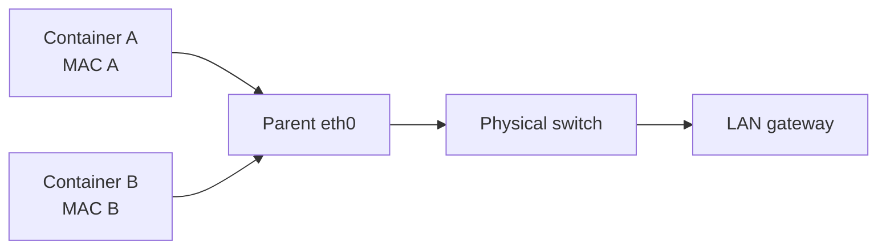

Macvlan gán MAC riêng cho interface của mỗi container, khiến endpoint xuất hiện với mạng vật lý như một thiết bị L2 độc lập. Driver này hữu ích cho appliance/legacy workload cần địa chỉ trên LAN hoặc cần quan sát traffic theo cách bridge/NAT không đáp ứng.



## Khi nào dùng và không dùng

Dùng khi:

- application yêu cầu xuất hiện trực tiếp trên broadcast domain;
- network appliance cần MAC/IP riêng;
- migration từ VM/physical appliance phụ thuộc L2;
- VLAN integration đã được NetOps cấp subnet, gateway và trunk.

Không dùng chỉ để tránh `-p`. User-defined bridge đơn giản hơn, portable hơn và giảm số MAC mà switch phải học.

## Platform và hạ tầng

Macvlan:

- chỉ hỗ trợ Linux host;
- không hỗ trợ Docker Desktop Mac/Windows, Windows Engine hoặc rootless mode;
- thường bị cloud provider chặn vì virtual NIC không chấp nhận nhiều source MAC;
- yêu cầu switch/NIC path chấp nhận nhiều MAC, thường liên quan promiscuous mode;
- có thể gây “VLAN spread” và CAM table pressure khi endpoint quá nhiều.

<Callout type="warn" title="Phối hợp với NetOps">
  Không tự chọn subnet LAN hoặc static IP. Reserve pool ngoài DHCP, khai báo gateway/VLAN đúng và xác minh switch port cho phép nhiều MAC trước khi tạo network.
</Callout>

## Host không giao tiếp trực tiếp với container

Linux macvlan mặc định không cho parent host interface giao tiếp trực tiếp với macvlan child endpoint. Vì vậy container có thể gọi gateway/máy khác nhưng không gọi IP của chính Docker host qua parent path.

Các lựa chọn có chủ đích:

- nối container thêm một bridge network để quản trị từ host;
- tạo macvlan interface trên host, gán IP riêng trong subnet và route pool container qua interface đó;
- đặt management service ở một máy khác trên LAN.

Không thêm route ngẫu nhiên vào parent interface; restriction nằm ở macvlan datapath, không chỉ route table.

## Tạo network bridge mode

Thay giá trị bằng hạ tầng thật:

```bash
docker network create --driver macvlan \
  --subnet 192.168.50.0/24 \
  --ip-range 192.168.50.128/25 \
  --gateway 192.168.50.1 \
  --aux-address 'router=192.168.50.1' \
  --opt parent=eth0 \
  macvlan50
```

`--ip-range` giới hạn pool Docker cấp. Dùng `--aux-address` reserve địa chỉ đã thuộc router/DNS/thiết bị khác. Docker IPAM không biết DHCP lease ngoài hệ thống nếu bạn không tách pool.

Chạy endpoint:

```bash
docker run -d --name macvlan-demo \
  --network macvlan50 \
  alpine:3.23 sleep 1d
```

Quan sát:

```bash
docker inspect macvlan-demo \
  --format '{{json .NetworkSettings.Networks}}'
docker exec macvlan-demo ip -br address
docker exec macvlan-demo ip route
```

Chỉ chạy lab nếu subnet/gateway/parent là thật và đã được cấp. Snippet `192.168.50.0/24` không phải topology dùng được ở mọi host.

## 802.1Q trunk

Nếu parent có dạng `eth0.50`, Docker hiểu đây là sub-interface VLAN 50 và có thể tạo nó:

```bash
docker network create --driver macvlan \
  --subnet 192.168.50.0/24 \
  --gateway 192.168.50.1 \
  --opt parent=eth0.50 \
  macvlan-vlan50
```

Switch port nối host phải trunk/tag VLAN 50; upstream gateway phải nằm trong VLAN/subnet đúng. Nếu interface đã được OS/network manager quản lý, cân nhắc pre-create và quản lý lifecycle ngoài Docker để tránh ownership không rõ.

## Macvlan modes

| Mode | Ý nghĩa khái quát |
|---|---|
| `bridge` | Child endpoints trên cùng parent có thể giao tiếp trực tiếp; mặc định |
| `private` | Cô lập child endpoints với nhau |
| `vepa` | Traffic giữa endpoints đi ra external switch, cần switch support phù hợp |
| `passthru` | Gắn đặc biệt một endpoint với physical behavior hạn chế |

Chọn bằng:

```bash
docker network create -d macvlan \
  -o parent=eth0 \
  -o macvlan_mode=private \
  --subnet 192.168.60.0/24 \
  private-macvlan
```

Mode khác `bridge` là quyết định network architecture, cần lab với switch thật.

## So sánh Macvlan và IPvlan L2

| Tiêu chí | Macvlan | IPvlan L2 |
|---|---|---|
| MAC phía external network | Một MAC mỗi endpoint | Dùng parent MAC cho nhiều endpoint IP |
| Switch CAM pressure | Cao hơn | Thấp hơn |
| Legacy app cần MAC riêng | Phù hợp hơn | Không phù hợp |
| Host-parent reachability | Bị hạn chế mặc định | Cũng bị kernel filter theo design |
| IP/VLAN planning | Bắt buộc | Bắt buộc |

Đọc [IPvlan network](/docs/networking/ipvlan/) trước khi chọn.

## Troubleshooting theo lớp

1. `docker network inspect`: subnet, pool, gateway, parent, mode.
2. `ip link show eth0` hoặc sub-interface: parent có `UP` và đúng VLAN không.
3. Container `ip addr`, `ip route`, `ip neigh`: address/route/ARP ra sao.
4. Switch: trunk/access mode, VLAN allow-list, port security, MAC limit.
5. IPAM: duplicate IP hoặc overlap DHCP pool.
6. Capture cả parent và external switch path:

```bash
sudo tcpdump -ni eth0 'arp or icmp'
```

Host ping fail nhưng external peer ping được có thể là restriction bình thường, không phải gateway lỗi.

## Security và vận hành

- Mỗi container hiện diện trực tiếp trên LAN; host bridge firewall rules không bảo vệ path này.
- Áp policy tại endpoint, switch/VLAN, router và upstream firewall.
- Giới hạn pool, monitor duplicate IP/MAC churn và CAM utilization.
- Không đặt untrusted workload vào management VLAN.
- Dùng DHCP chỉ khi solution đã được thiết kế; Docker IPAM mặc định cấp địa chỉ, không phối hợp DHCP server.

## Cleanup

```bash
docker rm -f macvlan-demo 2>/dev/null || true
docker network rm macvlan50 macvlan-vlan50 private-macvlan 2>/dev/null || true
```

## Nguồn chính thức

- [Macvlan network driver](https://docs.docker.com/engine/network/drivers/macvlan/)
- [docker network create](https://docs.docker.com/reference/cli/docker/network/create/)
