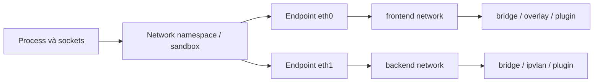
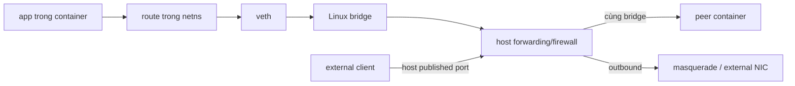

Docker network object không phải một “switch ảo” giống nhau trên mọi platform. Nó là contract để driver tạo connectivity; implementation thực tế phụ thuộc driver, host OS, Docker Desktop VM, rootless mode và firewall backend.



## Namespace, network và endpoint

| Khái niệm | Trả lời câu hỏi |
|---|---|
| Network namespace | Process thấy interface, route, socket/port space và firewall state nào? |
| Docker network | Nhóm endpoint nào chia sẻ connectivity policy do driver triển khai? |
| Endpoint | Container nối vào một network bằng interface/address/alias nào? |
| Driver | Data plane được dựng bằng bridge, host stack, VXLAN hay physical parent ra sao? |
| IPAM | Subnet, gateway và địa chỉ endpoint được cấp thế nào? |

Một container có thể có nhiều endpoint trên nhiều network. Container lifecycle và network lifecycle độc lập: xóa container gỡ endpoint, nhưng user-defined network vẫn tồn tại cho tới khi bị xóa.

Đọc [Linux namespaces](/docs/nen-tang-container/linux-namespaces/) để hiểu network namespace ở cấp kernel.

## Luồng packet trên user-defined bridge



Đây là mental model cho Linux Engine rootful phổ biến, không phải API guarantee. Không hard-code tên `veth`, bridge `br-*` hay chain nội bộ vào automation trừ khi bạn đang vận hành integration phụ thuộc rõ ràng vào implementation đó.

## IPAM và subnet

Nếu không truyền `--subnet`, Docker chọn một subnet không trùng với các prefix host mà nó nhận biết từ default address pools. Điều này không bảo đảm không xung đột với mọi mạng phía sau VPN, route động hoặc remote site.

Tạo network có subnet rõ ràng:

```bash
docker network create \
  --subnet 172.30.10.0/24 \
  --ip-range 172.30.10.128/25 \
  --gateway 172.30.10.1 \
  app-net
```

Ý nghĩa:

- `--subnet`: prefix của network;
- `--ip-range`: pool con dùng cấp động cho endpoint;
- `--gateway`: gateway endpoint nhận;
- `--aux-address`: giữ lại địa chỉ không được IPAM cấp.

<Callout type="warn" title="Tránh IP overlap">
  Prefix Docker trùng với LAN, VPN, VPC hoặc mạng remote tạo lỗi route khó đoán: packet có thể bị xem là connected route và không đi vào VPN. Lập kế hoạch `default-address-pools` trước khi có nhiều network.
</Callout>

Ví dụ daemon config chia một `/16` thành các network `/24`:

```json
{
  "default-address-pools": [
    { "base": "172.30.0.0/16", "size": 24 }
  ]
}
```

Thay đổi `/etc/docker/daemon.json` cần validate và restart daemon; network hiện có không tự đổi subnet.

## Route và default gateway

Trong container, kernel dùng route table như mọi Linux process:

```bash
docker exec CONTAINER ip route
```

- destination thuộc connected prefix đi qua interface tương ứng;
- destination khác đi qua default gateway;
- DNS resolution không quyết định route;
- publish port không đổi route outbound của application.

Khi container nối nhiều network, Docker chọn default gateway và lựa chọn có thể đổi khi endpoint được thêm/gỡ. Dùng gateway priority thay vì dựa vào thứ tự ngẫu nhiên:

```bash
docker run -d --name multi-net \
  --network name=egress-net,gw-priority=1 \
  --network backend-net \
  alpine:3.23 sleep 1d
```

Hoặc với container đang chạy:

```bash
docker network connect --gw-priority 1 egress-net multi-net
```

## DNS và identity

Trên user-defined network, Docker embedded DNS chạy tại `127.0.0.11` trong container view và resolve name/alias trong network scope. Nó forward query bên ngoài đến upstream DNS của host/configuration.

Hostname, container name, network alias và IP không đồng nghĩa:

| Giá trị | Scope/đặc điểm |
|---|---|
| Hostname | Tên process thấy cho chính container; không tự tạo global DNS record |
| Container name | Có thể resolve từ peer trên cùng user-defined network |
| Network alias | Tên bổ sung, chỉ trong network được gán |
| Container IP | Gắn với endpoint; có thể đổi khi recreate |
| Published host address | Entry point từ host/mạng ngoài, không phải service name nội bộ |

## Network lifecycle

Các thao tác chính:

```bash
docker network create app-net
docker network connect --alias api app-net api-v2
docker network disconnect app-net api-v2
docker network inspect app-net
docker network rm app-net
```

Network không thể xóa khi còn active endpoint. `docker network prune` chỉ dựa vào reference hiện tại, không biết network có còn cần cho deployment đang dừng hay không.

Khi container stop rồi start, Docker nối lại các network đã cấu hình. Static IP có thể làm start thất bại nếu địa chỉ không còn available; nếu thực sự cần static IP, tách dynamic `--ip-range` và vùng reserved rõ ràng.

## Internal network không giống `none`

```bash
docker network create --internal backend-only
```

Container cùng `backend-only` vẫn giao tiếp và resolve tên nhau. Network không có default route ra ngoài; host/gateway behavior còn phụ thuộc driver và gateway mode. Ngược lại, `--network none` không nối container vào Docker network nào và chỉ để lại loopback.

## Lab: quan sát multi-network

```bash
docker network create model-front
docker network create --internal model-back
docker run -d --name model-app \
  --network model-front \
  alpine:3.23 sleep 1d
docker network connect --alias app-internal model-back model-app
```

Inspect Docker state:

```bash
docker inspect model-app \
  --format '{{range $n, $v := .NetworkSettings.Networks}}{{println $n $v.IPAddress $v.Gateway $v.Aliases}}{{end}}'
```

Inspect effective state:

```bash
docker exec model-app ip -br address
docker exec model-app ip route
docker exec model-app cat /etc/resolv.conf
```

Đừng kỳ vọng interface name phản ánh Docker network name. Hãy map bằng IP/subnet và `inspect`.

## Thiết kế network theo trust boundary

- Mỗi application/project dùng user-defined network riêng.
- Chỉ nối service vào network chứa peer thực sự cần.
- Đặt reverse proxy vào frontend và application network; không nối database vào frontend.
- Không dùng static IP như service identity nếu DNS name đủ.
- Xác định egress route khi multi-homing.
- Dùng authentication/TLS; network membership không chứng minh workload identity.
- Quản lý network bằng Compose/IaC thay vì thao tác tay ở production.

## Cleanup

```bash
docker rm -f model-app 2>/dev/null || true
docker network rm model-front model-back app-net 2>/dev/null || true
```

## Nguồn chính thức

- [Networking overview](https://docs.docker.com/engine/network/)
- [docker network create](https://docs.docker.com/reference/cli/docker/network/create/)
- [docker network connect](https://docs.docker.com/reference/cli/docker/network/connect/)
- [Container networking](https://docs.docker.com/engine/network/)
