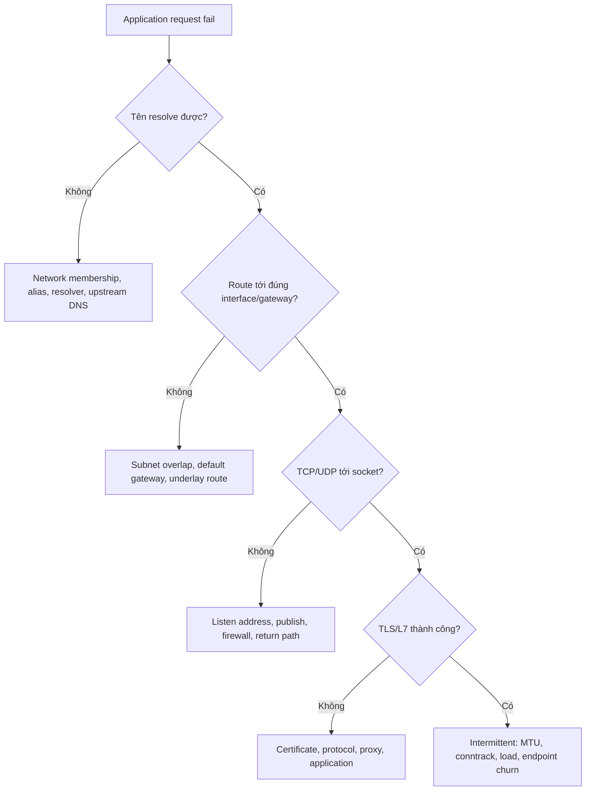

Network incident dễ bị kéo dài khi mọi lỗi đều bị gọi là “Docker DNS” hoặc “firewall”. Tách packet path thành lớp và xác định điểm cuối cùng còn hoạt động.



<Callout type="warn" title="Giữ evidence trước khi thay đổi">
  Không restart daemon, recreate container, flush firewall hoặc prune network trước khi capture inspect, routes, sockets, resolver và counters. Những thao tác đó thay endpoint IP/rules và xóa trạng thái cần chẩn đoán.
</Callout>

## 1. Xác định scope và timeline

Ghi rõ:

- source container/host/client nào;
- destination name, IP, port, protocol;
- IPv4 hay IPv6;
- tất cả request hay chỉ payload lớn/long-lived connection;
- bắt đầu sau deploy, VPN connect, firewall reload, daemon upgrade hay node move nào;
- một container, một network, một host hay toàn cluster.

Capture Docker state:

```bash
mkdir -p network-incident

docker version > network-incident/docker-version.txt
docker info > network-incident/docker-info.txt
docker ps --all --no-trunc > network-incident/containers.txt
docker network ls > network-incident/networks.txt
docker inspect CLIENT SERVER > network-incident/containers-inspect.json
docker network inspect NETWORK > network-incident/network-inspect.json
docker events --since '30m' --until '0s' > network-incident/events.txt
```

Inspect có thể chứa environment, labels và internal addresses; redact trước khi chia sẻ, không commit bundle.

## 2. Xác minh network membership

```bash
docker inspect CLIENT \
  --format '{{range $n, $v := .NetworkSettings.Networks}}{{println $n $v.IPAddress $v.GlobalIPv6Address $v.Gateway $v.Aliases}}{{end}}'

docker inspect SERVER \
  --format '{{range $n, $v := .NetworkSettings.Networks}}{{println $n $v.IPAddress $v.GlobalIPv6Address $v.Gateway $v.Aliases}}{{end}}'
```

Hai container muốn dùng service name phải share user-defined network/overlay phù hợp. Kiểm tra `docker network inspect NETWORK` để phát hiện stale/missing endpoint.

Nếu container multi-home, xem effective routes:

```bash
docker exec CLIENT ip -br address
docker exec CLIENT ip route
docker exec CLIENT ip -6 route
```

Subnet Docker overlap VPN/LAN có thể làm kernel chọn connected route sai. Dùng:

```bash
docker exec CLIENT ip route get DESTINATION_IP
```

## 3. Tách DNS khỏi connectivity

```bash
docker exec CLIENT cat /etc/resolv.conf
docker exec CLIENT cat /etc/hosts
docker exec CLIENT nslookup SERVICE_NAME
docker exec CLIENT nslookup example.com
```

Phân loại:

- internal fail, external được: membership/name/alias scope;
- internal được, external fail: upstream DNS/VPN/firewall;
- CLI lookup được, application fail: cache/search domain/resolver library;
- name ra IP đúng nhưng request fail: chuyển sang route/socket, không tiếp tục sửa DNS.

Known IP chỉ dùng để phân lớp. Không hard-code IP làm permanent fix.

## 4. Xác minh server socket

Trong server:

```bash
docker exec SERVER ss -lntup
docker exec SERVER ps
```

Cần đúng protocol, port và listen address. `127.0.0.1:8080` chỉ nhận connection cùng namespace; peer bridge cần server listen container interface, thường `0.0.0.0:8080` hoặc `[::]:8080`.

Test loopback trong server rồi test từ peer:

```bash
docker exec SERVER wget -S -O- http://127.0.0.1:PORT/
docker exec CLIENT wget -S -O- http://SERVICE_NAME:PORT/
```

Nếu image không có tool, chạy ephemeral debug container trên **cùng network** thay vì cài package vào production container:

```bash
docker run --rm -it --network NETWORK nicolaka/netshoot
```

Pin/approve debug image theo policy; tool container có network visibility tương ứng membership của nó.

## 5. Published port path

```bash
docker port SERVER
docker inspect SERVER --format '{{json .NetworkSettings.Ports}}'
sudo ss -lntup
```

Kiểm tra:

- host IP bind là loopback, interface cụ thể hay all addresses;
- host port có đúng không;
- TCP/UDP có nhầm không;
- application container port có đúng không;
- host port conflict có xuất hiện trong daemon/container create error không.

Test theo boundary:

```bash
# Container-to-container: dùng container port
docker exec CLIENT wget -S -O- http://SERVICE:CONTAINER_PORT/

# Host-to-container: dùng published host port
curl -v http://127.0.0.1:HOST_PORT/

# Remote-to-host: chạy từ máy thật bên ngoài
curl -v http://HOST_ADDRESS:HOST_PORT/
```

Nếu host được nhưng remote fail, tập trung host bind, firewall, security group, load balancer và upstream route.

## 6. Firewall, NAT và forwarding

Xác định backend trước:

```bash
docker info
sudo iptables -S
sudo iptables -t nat -S
sudo nft list ruleset
sysctl net.ipv4.ip_forward net.ipv6.conf.all.forwarding
```

Với iptables backend, xem `DOCKER-USER` counters:

```bash
sudo iptables -nvL DOCKER-USER --line-numbers
sudo iptables -nvL FORWARD --line-numbers
sudo iptables -t nat -nvL --line-numbers
```

Counter tăng ở drop rule chỉ ra policy; counter không tăng có thể nghĩa packet đi interface/address family/chain khác. UFW `INPUT` không nhất thiết thấy Docker DNAT forwarding traffic.

Không chạy:

```text
iptables -F
nft flush ruleset
```

trên host đang vận hành. Việc này có thể expose services, ngắt SSH và phá Docker networking.

## 7. Capture packet tại nhiều điểm

Trên host Linux:

```bash
sudo tcpdump -ni any 'host DESTINATION_IP and port PORT'
```

Capture cụ thể external NIC và bridge giúp biết packet biến mất trước hay sau forwarding. Để capture trong container namespace bằng host tool:

```bash
PID=$(docker inspect --format '{{.State.Pid}}' CLIENT)
sudo nsenter -t "$PID" -n tcpdump -ni any 'port PORT'
```

`nsenter`/`tcpdump` cần quyền cao và có thể capture dữ liệu nhạy cảm. Giới hạn filter, duration, file access và retention.

Đọc TCP flags:

- SYN đi, không SYN-ACK: drop, route hoặc server không response;
- RST: endpoint/path chủ động reject hoặc không có listener;
- handshake xong rồi treo: TLS/L7/MTU/flow control;
- request tới server, response không về client: return route, NAT/conntrack/asymmetry.

## 8. MTU và Path MTU

Dấu hiệu:

- ping nhỏ thành công nhưng download/TLS treo;
- chỉ xảy ra qua VPN, overlay hoặc cloud tunnel;
- retransmission tăng, large response fail.

Quan sát:

```bash
docker exec CLIENT ip link
docker network inspect NETWORK --format '{{json .Options}}'
ip link
```

Test không fragment với payload tăng dần khi ICMP được phép:

```bash
ping -M do -s 1400 DESTINATION_IP
```

Giá trị payload phụ thuộc IPv4/IPv6 header. Không coi một ping thành công là MTU proof cho mọi path. ICMP/ICMPv6 cần thiết cho PMTUD; firewall drop thông báo “packet too big/fragmentation needed” gây black hole.

## 9. Overlay, Macvlan và IPvlan

### Overlay

```bash
docker node ls
docker service ps SERVICE --no-trunc
ss -lunp | grep 4789
```

Kiểm tra `2377/tcp`, `7946/tcp+udp`, `4789/udp`, advertise/data-path address, node state, VXLAN MTU và encrypted-network compatibility.

### Macvlan/IPvlan L2

```bash
ip -d link show PARENT
docker exec CONTAINER ip neigh
sudo tcpdump -ni PARENT 'arp or icmp or icmp6'
```

Kiểm tra switch VLAN/trunk, port-security/MAC limit, duplicate IP, DHCP overlap. Host không giao tiếp trực tiếp với child qua parent có thể là behavior kernel bình thường.

### IPvlan L3

Kiểm tra upstream route tới container prefix, reverse path và firewall forwarding. External request tới được container nhưng response đi default route khác là asymmetric routing.

## 10. Conntrack và resource pressure

High connection churn có thể làm đầy conntrack:

```bash
sysctl net.netfilter.nf_conntrack_count
sysctl net.netfilter.nf_conntrack_max
sudo conntrack -S 2>/dev/null || true
```

Không tăng limit vô hạn. Tìm connection leak, timeout profile, NAT fan-out và memory cost. Kiểm tra host CPU/softirq, NIC drops và daemon logs:

```bash
ip -s link
journalctl -u docker.service --since '30 minutes ago'
```

## Error map nhanh

| Error/triệu chứng | Bắt đầu ở đâu |
|---|---|
| `NXDOMAIN` | Shared network, alias, resolver/upstream |
| `No route to host` | Route table, subnet overlap, gateway, reject rule |
| `Connection refused` | Listen address/port, process state, reject |
| Timeout | Firewall drop, route/return path, wrong IP, MTU |
| Host được, remote fail | Bind address, host/cloud firewall, route |
| Small packet được, large fail | MTU/PMTUD/VPN/overlay |
| Intermittent sau recreate | DNS cache, stale connection, endpoint churn |
| Chỉ một node fail | Node firewall, underlay, MTU, daemon state |

## Sau khi sửa: chứng minh recovery

1. DNS trả identity đúng.
2. Route chọn interface/gateway đúng.
3. Server listen đúng address/port/protocol.
4. East-west và north-south test thành công theo yêu cầu.
5. IPv4/IPv6 và TCP/UDP liên quan đều được test.
6. Firewall counters/log không còn unexpected drop.
7. Recreate/restart container không làm lỗi quay lại.
8. Metrics packet loss, latency, retransmit và error rate về baseline.
9. Ghi root cause, rollback và preventive action; xóa capture nhạy cảm theo policy.

## Nguồn chính thức

- [Docker networking overview](https://docs.docker.com/engine/network/)
- [Packet filtering and firewalls](https://docs.docker.com/engine/network/packet-filtering-firewalls/)
- [Docker daemon logs](https://docs.docker.com/engine/daemon/logs/)
- [docker network inspect](https://docs.docker.com/reference/cli/docker/network/inspect/)
