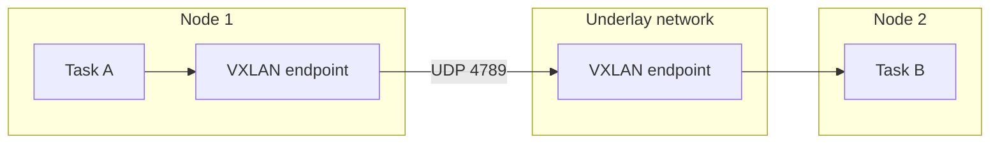

Overlay driver tạo network phân tán phủ lên underlay giữa nhiều Docker daemon. Docker Swarm quản lý membership và endpoint; data plane thường encapsulate packet bằng VXLAN để đưa traffic tới node chứa destination task.



Overlay không phải lựa chọn mặc định cho standalone container trên một host. Mọi participating host phải tham gia cùng swarm, kể cả khi chỉ nối standalone containers.

## Prerequisite và port

| Port | Vai trò |
|---|---|
| `2377/tcp` | Swarm control plane, mặc định |
| `7946/tcp` và `7946/udp` | Node discovery/communication |
| `4789/udp` | Overlay data path, mặc định |

Mở các port này **giữa swarm nodes tin cậy**, không expose control plane ra Internet. Cloud security group, host firewall, NAT và MTU underlay đều phải nhất quán.

<Callout type="warn" title="Không nhầm control plane với data encryption">
  Swarm control traffic được bảo vệ theo cơ chế Swarm, nhưng application data trên overlay không tự được encrypt chỉ vì cluster đã dùng TLS. Tạo network với `--opt encrypted` nếu cần IPsec cho VXLAN data path và đo performance impact.
</Callout>

## Service network và attachable network

Tạo overlay cho Swarm services:

```bash
docker network create --driver overlay app-overlay
```

Standalone container chỉ được attach nếu network có `--attachable`:

```bash
docker network create \
  --driver overlay \
  --attachable \
  debug-overlay
```

`--attachable` tăng bề mặt truy cập: user có quyền chạy container trên node có thể nối workload tùy ý vào network. Không bật chỉ để tiện debug mà thiếu access control.

## Lab single-node Swarm

Lab thay đổi node thành swarm manager. Không chạy trên production host chỉ để thử.

```bash
docker swarm init

docker network create \
  --driver overlay \
  --attachable \
  overlay-lab
```

Chạy hai standalone containers:

```bash
docker run -d --name overlay-web \
  --network overlay-lab \
  nginx:1.29-alpine

docker run --rm --network overlay-lab alpine:3.23 \
  wget -qO- http://overlay-web/
```

Inspect:

```bash
docker network inspect overlay-lab
docker info --format '{{.Swarm.LocalNodeState}}'
```

Trên multi-node cluster, chạy containers trên hai node khác nhau để thực sự test underlay/VXLAN. Single-node chỉ kiểm tra object, attachability và local path.

## Swarm service discovery

Service trên overlay có thể dùng:

- VIP endpoint mode: DNS trả virtual IP và Swarm load-balance tới task;
- DNS round-robin (`dnsrr`): DNS trả task addresses, client/external load balancer chọn endpoint.

Không hard-code task IP vì task được reschedule/replaced. Dùng service name và hiểu connection reuse: DNS/load-balancing không bảo đảm mỗi request đi task khác nếu client giữ TCP connection.

Docker khuyến nghị overlay subnet `/24` với VIP endpoint mode. Nếu cần nhiều endpoint, cân nhắc nhiều network nhỏ hoặc `dnsrr` cùng load balancer phù hợp, không chỉ mở rộng subnet mù quáng.

## Publish service port

Swarm có hai publish modes:

| Mode | Packet path | Khi dùng |
|---|---|---|
| `ingress` | Routing mesh nhận trên mọi node và chuyển tới task | Entry point đồng nhất trên cluster |
| `host` | Chỉ bind node chạy task | Muốn external load balancer biết task/node locality |

Ví dụ routing mesh:

```bash
docker service create \
  --name overlay-nginx \
  --network app-overlay \
  --replicas 2 \
  --publish published=8080,target=80 \
  nginx:1.29-alpine
```

Publish mode và application overlay là hai lớp khác nhau: overlay cho east-west task traffic; ingress/host publish xử lý north-south entry.

## Encryption và MTU

Tạo encrypted overlay:

```bash
docker network create \
  --driver overlay \
  --opt encrypted \
  secure-overlay
```

Encryption dùng IPsec ở VXLAN level và có performance cost. Overlay encapsulation cũng giảm effective MTU. Nếu packet nhỏ chạy nhưng TLS/response lớn treo:

1. đo underlay path MTU giữa node data-path addresses;
2. kiểm tra VPN/cloud encapsulation bổ sung;
3. capture packet trên underlay và VXLAN interface;
4. cấu hình network MTU phù hợp, rồi retest TCP/UDP.

Encrypted overlay không hỗ trợ đúng cho Windows container; Docker cảnh báo không attach Windows workload vào network này.

## Failure domains và quan sát

```bash
docker node ls
docker service ps SERVICE --no-trunc
docker network inspect NETWORK
ss -lunp | grep 4789
journalctl -u docker.service --since '30 minutes ago'
```

Kiểm tra từng lớp:

- swarm node `Ready` và advertise/data-path address đúng;
- firewall cho control/gossip/VXLAN theo cả hai chiều;
- overlay object tồn tại đúng scope;
- task thực sự attach network;
- service DNS/VIP hoặc `dnsrr` đúng;
- MTU và underlay route không asymmetric;
- encryption/platform compatibility.

## Production guidance

- Tách overlay theo application/trust zone, không dùng một network cluster-wide cho mọi service.
- Không expose `2377`, `7946`, `4789` công khai.
- Chọn advertise address/data-path address rõ trên host nhiều NIC.
- Benchmark encrypted network với traffic profile thật.
- Monitor IP exhaustion, task churn, node health và packet loss.
- Dùng TLS/auth ở application; overlay encryption không cung cấp service identity end-to-end.
- Giữ overlay nhỏ; Docker ghi nhận instability khi khoảng 1000 containers cùng nối một overlay trên một host.

## Cleanup lab

```bash
docker rm -f overlay-web 2>/dev/null || true
docker service rm overlay-nginx 2>/dev/null || true
docker network rm overlay-lab app-overlay secure-overlay 2>/dev/null || true
docker swarm leave --force
```

Chỉ `swarm leave --force` nếu node được tạo riêng cho lab và không thuộc cluster cần giữ.

## Nguồn chính thức

- [Overlay network driver](https://docs.docker.com/engine/network/drivers/overlay/)
- [Manage Swarm service networks](https://docs.docker.com/engine/swarm/networking/)
- [docker network create](https://docs.docker.com/reference/cli/docker/network/create/)
