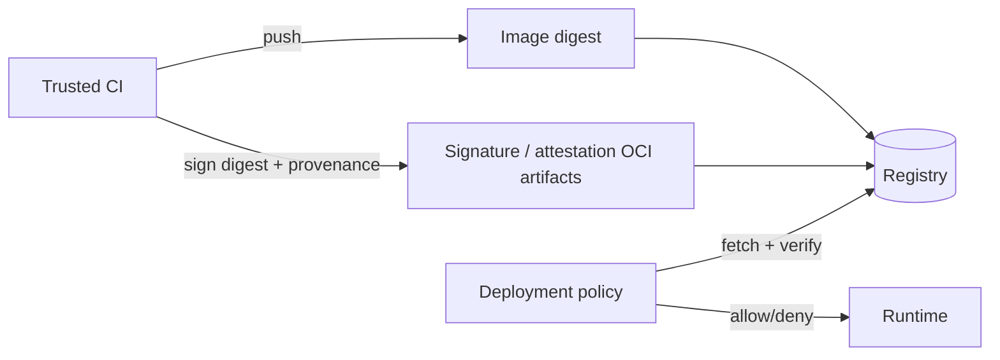

Content trust trả lời câu hỏi khó hơn “bytes có đúng digest không?”: artifact này do identity nào phát hành, qua quy trình nào, và policy có cho phép dùng không?

Docker Content Trust (DCT) là cơ chế cũ dựa trên The Update Framework và Notary v1 để ký tag. DCT đang được Docker cho nghỉ hưu; Notary v1 service tại `notary.docker.io` được công bố sẽ dừng ngày **8 tháng 12 năm 2026**. Không thiết kế hệ thống mới phụ thuộc DCT và phải migration workload cũ trước mốc này.

<Callout type="error" title="DCT đang được retire">
  `DOCKER_CONTENT_TRUST=1` và `docker trust` là legacy workflow. Hãy inventory nơi còn dùng, chọn hệ sinh thái chữ ký OCI hiện đại và kiểm thử enforcement trước khi Notary v1 service dừng ngày 08/12/2026.
</Callout>

## Ba thuộc tính thường bị nhầm

| Cơ chế | Chứng minh được | Không tự chứng minh |
|---|---|---|
| TLS | Client đang nói chuyện với server có certificate được tin | Artifact do publisher nào tạo |
| Digest | Content nhận được khớp hash/reference | Ai ký, pipeline nào build, artifact an toàn không |
| Signature + policy | Key/identity đã ký digest và thỏa rule cụ thể | Image không có CVE hoặc runtime config an toàn |
| Provenance | Metadata về nguồn/build process theo schema | Metadata luôn đúng nếu không verify issuer/signature |
| SBOM | Danh sách component được khai báo/phát hiện | Component không có vulnerability/license risk |

Một supply chain thực tế cần phối hợp các control, không chọn một cơ chế thay tất cả.

## DCT hoạt động như thế nào?

DCT gắn trust metadata với **tag** trong repository. Publisher ký tag; consumer bật enforcement để chỉ làm việc với signed tag.

```bash
export DOCKER_CONTENT_TRUST=1
docker pull registry.example.com/team/api:1.4.2
```

Các command legacy gồm:

```bash
docker trust inspect --pretty registry.example.com/team/api:1.4.2
docker trust sign registry.example.com/team/api:1.4.2
```

DCT quản lý root key, repository/tagging key, delegation và server-managed timestamp key. Mất root key là sự cố nghiêm trọng; root key từng được khuyến nghị backup và giữ offline.

Phần này chỉ để nhận diện hệ thống cũ. Không dùng các command trên làm hướng dẫn triển khai mới.

## Tại sao cần migration?

Ngoài retirement của service, DCT/Notary v1 có các giới hạn vận hành:

- trust model gắn chặt với tag workflow;
- key management và recovery phức tạp;
- integration với OCI artifact/attestation hiện đại hạn chế;
- enforcement chủ yếu qua Docker CLI environment variable;
- ecosystem production hiện thường dùng registry artifact + external policy engine.

Một số pull Docker Official Images có thể lỗi nếu môi trường còn `DOCKER_CONTENT_TRUST=1` trong giai đoạn DCT không còn đáng tin cậy. Chẩn đoán:

```bash
printf 'DOCKER_CONTENT_TRUST=%s\n' "${DOCKER_CONTENT_TRUST:-unset}"
```

Unset chỉ giải quyết compatibility tạm thời:

```bash
unset DOCKER_CONTENT_TRUST
```

Không coi việc tắt enforcement là migration hoàn tất; phải thay bằng verification policy mới trước production deployment.

## Mô hình ký OCI hiện đại

Hai hệ sinh thái phổ biến:

| Hệ sinh thái | Hướng tiếp cận | Điểm cần quyết định |
|---|---|---|
| Sigstore Cosign | Ký OCI artifact bằng key hoặc keyless identity/transparency log | OIDC issuer/subject, online/offline verification, registry support |
| Notary Project / Notation | Ký OCI artifact theo Notary Project specifications | Trust store, trust policy, plugin/KMS và registry support |

Tool/version thay đổi nhanh hơn image distribution basics. Pin version tool, đọc tài liệu chính thức và test với registry của bạn. Registry phải giữ signature/attestation artifact trong retention, replication và backup; chỉ giữ image manifest nhưng xóa referrer có thể làm verification fail.



## Thiết kế policy trước khi chọn command

Policy phải trả lời cụ thể:

- registry/repository nào nằm trong scope;
- identity hoặc key nào được phép ký;
- issuer OIDC và subject/workflow nào được tin;
- digest phải có signature, provenance, SBOM nào;
- keyless verification có yêu cầu transparency log không;
- behavior khi registry, identity provider hoặc log không truy cập được;
- key rotation/revocation ảnh hưởng artifact cũ ra sao;
- emergency override do ai phê duyệt và được audit thế nào.

Rule “có bất kỳ signature nào thì cho chạy” gần như vô nghĩa: attacker có thể tự ký artifact của họ. Policy phải ràng buộc signer identity và repository/digest intended.

## Workflow release đề xuất

1. Build image một lần trong trusted CI.
2. Push exact release tag và ghi remote digest.
3. Scan/test artifact theo digest.
4. Tạo SBOM và provenance bằng toolchain được pin.
5. Ký **digest**, không ký một tag mutable rồi resolve lại sau.
6. Publish signature/attestation vào registry hỗ trợ.
7. Verify từ environment độc lập với credential pull-only.
8. Admission/deployment policy kiểm tra signer, issuer, repository và digest.
9. Promote cùng digest; không rebuild cho production.
10. Giữ image cùng security metadata suốt rollback/audit window.

## Kế hoạch migration khỏi DCT

### 1. Inventory

Tìm trong source, CI và runtime config:

```bash
grep -R "DOCKER_CONTENT_TRUST\|docker trust\|notary" \
  .github .gitlab-ci.yml Jenkinsfile scripts deploy 2>/dev/null || true
```

Tìm thêm secret/key backup, Notary server, delegation process và runbook thủ công.

### 2. Chọn trust model mới

Chọn Cosign hoặc Notation theo:

- registry support;
- orchestrator/admission integration;
- KMS/HSM/OIDC hiện có;
- online/offline requirements;
- multi-region/air-gap behavior;
- team ownership và incident response.

### 3. Chạy song song

Trong giai đoạn chuyển đổi:

- giữ DCT nếu workload cũ còn cần;
- publish signature mới cho cùng approved digest;
- verify cả hai ở staging;
- quan sát false positive, availability và latency;
- không chuyển production bằng cách chỉ unset DCT.

### 4. Chuyển enforcement

Bật policy mới ở audit mode trước, sau đó enforce theo environment. Có break-glass procedure ngắn hạn, approval nhiều bên và audit log.

### 5. Nghỉ hưu key/service cũ

Sau khi không còn consumer:

- xóa `DOCKER_CONTENT_TRUST` khỏi CI/runtime;
- revoke/archival key theo retention/compliance;
- xóa credential Notary cũ;
- cập nhật runbook và đào tạo operator;
- test disaster recovery của trust data mới.

## Failure mode cần test

- tag bị đổi sau khi ký digest;
- signature tồn tại nhưng signer sai;
- OIDC issuer đúng nhưng subject/workflow sai;
- signature/referrer bị retention xóa;
- registry replicate image nhưng không replicate signature;
- key bị revoke hoặc rotate;
- transparency log/identity provider unavailable;
- artifact multi-platform: ký index hay từng platform không nhất quán;
- air-gapped verification thiếu trust root/bundle.

## Nguồn chính thức

- [Content trust in Docker](https://docs.docker.com/engine/security/trust/)
- [Sigstore Cosign](https://docs.sigstore.dev/cosign/)
- [Notary Project](https://notaryproject.dev/)
- [Notation documentation](https://notaryproject.dev/docs/)
- [OCI Image Specification](https://github.com/opencontainers/image-spec)
