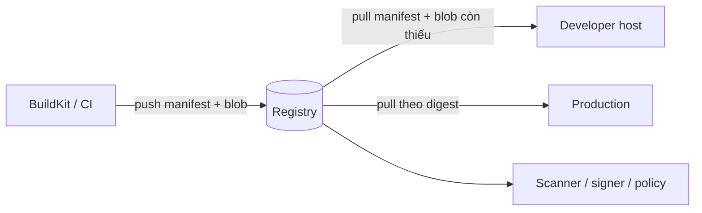
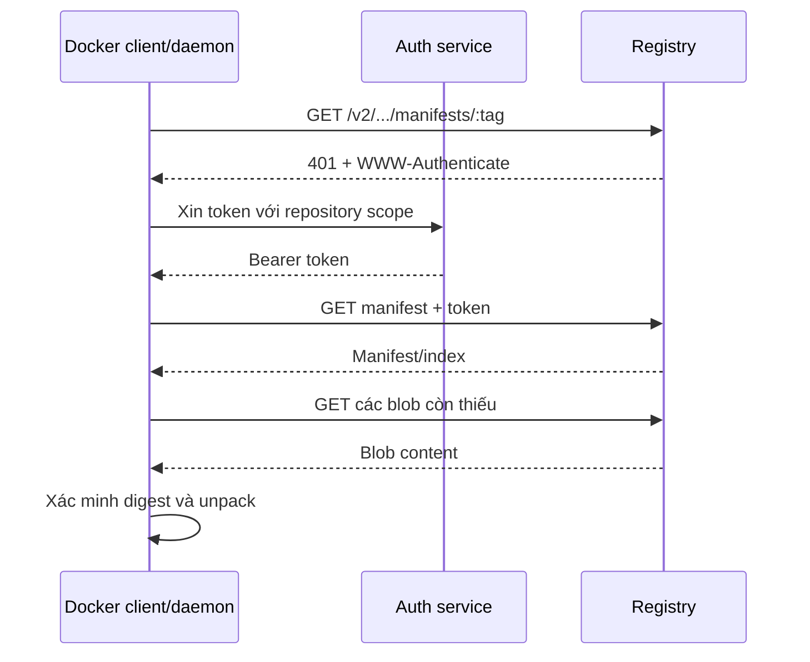

Container registry là dịch vụ lưu trữ và phân phối container image cùng các OCI artifact liên quan. Registry không lưu mỗi image như một file tar độc lập: nó quản lý manifest, image index và blob theo digest, nhờ đó nhiều image có thể dùng chung layer mà không lưu hoặc truyền lại dữ liệu giống nhau.



<Callout type="warn" title="Mental model">
  Registry là dịch vụ; repository là không gian chứa các version của một image; tag là con trỏ có thể thay đổi; digest là định danh content-addressed. Đừng dùng bốn khái niệm này thay thế cho nhau.
</Callout>

## Các thành phần cốt lõi

| Thành phần | Vai trò | Ví dụ |
|---|---|---|
| Registry | Endpoint phục vụ Distribution API | `registry.example.com` |
| Namespace | Phân vùng theo user, team hoặc organization | `payments` |
| Repository | Tập artifact có cùng tên logic | `payments/api` |
| Tag | Tên dễ đọc, thường là mutable reference | `1.4.2`, `stable` |
| Manifest | Mô tả config và các layer của một platform | `linux/amd64` manifest |
| Image index | Trỏ tới nhiều manifest theo platform | `linux/amd64`, `linux/arm64` |
| Blob | Nội dung content-addressed như layer/config | `sha256:...` |
| Digest | Hash xác định bytes của manifest hoặc blob | `sha256:...` |

Một reference đầy đủ thường có dạng:

```text
[REGISTRY[:PORT]/]NAMESPACE/REPOSITORY[:TAG][@DIGEST]
```

Ví dụ:

```text
registry.example.com/payments/api:1.4.2
registry.example.com/payments/api@sha256:<DIGEST>
```

Nếu bỏ registry, Docker mặc định resolve qua Docker Hub. Nếu bỏ tag, Docker dùng `latest`; đây chỉ là tên mặc định, không phải phép chọn version mới nhất.

## Registry lưu image như thế nào?

Một image đơn platform gồm manifest trỏ tới image config và danh sách layer:

```text
repository tag
      │
      ▼
manifest digest
  ├── image config digest
  ├── layer A digest
  ├── layer B digest
  └── layer C digest
```

Registry định danh blob theo digest. Nếu hai image tham chiếu cùng layer A, backend chỉ cần giữ một bản nội dung đó. Tuy nhiên retention, accounting và giao diện registry có thể tính dung lượng theo cách khác; đừng suy ra hóa đơn chỉ từ tổng kích thước layer hiển thị bởi CLI.

Với image đa nền tảng, tag thường trỏ tới image index:

```text
api:1.4.2 -> image index
               ├── linux/amd64 manifest -> config + layers
               └── linux/arm64 manifest -> config + layers
```

Docker Engine chọn manifest phù hợp platform khi pull. Dùng `docker buildx imagetools inspect` để xem remote index thay vì chỉ dựa vào local image store.

## Luồng pull



Client không cần tải lại layer đã có trong content store. Pull bằng tag trước hết resolve tag thành manifest hiện tại; pull bằng digest yêu cầu đúng manifest có digest đó.

## Luồng push

Khi push, client thường:

1. kiểm tra registry đã có từng blob chưa;
2. upload blob còn thiếu theo session có thể resume;
3. push config và manifest/index;
4. cập nhật tag tới manifest vừa push;
5. nhận digest của remote manifest.

Tag chỉ tồn tại local sau `docker tag` hoặc `docker build -t`. Registry không thay đổi cho tới khi push thành công. Với release quan trọng, CI phải ghi lại digest trả về và deploy digest đã qua kiểm tra.

## Registry không giải quyết mọi vấn đề

Registry cung cấp storage, distribution và thường có authentication/authorization, nhưng không mặc nhiên đảm bảo:

- image không có lỗ hổng;
- publisher đúng danh tính mong đợi;
- tag chưa bị ghi đè;
- artifact đã qua test hoặc approval;
- backup và disaster recovery đã hoạt động;
- retention không xóa artifact đang cần rollback.

Các control đó cần policy bổ sung: immutable tag, least-privilege token, vulnerability scanning, SBOM/provenance, chữ ký artifact, admission policy, audit log và backup được restore thử.

<Callout type="info" title="Digest không phải chữ ký">
  Digest phát hiện content bị thay đổi và cho phép pin đúng bytes. Nó không tự chứng minh ai đã publish artifact hoặc pipeline nào đã tạo artifact đó.
</Callout>

## Chọn loại registry

| Lựa chọn | Phù hợp khi | Trách nhiệm chính |
|---|---|---|
| Public managed registry | Phân phối public image, muốn vận hành tối thiểu | Quản lý account, token, namespace, limits |
| Private managed registry | Team cần IAM, scanning, replication, SLA tích hợp cloud | Policy, cost, network, retention, vendor behavior |
| Self-hosted Distribution | Air-gapped, yêu cầu kiểm soát storage/network đặc thù | TLS, auth, HA, backup, GC, upgrade, monitoring |
| Pull-through cache | Nhiều node pull cùng upstream content | Cache capacity, upstream limits, bảo vệ private content |

Self-host chỉ để “tránh phụ thuộc” có thể chuyển phụ thuộc thành gánh nặng vận hành. Chọn dựa trên RTO/RPO, region, egress, identity integration, policy và nhân lực trực vận hành.

## Bản đồ phần Registry và distribution

1. [Docker Hub](/docs/registry-va-distribution/docker-hub/) — repository, trusted content, token và giới hạn dịch vụ.
2. [Login, push và pull](/docs/registry-va-distribution/push-pull-login/) — workflow CLI an toàn.
3. [Image name, tag và digest](/docs/registry-va-distribution/image-names-tags-digests/) — resolution và immutable reference.
4. [Private registry](/docs/registry-va-distribution/private-registry/) — lab local và production boundary.
5. [Registry authentication](/docs/registry-va-distribution/registry-authentication/) — challenge/token, credential store và least privilege.
6. [Registry storage](/docs/registry-va-distribution/registry-storage/) — backend, HA, backup và capacity.
7. [Registry garbage collection](/docs/registry-va-distribution/registry-garbage-collection/) — delete, mark-and-sweep và runbook an toàn.
8. [Content trust](/docs/registry-va-distribution/content-trust/) — DCT retirement và mô hình ký artifact hiện đại.
9. [Registry mirrors](/docs/registry-va-distribution/registry-mirrors/) — pull-through cache và giới hạn.

## Nguồn chính thức

- [Docker Registry overview](https://docs.docker.com/get-started/docker-concepts/the-basics/what-is-a-registry/)
- [OCI Distribution Specification](https://github.com/opencontainers/distribution-spec)
- [OCI Image Specification](https://github.com/opencontainers/image-spec)
- [CNCF Distribution](https://distribution.github.io/distribution/)
