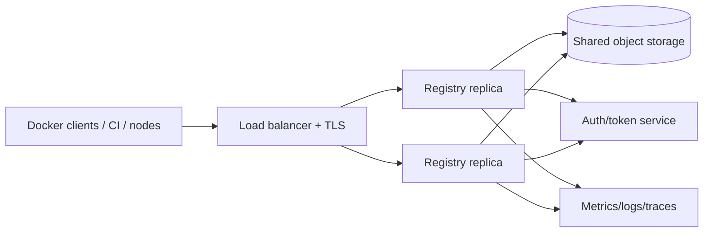

Private registry giữ image trong boundary do tổ chức kiểm soát. Use case phổ biến là image nội bộ, air-gapped environment, giảm phụ thuộc external registry và áp policy promotion/retention riêng.

CNCF Distribution cung cấp registry implementation chuẩn OCI. Chạy được một container `registry:3` rất dễ; vận hành production cần thêm TLS, authentication, durable storage, backup, monitoring, garbage collection và upgrade strategy.

## Lab local tối thiểu

Tạo volume và chạy registry trên loopback:

```bash
docker volume create registry-data

docker run --detach \
  --name registry-lab \
  --restart unless-stopped \
  --publish 127.0.0.1:5000:5000 \
  --volume registry-data:/var/lib/registry \
  --env OTEL_TRACES_EXPORTER=none \
  registry:3
```

Kiểm tra API:

```bash
curl --fail http://localhost:5000/v2/
```

Expected response là object JSON rỗng:

```json
{}
```

<Callout type="warn" title="Chỉ dành cho lab">
  Registry HTTP trên `localhost` không có authentication. Không publish port này ra LAN/Internet. Production phải dùng TLS từ CA được client tin cậy và access control phù hợp.
</Callout>

## Push và pull qua registry local

```bash
docker pull alpine:3.23
docker tag alpine:3.23 localhost:5000/lab/alpine:3.23
docker push localhost:5000/lab/alpine:3.23
```

Xóa local references để buộc pull từ registry:

```bash
docker image rm localhost:5000/lab/alpine:3.23 alpine:3.23
docker pull localhost:5000/lab/alpine:3.23
docker run --rm localhost:5000/lab/alpine:3.23 cat /etc/alpine-release
```

Xem log:

```bash
docker logs registry-lab
```

`localhost` được Docker xử lý thuận tiện cho development. Với hostname/IP khác qua plain HTTP, daemon mặc định yêu cầu HTTPS; đừng giải quyết production bằng cách thêm `insecure-registries`.

## Cấu hình bằng file

Khi option tăng, mount một `config.yml` dễ review hơn chuỗi environment variable dài:

```yaml
version: 0.1

log:
  level: info
  formatter: json

storage:
  filesystem:
    rootdirectory: /var/lib/registry
  delete:
    enabled: true

http:
  addr: 0.0.0.0:5000
  secret: REPLACE_WITH_A_LONG_RANDOM_VALUE
  headers:
    X-Content-Type-Options: [nosniff]
```

Chạy với config:

```bash
docker run --detach \
  --name registry-lab \
  --publish 127.0.0.1:5000:5000 \
  --volume "$(pwd)/config.yml:/etc/distribution/config.yml:ro" \
  --volume registry-data:/var/lib/registry \
  --env OTEL_TRACES_EXPORTER=none \
  registry:3
```

Không commit secret thật vào Git. Với cluster nhiều replica, mọi replica phải dùng cùng HTTP secret, storage backend và cache configuration tương thích.

## Kiến trúc production



| Thành phần | Yêu cầu |
|---|---|
| DNS/TLS | Stable hostname, valid chain, renewal và client trust được test |
| Authentication | SSO/token service hoặc cơ chế phù hợp; không Basic Auth qua HTTP |
| Authorization | Scope theo repository/action; tách pull, push, delete, admin |
| Storage | Durable, shared cho nhiều replica, có encryption và capacity plan |
| Load balancer | Giữ `Host`, `X-Forwarded-Proto`, API headers và upload behavior đúng |
| Observability | Access log, error rate, latency, upload failures, storage health |
| Lifecycle | Retention, manifest deletion, GC, backup/restore và rollback |

Endpoint `/v2/` của registry được bảo vệ có thể trả `401 Unauthorized` cùng `WWW-Authenticate`; đây có thể là trạng thái healthy. Health check load balancer phải hiểu behavior này thay vì yêu cầu mọi request `/v2/` trả `200`.

## TLS và CA

Có hai pattern:

1. registry tự terminate TLS;
2. reverse proxy/load balancer terminate TLS rồi kết nối registry qua network được bảo vệ.

Dù dùng pattern nào, external URL và forwarded headers phải đúng để registry không redirect client sang internal hostname hoặc hạ từ HTTPS xuống HTTP.

Với private CA, cài CA vào trust store Docker Engine theo tài liệu của platform. Self-signed leaf certificate và `insecure-registries` chỉ phù hợp lab tạm thời; chúng bỏ qua boundary xác thực server mà production cần.

## Authentication đơn giản bằng `htpasswd`

Distribution hỗ trợ `htpasswd` với bcrypt. Tạo file:

```bash
mkdir -p auth

docker run --rm --entrypoint htpasswd httpd:2 \
  -Bbn registryuser 'replace-this-password' > auth/htpasswd
```

Sau đó cấu hình `auth.htpasswd` và TLS. Password literal trên command line có thể lọt shell history/process list; trong production hãy dùng secret workflow và công cụ identity phù hợp. `htpasswd` hợp lab hoặc setup nhỏ, nhưng không cung cấp lifecycle, fine-grained repository ACL và audit tốt như token service/IAM tích hợp.

Đọc [Registry authentication](/docs/registry-va-distribution/registry-authentication/) trước khi chọn mô hình.

## Storage và HA

Filesystem driver phù hợp lab hoặc single-instance nhỏ. Nếu chạy nhiều replica mà mỗi replica dùng volume local, mỗi node có tập blob khác nhau và registry hỏng về mặt logic.

HA cần:

- tất cả replica dùng cùng supported object storage/shared backend;
- cùng HTTP secret;
- configuration đồng nhất;
- rolling upgrade được kiểm thử;
- backend latency/consistency phù hợp;
- garbage collection được phối hợp toàn cluster.

Chi tiết tại [Registry storage](/docs/registry-va-distribution/registry-storage/).

## Backup và disaster recovery

Backup registry không chỉ là giữ file cấu hình. Cần bảo vệ:

- storage backend chứa blob, manifest và link metadata;
- config, TLS/auth integration và secret cần thiết;
- policy/retention configuration;
- external database/index nếu sản phẩm registry bổ sung dùng chúng;
- danh sách release digest quan trọng.

Đặt RPO/RTO, dùng snapshot/versioning phù hợp và thực hiện restore drill sang hostname cô lập. Một backup chưa từng restore chỉ là giả định.

## Checklist production

- [ ] Pin version image registry; không phụ thuộc floating tag không kiểm soát.
- [ ] TLS chain và renewal alert hoạt động.
- [ ] Pull/push/delete dùng identity riêng và least privilege.
- [ ] Shared durable storage, encryption và quota được cấu hình.
- [ ] HTTP secret/cache đồng nhất giữa replica.
- [ ] Backup và restore drill đạt RPO/RTO.
- [ ] Retention không xóa artifact trong rollback window.
- [ ] GC có dry run, read-only window và rollback plan.
- [ ] Metrics/logs cảnh báo `5xx`, latency, disk/object errors và auth anomalies.
- [ ] Upgrade được test trên staging với representative image/index/attestation.

## Cleanup lab

Lệnh sau xóa registry container và toàn bộ dữ liệu lab trong volume:

```bash
docker container rm --force registry-lab
docker volume rm registry-data
```

Sau đó xóa local image nếu còn:

```bash
docker image rm localhost:5000/lab/alpine:3.23 2>/dev/null || true
```

## Nguồn chính thức

- [Deploy a registry server](https://distribution.github.io/distribution/about/deploying/)
- [Configure a registry](https://distribution.github.io/distribution/about/configuration/)
- [OCI Distribution Specification](https://github.com/opencontainers/distribution-spec)
- [Distribution releases](https://github.com/distribution/distribution/releases)
