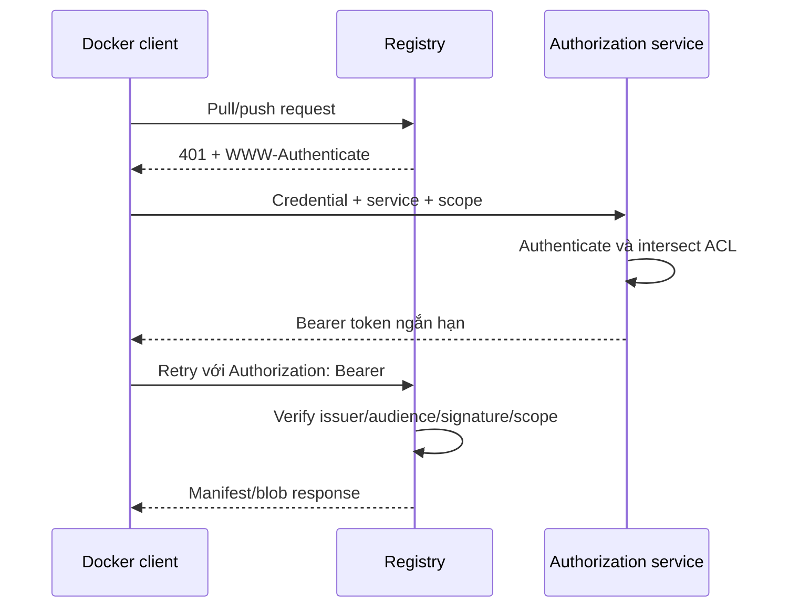

Registry authentication có hai phía cần phân biệt:

- client giữ credential dài hạn hoặc identity để xin quyền;
- registry chấp nhận request mang token ngắn hạn với scope repository/action phù hợp.

`docker login` lưu credential giúp client hoàn thành flow; nó không gửi password trong mọi request blob nếu registry dùng token authentication chuẩn.

## Luồng Bearer token



Challenge có dạng rút gọn:

```http
WWW-Authenticate: Bearer realm="https://auth.example.com/token",service="registry.example.com",scope="repository:team/api:pull,push"
```

| Trường | Ý nghĩa |
|---|---|
| `realm` | Token endpoint |
| `service` | Audience/service mà token dành cho |
| `scope` | Resource và action được yêu cầu |
| `repository:team/api:pull` | Chỉ pull repository cụ thể |
| `repository:team/api:pull,push` | Pull và push repository cụ thể |

Authorization server cấp giao của **quyền được yêu cầu** và **quyền identity thực có**. Token có thể hợp lệ nhưng thiếu `push`; request sau đó vẫn bị từ chối.

## Authentication khác authorization

| Câu hỏi | Cơ chế |
|---|---|
| Bạn là ai? | Password, PAT, OIDC, workload identity, client certificate |
| Bạn được làm gì? | Repository scope, role, team ACL, IAM policy |
| Artifact có đúng publisher không? | Signature và verification policy |
| Content có bị thay đổi không? | Digest verification |

Login thành công không chứng minh có quyền push. Pull thành công không chứng minh artifact đáng tin. Tránh gom mọi lỗi thành “auth lỗi”.

## Login cho developer

Docker Hub hiện có device-code flow mặc định khi chạy:

```bash
docker login
```

Private registry:

```bash
docker login registry.example.com
```

Registry address chỉ gồm hostname và port tùy chọn, không thêm path repository. Dùng PAT/token thay password account khi provider hỗ trợ, đặc biệt khi bật MFA.

## Login cho CI

```bash
set +x
printf '%s' "$REGISTRY_TOKEN" | \
  docker login registry.example.com \
  --username "$REGISTRY_USERNAME" \
  --password-stdin
```

CI identity nên:

- thuộc workload/service, không phụ thuộc account nhân viên;
- chỉ push repository/namespace cần thiết;
- không có delete/admin nếu job không cần;
- có expiration ngắn hoặc federation/OIDC nếu provider hỗ trợ;
- rotate và revoke được độc lập;
- không cấp cho untrusted pull request/fork;
- tách credential cache và release nếu policy khác nhau.

Cuối job:

```bash
docker logout registry.example.com
```

Logout không revoke remote token; rotate/revoke phải thực hiện ở provider nếu nghi lộ.

## Credential store và helper

Docker đọc cấu hình client từ `~/.docker/config.json` trên Linux/macOS hoặc `%USERPROFILE%/.docker/config.json` trên Windows.

Dùng credential store mặc định:

```json
{
  "credsStore": "pass"
}
```

Dùng helper riêng theo registry:

```json
{
  "credHelpers": {
    "registry.example.com": "secretservice",
    "registry.internal.example": "pass"
  }
}
```

Giá trị `pass` tương ứng binary `docker-credential-pass` trong `PATH`. Docker Desktop thường cấu hình native keychain sẵn.

Nếu không có helper, credential trong `config.json` có thể chỉ được base64 encode. Bảo vệ permission file vẫn cần thiết nhưng không tương đương encrypted secret store.

<Callout type="warn" title="Không copy toàn bộ ~/.docker">
  Copy `~/.docker/config.json` vào CI artifact, image build context hoặc home directory dùng chung có thể làm lộ credential nhiều registry. Tạo cấu hình tối thiểu theo job và dùng secret store của nền tảng.
</Callout>

## Basic Auth với self-hosted Distribution

`htpasswd` là phương án đơn giản:

```bash
mkdir -p auth
docker run --rm --entrypoint htpasswd httpd:2 \
  -Bbn alice 'replace-password' > auth/htpasswd
```

Distribution chỉ hỗ trợ bcrypt cho backend `htpasswd`. File được load khi registry start. Basic Auth phải đi qua TLS vì credential nằm trong HTTP Authorization header và chỉ được bảo vệ bởi transport encryption.

Hạn chế:

- lifecycle user thủ công;
- khó phân quyền repository/action chi tiết;
- khó tích hợp SSO/MFA;
- audit và rotation hạn chế;
- secret file cần phân phối an toàn tới replica.

Với tổ chức lớn, dùng delegated token service hoặc registry product tích hợp IAM thường phù hợp hơn.

## TLS là điều kiện nền

Authentication không an toàn nếu client không xác minh đúng registry server. Production cần:

- certificate khớp hostname;
- đầy đủ intermediate chain;
- private CA được cài đúng trust store daemon;
- renewal trước expiry và alert;
- reverse proxy giữ `Host`/`X-Forwarded-Proto` đúng;
- không dùng `insecure-registries` để né lỗi CA.

Lỗi `x509` là lỗi trust/TLS trước khi là lỗi username/token.

## Phân quyền theo workload

| Workload | Quyền tối thiểu thường cần |
|---|---|
| Developer consumer | Pull repository dev/base được phép |
| CI build | Pull base/cache, push build repository |
| Release promotion | Pull source digest, push/update release tag |
| Runtime node | Pull production repository |
| Retention/GC operator | Delete/admin riêng, có approval |
| Scanner | Pull manifest/blob và đọc metadata cần thiết |

Tách role làm giảm blast radius. Runtime node không cần push; CI feature branch không cần update `stable`; scanner không cần delete.

## Chẩn đoán

```bash
curl -i https://registry.example.com/v2/
```

Một registry được bảo vệ thường trả `401` và `WWW-Authenticate`. Kiểm tra theo thứ tự:

1. DNS/TLS có đúng không;
2. challenge `realm`, `service`, `scope` có hợp lệ không;
3. client có credential cho đúng hostname:port không;
4. token hết hạn hoặc clock skew không;
5. scope được cấp có chứa action cần thiết không;
6. reverse proxy có làm mất `Authorization` header không;
7. registry/auth service logs nói authentication hay authorization thất bại.

Không paste token thật vào ticket/log. Redact header và revoke token nếu đã lộ.

## Nguồn chính thức

- [`docker login`](https://docs.docker.com/reference/cli/docker/login/)
- [Distribution token authentication specification](https://distribution.github.io/distribution/spec/auth/token/)
- [Registry configuration: auth](https://distribution.github.io/distribution/about/configuration/#auth)
- [Docker credential helpers](https://github.com/docker/docker-credential-helpers)
