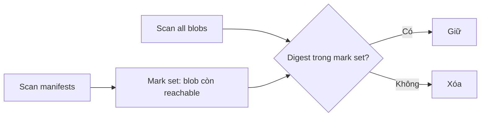

Registry garbage collection (GC) giải phóng blob không còn được manifest tham chiếu. Xóa tag hoặc manifest và thu hồi storage là các bước khác nhau; GC chỉ nên chạy sau khi retention policy đã chọn đúng artifact cần loại bỏ.

## Tại sao xóa tag chưa giải phóng dung lượng?

```text
Tag A ──> Manifest 1 ──> Layer X, Layer Y
Tag B ──> Manifest 2 ──> Layer X, Layer Z
```

Nếu xóa Tag B và Manifest 2:

- Layer Z có thể không còn reference và đủ điều kiện GC;
- Layer X vẫn được Manifest 1 dùng nên phải giữ;
- Manifest 2 có thể đủ điều kiện xóa;
- Layer Y không liên quan và vẫn được giữ.

Content-addressed storage deduplicate blob nên không thể dọn theo “folder của tag”.

## Mark-and-sweep

GC của Distribution hoạt động theo hai pha:

1. **Mark**: quét manifest còn tồn tại và xây tập digest phải giữ.
2. **Sweep**: quét blob; xóa blob không nằm trong mark set.



Đây là **stop-the-world GC** về mặt write safety. Nếu client upload manifest/layer trong lúc mark đang chạy, blob mới chưa được manifest hiện tại mark có thể bị sweep, làm image vừa push bị hỏng.

<Callout type="error" title="Data-loss risk">
  Chạy GC khi registry còn nhận write có thể xóa blob của upload đang diễn ra. Đưa toàn bộ cluster vào read-only hoặc dừng registry trước khi chạy; chỉ chặn một replica là chưa đủ nếu replica khác vẫn ghi cùng backend.
</Callout>

## Điều kiện trước GC

- Có backup/snapshot restore được theo RPO.
- Retention policy đã bảo vệ digest đang deploy và rollback window.
- Manifest cần loại bỏ đã được xóa qua supported API.
- Mọi registry replica dùng backend đã chuyển read-only hoặc dừng.
- Không có replication/import job ghi vào backend.
- Config GC trỏ đúng storage driver, bucket/root prefix.
- Có maintenance window, owner, success criteria và rollback plan.
- Dung lượng chưa ở mức cạn hoàn toàn; GC cũng cần đọc/list backend đáng kể.

## Bật deletion và read-only

Cấu hình mẫu:

```yaml
version: 0.1

storage:
  filesystem:
    rootdirectory: /var/lib/registry
  delete:
    enabled: true
  maintenance:
    readonly:
      enabled: true
```

`delete.enabled` cho phép xóa manifest/blob qua API theo behavior Distribution. `readonly` ngăn write trong maintenance. Cần restart/redeploy registry để config có hiệu lực và xác minh push thực sự bị từ chối trước GC.

Với managed registry hoặc sản phẩm dựa trên Distribution, dùng retention/GC mechanism của vendor; không tự chạy binary upstream trên backend nội bộ của sản phẩm.

## Dry run trước

Giả sử container registry tên `registry`, config ở `/etc/distribution/config.yml` và binary là `registry`:

```bash
docker exec registry \
  registry garbage-collect \
  --dry-run \
  /etc/distribution/config.yml
```

Dry run liệt kê blob đủ điều kiện mà không xóa. Lưu output vào maintenance record và kiểm tra:

- số blob/bytes có hợp lý với retention plan không;
- repository quan trọng có manifest được mark không;
- config có đúng environment không;
- thời gian scan có vừa maintenance window không;
- backend có lỗi list/read hoặc permission không.

Dry run thành công không loại bỏ race nếu write vẫn bật.

## Chạy GC

Sau backup, read-only verification và dry run:

```bash
docker exec registry \
  registry garbage-collect \
  /etc/distribution/config.yml
```

Option `--delete-untagged` cho phép xóa manifest hiện không được tag tham chiếu:

```bash
docker exec registry \
  registry garbage-collect \
  --delete-untagged \
  /etc/distribution/config.yml
```

<Callout type="warn" title="Cẩn thận với untagged manifest">
  Manifest không có tag vẫn có thể được deployment, cache, image index hoặc consumer khác tham chiếu bằng digest. Chỉ dùng `--delete-untagged` khi inventory/policy chứng minh các digest đó không còn cần.
</Callout>

Tên binary/path có thể khác theo image/version/vendor. Kiểm tra `registry garbage-collect --help` trên version đang pin và không copy command mù quáng vào production.

## Runbook maintenance

1. Thông báo đóng write/push window.
2. Dừng release, replication và retention jobs.
3. Chuyển **toàn bộ** registry deployment sang read-only.
4. Thử push canary và xác nhận bị từ chối.
5. Tạo backup/snapshot nhất quán.
6. Chạy dry run, review output và capacity estimate.
7. Chạy GC một instance/job duy nhất.
8. Kiểm tra exit code và storage/backend errors.
9. Pull representative image bằng digest, gồm multi-platform image.
10. Bỏ read-only, restart/redeploy cluster.
11. Push/pull canary và quan sát `5xx`, `unknown blob`, latency.
12. Ghi bytes thu hồi, thời gian và anomaly vào maintenance record.

## Xác minh sau GC

```bash
docker pull registry.example.com/team/api@sha256:<KNOWN_GOOD_DIGEST>
docker buildx imagetools inspect \
  registry.example.com/team/api@sha256:<KNOWN_GOOD_INDEX_DIGEST>
```

Kiểm tra thêm:

- artifact production và rollback đều pull được;
- tất cả platform manifest còn tồn tại;
- attestation/SBOM/signature liên quan không bị retention làm mất;
- push mới thành công sau khi tắt read-only;
- storage usage giảm theo kỳ vọng sau độ trễ metric/provider;
- logs không có `blob unknown`, `manifest unknown` bất thường.

## Rollback khi có sự cố

GC xóa blob vật lý nên không thể “undo” bằng cách tạo lại tag. Rollback thực tế là:

1. dừng write ngay;
2. đặt registry read-only;
3. khôi phục backend từ snapshot/backup trước GC;
4. bảo đảm config/version tương thích;
5. pull digest canary và artifact quan trọng;
6. mở write sau khi integrity được xác minh.

Nếu không có backup, có thể repush artifact từ registry khác/local cache nhưng không bảo đảm phục hồi toàn bộ digest, index và metadata. Đây không phải rollback đáng tin cậy.

## GC khác upload purging

| Cơ chế | Dọn gì? | Khi chạy |
|---|---|---|
| Upload purging | Upload directory/session cũ bị bỏ dở | Background maintenance theo `age`/`interval` |
| Garbage collection | Blob không còn reachable từ manifest | Maintenance có kiểm soát |
| Retention policy | Quyết định tag/manifest nào hết hạn | Trước GC, theo business policy |
| Object lifecycle | Version/backup/multipart theo provider | Không được xóa trực tiếp live registry blob theo tuổi |

Không dùng upload purging thay GC và không dùng GC thay retention policy.

## Nguồn chính thức

- [Distribution garbage collection](https://distribution.github.io/distribution/about/garbage-collection/)
- [Registry storage maintenance configuration](https://distribution.github.io/distribution/about/configuration/#maintenance)
- [Distribution API: deleting an image](https://distribution.github.io/distribution/spec/api/#deleting-an-image)
