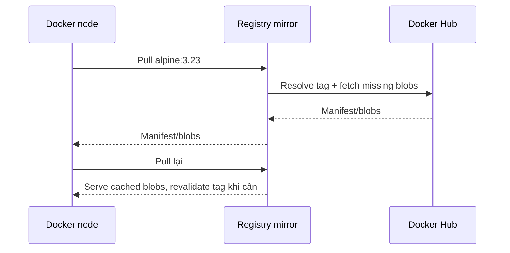

Registry mirror theo mô hình **pull-through cache** đứng giữa Docker daemon và upstream registry. Lần pull đầu, mirror lấy content từ upstream rồi lưu local; lần sau có thể phục vụ blob đã cache, giảm bandwidth và latency cho nhiều node dùng chung.



Mirror không phải local daemon image cache: nhiều node có thể dùng chung mirror và mirror có lifecycle/storage riêng.

## Khi mirror hữu ích?

- Nhiều CI runner/node pull lặp lại cùng base image.
- Site có đường truyền Internet chậm hoặc egress đắt.
- Muốn giảm blast radius của sự cố network ngắn hạn.
- Cần quan sát tập trung traffic pull từ Docker Hub.

Mirror không giải quyết:

- approval/promotion artifact;
- chữ ký, scan hoặc provenance policy;
- retention bảo đảm lâu dài cho digest;
- air-gap hoàn toàn;
- mirror mọi upstream registry qua Docker daemon configuration hiện hành.

Nếu tập image nhỏ và cần kiểm soát chặt, mirror/copy digest đã approve vào private registry thường đơn giản và deterministic hơn pull-through cache.

## Giới hạn quan trọng

Theo Distribution và Docker daemon behavior hiện hành:

- một mirror instance chỉ cấu hình một upstream;
- mirror URL phải ở root domain, không có path component;
- Docker daemon `registry-mirrors` chỉ hỗ trợ mirror Docker Hub;
- mirror Docker Hub vẫn chịu fair-use/rate-limit policy upstream;
- tag mutable được revalidate với upstream, nên cache không biến tag thành immutable;
- concurrent cache miss có thể tạo nhiều upstream request;
- để cache cleanup theo TTL hoạt động, deletion phải được bật theo cấu hình Distribution.

<Callout type="warn" title="Private upstream content">
  Nếu mirror dùng credential có quyền pull private repository, người truy cập mirror có thể nhận content mà credential đó đọc được. Mirror bắt buộc có authentication/authorization tương ứng, không được coi là cache public vô hại.
</Callout>

## Cấu hình mirror

Tạo `config.yml`:

```yaml
version: 0.1

log:
  level: info

storage:
  filesystem:
    rootdirectory: /var/lib/registry
  delete:
    enabled: true

proxy:
  remoteurl: https://registry-1.docker.io
  ttl: 168h

http:
  addr: 0.0.0.0:5000
```

Chạy lab trên loopback:

```bash
docker volume create registry-mirror-data

docker run --detach \
  --name registry-mirror \
  --publish 127.0.0.1:5001:5000 \
  --volume "$(pwd)/config.yml:/etc/distribution/config.yml:ro" \
  --volume registry-mirror-data:/var/lib/registry \
  --env OTEL_TRACES_EXPORTER=none \
  registry:3
```

Để nhiều host dùng, đặt mirror sau TLS với hostname ổn định, access control và monitoring. Không expose HTTP unauthenticated ra network.

## Cấu hình Docker daemon

Trên Linux Engine, `/etc/docker/daemon.json`:

```json
{
  "registry-mirrors": [
    "https://mirror.company.example"
  ]
}
```

Validate JSON và restart/reload Docker theo OS/service manager:

```bash
sudo systemctl restart docker
```

Restart daemon ảnh hưởng container/workload tùy cấu hình và platform; lên maintenance plan thay vì chạy trực tiếp trên production node.

Kiểm tra daemon nhận config:

```bash
docker info
```

Tìm phần `Registry Mirrors`, sau đó pull:

```bash
docker pull alpine:3.23
docker logs registry-mirror
```

Log `unknown blob` ở mức `info` trong lần cache miss có thể chỉ nghĩa mirror chưa có blob và đang lấy upstream. Đọc level/context trước khi kết luận lỗi.

## Credential upstream

Distribution hỗ trợ cấu hình username/password trong `proxy`, nhưng secret tĩnh trong YAML có rủi ro cao:

```yaml
proxy:
  remoteurl: https://registry-1.docker.io
  username: service-account-name
  password: ${DO_NOT_COMMIT_REAL_SECRET}
```

Trong production:

- dùng service account/token riêng cho mirror;
- chỉ cấp pull và chỉ repository cần thiết nếu provider hỗ trợ;
- inject secret qua secret manager/credential helper được Distribution version hỗ trợ;
- rotate và audit usage;
- bảo vệ mirror bằng auth ít nhất tương đương upstream private access;
- không ghi config đã expand secret vào log/backup không mã hóa.

Nếu chỉ cache public image, tránh cấp private credential không cần thiết.

## Freshness và reproducibility

Pull bằng tag:

```bash
docker pull alpine:3.23
```

Mirror kiểm tra upstream để xác định tag có đổi và fetch content mới khi cần. Vì vậy hai lần pull tag vẫn có thể nhận digest khác.

Pull bằng digest:

```bash
docker pull alpine@sha256:<APPROVED_DIGEST>
```

Digest giữ selection chính xác, nhưng artifact có thể không còn ở cache sau cleanup và vẫn cần upstream nếu cache miss. Nếu cần bảo đảm availability độc lập upstream, import artifact vào private registry với retention policy thay vì chỉ dựa vào mirror.

## Storage và cleanup

Mirror tích lũy blob theo workload. Theo dõi:

- disk usage và tốc độ tăng;
- cache hit/miss;
- upstream request/`429`;
- pull latency và error;
- stale content/TTL cleanup;
- filesystem inode nếu backend liên quan;
- image phổ biến bị evict rồi tải lại liên tục.

Distribution khuyến nghị filesystem driver cho pull-through cache để bảo đảm behavior/performance theo recipe. Nếu cần topology khác, kiểm tra tài liệu version và load test thay vì giả định storage backend của registry thường dùng sẽ hoạt động tối ưu cho mirror.

## High availability và failure mode

Nhiều mirror instance có thể cùng phục vụ traffic, nhưng cache state/inflight request có tính local theo implementation. Test:

- node chọn mirror nào khi endpoint lỗi;
- cache miss lúc upstream down;
- tag revalidation timeout;
- concurrent pull image lớn;
- disk full;
- credential upstream hết hạn;
- TLS certificate mirror hết hạn;
- cleanup race với pull;
- provider trả `429`.

Mirror cải thiện hiệu năng nhưng có thể trở thành single point of failure nếu mọi daemon chỉ biết một endpoint không HA.

## Mirror hay private registry?

| Nhu cầu | Pull-through mirror | Private registry có promotion |
|---|---|---|
| Cache tự động image Hub được yêu cầu | Tốt | Cần import/push |
| Chỉ cho phép artifact đã approve | Không đủ | Phù hợp |
| Hoạt động air-gapped | Không | Có thể |
| Giữ digest theo rollback window | Không bảo đảm nếu cache evict | Retention rõ ràng |
| Giảm pull lặp lại | Tốt | Tốt nếu image đã mirror |
| Nhiều upstream registry | Hạn chế | Import từ nhiều nguồn được |

Nhiều tổ chức dùng cả hai: mirror cho developer/CI cache rộng và private registry cho production allowlist.

## Cleanup lab

Lệnh sau xóa container và toàn bộ cache lab:

```bash
docker container rm --force registry-mirror
docker volume rm registry-mirror-data
rm config.yml
```

Nếu đã sửa daemon config, xóa entry mirror và restart daemon theo change procedure. Không để production node trỏ tới endpoint lab đã bị xóa.

## Nguồn chính thức

- [Registry as a pull-through cache](https://distribution.github.io/distribution/recipes/mirror/)
- [Registry proxy configuration](https://distribution.github.io/distribution/about/configuration/#proxy)
- [Docker daemon configuration](https://docs.docker.com/reference/cli/dockerd/#daemon-configuration-file)
- [Docker Hub usage and limits](https://docs.docker.com/docker-hub/usage/)
