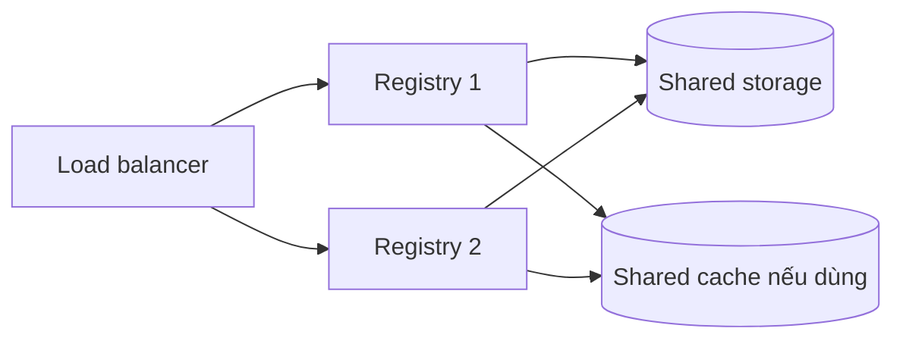

Storage backend là source of truth của self-hosted registry. Mất hoặc làm hỏng backend có thể khiến tag vẫn xuất hiện trong metadata bên ngoài nhưng manifest/layer không pull được. Storage vì thế phải được thiết kế cùng RPO, RTO, HA và garbage collection, không chỉ dựa trên dung lượng hiện tại.

## Mô hình dữ liệu

```text
repository links / tags
          │
          ▼
manifest hoặc image index
  ├── config blob
  ├── layer blobs
  └── attestation/related manifests
```

Blob được định danh theo digest và có thể được nhiều manifest tham chiếu. Xóa một tag không nhất thiết xóa manifest; xóa manifest không lập tức giải phóng blob; garbage collection chỉ xóa blob không còn được mark là reachable.

<Callout type="warn" title="Không sửa trực tiếp backend">
  Không dùng `rm`, object lifecycle rule hoặc script tự viết để xóa đường dẫn nội bộ trong registry storage. Thao tác ngoài Registry API/GC có thể xóa blob còn được manifest tham chiếu và làm artifact hỏng.
</Callout>

## Chọn storage driver

Distribution hiện cung cấp các driver chính:

| Driver | Phù hợp | Trade-off |
|---|---|---|
| `filesystem` | Lab, single instance, production nhỏ có operational model rõ | Gắn với filesystem/host; HA khó nếu không có shared filesystem đúng semantics |
| `s3` | HA trên AWS hoặc S3-compatible đã kiểm thử | API cost, latency, IAM, redirect, compatibility khác nhau giữa provider |
| `azure` | Azure Blob Storage | IAM/network/cost và semantics theo provider |
| `gcs` | Google Cloud Storage | IAM/network/cost và semantics theo provider |
| `inmemory` | Test ngắn hạn | Mất toàn bộ dữ liệu khi process dừng |

Chỉ cấu hình **một** storage backend. Driver custom/fork không mặc nhiên được upstream hỗ trợ; test compatibility với version Distribution đang pin.

## Filesystem driver

Cấu hình:

```yaml
version: 0.1
storage:
  filesystem:
    rootdirectory: /var/lib/registry
```

Mount durable volume:

```bash
docker run --detach \
  --name registry \
  --publish 127.0.0.1:5000:5000 \
  --volume /mnt/registry:/var/lib/registry \
  --env OTEL_TRACES_EXPORTER=none \
  registry:3
```

Filesystem dễ backup bằng snapshot nhất quán khi registry dừng/read-only. Nhưng nhiều replica không được dùng mỗi local disk riêng: request upload vào replica A rồi pull từ replica B có thể thấy hai tập dữ liệu khác nhau.

Shared filesystem chỉ hợp lệ nếu semantics, locking, latency và failure mode đã được Distribution/storage vendor hỗ trợ và load-tested.

## Object storage

Ví dụ rút gọn với S3:

```yaml
version: 0.1
storage:
  s3:
    region: ap-southeast-1
    bucket: company-registry-prod
    rootdirectory: /distribution
    encrypt: true
    secure: true
```

Dùng workload identity/IAM role thay access key tĩnh khi platform hỗ trợ. Nếu buộc dùng secret, inject qua secret manager và rotate; không commit vào `config.yml`.

Thiết kế object storage phải xét:

- region và network latency tới registry replica;
- request/egress/storage cost;
- encryption và key availability;
- bucket policy chặn public access;
- versioning/backup và lifecycle rules;
- compatibility của S3-compatible implementation;
- multipart upload cleanup;
- rate limit/throttling;
- behavior redirect client tới backend/CDN.

## HA requirements



Mọi replica phải chia sẻ:

- cùng storage backend và root prefix;
- cùng HTTP secret;
- compatible Redis/cache configuration nếu bật;
- auth/trust configuration đồng nhất;
- cùng external hostname behavior.

Registry replica có thể stateless ở compute layer, nhưng upload session và redirect vẫn nhạy với proxy/storage configuration. Test push image lớn, concurrent push cùng blob, multi-platform index và client retry khi một replica bị terminate.

## Redirect và CDN

Một số storage driver có thể trả redirect để client tải blob trực tiếp từ object storage/CDN, giảm bandwidth qua registry process.

Trade-off:

| Qua registry | Redirect trực tiếp |
|---|---|
| Egress và auth tập trung tại registry | Giảm tải data plane registry |
| Dễ kiểm soát network path | Client phải truy cập backend/CDN URL |
| Registry chịu bandwidth lớn | Signed URL, TTL, proxy/firewall phức tạp hơn |

Nếu client chỉ được phép gọi registry hostname, có thể phải tắt redirect:

```yaml
storage:
  redirect:
    disable: true
```

Đo tải trước khi chọn; đừng tắt redirect theo thói quen.

## Capacity planning

Theo dõi ít nhất:

- bytes đang dùng và tốc độ tăng;
- số repository/tag/manifest/blob;
- upload đang dang dở và orphan upload;
- tỷ lệ dedup thực tế;
- object API latency/error/throttle;
- pull egress và cache hit;
- thời gian dry-run/GC;
- dung lượng giữ cho rollback và legal retention.

Ước lượng đơn giản:

```text
required capacity ≈ unique compressed blobs
                  + manifests/config/attestations
                  + unfinished uploads
                  + backup/versioning overhead
                  + safety headroom
```

Kích thước image CLI hiển thị không bằng compressed storage bytes hoặc billing của object store.

## Retention và lifecycle

Quy trình đúng:

1. policy chọn tag/manifest hết retention;
2. bảo vệ digest đang deploy hoặc trong rollback window;
3. xóa manifest qua supported registry API/product API;
4. chạy GC theo runbook;
5. xác minh artifact còn giữ vẫn pull được.

Không để object store lifecycle xóa blob theo tuổi vì blob cũ vẫn có thể được manifest mới/đang chạy tham chiếu. Lifecycle có thể dùng cho backup version hoặc incomplete multipart upload nếu được thiết kế riêng và kiểm thử.

## Backup và restore

Backup cần nhất quán giữa các object registry sử dụng. Pattern an toàn:

1. đưa registry vào read-only hoặc dừng write;
2. chờ upload đang chạy drain/fail có kiểm soát;
3. snapshot/copy backend bằng cơ chế provider;
4. lưu config và secret references tách biệt;
5. ghi timestamp, version Distribution và release digest quan trọng;
6. khôi phục vào môi trường cô lập;
7. pull representative single/multi-platform image bằng digest;
8. chỉ công nhận backup sau restore test.

Object versioning không tự là backup nếu cùng credential có thể xóa mọi version hoặc KMS key bị mất. Thiết kế account/region/retention boundary theo RPO/RTO.

## Bảo trì storage

- Bật upload purging theo config được review để dọn upload orphan.
- Chạy [Registry garbage collection](/docs/registry-va-distribution/registry-garbage-collection/) ở read-only/offline window.
- Không chạy nhiều GC process đồng thời trên cùng backend.
- Không thay storage driver bằng cách chỉ copy một phần directory/object prefix.
- Trước upgrade lớn, test schema/layout compatibility và rollback.
- Sau migration, so digest inventory và pull representative artifacts.

## Nguồn chính thức

- [Registry storage drivers](https://distribution.github.io/distribution/storage-drivers/)
- [Registry storage configuration](https://distribution.github.io/distribution/about/configuration/#storage)
- [Filesystem storage driver](https://distribution.github.io/distribution/storage-drivers/filesystem/)
- [S3 storage driver](https://distribution.github.io/distribution/storage-drivers/s3/)
