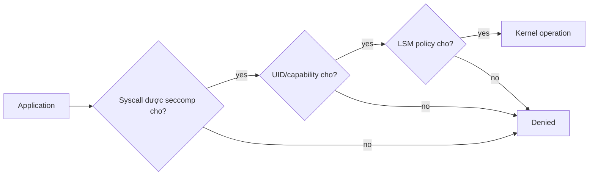

AppArmor và SELinux là Linux Security Module (LSM) cung cấp Mandatory Access Control (MAC): kernel áp policy ngoài Unix owner/mode truyền thống. Nếu application bị compromise, LSM có thể chặn truy cập path, type hoặc operation mà UID/capability riêng lẻ vẫn cho phép.

| Thuộc tính | AppArmor | SELinux |
|---|---|---|
| Mental model chính | Profile gắn với program, rule thường theo path | Label/type trên process và object, rule theo type |
| Phổ biến | Ubuntu/Debian và distro hỗ trợ AppArmor | RHEL/Fedora/CentOS và distro hỗ trợ SELinux |
| Docker default | `docker-default` cho container khi AppArmor hoạt động | Container domain/label do policy và runtime gán |
| Debug | `aa-status`, kernel/audit log | `getenforce`, `ausearch`, `sealert`, label tools |

Không bật cả hai chỉ để “gấp đôi security”; host thường chọn LSM chính theo distro. Dùng policy được distro/runtime support và test với hệ thống log, storage, backup thực tế.

## Kiểm tra host và container

AppArmor:

```bash
sudo aa-status
docker info --format '{{json .SecurityOptions}}'
docker run --rm alpine:3.23 cat /proc/1/attr/current
```

SELinux:

```bash
getenforce
sestatus
docker info --format '{{json .SecurityOptions}}'
docker run --rm alpine:3.23 sh -c 'id -Z 2>/dev/null || cat /proc/1/attr/current'
```

Command/output phụ thuộc distro và image. `Disabled` hoặc thiếu utility không tự chứng minh runtime không có policy; kiểm tra kernel boot/config và daemon info.

## AppArmor với Docker

Docker tự tạo và load profile `docker-default` cho container, không phải daemon. Chỉ định explicit:

```bash
docker run --rm \
  --security-opt apparmor=docker-default \
  alpine:3.23 true
```

Custom profile phải được load trên **daemon host** trước khi tạo container:

```bash
sudo apparmor_parser -r -W /etc/apparmor.d/containers/example-app

docker run --rm \
  --security-opt apparmor=example-app \
  IMAGE COMMAND
```

Compose:

```yaml
services:
  app:
    image: registry.example.com/team/app@sha256:REPLACE_WITH_DIGEST
    security_opt:
      - apparmor=example-app
```

Profile name là host dependency. Deployment phải fail nếu profile thiếu; provisioning/load profile trước rồi mới rollout container.

### Phát triển AppArmor profile

1. Bắt đầu từ template/reference phù hợp distro và Docker version.
2. Chạy `complain`/audit mode trong test để thu event.
3. Thực hiện đủ startup, traffic, reload, log rotation, backup và shutdown.
4. Review từng allow; không biến log thành allowlist tự động không kiểm soát.
5. Chuyển enforce trên canary.
6. Alert deny bất thường và version profile cùng deployment.

Debug:

```bash
sudo journalctl -k --since '10 minutes ago' | grep -i apparmor
sudo dmesg | grep -i 'apparmor="DENIED"' | tail
```

## SELinux label và bind mount

SELinux policy thường đặt container process vào domain riêng và label file container được phép truy cập. Bind mount host path có Unix permission đúng vẫn có thể bị deny vì label.

Với `-v`, Docker hỗ trợ option relabel:

```bash
# :Z — private label cho một container
sudo mkdir -p /srv/selinux-demo
docker run --rm -v /srv/selinux-demo:/data:Z alpine:3.23 touch /data/ok

# :z — shared label khi nhiều container cần cùng content
# docker run --rm -v /srv/shared:/data:z IMAGE
```

<Callout type="error" title="Relabel có thể phá host">
  Không dùng `:Z` hoặc `:z` với path hệ thống như `/home`, `/usr`, `/etc` hay `/var` mà chưa hiểu policy. Recursive relabel có thể làm dịch vụ host khác mất quyền truy cập. Dùng dedicated directory/volume và backup metadata cần thiết.
</Callout>

Xem label:

```bash
ls -Zd /srv/selinux-demo
ps -eZ | grep container
```

Khôi phục default context cho path được policy quản lý:

```bash
sudo restorecon -Rv /srv/selinux-demo
```

Không tự động chạy `chcon` dài hạn mà không cập nhật policy/file-context mapping; relabel có thể mất sau restore/reinstall.

Compose bind option phụ thuộc syntax/version. Có thể dùng short syntax `./data:/data:Z`; validate trên host SELinux thật vì Docker Desktop/non-SELinux host không chứng minh policy đúng.

## Debug SELinux deny

```bash
sudo ausearch -m AVC,USER_AVC -ts recent
sudo journalctl -k --since '10 minutes ago' | grep -i 'avc:.*denied'
```

Nếu có `sealert`:

```bash
sudo sealert -a /var/log/audit/audit.log
```

Thông báo gợi ý tạo policy module không phải lúc nào cũng an toàn. Trước khi allow, kiểm tra:

- path có được mount nhầm không;
- label source/target đúng không;
- app có cần operation đó không;
- booleans/policy chuẩn của distro đã tồn tại chưa;
- rule mới có mở toàn bộ type/path không.

Không dùng `setenforce 0` làm fix production. Permissive mode chỉ phù hợp debug có thời hạn, trên canary, với audit và kế hoạch quay lại enforcing.

## LSM, seccomp và capability khác nhau



- seccomp lọc syscall;
- capability/DAC kiểm tra authority và owner/mode;
- AppArmor/SELinux áp MAC policy;
- read-only mount/filesystem có thể chặn ghi ở VFS/mount layer.

Dùng audit source để biết lớp nào deny, không tắt tất cả.

## Checklist vận hành

- Host LSM ở enforce mode và policy package được cập nhật.
- Container không chạy unconfined nếu không có exception được phê duyệt.
- Custom profile/label được version, deploy và rollback cùng workload.
- Bind mount dùng dedicated path và relabel có chủ đích.
- Deny log đi vào hệ thống tập trung với workload/container identity.
- Canary test trên đúng distro/kernel; Docker Desktop không thay test Linux host.
- Policy được review lại khi image path, binary, volume hoặc behavior đổi.

## Nguồn chính thức

- [AppArmor security profiles for Docker](https://docs.docker.com/engine/security/apparmor/)
- [Docker Engine security](https://docs.docker.com/engine/security/)
- [SELinux container documentation](https://docs.redhat.com/en/documentation/red_hat_enterprise_linux/9/html/using_selinux/using-selinux-for-protecting-containerized-applications_using-selinux)
- [Seccomp profiles](/docs/security/seccomp-profiles/)
