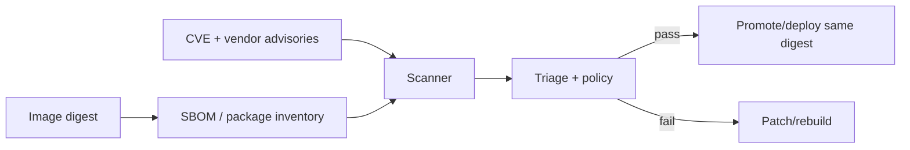

Vulnerability scanner inventory package/binary trong image, đối chiếu version với advisory database rồi báo lỗ hổng đã biết. Kết quả là snapshot của **artifact + database + scanner version** tại thời điểm phân tích, không phải chứng nhận image an toàn.



## Scanner thấy và không thấy gì

| Có thể phát hiện | Thường không chứng minh được |
|---|---|
| OS package và language dependency có advisory | Application logic/auth bug |
| Package version đã có fixed version | CVE thực sự reachable trong workload |
| Secret pattern/misconfig nếu tool có module tương ứng | Secret chưa nằm trong signature database |
| Base image cũ hoặc package dư | Runtime capability/mount/network an toàn |
| Malware signature nếu scanner hỗ trợ | Image do đúng publisher build |

Kết hợp SAST, dependency review, secret scanning, provenance/signature verification, runtime config policy và dynamic test.

## Luôn scan artifact sẽ deploy

Workflow không an toàn:

```text
scan source/tag -> rebuild -> push cùng tag -> deploy tag
```

Artifact được deploy có thể khác artifact đã scan. Workflow đúng:

1. build và push một lần;
2. ghi remote digest;
3. scan digest đó;
4. approve/promotion cùng digest;
5. deploy digest;
6. rescan digest đang chạy khi database đổi.

```bash
IMAGE='registry.example.com/team/api'
DIGEST='sha256:REPLACE_WITH_REAL_DIGEST'

docker scout cves "registry://${IMAGE}@${DIGEST}"
```

Không đặt chuỗi placeholder vào pipeline. Lấy digest từ build/push output hoặc registry API và validate format.

## Docker Scout CLI

Tổng quan nhanh:

```bash
docker scout quickview alpine:3.23
```

Liệt kê critical/high có bản vá:

```bash
docker scout cves \
  --only-severity critical,high \
  --only-fixed \
  alpine:3.23
```

Tạo SARIF cho code scanning/reporting:

```bash
docker scout cves \
  --format sarif \
  --output scout-results.sarif.json \
  IMAGE@sha256:REAL_DIGEST
```

`docker scout cves --exit-code` trả code `2` nếu phát hiện vulnerability theo filter. Pipeline phải phân biệt code policy fail với lỗi tool/network và lưu report:

```bash
set +e
docker scout cves \
  --exit-code \
  --only-severity critical,high \
  --only-fixed \
  IMAGE@sha256:REAL_DIGEST
status=$?
set -e

case "$status" in
  0) echo 'Không có vulnerability khớp filter' ;;
  2) echo 'Policy vulnerability thất bại' >&2; exit 2 ;;
  *) echo 'Scanner lỗi hoặc không hoàn tất' >&2; exit "$status" ;;
esac
```

Flag, entitlement và behavior thay đổi theo phiên bản/plugin. Pin Docker Scout CLI trong CI và kiểm tra `docker scout version`.

## SBOM cải thiện inventory

BuildKit có thể gắn SBOM attestation:

```bash
docker buildx build \
  --sbom=true \
  --provenance=mode=max \
  --tag registry.example.com/team/api:1.4.0 \
  --push .
```

Scanner có thể dùng SBOM thay vì giải nén/phân tích lại toàn image. Tuy nhiên:

- SBOM có thể thiếu package statically linked hoặc file custom;
- scan scope multi-stage/final stage cần xác minh;
- SBOM không chứa trạng thái CVE cố định;
- SBOM/provenance cần được giữ khi mirror/promote;
- attestation phải được verify nếu dùng làm evidence tin cậy.

Xem [Attestations, SBOM và provenance](/docs/buildkit/attestations-sbom-provenance/).

## Triage theo risk, không chỉ đếm severity

Ưu tiên theo:

| Tín hiệu | Câu hỏi |
|---|---|
| Vendor severity | Distro/language maintainer đánh giá thế nào? |
| Fixability | Có package/base version đã vá không? |
| Exploitability | EPSS, CISA KEV hoặc exploit public có không? |
| Reachability | Code/path dễ tổn thương có nằm trong runtime không? |
| Exposure | Service Internet-facing, quyền và network ra sao? |
| Compensating controls | Seccomp, non-root, feature disabled có giảm risk không? |
| Asset impact | Data/identity/availability nếu khai thác? |

CVSS cao nhưng package build-only không nằm final image có risk khác CVE medium đang bị khai thác trong parser Internet-facing. Ghi decision và evidence, không tự động suppress chỉ vì “không thấy exploit”.

## Exception và VEX

Exception cần có:

- CVE/package/image digest/platform;
- lý do affected/not affected hoặc risk acceptance;
- evidence kỹ thuật và compensating control;
- owner/approver;
- expiry ngắn;
- điều kiện đóng: fixed version, rebuild hoặc feature removal.

VEX (Vulnerability Exploitability eXchange) biểu diễn affected/not affected/fixed theo máy đọc được. Chỉ tin VEX từ author/identity được policy chấp nhận; attacker có thể tự tạo statement “not affected”.

<Callout type="warn" title="Không suppress vô thời hạn">
  CVE database, exploitability và workload exposure thay đổi. Mọi exception phải hết hạn và được re-evaluate khi image, dependency hoặc threat model đổi.
</Callout>

## Remediation đúng cách

1. Update base image digest/tag có bản vá.
2. Update direct/transitive dependency và lockfile.
3. Loại package/tool không cần khỏi runtime stage.
4. Rebuild không dùng stale cache khi cần refresh package index.
5. Scan image digest mới.
6. Chạy regression test.
7. Ký/promote/deploy digest mới.
8. Xác minh digest cũ không còn chạy; giữ theo rollback/forensic policy.

Không chạy package manager để vá container đang chạy. Cách đó tạo drift, không reproducible và mất khi recreate.

## Continuous scanning

Image “pass” hôm nay có thể fail ngày mai khi advisory mới xuất hiện. Inventory digest đang chạy và rescan:

- khi CVE/advisory database cập nhật;
- khi CISA KEV hoặc exploit mới công bố;
- định kỳ theo SLA;
- trước promotion/deploy;
- sau thay đổi VEX/exception;
- khi base/dependency mới có bản vá.

Metric hữu ích là thời gian từ disclosure/triage đến production digest đã vá, không chỉ tổng số CVE.

## Nguồn chính thức

- [`docker scout cves`](https://docs.docker.com/reference/cli/docker/scout/cves/)
- [Docker Scout image analysis](https://docs.docker.com/scout/explore/analysis/)
- [Docker Scout policy evaluation](https://docs.docker.com/scout/policy/)
- [CISA Known Exploited Vulnerabilities Catalog](https://www.cisa.gov/known-exploited-vulnerabilities-catalog)
- [NIST National Vulnerability Database](https://nvd.nist.gov/)
