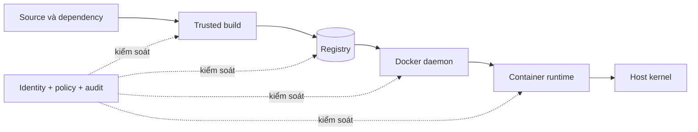

Container dùng chung kernel với host. Namespace, cgroup, Linux capabilities, seccomp và Linux Security Module tạo nhiều ranh giới, nhưng container không phải máy ảo thu nhỏ và image không mặc nhiên đáng tin chỉ vì chạy được.



<Callout type="warn" title="Nguyên tắc cốt lõi">
  Security của container là defense in depth. Không control đơn lẻ nào — chạy non-root, quét CVE, ký image hay bật seccomp — bù được cho Docker socket bị lộ hoặc host kernel không được vá.
</Callout>

## Các ranh giới cần bảo vệ

| Lớp | Tài sản chính | Rủi ro điển hình | Control ưu tiên |
|---|---|---|---|
| Source/build | Source, dependency, CI credential | Dependency độc hại, secret vào layer, build bị sửa | Review, pin dependency, BuildKit secret, provenance |
| Registry | Image, tag, signature, SBOM | Tag bị ghi đè, token lộ, artifact bị xóa | Digest, least privilege, retention, signature policy |
| Docker daemon | Socket/API và host root authority | User hoặc container điều khiển daemon | Hạn chế socket, SSH/mTLS, rootless, audit |
| Container config | User, capability, mount, network | `--privileged`, bind mount nhạy cảm, secret lộ | Least privilege, read-only root, network segmentation |
| Host/kernel | Kernel, filesystem, device, credential | Escape, kernel exploit, resource exhaustion | Patch, LSM, seccomp, cgroup limits, host tối giản |
| Runtime | Process, file, network behavior | Web shell, crypto miner, lateral movement | Baseline, telemetry, alert và response runbook |

Một control phải gắn với rủi ro cụ thể. Ví dụ, image scanning phát hiện package có CVE đã biết nhưng không ngăn container mount `/var/run/docker.sock`; read-only root filesystem giảm persistence nhưng không ngăn tiến trình gửi secret qua mạng.

## Baseline cho một workload thông thường

Bắt đầu từ cấu hình chặt rồi chỉ mở đúng quyền application cần:

```bash
docker run --detach \
  --name security-demo \
  --user 10001:10001 \
  --read-only \
  --tmpfs /tmp:rw,noexec,nosuid,size=64m \
  --cap-drop ALL \
  --security-opt no-new-privileges=true \
  --memory 256m \
  --cpus 0.5 \
  --pids-limit 128 \
  --network none \
  alpine:3.23 sleep 300
```

Đây là điểm xuất phát cho lab, không phải cấu hình copy nguyên vào mọi service. Application HTTP có thể cần network; process bind port thấp có thể cần `NET_BIND_SERVICE`; workload ghi state phải có volume hoặc tmpfs đúng path.

Kiểm tra effective config thay vì chỉ đọc command hoặc YAML:

```bash
docker inspect security-demo --format '{{json .HostConfig.SecurityOpt}}'
docker inspect security-demo --format '{{json .HostConfig.CapDrop}}'
docker inspect security-demo --format 'readonly={{.HostConfig.ReadonlyRootfs}} user={{.Config.User}}'
docker exec security-demo sh -c 'id; grep NoNewPrivs /proc/1/status'
```

Cleanup:

```bash
docker rm --force security-demo
```

## Thứ tự hardening có hiệu quả

1. **Giảm authority của daemon:** không cấp Docker socket cho user, workload hoặc CI không cần quyền quản trị host.
2. **Vá và tối giản host:** cập nhật kernel, Docker Engine/container runtime; không chạy dịch vụ không liên quan trên host.
3. **Kiểm soát artifact:** dùng source image đáng tin, pin digest, scan, tạo SBOM/provenance và xác minh chữ ký theo identity policy.
4. **Giảm quyền container:** chạy non-root, drop capabilities, giữ seccomp/LSM, tránh host namespace và device.
5. **Giảm bề mặt ghi và mạng:** read-only root, mount tối thiểu, network segmentation, secret dạng file với lifecycle rõ.
6. **Giới hạn blast radius:** CPU, memory, PID và số lượng workload trên mỗi trust zone.
7. **Quan sát và diễn tập:** lưu audit/event, phát hiện drift, có quy trình cô lập, thu thập bằng chứng và rotate credential.

<Callout type="info" title="Non-root chưa đủ">
  UID khác `0` trong container là control quan trọng, nhưng process vẫn có thể khai thác kernel, đọc mount được cấp hoặc dùng credential của chính service. Kết hợp non-root với capability, seccomp, LSM, mount và network policy.
</Callout>

## Những cấu hình cần xem là ngoại lệ

Các option sau làm yếu đáng kể isolation và phải có owner, lý do, thời hạn cùng test thay thế:

- `--privileged`;
- mount Docker socket hoặc root filesystem của host;
- `--pid=host`, `--network=host`, `--userns=host`;
- `--cap-add SYS_ADMIN` hoặc capability rộng tương tự;
- `--security-opt seccomp=unconfined`;
- `--security-opt apparmor=unconfined` hoặc tắt SELinux label;
- chạy container như UID `0` khi application không cần;
- expose Docker API qua TCP không có mutual TLS và authorization.

`--privileged` không phải cách sửa lỗi permission. Nó cấp gần như toàn bộ capability, device và làm thay đổi security profile; hãy tìm đúng syscall, capability, path hoặc device mà workload cần.

## Bản đồ phần Security

1. [Threat model cho container](/docs/security/threat-model/) — xác định tài sản, actor và trust boundary.
2. [Bảo vệ Docker daemon và socket](/docs/security/daemon-socket-security/) — bảo vệ authority gần tương đương host root.
3. [Rootless security](/docs/security/rootless-security/) và [user namespace remapping](/docs/security/user-namespaces/) — giảm tác động của UID `0`.
4. [Linux capabilities](/docs/security/linux-capabilities/), [seccomp](/docs/security/seccomp-profiles/) và [AppArmor/SELinux](/docs/security/apparmor-selinux/) — giới hạn quyền kernel.
5. [Read-only filesystem](/docs/security/read-only-filesystem/) và [secrets management](/docs/security/secrets-management/) — kiểm soát dữ liệu runtime.
6. [Quét lỗ hổng image](/docs/security/image-scanning/), [supply chain security](/docs/security/supply-chain-security/) và [ký image](/docs/security/signing-and-verification/) — kiểm soát artifact trước deploy.
7. [Runtime security](/docs/security/runtime-security/) và [security checklist](/docs/security/security-checklist/) — phát hiện, response và kiểm tra release.

## Nguồn chính thức

- [Docker Engine security](https://docs.docker.com/engine/security/)
- [Docker security announcements](https://docs.docker.com/security/security-announcements/)
- [CIS Docker Benchmark](https://www.cisecurity.org/benchmark/docker)
- [NIST Application Container Security Guide](https://csrc.nist.gov/publications/detail/sp/800-190/final)
