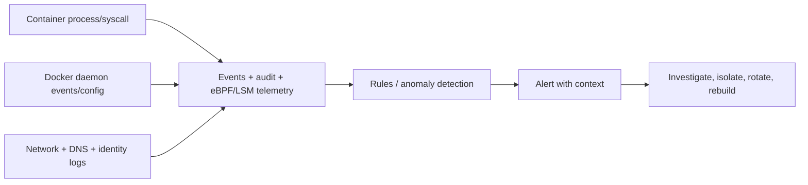

Runtime security trả lời câu hỏi: **artifact và config đã được phê duyệt đang làm gì sau khi chạy?** Preventive controls giảm khả năng và blast radius; telemetry/detection phát hiện khi behavior vượt baseline hoặc control bị thay đổi.



## Baseline trước khi alert

Với mỗi service, ghi:

- image/index digest và platform;
- expected process tree, user và executable path;
- listening port, DNS/outbound destination;
- writable/mounted path;
- capability, seccomp, LSM, namespace và device;
- expected child process/shell/tool;
- file/config reload và deployment window;
- owner, severity và response action.

Nếu không có baseline, detector sẽ alert mọi `sh` hoặc network connection và team sớm bỏ qua cảnh báo.

## Tín hiệu quan trọng

| Tín hiệu | Ví dụ nghi vấn | Context cần kèm |
|---|---|---|
| Process | Shell, package manager, miner, debugger mới | Container ID, image digest, parent, user, command |
| File | Ghi binary/config, xóa log, sửa certificate | Path, mount type, process, hash |
| Network | Scan subnet, DNS lạ, outbound mới | Source workload, destination, bytes, identity |
| Privilege | Capability/namespace/device thay đổi | Deployment actor, old/new config |
| Docker API | `exec`, privileged create, socket mount | Caller identity, request, host |
| Host/kernel | Seccomp/LSM deny, module/BPF/audit change | PID, cgroup/container, syscall/rule |
| Identity | Token dùng từ workload/region lạ | Audience, scope, session, downstream action |

`docker logs` chỉ là application stdout/stderr. Nó không cung cấp đầy đủ syscall, file, network hoặc caller identity của Docker API.

## Docker-native evidence

Inventory runtime:

```bash
docker ps --no-trunc \
  --format 'table {{.ID}}\t{{.Image}}\t{{.Status}}\t{{.Names}}'

docker inspect CONTAINER > container-inspect.json
docker top CONTAINER -eo pid,ppid,user,comm,args
docker diff CONTAINER
```

Theo dõi daemon events:

```bash
docker events \
  --filter type=container \
  --format '{{json .}}'
```

Event stream hữu ích cho `create`, `start`, `exec_create`, `die`, `destroy`, nhưng cần collector bền vững và correlation với caller identity từ SSH/API gateway/audit layer.

Host PID của container:

```bash
pid="$(docker inspect -f '{{.State.Pid}}' CONTAINER)"
sudo cat "/proc/${pid}/status"
sudo ls -l "/proc/${pid}/ns"
```

Không chạy command forensic làm thay đổi evidence nếu có quy trình incident chuyên dụng.

## Runtime detector

Các lựa chọn có thể kết hợp:

- Linux Audit/LSM logs cho policy deny và host object;
- eBPF/syscall sensor như Falco hoặc commercial runtime security tool;
- EDR host hiểu cgroup/container metadata;
- network flow/DNS/proxy logs;
- cloud/secret manager/database identity audit;
- file integrity monitoring cho host và mount nhạy cảm.

Tool không tự tạo strategy. Rule phải versioned, có owner, test fixture, exception expiry và mapping tới response runbook.

## Rule nên bắt đầu từ behavior mạnh

Ưu tiên tín hiệu ít false positive:

- Docker socket xuất hiện trong mount mới;
- privileged container hoặc thêm `SYS_ADMIN`;
- host PID/network/user namespace;
- shell/package manager trong image service không có shell theo baseline;
- write vào binary/config path;
- đọc credential path bởi process không mong đợi;
- outbound tới Internet từ workload không cần egress;
- process crypto miner, reverse shell hoặc network scanner;
- container exec ngoài maintenance window;
- LSM/seccomp policy chuyển unconfined.

Sau đó mới thêm anomaly rộng. Một alert phải chỉ ra workload owner, digest, node, process tree và next action; chỉ gửi syscall name thường không đủ xử lý.

## Preventive và detective controls

| Mục tiêu | Preventive | Detective |
|---|---|---|
| Chặn persistence | Read-only root, immutable replacement | File write/drift alert |
| Giảm privilege | Non-root, cap drop, seccomp, LSM | Privilege/config change alert |
| Bảo vệ credential | Scope/TTL nhỏ, file/identity delivery | Secret access và downstream usage audit |
| Giảm lateral movement | Network segmentation/egress allowlist | Flow/DNS anomaly |
| Bảo vệ daemon | Không mount socket, authz | Docker API/event audit |
| Giảm DoS | CPU/memory/PID limit | Saturation, OOM, throttling alert |

Detector không bù cho missing preventive control. Alert “container mount socket” sau khi attacker đã tạo privileged host container có thể quá muộn.

## Response khi nghi compromise

### 1. Triage

Ghi thời gian, host, container ID, image digest, alert rule, process/network/identity evidence. Xác nhận có deployment/maintenance hợp lệ không nhưng không đóng alert chỉ vì operator quen thuộc.

### 2. Contain

Tùy severity:

- chặn egress/ingress hoặc isolate host;
- revoke workload credential;
- dừng scheduling/deploy mới;
- giữ registry digest và log;
- không xóa container ngay nếu cần forensic.

`docker pause` chỉ dừng process tạm thời, không chặn mọi host/network/control-plane path và không phải isolation strategy hoàn chỉnh.

### 3. Eradicate

- sửa root cause trong source/config/policy;
- rebuild image bằng trusted pipeline;
- rotate secret/token/certificate;
- rebuild node nếu daemon/host boundary có thể bị ảnh hưởng;
- xóa persistence ở volume/external service dựa trên forensic evidence.

### 4. Recover

Deploy digest sạch trên host đáng tin, canary và giám sát indicator cũ. Không dùng `docker commit` container đã sửa để tạo release.

### 5. Learn

Cập nhật threat model, rule, baseline, runbook, credential scope và test. Ghi thời gian detection/containment/rotation để cải thiện SLA.

<Callout type="error" title="Giả định host compromise khi socket/privileged bị lạm dụng">
  Nếu attacker đã điều khiển rootful Docker daemon hoặc privileged container, chỉ recreate application container là không đủ. Cô lập và rebuild host từ baseline tin cậy, đồng thời rotate credential có thể truy cập từ node.
</Callout>

## Test detector

Dùng lab/dedicated environment, không tạo hành vi nguy hiểm trên production:

```bash
docker run --rm \
  --label com.example.security-test=process-baseline \
  alpine:3.23 sh -c 'echo runtime-detection-test'
```

Test pipeline end-to-end:

1. event được sensor nhận;
2. rule match đúng container metadata;
3. alert tới đúng channel;
4. runbook link hoạt động;
5. responder tìm được owner/digest/node;
6. exception không che workload ngoài scope;
7. telemetry outage cũng phát alert.

Không chạy reverse shell, miner hoặc exploit thật nếu lab không được cô lập/phê duyệt. Dùng atomic test an toàn hoặc fixture replay.

## Nguồn tham khảo

- [Docker events](https://docs.docker.com/reference/cli/docker/system/events/)
- [Falco rules](https://falco.org/docs/concepts/rules/)
- [MITRE ATT&CK Containers](https://attack.mitre.org/matrices/enterprise/containers/)
- [NIST SP 800-61 Incident Response](https://csrc.nist.gov/pubs/sp/800/61/r3/final)
- [Threat model cho container](/docs/security/threat-model/)
