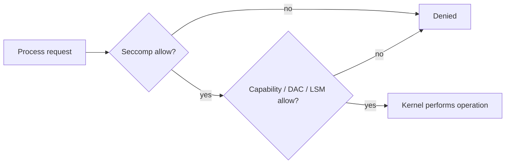

Seccomp (secure computing mode) là tính năng Linux kernel lọc syscall mà process được phép gọi. Docker áp default seccomp profile cho container Linux nếu Engine/kernel hỗ trợ, giúp giảm bề mặt kernel có thể tiếp cận.

```text
Application -> libc -> syscall -> seccomp filter -> Linux kernel
                                      │
                                      ├─ allow
                                      └─ errno / kill / log theo action
```

Seccomp kiểm soát syscall và đôi khi argument; nó không thay file permission, capability, AppArmor/SELinux, network policy hoặc patch kernel.

## Default profile

Docker default profile dùng allowlist với action mặc định `SCMP_ACT_ERRNO`, rồi cho phép syscall cần cho workload phổ biến. Các syscall nhạy cảm liên quan kernel module, mount, keyring, clock, BPF, tracing hoặc namespace bị chặn/điều kiện hóa.

Kiểm tra Engine:

```bash
docker info --format '{{json .SecurityOptions}}'
```

Kiểm tra container:

```bash
docker run --rm alpine:3.23 sh -c \
  'grep -E "^(Seccomp|NoNewPrivs):" /proc/1/status'
```

`Seccomp: 2` nghĩa process đang ở filter mode. Số lượng syscall và rule thay đổi theo Engine, kernel, architecture; không copy một con số cố định vào policy compliance.

<Callout type="warn" title="Giữ default profile">
  Không đặt `seccomp=unconfined` để sửa lỗi tương thích mà chưa xác định syscall bị chặn. Default profile được cập nhật cùng Engine để phản ánh compatibility và lỗ hổng mới.
</Callout>

## Override profile

Docker CLI đọc JSON profile ở **client** rồi gửi nội dung tới daemon:

```bash
docker run --rm \
  --security-opt seccomp=/absolute/path/profile.json \
  alpine:3.23 true
```

Vì vậy khi client điều khiển remote daemon, file cần tồn tại trên máy chạy CLI, không nhất thiết daemon host.

Compose:

```yaml
services:
  app:
    image: registry.example.com/team/app@sha256:REPLACE_WITH_DIGEST
    security_opt:
      - seccomp=./security/seccomp-app.json
```

Path behavior phụ thuộc CLI/project directory. Dùng CI validation và inspect model sau merge/override.

## Cấu trúc profile tối thiểu

Ví dụ dưới đây chỉ minh họa schema, **không đủ để chạy application thực tế**:

```json
{
  "defaultAction": "SCMP_ACT_ERRNO",
  "defaultErrnoRet": 1,
  "architectures": [
    "SCMP_ARCH_X86_64",
    "SCMP_ARCH_X86",
    "SCMP_ARCH_X32"
  ],
  "syscalls": [
    {
      "names": ["read", "write", "exit", "exit_group"],
      "action": "SCMP_ACT_ALLOW"
    }
  ]
}
```

Custom profile nên bắt đầu từ default profile **đúng version Engine** hoặc profile được runtime/vendor hỗ trợ, sau đó thu hẹp có test. Một profile cũ có thể chặn syscall mới mà runtime/library cần, hoặc bỏ lỡ deny rule security mới.

## Workflow tạo profile an toàn

1. Chạy workload với Docker default profile.
2. Liệt kê chức năng và platform/architecture cần hỗ trợ.
3. Quan sát syscall trong môi trường test bằng `strace`, audit hoặc seccomp logging phù hợp.
4. Tạo allowlist; giữ capability và LSM control song song.
5. Test startup, traffic, signal, DNS, TLS, thread/process, backup và shutdown.
6. Test action dự kiến bị chặn.
7. Pin profile theo source control và owner.
8. Canary trên kernel/Engine giống production.
9. Review diff khi nâng runtime/base image.

Không xây profile chỉ từ một lần chạy happy path: code error, signal handler, garbage collector, certificate reload hoặc kiến trúc ARM có thể dùng syscall khác.

## Chẩn đoán `Operation not permitted`

`EPERM` có thể đến từ seccomp, capability, file permission hoặc LSM. Thu thập:

```bash
docker inspect CONTAINER --format '{{json .HostConfig.SecurityOpt}}'
docker inspect CONTAINER --format 'add={{json .HostConfig.CapAdd}} drop={{json .HostConfig.CapDrop}}'
docker logs --tail 200 CONTAINER
```

Trong môi trường test, so sánh có kiểm soát với default/unconfined để xác định nguyên nhân:

```bash
# Chỉ dùng lab để chẩn đoán, không dùng làm cấu hình production
docker run --rm --security-opt seccomp=unconfined IMAGE COMMAND
```

Nếu unconfined làm lỗi biến mất:

- xác định syscall chính xác;
- kiểm tra syscall có cần thiết và capability liên quan không;
- thêm rule hẹp, có argument filter nếu khả thi;
- ghi test để rule không mở rộng ngoài dự kiến.

Xem kernel/audit log:

```bash
sudo journalctl -k --since '10 minutes ago' | grep -i seccomp
```

Log availability phụ thuộc profile action, audit config và distro.

## Seccomp và capability phối hợp

Nhiều operation cần cả syscall được allow và capability tương ứng. Ví dụ cho phép `mount` trong seccomp chưa đủ nếu process thiếu `CAP_SYS_ADMIN`; ngược lại cấp capability nhưng seccomp chặn syscall vẫn lỗi.



Defense in depth này là chủ ý. Không tắt từng lớp cho đến khi app chạy; tìm minimum permission ở mỗi lớp.

## Anti-pattern

- `seccomp=unconfined` cho mọi container vì một vendor image lỗi.
- Copy profile từ Internet không biết runtime/kernel/version.
- Dùng action kill trong production trước khi thử audit/errno và runbook.
- Chỉ test trên `amd64` nhưng deploy cả `arm64`.
- Allow syscall rộng để bù capability hoặc file permission sai.
- Không lưu profile cạnh deployment config và không có owner.

## Nguồn chính thức

- [Seccomp security profiles for Docker](https://docs.docker.com/engine/security/seccomp/)
- [Docker default seccomp profile](https://github.com/moby/profiles/blob/main/seccomp/default.json)
- [Linux seccomp manual](https://man7.org/linux/man-pages/man2/seccomp.2.html)
- [Linux capabilities](/docs/security/linux-capabilities/)
