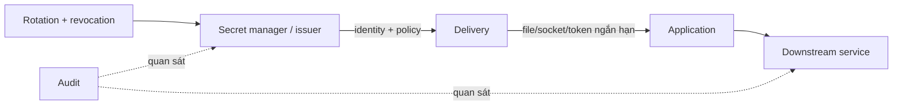
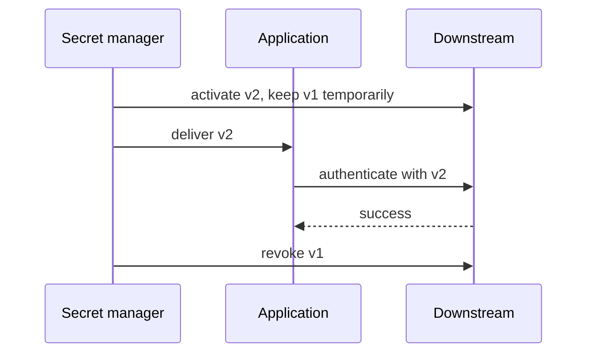

Secret là dữ liệu cho phép actor thực hiện hành động nhạy cảm: password, API token, private key, certificate client, signing key hoặc cloud credential. Mục tiêu không chỉ là “không commit Git” mà là giảm nơi secret xuất hiện, authority, thời gian sống và blast radius khi lộ.



## Vòng đời secret

| Giai đoạn | Câu hỏi bắt buộc |
|---|---|
| Tạo | Entropy đủ không, issuer nào, owner nào? |
| Lưu | Có mã hóa, access policy và backup/recovery không? |
| Cấp phát | Workload nào nhận, qua kênh nào, có ghi log không? |
| Sử dụng | Scope, TTL, audience và network path là gì? |
| Rotate | App reload/reconnect thế nào, có overlap an toàn không? |
| Revoke | Thu hồi trong bao lâu, phát hiện usage sau revoke không? |
| Audit | Ai/identity nào đọc và dùng secret, log giữ bao lâu? |

Ưu tiên identity ngắn hạn do platform phát hành thay static token dài hạn. Nếu phải dùng static secret, scope hẹp, version và rotate định kỳ.

## Không đưa secret vào image/build metadata

Các anti-pattern:

```dockerfile
ENV API_TOKEN=real-secret
ARG NPM_TOKEN
COPY id_rsa /root/.ssh/id_rsa
RUN echo "$NPM_TOKEN" > /root/.npmrc && npm ci && rm /root/.npmrc
```

Xóa file ở instruction sau không xóa bytes khỏi layer/cache cũ. Dùng BuildKit secret/SSH mount:

```dockerfile
# syntax=docker/dockerfile:1
RUN --mount=type=secret,id=npmrc,target=/root/.npmrc,required=true \
    npm ci
```

```bash
docker buildx build \
  --secret id=npmrc,src="$HOME/.npmrc" \
  --tag app:dev .
```

Xem chi tiết tại [Secret và SSH mounts](/docs/buildkit/secret-and-ssh-mounts/).

## Environment variable có giới hạn gì?

Environment tiện nhưng dễ xuất hiện trong:

- `docker inspect` và deployment model;
- process dump/debug/support bundle;
- log khi app in config hoặc shell `set -x`;
- CI job output;
- child process kế thừa environment.

```bash
# Chỉ inventory tên biến, không in value production
docker inspect CONTAINER --format '{{range .Config.Env}}{{println .}}{{end}}' \
  | sed 's/=.*$/=<redacted>/'
```

File mount tránh một số accidental exposure và có permission rõ hơn, nhưng application compromised vẫn đọc được file. File không phải vault.

## Secrets trong Docker Compose

```yaml
services:
  api:
    image: registry.example.com/team/api@sha256:REPLACE_WITH_DIGEST
    user: "10001:10001"
    secrets:
      - source: db_password
        target: db_password

secrets:
  db_password:
    file: ./secrets/db-password.txt
```

Trong container, secret thường ở `/run/secrets/db_password`. Chỉ service được grant mới nhận mount.

<Callout type="warn" title="Compose local không tự mã hóa secret">
  Trên Docker Compose với Engine thông thường, file-backed secret dựa trên file/mount phía host. Compose cải thiện phân phối theo service nhưng không bảo vệ host root, không tự rotate và không biến source file thành encrypted secret store.
</Callout>

Không commit source:

```text
# .gitignore
secrets/*
!secrets/README.md
```

`.gitignore` không xử lý secret đã commit. Khi nghi lộ: revoke/rotate trước, rồi dọn history và cache.

Xem [Configs và secrets](/docs/docker-compose/configs-and-secrets/) cho behavior Compose và `_FILE` convention.

## Runtime delivery tốt hơn

Tùy hạ tầng, ưu tiên:

- workload identity lấy token ngắn hạn theo audience;
- secret manager agent/sidecar ghi file vào tmpfs;
- Unix socket/API local trả credential có TTL;
- CSI/provider hoặc orchestrator secret integration;
- application gọi secret manager trực tiếp bằng workload identity.

Đánh giá failure mode: secret manager down, token hết hạn, clock skew, app reload fail, cache credential và rate limit. Chọn fail-open/fail-closed theo workload; không để app âm thầm dùng credential cũ vô hạn.

## Permission và ownership

Với file secret:

```bash
install -m 0600 /dev/null ./secrets/db-password.txt
stat -c '%U:%G %a %n' ./secrets/db-password.txt
```

Trong container:

```bash
docker exec CONTAINER stat -c '%u:%g %a %n' /run/secrets/db_password
```

Compose file-backed mounts có giới hạn hỗ trợ `uid`, `gid`, `mode` tùy implementation. Xác minh effective permission; không nới `0444` hoặc chạy root chỉ để app đọc được.

## Rotation không downtime

Quy trình versioned secret:

1. Tạo credential `v2` với scope tương đương hoặc hẹp hơn.
2. Cho downstream chấp nhận `v1` và `v2` trong overlap ngắn.
3. Cấp `v2` và recreate/reload workload.
4. Xác minh request mới dùng `v2` qua audit, không in value.
5. Revoke `v1`.
6. Alert mọi usage `v1` sau revoke.
7. Xóa source/cache cũ theo retention.



Test rotation trước incident. Với database pool, app có thể giữ connection xác thực bằng credential cũ; cần reconnect/drain có chủ đích.

## Khi secret bị lộ

Không chỉ xóa file:

1. Revoke hoặc disable credential ngay.
2. Xác định scope, TTL, audience và thời gian exposure.
3. Tìm usage qua provider/downstream audit.
4. Rotate credential liên quan nếu có reuse/derivation.
5. Xóa khỏi image layer, registry, build cache, artifact, log và support bundle.
6. Rebuild image/cache từ mốc sạch.
7. Sửa delivery path và thêm canary/detector.

Nếu secret từng vào image đã push, coi mọi người có quyền pull image là có thể đọc secret, kể cả file đã `rm` ở layer sau.

## Checklist

- Secret không nằm trong Dockerfile, image layer, label, build arg hoặc Git.
- Mỗi workload có credential riêng; không dùng chung theo team/environment rộng.
- Scope/audience tối thiểu và TTL ngắn nhất app hỗ trợ.
- Delivery không in value vào log; debug output được redact.
- File permission và user namespace mapping được xác minh.
- Rotation/revocation được diễn tập và có owner.
- Backup/export secret có policy riêng.
- Runtime egress giới hạn nơi credential có thể được dùng.
- Audit phát hiện usage từ identity, IP, region hoặc time bất thường.

## Nguồn chính thức

- [Manage secrets securely in Docker Compose](https://docs.docker.com/compose/how-tos/use-secrets/)
- [Build secrets](https://docs.docker.com/build/building/secrets/)
- [Docker Swarm secrets](https://docs.docker.com/engine/swarm/secrets/)
- [OWASP Secrets Management Cheat Sheet](https://cheatsheetseries.owasp.org/cheatsheets/Secrets_Management_Cheat_Sheet.html)
