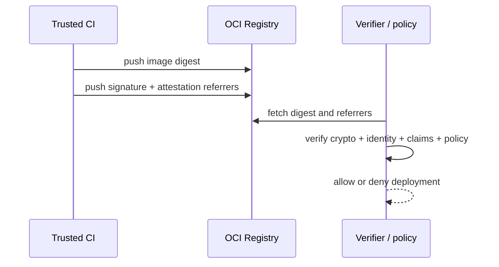

Chữ ký số liên kết artifact digest với private key hoặc workload identity. Verification chỉ có ý nghĩa khi policy biết **key/identity nào được tin**, **cho repository nào**, **từ workflow nào** và **evidence nào bắt buộc**.



## Digest, signature và provenance

| Cơ chế | Bảo đảm chính | Không tự bảo đảm |
|---|---|---|
| Digest | Bytes nhận được đúng content-address | Publisher là ai |
| Signature | Key/identity ký payload gắn digest | Image không có CVE |
| Provenance | Metadata source/material/builder | Metadata đáng tin nếu chưa verify signer |
| SBOM | Component inventory | Component không có vulnerability |
| Deployment policy | Rule nào được enforce | Rule đúng nếu cấu hình/identity sai |

Luôn ký digest đã push. Tag có thể bị đổi giữa lúc ký và verify.

## Chọn trust model

### Key-managed

CI ký bằng key trong KMS/HSM hoặc key file:

- dễ hiểu và có thể verify offline bằng public key;
- cần generation, access control, rotation, revocation, backup;
- khó biết workflow nào dùng key nếu nhiều pipeline share cùng key.

### Keyless identity

CI nhận short-lived certificate bằng OIDC identity rồi ký:

- tránh private key dài hạn trong CI;
- policy ràng buộc issuer và subject/workflow;
- phụ thuộc OIDC, certificate authority/transparency infrastructure hoặc bundle;
- identity claim phải đủ chặt, không chỉ organization rộng.

Không có lựa chọn đúng cho mọi môi trường. Air-gap, compliance, KMS hiện có, registry support và incident response quyết định mô hình.

## Cosign với key pair

Tạo key pair chỉ cho lab:

```bash
cosign generate-key-pair
```

Lệnh tạo `cosign.key` và `cosign.pub`; private key được bảo vệ bằng password. Không commit `cosign.key`.

Ký image remote theo digest:

```bash
IMAGE='registry.example.com/team/api'
DIGEST='sha256:REPLACE_WITH_REAL_DIGEST'
cosign sign --key cosign.key "${IMAGE}@${DIGEST}"
```

Verify:

```bash
cosign verify \
  --key cosign.pub \
  "${IMAGE}@${DIGEST}"
```

Production nên dùng KMS/HSM hoặc keyless identity thay private key local. Pin Cosign version và đọc output/exit code; đừng chỉ grep chuỗi “Verified”.

## Cosign keyless

Trong CI có OIDC identity:

```bash
cosign sign "${IMAGE}@${DIGEST}"
```

Verifier phải ràng buộc identity và issuer:

```bash
cosign verify \
  --certificate-identity 'https://github.com/example/api/.github/workflows/release.yml@refs/heads/main' \
  --certificate-oidc-issuer 'https://token.actions.githubusercontent.com' \
  "${IMAGE}@${DIGEST}"
```

Identity claim thực tế phụ thuộc CI provider và Cosign version. Lấy từ signature hợp lệ trong môi trường test, review exact claim rồi pin pattern hẹp. Tránh regex cho phép mọi branch, fork hoặc workflow trong organization.

<Callout type="error" title="Có signature chưa đủ">
  `cosign verify IMAGE` mà không ràng buộc signer theo trust model có thể chấp nhận signature của identity không mong muốn hoặc không đáp ứng policy. Verification phải kiểm tra claims, issuer, subject và digest.
</Callout>

## Signature và attestation trong OCI registry

Cosign hiện dùng OCI referrer/registry artifacts tùy registry capability. Kiểm tra tree:

```bash
cosign tree "${IMAGE}@${DIGEST}"
```

Registry, mirror, retention và garbage collection phải giữ:

- image index và platform manifests;
- signature;
- SBOM/provenance attestation;
- transparency/offline bundle nếu policy cần;
- artifact cũ trong audit/rollback window.

Test copy từ staging sang production. Việc image pull được không chứng minh referrer đã được copy.

## Notation / Notary Project

Notation là lựa chọn OCI signing khác, dùng trust store, trust policy và plugin/KMS. Khi chọn giữa Cosign và Notation, đánh giá:

| Tiêu chí | Câu hỏi |
|---|---|
| Registry | Referrer/discovery/delete/replication hỗ trợ thế nào? |
| Identity | OIDC keyless hay x509/KMS trust store? |
| Policy | Admission/deployment engine nào hỗ trợ? |
| Air-gap | Trust root, timestamp và bundle chuyển ra sao? |
| Rotation | Artifact cũ verify thế nào sau key rotation/revocation? |
| Operations | Tool/version/plugin nào team có thể vận hành? |

Không ký cùng lúc bằng hai hệ sinh thái nếu không có consumer/policy rõ; nhiều signature không tự tăng assurance và làm retention/incident phức tạp hơn.

## Docker Content Trust là legacy

Docker Content Trust/Notary v1 dùng `DOCKER_CONTENT_TRUST=1` và `docker trust`. Docker đã công bố retirement; Notary v1 service tại `notary.docker.io` dự kiến dừng ngày **08/12/2026**.

Không xây hệ thống mới trên DCT. Inventory và migration sang OCI signing hiện đại theo [Content trust](/docs/registry-va-distribution/content-trust/). Không chỉ `unset DOCKER_CONTENT_TRUST` rồi coi migration hoàn tất; cần enforcement thay thế.

## Key rotation và revocation

Policy phải định nghĩa:

- key/identity mới bắt đầu được tin khi nào;
- overlap giữa old/new signer;
- artifact cũ có tiếp tục verify không;
- revoked key làm invalid artifact nào;
- emergency re-sign có được phép không;
- audit retention của signing request;
- ai có quyền đổi trust policy.

Khi key lộ, attacker có thể ký artifact mới. Revoke key, dừng deploy, inventory signature/digest trong khoảng ảnh hưởng và xác minh source/provenance; chỉ rotate key mà không điều tra artifact đã ký là chưa đủ.

## Multi-platform image

Quyết định ký:

- image index digest để bảo vệ tập platform;
- từng platform manifest nếu consumer/policy yêu cầu;
- cả hai với rule rõ ràng.

Pipeline phải fail nếu một platform thiếu evidence. Không copy digest `amd64` rồi tưởng đã ký cả multi-platform release.

## Verification gate

Một gate tối thiểu:

1. resolve approved image thành digest;
2. fetch signature/referrer từ registry production;
3. verify crypto và digest claim;
4. verify key hoặc OIDC issuer + exact identity;
5. verify repository/subject và annotation bắt buộc;
6. verify provenance/SBOM policy riêng;
7. fail closed nếu evidence thiếu, malformed hoặc registry timeout;
8. ghi decision, digest, signer và policy version;
9. deploy chính digest vừa verify.

Break-glass phải có approval độc lập, TTL, scope một digest/environment và retrospective.

## Nguồn chính thức

- [Sigstore Cosign: signing containers](https://docs.sigstore.dev/cosign/signing/signing_with_containers/)
- [Sigstore Cosign: verifying signatures](https://docs.sigstore.dev/cosign/verifying/verify/)
- [Notation documentation](https://notaryproject.dev/docs/)
- [OCI Distribution Specification](https://github.com/opencontainers/distribution-spec)
- [Docker Content Trust retirement](/docs/registry-va-distribution/content-trust/)
