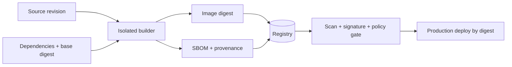

Container supply chain gồm mọi bước biến source và dependency thành artifact chạy production. Attacker không cần phá container runtime nếu có thể sửa source, dependency, CI workflow, build cache, registry tag hoặc deployment manifest.



## Threat theo từng stage

| Stage | Threat | Control ưu tiên |
|---|---|---|
| Source | Account/review bypass, workflow bị sửa | MFA, branch protection, CODEOWNERS, signed/audited release |
| Dependency | Typosquatting, dependency confusion, mutable version | Private namespace policy, lockfile, digest/checksum, update automation |
| Build | PR lấy secret, poisoned cache, runner persistence | Trusted/restricted runner, ephemeral builder, secret mount, network control |
| Image | Secret/package thừa, base cũ | Multi-stage, non-root USER, SBOM, scan, minimal runtime |
| Registry | Token lộ, tag overwrite, referrer bị xóa | Least privilege, immutable tag, digest, retention, audit |
| Promotion | Rebuild giữa staging/prod, copy mất metadata | Build once, promote same digest, verify referrer |
| Deploy | Pull mutable tag, không verify signer | Admission/release policy theo digest + identity |

## Source và dependency

- Release chỉ từ protected branch/tag và reviewed workflow.
- Third-party CI action/plugin phải pin immutable revision, không dùng moving tag tùy tiện.
- Language dependency dùng lockfile/checksum và private registry scope rõ.
- Base image pin tag dễ đọc + digest; có bot/process cập nhật định kỳ.
- Download trong Dockerfile phải dùng HTTPS và verify checksum/signature.
- Không chạy install script từ URL mutable bằng `curl | sh` trong trusted build.

Ví dụ tải artifact có checksum:

```dockerfile
ARG TOOL_VERSION=1.2.3
ARG TOOL_SHA256=REPLACE_WITH_REVIEWED_SHA256
RUN curl --fail --show-error --location \
      "https://downloads.example.com/tool-${TOOL_VERSION}.tar.gz" \
      --output /tmp/tool.tar.gz \
    && echo "${TOOL_SHA256}  /tmp/tool.tar.gz" | sha256sum --check - \
    && tar -xzf /tmp/tool.tar.gz -C /usr/local/bin \
    && rm /tmp/tool.tar.gz
```

Checksum phải đến từ trust channel được review; hash nằm cạnh URL độc hại do cùng attacker kiểm soát không tạo trust.

## Tách trusted và untrusted build

Pull request từ fork là input không tin cậy. Nó có thể sửa Dockerfile/script để đọc mọi secret mount hoặc gửi credential ra mạng.

```text
Untrusted PR: lint/test với token tối thiểu, không push release
Trusted merge: isolated runner -> build -> attest -> push -> sign
```

- dùng runner ephemeral và xóa state sau job;
- không dùng production secret ở PR job;
- tách cache theo trust zone hoặc chỉ import cache read-only đã kiểm soát;
- hạn chế egress của builder khi khả thi;
- release identity chỉ usable từ protected workflow/ref;
- review thay đổi CI config như production code.

## Build artifact và metadata

Build release một lần:

```bash
docker buildx build \
  --platform linux/amd64,linux/arm64 \
  --sbom=true \
  --provenance=mode=max \
  --tag registry.example.com/team/api:1.4.0 \
  --push .
```

Sau push, ghi index digest. Scan, ký và promote digest đó; không rebuild riêng cho production.

Metadata có vai trò khác nhau:

| Metadata/control | Trả lời |
|---|---|
| Digest | Artifact bytes nào? |
| SBOM | Có component/package nào? |
| Provenance | Source/material/builder/parameter nào tạo artifact? |
| Vulnerability report | Artifact có advisory đã biết nào tại thời điểm scan? |
| Signature | Key/identity nào ký digest/attestation? |
| Policy result | Evidence có thỏa rule deploy không? |

Không control nào thay tất cả control còn lại.

## Promotion và registry

Promotion đúng là copy/re-tag cùng manifest/index digest. Sau promotion cần verify:

- index và mọi platform manifest giữ digest mong đợi;
- SBOM/provenance/signature referrer còn tồn tại;
- registry replication/garbage collection không xóa metadata;
- production pull credential chỉ có quyền đọc;
- rollback digest vẫn trong retention window;
- tag immutable/moving tag update được audit.

Xem [Image name, tag và digest](/docs/registry-va-distribution/image-names-tags-digests/) và [Registry storage](/docs/registry-va-distribution/registry-storage/).

## Policy gate mẫu

Một release policy có thể yêu cầu:

1. reference production là digest;
2. repository thuộc allowlist;
3. signature hợp lệ từ đúng OIDC issuer + workflow identity;
4. provenance source repository/revision khớp release;
5. builder identity thuộc allowlist;
6. SBOM tồn tại cho mọi platform;
7. không có critical/high fixable ngoài exception còn hạn;
8. base image thuộc approved list;
9. config default user non-root;
10. evidence vẫn tồn tại sau promotion.

Policy phải default deny khi evidence thiếu hoặc không parse được. Thiết kế break-glass có approval, TTL, audit và retrospective; không biến network timeout thành auto allow.

## SLSA và mức trưởng thành

SLSA cung cấp framework tăng assurance cho build/provenance. Không cần tuyên bố level ngay để bắt đầu:

- **Baseline:** build script versioned, artifact theo digest, runner access có audit.
- **Tiếp theo:** provenance tự động, isolated/ephemeral builder, secret scope hẹp.
- **Nâng cao:** tamper-resistant provenance, hardened build platform và policy verification độc lập.

Chỉ claim mức đáp ứng sau assessment theo version specification cụ thể; có provenance JSON không tự động đạt SLSA level.

## Dependency và base update

Pin digest tạo reproducibility nhưng cũng đóng băng vulnerability. Cần vòng lặp:

```text
Discover update -> review diff/advisory -> rebuild -> test -> scan
-> sign -> canary -> deploy -> retire old digest
```

Theo dõi end-of-life của distro/runtime. Image nhỏ không nhất thiết an toàn hơn nếu thiếu update channel hoặc scanner không nhận diện component.

## Incident supply chain

Khi nghi release pipeline bị compromise:

1. Dừng promotion/deploy nhưng giữ evidence.
2. Revoke CI, registry và signing identities liên quan.
3. Inventory mọi digest được build/push trong khoảng ảnh hưởng.
4. Xác minh source revision, workflow, runner, provenance và audit log.
5. Quarantine artifact; không chỉ xóa tag vì digest có thể còn referenced.
6. Rebuild bằng clean builder từ source/dependency đã xác minh.
7. Ký bằng identity/key mới nếu trust root bị ảnh hưởng.
8. Deploy digest sạch và tìm usage artifact cũ ở mọi environment.

## Checklist nhanh

- [ ] Source/workflow release có protected review.
- [ ] PR không tin cậy không nhận production secret.
- [ ] Dependency/base/download được pin và có update process.
- [ ] Builder ephemeral hoặc được reset, cache chia trust zone.
- [ ] BuildKit secret mount thay `ARG`/`ENV` secret.
- [ ] SBOM/provenance tạo tự động cho mọi platform.
- [ ] Scan, sign, approve và deploy cùng digest.
- [ ] Registry giữ/copy cả image và security metadata.
- [ ] Verification policy ràng buộc signer identity, không chỉ “có signature”.
- [ ] Rollback và incident response được diễn tập.

## Nguồn chính thức

- [SLSA specification](https://slsa.dev/spec/)
- [OpenSSF Supply Chain Integrity](https://best.openssf.org/SCM-BestPractices/)
- [Build attestations](https://docs.docker.com/build/metadata/attestations/)
- [OCI Image Specification](https://github.com/opencontainers/image-spec)
- [Ký và xác minh image](/docs/security/signing-and-verification/)
