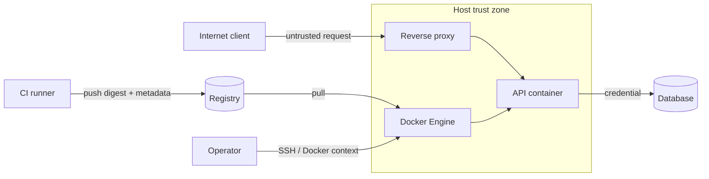

Threat model mô tả **cần bảo vệ gì**, **khỏi ai**, **qua đường nào** và **rủi ro nào được chấp nhận**. Nếu bỏ bước này, team dễ harden theo checklist chung nhưng vẫn để hở control plane quan trọng nhất như Docker socket, CI credential hoặc bind mount dữ liệu production.

## Xác định phạm vi

Một phạm vi đủ nhỏ có thể review trong một buổi:

```text
Workload: payments-api
Environment: production Docker Engine trên Linux
Inputs: HTTPS request, queue message, config và database credential
Outputs: response, log, metric, outbound database connection
Operators: platform team và deployment CI
Không thuộc scope: source control SaaS, database internals
```

Ghi rõ giả định. Ví dụ “host admin được tin cậy”, “các tenant không tin nhau”, “registry là managed service” hoặc “workload xử lý dữ liệu thanh toán”. Threat model thay đổi khi giả định thay đổi.

## Tài sản và actor

| Nhóm | Ví dụ tài sản | Hậu quả nếu mất |
|---|---|---|
| Control plane | Docker socket, daemon API, SSH key, client certificate | Chiếm quyền host và mọi container |
| Artifact | Image digest, signature, SBOM, provenance | Deploy mã không được phê duyệt |
| Credential | Registry token, database password, cloud identity | Truy cập dữ liệu hoặc lateral movement |
| Host | Kernel, device, filesystem, audit log | Container escape, mất toàn bộ node |
| Workload data | Request, file upload, database record | Rò rỉ, sửa hoặc phá hủy dữ liệu |
| Availability | CPU, memory, PID, disk, registry | DoS và thất bại rollout/rollback |

Actor không chỉ là attacker Internet. Hãy xét:

- application bị khai thác qua input không tin cậy;
- developer hoặc operator bị compromise;
- pull request/fork chạy code trong CI;
- dependency, base image hoặc build action độc hại;
- workload khác trên cùng host;
- registry/CI account bị chiếm;
- lỗi cấu hình hoặc thao tác vô ý.

## Vẽ trust boundary và data flow



Đánh dấu nơi dữ liệu đổi trust level: Internet vào proxy, CI push registry, daemon tạo mount/device, container dùng credential gọi database. Mỗi mũi tên cần biết protocol, identity, authorization, encryption và audit source.

## Phân tích theo vòng đời

### Build

Các câu hỏi quan trọng:

- Pull request không tin cậy có nhận production secret không?
- Base image và dependency có được pin, cập nhật và scan không?
- Dockerfile có dùng `ARG`, `ENV` hoặc `COPY` cho secret không?
- Builder/cache dùng chung giữa trust zone nào?
- Provenance có chứng minh source revision và builder identity không?

### Distribution

- Ai được push, overwrite tag hoặc xóa artifact?
- Deploy resolve tag một lần hay pull mutable tag sau approval?
- Mirror/promotion có giữ signature, SBOM và provenance không?
- Retention có xóa image đang nằm trong rollback window không?
- Registry token có scope và thời hạn tối thiểu không?

### Runtime

- Process chạy UID nào và còn capabilities nào?
- Container có Docker socket, host path, device hoặc host namespace không?
- Ingress/egress nào thực sự cần?
- Secret nằm ở đâu, rotate và revoke thế nào?
- Resource limit có ngăn workload làm cạn host không?
- Dấu hiệu compromise nào được log và alert?

## Từ threat sang control

| Threat | Điều kiện | Preventive control | Detective/response control |
|---|---|---|---|
| Web exploit ghi web shell | Root filesystem writable | Read-only root, non-root, mount tối thiểu | File/process alert, recreate từ digest sạch |
| Container chiếm host qua socket | Socket được mount | Không mount socket; proxy allowlist nếu bắt buộc | Audit Docker API, isolate node, rotate host credential |
| Tag bị thay sau khi scan | Deploy bằng mutable tag | Scan và deploy cùng digest | So effective digest với release record |
| Kernel exploit | Kernel/runtime chưa vá | Patch, seccomp, LSM, rootless/userns | Host EDR/audit, quarantine và rebuild node |
| Credential bị exfiltrate | Secret quá rộng hoặc sống lâu | Short-lived identity, least privilege, egress control | Provider audit, revoke/rotate, tìm usage bất thường |
| Resource exhaustion | Không có cgroup/PID limit | Memory/CPU/PID/storage quota | Alert saturation/OOM, stop workload |

Một control tốt phải test được. “Dùng image an toàn” không test được; “production chỉ deploy digest có signature từ OIDC issuer X, workflow Y và scan policy pass” thì test được.

## Abuse case mẫu: application bị RCE

Giả sử attacker thực thi command với user của API container:

1. Đọc environment, config, secret mount và process arguments.
2. Ghi file vào path writable để persistence.
3. Quét network nội bộ và metadata service.
4. Thử syscall/capability để escape hoặc quan sát host.
5. Tìm Docker socket, device và bind mount.
6. Dùng credential của service để truy cập database/cloud API.

Các control giảm blast radius:

- secret chỉ cấp đúng service, scope hẹp và rotate được;
- read-only root, writable tmpfs có `noexec,nosuid`;
- `cap_drop: [ALL]`, `no-new-privileges`, seccomp và LSM;
- egress chỉ tới database/API cần thiết;
- không có Docker socket/host mount;
- runtime alert cho shell, process lạ, outbound bất thường;
- replacement container thay vì chữa trực tiếp instance bị nghi compromise.

<Callout type="warn" title="Container escape không phải threat duy nhất">
  Phần lớn incident không cần escape. Attacker có thể đạt mục tiêu bằng credential, data và network hợp lệ mà application đã được cấp. Threat model phải bao gồm quyền của workload, không chỉ kernel boundary.
</Callout>

## Risk register tối thiểu

Ghi mỗi risk với owner và deadline:

| Trường | Nội dung |
|---|---|
| ID và mô tả | Scenario cụ thể, không chỉ tên CVE |
| Asset/impact | Confidentiality, integrity, availability |
| Likelihood | Căn cứ exposure và khả năng khai thác |
| Existing controls | Control đã xác minh, không phải dự định |
| Residual risk | Rủi ro còn lại sau control |
| Action/owner/date | Việc cần làm, người chịu trách nhiệm, hạn |
| Evidence | Config, test output, dashboard, ticket |

Review lại khi đổi base image, runtime, network, mount, identity, CI/registry hoặc dữ liệu xử lý. Incident và near miss cũng phải cập nhật model.

## Câu hỏi review nhanh

- Nếu container bị RCE hôm nay, attacker đọc/ghi được gì?
- Nếu CI bị chiếm, artifact độc hại có qua được deploy policy không?
- Nếu registry tag bị overwrite, production có đổi artifact không?
- Nếu Docker credential của một developer lộ, blast radius là gì?
- Nếu host kernel có zero-day, rootless/userns và node isolation giảm tác động ra sao?
- Nếu detector fail, control phòng ngừa nào vẫn còn?
- Team có thể cô lập workload, giữ bằng chứng và rotate credential trong bao lâu?

## Nguồn tham khảo

- [NIST SP 800-190: Application Container Security Guide](https://csrc.nist.gov/publications/detail/sp/800-190/final)
- [OWASP Threat Modeling](https://owasp.org/www-community/Threat_Modeling)
- [MITRE ATT&CK Containers Matrix](https://attack.mitre.org/matrices/enterprise/containers/)
- [Docker Engine security](/docs/security/)
