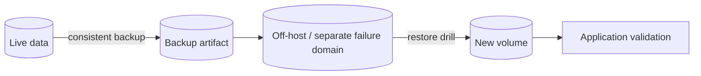

Volume giúp dữ liệu sống qua recreate container; backup giúp phục hồi sau xóa nhầm, corruption, lỗi host hoặc lỗi application. Hai cơ chế giải quyết hai failure domain khác nhau.



Một file archive tồn tại chưa đủ. Backup chỉ đáng tin khi có consistency model, retention, integrity check và restore đã được kiểm thử.

## Chọn consistency level trước

| Phương pháp | Downtime | Consistency | Phù hợp |
|---|---:|---|---|
| Dừng writer rồi copy filesystem | Có | Tốt nếu application flush sạch | App đơn giản, maintenance window |
| Application-native dump | Thường không cần dừng | Theo guarantee của application | Database, logical migration |
| Storage snapshot phối hợp quiesce | Rất ngắn hoặc không | Phụ thuộc app + backend | Dataset lớn, RTO chặt |
| Copy live files bằng `tar` | Không | Có thể không nhất quán | Chỉ file immutable hoặc app cho phép |

<Callout type="warn" title="Không tar live database theo phản xạ">
  Database có buffer, WAL/journal và invariant giữa nhiều file. Dùng `pg_dump`, `pg_basebackup`, `mysqldump`, backup API hoặc quy trình snapshot được database hỗ trợ. File-level copy chỉ an toàn theo tài liệu của chính database.
</Callout>

## Lab: backup một named volume

Tạo volume và dataset nhỏ:

```bash
docker volume create backup-source
docker run --rm \
  --mount type=volume,src=backup-source,dst=/data \
  alpine:3.22 sh -c '
    mkdir -p /data/config /data/uploads
    printf "version=1\n" > /data/config/app.conf
    printf "payload\n" > /data/uploads/item.txt
  '
```

Tạo directory backup trên host:

```bash
mkdir -p "$PWD/storage-backups"
```

Vì lab không có writer đang chạy, helper container có thể archive nhất quán. Mount source read-only để tránh sửa nhầm:

```bash
docker run --rm \
  --mount type=volume,src=backup-source,dst=/data,readonly \
  --mount type=bind,src="$PWD/storage-backups",dst=/backup \
  alpine:3.22 \
  tar -czf /backup/backup-source.tgz -C /data .
```

Tạo checksum ngoài archive:

```bash
(
  cd "$PWD/storage-backups"
  sha256sum backup-source.tgz > backup-source.tgz.sha256
  sha256sum --check backup-source.tgz.sha256
)
```

Checksum phát hiện artifact thay đổi; nó không chứng minh dữ liệu application nhất quán hay không độc hại.

## Restore vào volume mới

Không restore đè dataset duy nhất trước khi kiểm tra. Tạo destination độc lập:

```bash
docker volume create backup-restored
docker run --rm \
  --mount type=volume,src=backup-restored,dst=/restore \
  --mount type=bind,src="$PWD/storage-backups",dst=/backup,readonly \
  alpine:3.22 \
  tar -xzf /backup/backup-source.tgz -C /restore
```

Kiểm tra cấu trúc và nội dung:

```bash
docker run --rm \
  --mount type=volume,src=backup-restored,dst=/data,readonly \
  alpine:3.22 sh -c '
    find /data -maxdepth 3 -type f -print
    grep -qx "version=1" /data/config/app.conf
    grep -qx "payload" /data/uploads/item.txt
  '
```

Sau file-level validation, bước production còn phải start application/database trên volume restore và chạy health/integrity check ở cấp domain.

## Ownership và metadata khi restore

Archive có thể chứa numeric UID/GID và mode từ environment nguồn. Environment đích có thể dùng UID mapping khác, rootless mode hoặc NFS policy khác.

Trước cutover:

```bash
docker run --rm \
  --mount type=volume,src=backup-restored,dst=/data,readonly \
  alpine:3.22 find /data -maxdepth 2 -printf '%u:%g %m %p\n'
```

Nếu cần đổi ownership, làm trong bước migration có log và phạm vi cụ thể. Không `chown -R` dataset lớn ngay trong application startup mà không đo duration.

## Backup pipeline production

Một pipeline tối thiểu nên có:

1. **Inventory**: volume/dataset nào thuộc service và owner nào.
2. **Quiesce/dump**: tạo consistent point theo application.
3. **Capture**: archive, snapshot hoặc native backup.
4. **Protect**: encryption in transit/at rest và access control.
5. **Transfer**: lưu ngoài Docker host hoặc failure domain nguồn.
6. **Verify**: checksum, manifest, backup tool validation.
7. **Retain**: policy daily/weekly/monthly và immutable retention nếu cần.
8. **Restore drill**: phục hồi vào environment cô lập.
9. **Application validation**: query, integrity check và smoke test.
10. **Evidence**: duration, size, recovery point và kết quả drill.

## RPO, RTO và retention

- **RPO**: chấp nhận mất bao nhiêu dữ liệu tính từ thời điểm failure.
- **RTO**: mất bao lâu để service hoạt động lại.

Backup nightly có RPO xấp xỉ 24 giờ trong worst case, dù restore chỉ mất 10 phút. Ngược lại, continuous archive có RPO nhỏ nhưng restore phức tạp có thể làm RTO dài.

Đo bằng restore thật. Không lấy thời gian upload backup làm RTO.

## Những gì cần backup ngoài volume data

Tùy service, cần giữ thêm:

- image digest hoặc release manifest;
- Compose/deployment config;
- schema migration version;
- secret reference và quy trình cấp lại key;
- volume driver/backend configuration;
- runbook restore;
- application version tương thích dữ liệu.

Không archive Docker internal directory `/var/lib/docker` như một backup portable mặc định. Layout phụ thuộc Engine/image store/driver và live copy có thể không nhất quán.

## Migration sang host khác

Quy trình an toàn:

1. tạo consistent backup trên nguồn;
2. copy artifact qua kênh có integrity/authentication;
3. tạo volume đích bằng đúng driver/options;
4. restore vào volume đích;
5. kiểm tra UID/GID và application compatibility;
6. start một writer duy nhất;
7. validate trước khi chuyển traffic;
8. giữ nguồn read-only cho tới khi rollback window kết thúc.

Với external volume driver, có thể không cần copy data, nhưng attach cùng backend sang host mới vẫn cần fencing và driver-specific runbook.

## Cleanup bài thực hành

```bash
docker volume rm backup-source backup-restored
rm -rf "$PWD/storage-backups"
```

Command cuối xóa backup lab trên host; không chạy nếu directory chứa artifact thật.

## Nguồn chính thức

- [Backup, restore hoặc migrate Docker volumes](https://docs.docker.com/engine/storage/volumes/#back-up-restore-or-migrate-data-volumes)
- [Docker volumes](https://docs.docker.com/engine/storage/volumes/)
- [PostgreSQL backup and restore](https://www.postgresql.org/docs/current/backup.html)
