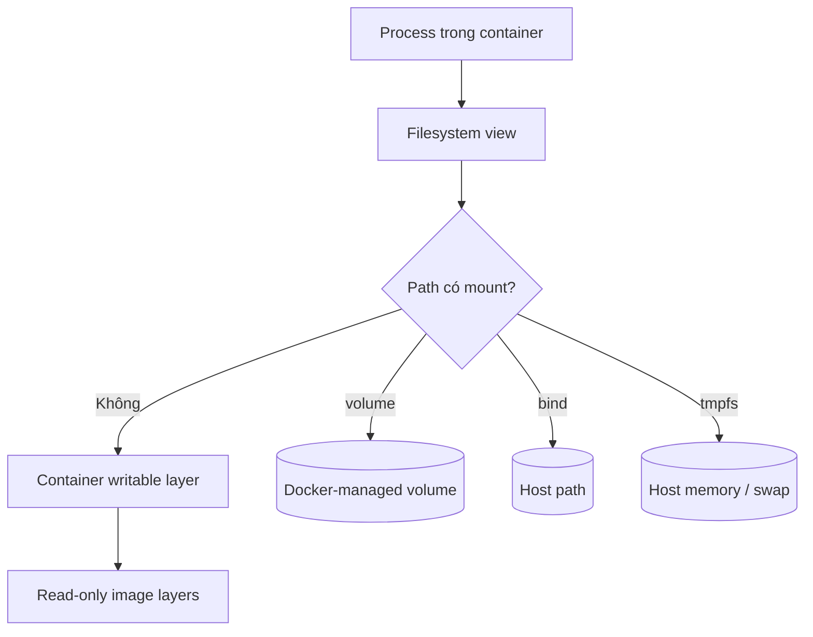

Filesystem mà process nhìn thấy trong container là kết quả ghép nhiều nguồn dữ liệu. Image cung cấp các layer chỉ đọc; mỗi container có một writable layer riêng; các mount có thể che một phần filesystem đó bằng dữ liệu nằm ngoài lifecycle của container.



<Callout type="warn" title="Quy tắc quan trọng">
  `docker stop` giữ container object và writable layer; `docker rm` xóa writable layer. Volume tồn tại độc lập, bind mount dùng trực tiếp host path, còn tmpfs mất nội dung khi container dừng hoặc được tạo lại.
</Callout>

## Hai bài toán storage khác nhau

Docker dùng từ *storage* cho hai phạm vi cần phân biệt:

1. **Daemon storage backend** lưu image layer và writable layer. Docker Engine 29.0 trở lên dùng containerd image store mặc định cho cài đặt mới; hệ thống cũ có thể vẫn dùng classic storage driver như `overlay2`.
2. **Application data persistence** đưa dữ liệu ra ngoài writable layer bằng volume, bind mount hoặc tmpfs.

Storage driver hay snapshotter không biến writable layer thành nơi lưu database bền vững. Nó chỉ thay đổi cách daemon triển khai layer.

## Chọn loại mount theo ownership

| Cơ chế | Ai quản lý vị trí dữ liệu? | Lifecycle | Trường hợp phù hợp |
|---|---|---|---|
| Writable layer | Docker, gắn với container | Mất khi `docker rm` | File tạm nhỏ, state có thể tái tạo |
| Named volume | Docker và volume driver | Độc lập với container | Database, uploads, state ứng dụng |
| Bind mount | Operator quản lý host path | Theo host path | Source code, config, artifact cần host truy cập |
| tmpfs | Linux kernel, trong memory | Mất khi container dừng | Scratch data, cache ngắn hạn, runtime secret |

Ba câu hỏi thường đủ để chọn:

- Dữ liệu có phải sống qua việc recreate container không? Nếu có, loại writable layer.
- Host process hoặc developer có cần truy cập trực tiếp path không? Nếu có, cân nhắc bind mount; nếu không, ưu tiên volume.
- Dữ liệu có chủ ý phải biến mất và chịu được memory pressure không? Nếu có, cân nhắc tmpfs có giới hạn.

## Mount che dữ liệu trong image

Mount vào một directory đã có file trong image sẽ **obscure** các file đó. Dữ liệu không bị xóa, nhưng container không nhìn thấy cho tới khi được tạo lại mà không có mount.

Named volume rỗng là trường hợp đặc biệt: Docker mặc định copy nội dung sẵn có tại target trong image vào volume mới. Bind mount và tmpfs không có bước copy này. Có thể tắt việc copy cho volume bằng `volume-nocopy`.

```text
Image có /app/default.conf
          │
          ├── không mount ──> thấy default.conf
          ├── bind ./config:/app ──> thấy nội dung ./config
          └── volume rỗng:/app ──> Docker seed default.conf vào volume
```

## Lab: quan sát ba lifecycle

Tạo volume và host directory cho bài thực hành:

```bash
docker volume create storage-overview-data
mkdir -p /tmp/storage-overview-host
```

Chạy container với volume, bind mount và tmpfs:

```bash
docker run -d --name storage-overview \
  --mount type=volume,src=storage-overview-data,dst=/data \
  --mount type=bind,src=/tmp/storage-overview-host,dst=/host \
  --mount type=tmpfs,dst=/memory,tmpfs-size=16777216 \
  alpine:3.22 sleep 1d
```

Ghi một file vào mỗi nơi:

```bash
docker exec storage-overview sh -c '
  printf volume > /data/value
  printf bind > /host/value
  printf tmpfs > /memory/value
  printf layer > /layer-value
'
```

Dừng rồi start **cùng container object**:

```bash
docker stop storage-overview
docker start storage-overview
docker exec storage-overview sh -c '
  cat /data/value
  cat /host/value
  cat /layer-value
  test ! -e /memory/value && echo tmpfs-reset
'
```

Expected output:

```text
volumebindlayertmpfs-reset
```

Volume, bind data và writable layer còn vì container object chưa bị xóa; tmpfs đã được tạo mới. Bây giờ xóa container:

```bash
docker rm -f storage-overview
```

Sau `docker rm`, volume và host file vẫn tồn tại; writable layer thì không. Dùng helper container để xác minh hai nguồn bền vững:

```bash
docker run --rm \
  --mount type=volume,src=storage-overview-data,dst=/data,readonly \
  --mount type=bind,src=/tmp/storage-overview-host,dst=/host,readonly \
  alpine:3.22 sh -c 'cat /data/value; cat /host/value'
```

Expected output:

```text
volumebind
```

## Quan sát trước khi thay đổi

Dùng `docker inspect` để xác định source of truth thay vì suy luận từ command hoặc file Compose:

```bash
docker inspect CONTAINER --format '{{json .Mounts}}'
docker volume ls
docker volume inspect VOLUME
docker system df -v
```

Trong `.Mounts`, kiểm tra `Type`, `Source`, `Destination`, `RW` và `Propagation`. Với remote daemon, `Source` luôn thuộc máy chạy daemon, không phải máy chạy Docker CLI.

Không sửa trực tiếp nội dung dưới `/var/lib/docker`. Đây là vùng dữ liệu nội bộ của daemon; đường dẫn và layout có thể khác theo image store, storage driver, rootless mode hoặc Docker Desktop.

## Boundary về durability và backup

Volume **không đồng nghĩa với backup**. Nó chỉ tách lifecycle dữ liệu khỏi container trên cùng storage backend. Xóa nhầm volume, lỗi filesystem, lỗi host hoặc lỗi application vẫn có thể làm mất dữ liệu.

Một thiết kế production cần tách:

- persistence: dữ liệu sống qua recreate container;
- consistency: backup phản ánh state hợp lệ của application;
- redundancy: chịu được failure của disk/host;
- recovery: restore đã được kiểm thử với RPO và RTO cụ thể.

Đọc [Backup và restore dữ liệu](/docs/storage/backup-and-restore/) trước khi vận hành workload có state.

## Lộ trình phần Storage

1. [Container writable layer](/docs/storage/writable-layer/) — CoW, disk usage và dữ liệu tạm.
2. [Docker volumes](/docs/storage/volumes/), [Bind mounts](/docs/storage/bind-mounts/) và [tmpfs mounts](/docs/storage/tmpfs-mounts/) — ba cơ chế mount chính.
3. [Mount syntax](/docs/storage/mount-syntax/) — chọn `--mount`, `-v` và xác minh cấu hình.
4. [Volume drivers](/docs/storage/volume-drivers/) — external/shared storage và failure boundary.
5. [Permission và ownership](/docs/storage/permissions-and-ownership/) — UID/GID, SELinux, rootless và user namespaces.
6. [Backup và restore](/docs/storage/backup-and-restore/) cùng [Storage cho database](/docs/storage/database-storage/) — durability ở cấp application.
7. [Troubleshooting storage](/docs/storage/storage-troubleshooting/) — quy trình chẩn đoán dựa trên evidence.

## Cleanup bài thực hành

```bash
docker rm -f storage-overview 2>/dev/null || true
docker volume rm storage-overview-data
rm -rf /tmp/storage-overview-host
```

## Nguồn chính thức

- [Docker storage](https://docs.docker.com/engine/storage/)
- [Docker volumes](https://docs.docker.com/engine/storage/volumes/)
- [Bind mounts](https://docs.docker.com/engine/storage/bind-mounts/)
- [tmpfs mounts](https://docs.docker.com/engine/storage/tmpfs/)
- [Storage drivers](https://docs.docker.com/engine/storage/drivers/)
