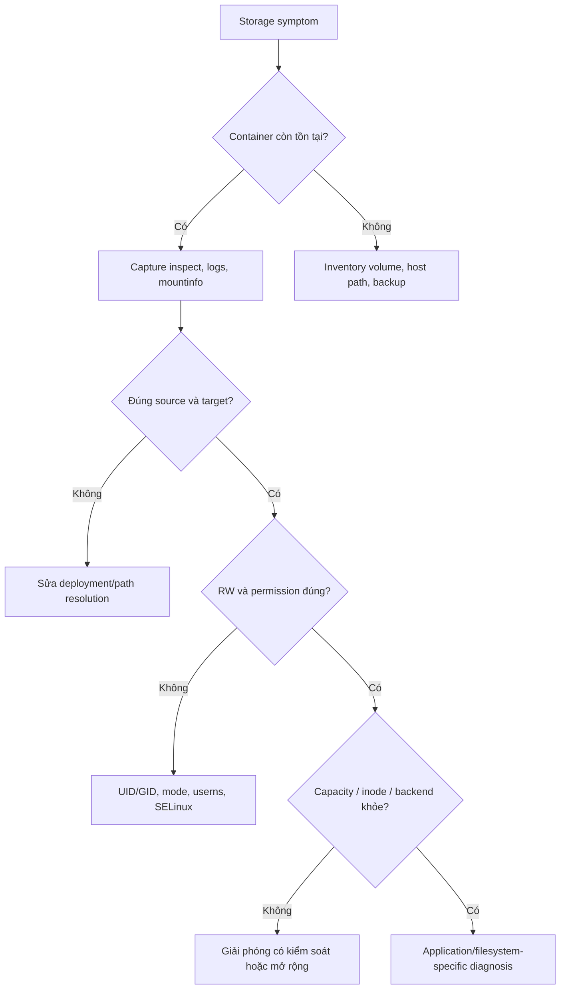

Storage incident dễ trở nên tệ hơn nếu phản xạ đầu tiên là `docker rm`, `docker volume prune`, `chmod -R` hoặc restart liên tục. Hãy capture identity, mount contract và disk state trước khi thay đổi.



## 1. Freeze các thao tác phá hủy evidence

Trước khi recreate hoặc cleanup:

```bash
docker ps --all --no-trunc
docker inspect CONTAINER > container-inspect.json
docker logs --timestamps --tail 300 CONTAINER > container.log 2>&1
docker events --since '30m' --until '0s' \
  --filter container=CONTAINER > container-events.log
```

Nếu container chạy được:

```bash
docker exec CONTAINER cat /proc/self/mountinfo > mountinfo.txt
docker exec CONTAINER sh -c 'id; df -h; df -i' > filesystem-state.txt
```

`docker events` chỉ giữ history giới hạn và không phải audit log bền vững. Capture sớm.

<Callout type="warn" title="Không prune trong incident chưa phân loại">
  “Unused” theo Docker chỉ nghĩa không được object hiện tại tham chiếu. Volume vẫn có thể chứa dữ liệu cần recovery hoặc service đang tạm dừng.
</Callout>

## 2. Xác định dữ liệu thực sự nằm ở đâu

```bash
docker inspect CONTAINER \
  --format '{{range .Mounts}}{{printf "type=%s name=%s source=%s destination=%s rw=%v propagation=%s\n" .Type .Name .Source .Destination .RW .Propagation}}{{end}}'
```

Đối chiếu:

- `Type`: `volume`, `bind` hay `tmpfs`;
- `Source`: đúng volume/host path trên daemon host chưa;
- `Destination`: có đúng data directory application dùng không;
- `RW`: có bị read-only không;
- `Name`: Compose có tạo volume project-prefixed khác dự kiến không.

Trong container, hỏi application và filesystem:

```bash
docker exec CONTAINER sh -c '
  readlink -f /expected/data/path
  stat -c "%u:%g %a %n" /expected/data/path
  df -h /expected/data/path
  df -i /expected/data/path
'
```

## 3. Dữ liệu “biến mất”

### Mount che file trong image

Nếu file biến mất ngay sau khi thêm mount, target có thể bị obscure. So sánh container mới không mount với container lỗi:

```bash
docker run --rm IMAGE ls -la /expected/data/path
docker exec CONTAINER ls -la /expected/data/path
```

Recreate với target đúng; đừng copy file ngẫu nhiên vào volume trước khi hiểu initialization behavior.

### Recreate dùng volume khác

Compose project name, directory làm việc hoặc `external` config có thể đổi tên volume:

```bash
docker compose config
docker volume ls
docker inspect CONTAINER --format '{{json .Mounts}}'
```

Tìm container còn tham chiếu volume nghi ngờ:

```bash
docker ps --all --filter volume=VOLUME
```

### Dữ liệu từng nằm trên writable layer

Nếu container cũ đã bị `docker rm` và không có mount/backup, writable layer đã bị xóa theo lifecycle. Đừng tạo thêm writes trên host nếu chuẩn bị forensic ở cấp disk; dừng và dùng quy trình recovery chuyên biệt.

### tmpfs đã reset

Tmpfs mất dữ liệu qua stop/start. Nếu dữ liệu cần persistence, thiết kế mount sai loại chứ không phải Docker “xóa volume”.

## 4. `Permission denied` hoặc read-only

Thu thập:

```bash
docker exec CONTAINER id
docker exec CONTAINER stat -c '%u:%g %a %n' /data
docker inspect CONTAINER \
  --format '{{range .Mounts}}{{println .Destination .RW}}{{end}}'
docker info --format '{{json .SecurityOptions}}'
```

Với bind mount trên host:

```bash
namei -l /host/source
ls -Zd /host/source 2>/dev/null || true
getenforce 2>/dev/null || true
```

Phân biệt error:

| Error | Hướng kiểm tra |
|---|---|
| `Permission denied` | UID/GID, mode, ACL, parent traversal, SELinux, userns |
| `Read-only file system` | Mount `.RW`, `--read-only`, backend remount read-only |
| `Operation not permitted` | Capability, user namespace, mount flags, backend policy |
| `No such file or directory` | Source/target typo, mount che file, remote daemon path |

Đọc [Permission và ownership](/docs/storage/permissions-and-ownership/) trước khi đổi quyền.

## 5. `No space left on device`

Thông báo này có thể là hết byte, inode, quota hoặc tmpfs capacity.

Trên Docker host:

```bash
df -h
df -i
docker system df -v
docker ps --all --size
```

Trong container tại đúng mount:

```bash
docker exec CONTAINER df -h /data
docker exec CONTAINER df -i /data
```

Với external volume, kiểm tra quota/backend metric. Với tmpfs, xem `df -h` của chính tmpfs và memory pressure.

Docker disk usage còn có image/cache, writable layers, volumes và container logs. Đừng chỉ nhìn `docker system df`; logging driver files và external bind data có thể nằm ngoài số reclaimable đó.

Cleanup theo object đã xác minh:

```bash
docker image prune
docker builder prune
docker container prune
docker volume prune
```

Mỗi command có scope và data-loss risk khác nhau. Chạy từng lệnh với filter/prompt phù hợp, sau backup, không dùng `docker system prune --volumes` như phản xạ.

## 6. I/O chậm hoặc treo

Chia đường đi I/O thành các lớp:

```text
application
  -> container mount
  -> writable layer / local filesystem / volume plugin
  -> block or network backend
  -> device / storage service
```

Kiểm tra:

1. workload có vô tình ghi database vào writable layer không;
2. latency bắt đầu sau deploy, migration, backup hay host move nào;
3. backend có đầy, throttled hoặc mất network không;
4. volume plugin/daemon/kernel log có timeout không;
5. application đang retry dồn dập hay restart loop không;
6. UID migration hoặc `chown -R` có tạo metadata storm không.

Lấy daemon logs theo init system của host, ví dụ:

```bash
journalctl -u docker.service --since '30 minutes ago'
```

Trên Docker Desktop, dùng diagnostic workflow của Desktop thay vì giả định `/var/lib/docker` nằm trực tiếp trên native host.

Không benchmark production volume bằng destructive write. Dùng dataset/path test riêng và workload giống pattern thật: sequential/random, file nhỏ/lớn, sync frequency và concurrency.

## 7. Volume không xóa hoặc không mount

Volume đang được container tham chiếu:

```bash
docker ps --all --filter volume=VOLUME
docker volume inspect VOLUME
```

Plugin/external backend:

```bash
docker plugin ls
docker plugin inspect PLUGIN
docker info
```

Container start có thể fail ở mount phase trước khi application log xuất hiện. Xem `docker inspect`, daemon logs và backend/plugin events. Không force detach block volume nếu chưa bảo đảm writer cũ đã bị fencing.

## 8. Sau khi sửa: chứng minh recovery

Validation nên đi từ thấp lên cao:

1. mount đúng type/source/target và mode;
2. expected UID có thể read/write file test;
3. filesystem có capacity và inode headroom;
4. application start ổn, không restart loop;
5. domain check thành công, ví dụ database query;
6. backup chạy và artifact được verify;
7. metrics/alert trở lại baseline;
8. cleanup file test và ghi incident timeline.

Nếu đã restore, không chỉ kiểm tra file tồn tại. Start application tương thích trên bản restore cô lập và thực hiện integrity check.

## Runbook capture nhanh

```bash
mkdir -p storage-incident

docker inspect CONTAINER > storage-incident/inspect.json
docker logs --timestamps CONTAINER > storage-incident/logs.txt 2>&1
docker system df -v > storage-incident/docker-df.txt
docker volume ls > storage-incident/volumes.txt
df -h > storage-incident/host-df-h.txt
df -i > storage-incident/host-df-i.txt
```

Không commit bundle này vào repository: inspect/log có thể chứa environment variables, path và credential nhạy cảm.

## Nguồn chính thức

- [Docker storage](https://docs.docker.com/engine/storage/)
- [docker system df](https://docs.docker.com/reference/cli/docker/system/df/)
- [docker inspect](https://docs.docker.com/reference/cli/docker/inspect/)
- [Docker daemon logs](https://docs.docker.com/engine/daemon/logs/)
- [Docker prune objects](https://docs.docker.com/engine/manage-resources/pruning/)
