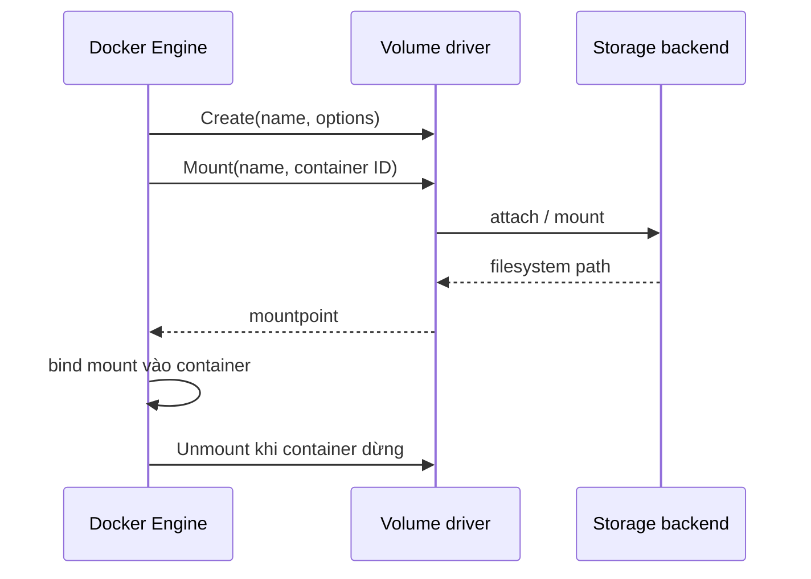

Volume driver quyết định cách Docker provision, mount và remove backend của một volume. Driver mặc định là `local`; plugin driver có thể tích hợp NFS, block storage hoặc dịch vụ storage bên ngoài.



Application vẫn nhìn thấy một directory. Nhưng latency, availability, consistency và data lifecycle phụ thuộc backend/driver chứ không do Docker volume abstraction bảo đảm.

## `local` driver thực sự có nghĩa gì?

Tạo volume mặc định:

```bash
docker volume create local-data
docker volume inspect local-data
```

Thông thường output có:

```text
Driver: local
Scope: local
```

`local` và `Scope: local` nghĩa là volume identity thuộc Docker host đó. Trong cluster, cùng tên volume trên hai node có thể là hai dataset khác nhau.

<Callout type="warn" title="Tên giống nhau không có nghĩa dữ liệu giống nhau">
  Tạo `app-data` bằng local driver trên nhiều node không tạo shared storage. Scheduler chuyển workload sang node khác có thể mount một volume rỗng cùng tên.
</Callout>

Trên Linux, `local` driver cũng có thể chuyển `type`, `device` và mount option cho system `mount`, ví dụ NFS. Điều đó không biến Docker thành storage orchestrator: NFS server, network, credential, locking và recovery vẫn phải được vận hành riêng.

## Tạo volume với driver và options

Cú pháp tổng quát:

```bash
docker volume create \
  --driver DRIVER \
  --opt key=value \
  --label com.example.owner=team-a \
  VOLUME
```

Mount volume đã tạo:

```bash
docker run --rm \
  --mount type=volume,src=VOLUME,dst=/data \
  IMAGE
```

Hoặc khai báo driver khi container/service tạo volume:

```bash
docker run --rm \
  --mount type=volume,src=VOLUME,dst=/data,volume-driver=DRIVER,volume-opt=key=value \
  IMAGE
```

Nếu driver cần options, ưu tiên `--mount`; `-v` không biểu diễn đầy đủ theo từng mount.

## Ví dụ NFS với `local` driver

Ví dụ sau chỉ là deployment template và yêu cầu NFS server `10.0.0.10` đã export `/srv/app-data`:

```bash
docker volume create \
  --driver local \
  --opt type=nfs \
  --opt o=addr=10.0.0.10,rw,nfsvers=4 \
  --opt device=:/srv/app-data \
  nfs-app-data
```

Kiểm tra metadata:

```bash
docker volume inspect nfs-app-data
```

Việc volume create thành công chưa chứng minh mount hoặc I/O thành công; backend thường chỉ được mount khi container dùng volume:

```bash
docker run --rm \
  --mount type=volume,src=nfs-app-data,dst=/data \
  alpine:3.22 sh -c 'mount | grep /data; touch /data/write-probe'
```

Chỉ chạy write probe trên export dành cho test. Sau đó xác minh ownership và xóa file từ cùng trust boundary.

## Plugin lifecycle và quyền

Plugin driver nhận request từ Docker daemon và trả về mountpoint. Plugin có thể cần quyền host/network rộng để attach storage. Vì vậy nó thuộc trusted computing base của host.

Inventory plugin:

```bash
docker plugin ls
docker plugin inspect PLUGIN
docker volume ls --filter driver=DRIVER
```

Trước khi cài plugin:

- xác minh publisher, source, release cadence và compatibility với Engine/kernel;
- review các permission mà `docker plugin install` yêu cầu;
- pin version nếu hệ sinh thái plugin hỗ trợ;
- thử upgrade, disable, daemon restart và host reboot;
- định nghĩa cách cứu dữ liệu khi plugin không khởi động;
- không đưa credential thẳng vào command history nếu driver có secret mechanism an toàn hơn.

## Scope không phải consistency guarantee

Volume plugin có thể báo capability scope:

- `local`: cluster manager xử lý volume theo từng node;
- `global`: manager có thể coi volume identity dùng chung toàn cluster.

`global` không tự chứng minh:

- mọi node đã attach được;
- backend hỗ trợ concurrent writers;
- filesystem locking phù hợp;
- read-after-write consistency đáp ứng application;
- failover không gây split-brain.

Các guarantee đó phải đến từ backend, driver và application protocol.

## Failure modes cần thiết kế

| Failure | Biểu hiện | Câu hỏi vận hành |
|---|---|---|
| Backend unreachable | Container start treo hoặc lỗi mount | Timeout và alert nằm ở đâu? |
| Credential hết hạn | Permission denied khi attach/I/O | Rotation có cần remount không? |
| Node mất kết nối | I/O treo, read-only hoặc lỗi | Application xử lý partial write thế nào? |
| Plugin crash | Mount/unmount thất bại | Daemon restart có recovery được không? |
| Volume attach node cũ | Không attach được node mới | Fencing có ngăn hai writer không? |
| Backend đầy quota | `ENOSPC` trong container | Ai theo dõi capacity và inode? |
| Driver upgrade | Volume không mount sau reboot | Có rollback matrix không? |

Test failure trên môi trường disposable. Một benchmark happy path không đủ để chọn storage production.

## Tiêu chí chọn backend

1. **Access mode**: single writer, multi-reader hay multi-writer.
2. **Durability**: replication, snapshot, checksum, corruption detection.
3. **Consistency**: locking, cache coherence, sync semantics.
4. **Performance**: latency p95/p99, IOPS, throughput, metadata workload.
5. **Topology**: node, zone, region và data locality.
6. **Operations**: resize, backup, restore, encryption, key rotation.
7. **Failure behavior**: timeout, fencing, reconnect và stale mount.
8. **Supportability**: Engine/kernel compatibility và escalation path.

Với object/blob data, application ghi trực tiếp vào object storage thường rõ semantics hơn giả lập filesystem qua volume plugin.

## Cleanup local lab

```bash
docker volume rm local-data
```

Chỉ xóa `nfs-app-data` nếu bạn đã tạo nó cho test và hiểu lifecycle backend:

```bash
docker volume rm nfs-app-data
```

Xóa Docker volume metadata không phải lúc nào cũng đồng nghĩa xóa dataset external; behavior thuộc driver.

## Nguồn chính thức

- [Use a volume driver](https://docs.docker.com/engine/storage/volumes/#use-a-volume-driver)
- [Docker volume plugins](https://docs.docker.com/engine/extend/plugins_volume/)
- [docker volume create](https://docs.docker.com/reference/cli/docker/volume/create/)
- [Docker plugin CLI](https://docs.docker.com/reference/cli/docker/plugin/)
