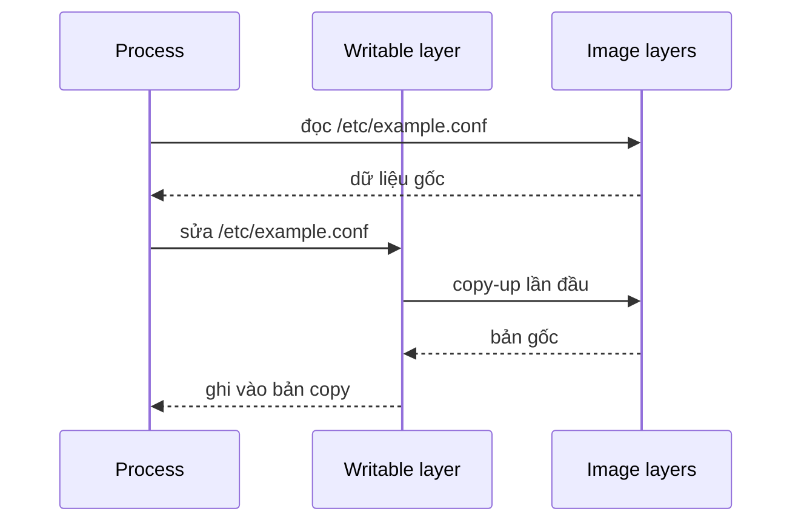

Khi tạo container, Docker đặt một writable layer mỏng lên trên các image layer chỉ đọc. Process thấy một filesystem hợp nhất, nhưng mọi file được tạo mới, sửa hoặc xóa mà không nằm trên mount đều được ghi vào layer riêng của container đó.

```text
Container A writable layer  ─┐
                             ├── cùng dùng image layers chỉ đọc
Container B writable layer  ─┘
```

Hai container từ cùng image không nhìn thấy thay đổi trong writable layer của nhau.

## Copy-on-write hoạt động thế nào?

Nếu process chỉ đọc file từ image layer, Docker dùng file hiện có. Lần đầu file đó cần sửa, backend thực hiện **copy-up**: copy file lên writable layer rồi sửa bản copy. Xóa file thường được biểu diễn bằng metadata kiểu whiteout để che file ở layer thấp hơn.



Copy-on-write tiết kiệm disk và giúp start container nhanh, nhưng có hệ quả:

- sửa file lớn có thể phải copy-up toàn bộ file trước;
- đổi ownership hoặc mode cũng có thể kích hoạt copy-up;
- workload write-heavy phải đi qua abstraction của storage backend;
- mỗi replica có state riêng, không phải shared storage.

## Lifecycle chính xác

| Thao tác | Writable layer |
|---|---|
| `docker stop` | Còn, vì container object còn |
| `docker start` | Dùng lại cùng layer |
| `docker restart` | Dùng lại cùng layer |
| `docker commit` | Tạo image mới từ thay đổi, không phải chiến lược backup |
| `docker rm` | Bị xóa cùng container |
| Recreate bằng cùng name | Layer mới, không kế thừa layer cũ |

<Callout type="warn" title="Không dùng cho dữ liệu quan trọng">
  State sống qua `stop/start` dễ tạo cảm giác bền vững, nhưng nó mất khi container được recreate hoặc remove. Database, uploads và dữ liệu cần backup phải nằm trên volume, bind mount phù hợp hoặc external service.
</Callout>

## Lab: chứng minh isolation và lifecycle

Tạo hai container từ cùng image:

```bash
docker run --name layer-a alpine:3.22 \
  sh -c 'printf A > /state && cat /state'
docker run --name layer-b alpine:3.22 \
  sh -c 'test ! -e /state && printf B > /state && cat /state'
```

Expected output lần lượt là `A` và `B`. Start lại `layer-a`; command ban đầu chạy lại và layer cũ vẫn còn cho tới khi command ghi đè:

```bash
docker start -a layer-a
```

Xem thay đổi filesystem so với image:

```bash
docker container diff layer-a
```

Output có thể chứa:

```text
A /state
```

`A` nghĩa là path được thêm. `C` là changed và `D` là deleted.

Kiểm tra kích thước writable layer:

```bash
docker container ls --all --size \
  --filter name=layer- \
  --format 'table {{.Names}}\t{{.Size}}'
```

Xóa rồi tạo lại `layer-a` từ cùng image:

```bash
docker rm layer-a
docker run --name layer-a alpine:3.22 test ! -e /state
```

Exit code `0` chứng minh state cũ không thuộc image và không được phục hồi.

## Đọc disk usage đúng cách

`docker container ls --size` hiển thị:

- **size**: dung lượng gần đúng của writable layer;
- **virtual size**: writable layer cộng image data nhìn thấy bởi container.

Không cộng `virtual size` của mọi container vì image layers được chia sẻ. Lệnh tổng quan hữu ích hơn:

```bash
docker system df
docker system df -v
```

Các số này không nhất thiết gồm đầy đủ:

- log files do logging driver lưu;
- volumes và bind mounts;
- metadata container;
- swap hoặc checkpoint.

Nếu host đầy disk, phải kiểm tra từng nhóm thay vì kết luận writable layer là nguyên nhân.

## Storage driver và containerd image store

Docker Engine có thể dùng classic storage driver hoặc containerd image store với snapshotter. Kiểm tra hệ thống thực tế:

```bash
docker info
```

Trên cài đặt mới của Docker Engine 29.0 trở lên, containerd image store là mặc định. Vì vậy, không hard-code giả định rằng mọi layer nằm dưới `/var/lib/docker/overlay2`.

Bất kể backend nào, contract ở cấp container vẫn giống nhau:

- image layers là immutable;
- container có writable snapshot/layer riêng;
- xóa container xóa state riêng đó;
- mount là cơ chế đúng cho state cần quản lý độc lập.

Không chỉnh sửa trực tiếp internal storage của daemon. Việc đó bypass metadata và có thể làm hỏng image, snapshot hoặc volume.

## Writable layer phù hợp với dữ liệu nào?

**Phù hợp:**

- PID file và runtime metadata không cần sau recreate;
- cache có thể tái tạo và có kích thước nhỏ;
- file tạm trong một execution;
- thay đổi phục vụ debug ngắn hạn.

**Không phù hợp:**

- database data directory;
- user uploads;
- queue state;
- audit records;
- artifact cần một container khác sử dụng;
- bất kỳ dữ liệu nào nằm trong kế hoạch backup/restore.

Với dữ liệu tạm có volume ghi lớn, [tmpfs](/docs/storage/tmpfs-mounts/) có thể tránh I/O qua writable layer, nhưng phải giới hạn memory. Với dữ liệu bền vững, dùng [Docker volumes](/docs/storage/volumes/).

## Anti-pattern: sửa container đang chạy rồi commit

`docker commit` có thể hữu ích để forensic hoặc tạo snapshot thử nghiệm, nhưng không thay thế Dockerfile hay backup:

- mount data không được đưa vào image commit;
- state application có thể không nhất quán trong lúc commit;
- image mới khó review và tái tạo;
- secret hoặc file tạm có thể vô tình đi vào layer.

Hãy sửa Dockerfile/config, rebuild image và recreate container. Đây là operating model immutable đã trình bày tại [Immutable containers](/docs/container-lifecycle/immutable-containers/).

## Cleanup bài thực hành

```bash
docker rm -f layer-a layer-b
```

## Nguồn chính thức

- [Storage drivers và writable layer](https://docs.docker.com/engine/storage/drivers/)
- [Docker storage](https://docs.docker.com/engine/storage/)
- [docker container diff](https://docs.docker.com/reference/cli/docker/container/diff/)
- [docker system df](https://docs.docker.com/reference/cli/docker/system/df/)
