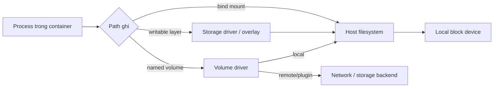

Block I/O control giới hạn hoặc ưu tiên request tới **block device**. Nó không tự tạo latency guarantee và không bao phủ mọi storage path giống nhau. Bind mount trên local SSD, writable layer `overlay2`, network filesystem và volume plugin có data path khác nhau.

Trước khi đặt flag, phải trả lời:

1. path workload ghi/đọc cuối cùng đi tới device nào;
2. I/O là buffered hay direct;
3. host dùng cgroup v1/v2, filesystem và I/O scheduler nào;
4. bottleneck nằm ở cgroup, filesystem, device, network hay storage backend.

## Các control Docker cung cấp

| Option | Loại | Ví dụ | Ghi chú |
|---|---|---|---|
| `--blkio-weight` | Relative weight | `--blkio-weight 300` | Docker docs nêu range `10-1000`; chủ yếu có ý nghĩa khi contention |
| `--blkio-weight-device` | Weight theo device | `/dev/nvme0n1:200` | Device phải là backing path thực |
| `--device-read-bps` | Read bandwidth ceiling | `/dev/sdb:20mb` | Rate theo device |
| `--device-write-bps` | Write bandwidth ceiling | `/dev/sdb:10mb` | Rate theo device |
| `--device-read-iops` | Read IOPS ceiling | `/dev/sdb:1000` | IOPS không nói kích thước mỗi operation |
| `--device-write-iops` | Write IOPS ceiling | `/dev/sdb:500` | Cần benchmark cùng block size/queue depth |

`--blkio-weight` là ưu tiên tương đối, không phải bandwidth reservation. Docker Engine docs lưu ý weight chỉ áp dụng cho direct I/O trong behavior được tài liệu hóa; buffered write có page cache/writeback semantics phức tạp hơn.

<Callout type="warn" title="Không đoán device">
  Không copy `/dev/sda` từ ví dụ vào production. Trên cloud VM, LVM, encrypted disk, RAID, overlay filesystem hoặc Docker Desktop, backing device có thể hoàn toàn khác. Flag trỏ sai device có thể không kiểm soát data path bạn quan tâm.
</Callout>

## Storage path quyết định hiệu lực



- **Writable layer:** I/O đi qua storage driver, copy-on-write và host filesystem.
- **Bind mount/local volume:** thường map rõ hơn tới host filesystem/device.
- **NFS/CIFS/remote volume:** bottleneck có thể là network/server; local block limit không biểu diễn backend throughput.
- **tmpfs:** dùng memory, không phải block device data path thông thường.
- **Docker Desktop:** Linux container I/O đi qua VM và filesystem sharing layer; native Linux benchmark không đại diện trực tiếp.

Đọc [Storage và dữ liệu](/docs/storage/) trước khi tối ưu persistence path.

## Tìm backing device an toàn

Trên Linux host native, lấy Docker root và filesystem:

```bash
docker info --format 'Driver={{.Driver}} DockerRootDir={{.DockerRootDir}}'
DOCKER_ROOT=$(docker info --format '{{.DockerRootDir}}')
findmnt -T "$DOCKER_ROOT" -o TARGET,SOURCE,FSTYPE,OPTIONS
lsblk -o NAME,MAJ:MIN,TYPE,SIZE,FSTYPE,MOUNTPOINTS
```

Với bind-mount path:

```bash
LAB_DIR=/srv/docker-io-lab
sudo mkdir -p "$LAB_DIR"
findmnt -T "$LAB_DIR" -o TARGET,SOURCE,MAJ:MIN,FSTYPE,OPTIONS
```

`SOURCE` có thể là logical volume, mapper device hoặc mount đặc biệt. Đối chiếu `lsblk`, LVM/RAID/cloud volume mapping và `stat -c '%t:%T'` khi cần. Không suy ra device chỉ từ tên mount.

## Lab bandwidth có điều kiện

Lab này chỉ dành cho **Linux host native**, trên một thư mục scratch đã xác định backing block device. Không dùng production data path. Thay `/dev/DEVICE` bằng device đã xác minh.

```bash
LAB_DIR=/srv/docker-io-lab
DEVICE=/dev/DEVICE
sudo mkdir -p "$LAB_DIR"
findmnt -T "$LAB_DIR"
lsblk "$DEVICE"
```

Chạy direct write giới hạn khoảng 10 MB/s:

```bash
time docker run --rm \
  --device-write-bps "$DEVICE:10mb" \
  --mount type=bind,src="$LAB_DIR",dst=/data \
  alpine:3.23 \
  dd if=/dev/zero of=/data/io-test.bin bs=1M count=64 oflag=direct
```

Không thêm `--device "$DEVICE"`: workload chỉ cần ghi qua bind mount, không cần raw-device access. Nếu filesystem/tool không hỗ trợ `oflag=direct`, lab này không còn kiểm tra đúng direct-I/O path; không âm thầm bỏ flag rồi so sánh như tương đương.

Cleanup host file:

```bash
sudo rm -f "$LAB_DIR/io-test.bin"
```

Kết quả có thể lệch do filesystem, block size, queueing, device cache và storage stack. Mục tiêu là xác minh control có hiệu lực trên topology cụ thể, không phải chứng minh một SLO chung.

## Inspect effective configuration

```bash
docker inspect CONTAINER --format '{{json .HostConfig}}' |
  jq '{BlkioWeight, BlkioWeightDevice, BlkioDeviceReadBps, BlkioDeviceWriteBps, BlkioDeviceReadIOps, BlkioDeviceWriteIOps}'
```

Inspect chứng minh Engine lưu config, chưa chứng minh kernel/device thực sự enforce như kỳ vọng. Cần workload test và cgroup/device metrics.

Trên cgroup v2, các file thường dùng:

```bash
docker exec CONTAINER sh -c '
  [ -r /sys/fs/cgroup/io.max ] && { echo ---io.max; cat /sys/fs/cgroup/io.max; }
  [ -r /sys/fs/cgroup/io.weight ] && { echo ---io.weight; cat /sys/fs/cgroup/io.weight; }
  [ -r /sys/fs/cgroup/io.stat ] && { echo ---io.stat; cat /sys/fs/cgroup/io.stat; }
  [ -r /sys/fs/cgroup/io.pressure ] && { echo ---io.pressure; cat /sys/fs/cgroup/io.pressure; }
'
```

Cgroup namespace/permission có thể che path hoặc controller file. Khi cần, tìm cgroup từ host PID như trang [Control groups](/docs/nen-tang-container/control-groups/) mô tả.

## Đọc metric đúng

| Signal | Cho biết | Không cho biết một mình |
|---|---|---|
| `docker stats` BLOCK I/O | Byte read/write tích lũy theo runtime accounting | Latency, queue depth hay current rate |
| `io.stat` | Bytes/operations per major:minor device | Application request latency |
| `io.pressure` PSI | Thời gian task bị stall vì I/O | Backend nào gây stall |
| `iostat -x` | Utilization, queue, await phía device | Container/request nào chịu trách nhiệm hoàn toàn |
| App latency/queue | Tác động tới workload | Device root cause |
| Storage backend metrics | Volume latency/IOPS/throttle | Process nào tạo load nếu thiếu correlation |

Tính rate bằng delta counter theo thời gian. `BLOCK I/O 5GB / 2GB` trong `docker stats` là cumulative bytes, không phải 5 GB/s.

## Buffered I/O và page cache

Application dùng `write()` thường ghi vào page cache trước. Latency của syscall có thể thấp trong khi dirty pages được flush sau. Hệ quả:

- benchmark ngắn đo memory/cache thay vì device;
- writeback có thể được account khác tùy kernel/filesystem;
- `fsync`/database WAL latency mới lộ storage durability path;
- memory pressure thay đổi kết quả I/O;
- weight behavior với buffered I/O không giống direct I/O.

Thiết kế benchmark theo workload thật: block size, sync/direct mode, read/write ratio, queue depth, dataset lớn hơn cache và durability requirement.

## Weight hay hard throttle?

**Dùng weight** khi muốn batch/backup nhường I/O cho service quan trọng lúc contention nhưng được chạy nhanh khi device rảnh.

**Dùng BPS/IOPS ceiling** khi cần chặn noisy neighbor tạo quá nhiều load lên device/shared host.

Kết hợp cả hai chỉ sau khi test. Hard throttle quá thấp có thể làm:

- transaction timeout;
- healthcheck fail và restart loop;
- queue tăng, memory tăng theo;
- compaction/checkpoint kéo dài;
- backup không hoàn tất trong cửa sổ vận hành.

## Compose và portability

Compose có thể expose một số blkio fields tùy implementation, ví dụ:

```yaml
services:
  batch:
    image: example/batch:1.2.0
    blkio_config:
      weight: 200
      device_write_bps:
        - path: /dev/nvme0n1
          rate: 10mb
```

Device path làm file phụ thuộc host. Nếu fleet không đồng nhất, dùng host labels/provisioning hoặc storage policy ở platform layer. Luôn chạy:

```bash
docker compose config
docker compose up --detach
docker compose ps --quiet batch | xargs docker inspect --format '{{json .HostConfig}}'
```

## Runbook I/O chậm

1. Xác định endpoint/job và time window bị chậm.
2. Đọc application latency, queue, timeout, fsync/DB metrics.
3. Kiểm tra `docker stats`, cgroup `io.stat`/PSI và CPU/memory pressure.
4. Map container path tới mount, filesystem và device/backend.
5. Kiểm tra host device queue/latency cùng cloud/NAS/volume metrics.
6. Xác định có cgroup throttle hay host/backend saturation.
7. Reproduce với workload và topology tương đương.
8. Chỉ sau đó đổi weight, limit, filesystem, volume hoặc application I/O pattern.

## Nguồn chính thức

- [Running containers: Block IO bandwidth](https://docs.docker.com/engine/containers/run/#block-io-bandwidth-blkio-constraint)
- [`docker container run` I/O options](https://docs.docker.com/reference/cli/docker/container/run/)
- [Runtime metrics — Docker Docs](https://docs.docker.com/engine/containers/runmetrics/)
- [Cgroup v2 I/O controller](https://docs.kernel.org/admin-guide/cgroup-v2.html#io)
